# ModernizeX — エンドユーザーガイド

**製品:** ModernizeX — COBOL → Java モダナイゼーションプラットフォーム
**ドキュメントバージョン:** 2.1 · **日付:** 2026-09-15

> 本ガイドは、稼働中の ModernizeX アプリケーション（ビルド `2.0-refactored`）の実際の UI を反映しています。すべてのスクリーンショットは稼働中のアプリから直接取得したものです。

---

## 目次

1. [概要とナビゲーション](#1-overview--navigation)
2. [Dashboard（ワークスペース）](#2-dashboard-workspace)
3. [新規プロジェクトの作成](#3-creating-a-new-project)
4. [プロジェクト概要（Project Overview）](#4-project-overview)
5. [Assessment — Database](#5-assessment--database)
6. [Assessment — Files (VSAM/QSAM)](#6-assessment--files-vsamqsam)
7. [Assessment — Analysis (Graph)](#7-assessment--analysis-graph)
8. [AS-IS — Input Source](#8-as-is--input-source)
9. [AS-IS — AS-IS Design](#9-as-is--as-is-design)
10. [TO-BE — Conversion Results](#10-to-be--conversion-results)
11. [TO-BE — クラスおよびスキーマのマッピング](#11-to-be--class--schema-mapping)
12. [TO-BE — Java Output](#12-to-be--java-output)
13. [TO-BE — Refactor Code](#13-to-be--refactor-code)
14. [TO-BE — Modernize UI](#14-to-be--modernize-ui)
15. [TO-BE — TO-BE Design](#15-to-be--to-be-design)
16. [Data Migration — Gen Schema](#16-data-migration--gen-schema)
17. [Data Migration — Migration Files](#17-data-migration--migration-files)
18. [Validation — Gen Unit Test](#18-validation--gen-unit-test)
19. [Validation — Integration Test](#19-validation--integration-test)
20. [Settings](#20-settings)
21. [Help](#21-help)
22. [納品とプロジェクトのクローズアウト](#22-delivery--project-closeout)
- [付録 A — 用語集](#appendix-a--glossary)
- [付録 B — キーボードショートカット](#appendix-b--keyboard-shortcuts)
- [付録 C — デプロイと AI プロバイダー](#appendix-c--deployment--ai-provider)

---

## 1. Overview & Navigation

### 1.1. ModernizeX とは

ModernizeX は、COBOL/CICS/JCL システム（DB2/SQL、DL/I、MQ、VSAM/QSAM を含む）を Java（Spring Boot）へモダナイズするための Web プラットフォームです。単純な LLM によるコード翻訳とは異なり、ModernizeX は **まずコードベース全体を静的に解析** し（AST、コールグラフ、データフロー、依存関係グラフ）、その後で初めて AI を用いてドキュメントを生成し、コードをリファクタリングします。これは決定論的に復元された事実に基づいています。その結果、次のことが実現されます。

- 変数名やプログラム名のハルシネーション（幻覚）が発生せず、元の業務ロジックが保持されます。
- すべての Java コンポーネントは、元の COBOL プログラムまで **トレース（追跡）** 可能です。
- 新システムの動作は、Unit Test / Integration Test を通じて検証されます。
- **オンプレミス** デプロイをサポートしており、顧客のソースコードが顧客のインフラ外に出ることはありません（付録 C を参照）。

### 1.2. ModernizeX を利用するユーザー

| ロール | ModernizeX における主な活動 |
|---|---|
| **Project Manager** | プロジェクトの作成、Dashboard の監視、レポートのエクスポート |
| **Migration Architect** | スタックおよび AI プロバイダーの設定、AS-IS/TO-BE ドキュメントのレビューと承認 |
| **Developer / Migration Engineer** | パイプラインステップの実行、生成された Java のレビュー、変換に関する問題の解決 |
| **QA Engineer** | Unit Test / Integration Test の生成と実行、差分の分析 |
| **Stakeholder / Customer** | Dashboard の閲覧、成果物のダウンロード |

### 1.3. エンドツーエンドのワークフロー

すべての作業は、順序立てられた機能グループに整理されています。

```
Import Source
        ↓
Assessment (system evaluation & analysis)
        ↓
AS-IS (browse original source · AS-IS design docs)
        ↓
TO-BE (COBOL → Java conversion · refactor · UI modernization · TO-BE design docs)
        ↓
Data Migration (schema generation & VSAM data migration)
        ↓
Validation (generate & run Unit / Integration Tests)
        ↓
Delivery
```

### 1.4. サイドバーの構成

左側のサイドバーには 3 つのエリアがあります。

- **WORKSPACE**
  - **Dashboard** — すべてのプロジェクトの概要。
- **PROJECT** — 以下の項目はプロジェクトを開いているときのみ表示されます。パネルにはプロジェクト名とステータスピルが表示され、現在のプロジェクトを閉じるには **CLOSE** をクリックします。
  - **ASSESSMENT:** Overview · Database · Files (VSAM/QSAM) · Analysis (Graph)
  - **AS-IS:** Input Source · AS-IS Design
  - **TO-BE:** Conversion Results · Java Output · Refactor Code · Modernize UI · TO-BE Design
  - **DATA MIGRATION:** Gen Schema · Migration Files
  - **VALIDATION:** Gen Unit Test · Integration Test
- **MANAGE**
  - **Settings** — AI Provider およびアプリケーションを設定します。
  - **Help**

### 1.5. トップバーとステータスカラー

トップバーには、現在位置を示す **breadcrumb（パンくずリスト）**、**Search projects** ボックス（ショートカット `Ctrl+K`）、**言語スイッチャー**（EN ⇄ JA — UI 全体を英語と日本語で切り替えます）、**テーマトグル**（ダーク/ライト）、およびユーザーメニューが含まれます。

ステータスピル（状態表示バッジ）は、アプリ全体を通じて一貫した色を使用します。

| 色 | 意味 |
|---|---|
| 🟢 緑 | 完了 / 合格（`COMPLETED`、`MIGRATED`、`SUCCESS`） |
| 🔵 青 | アセスメント完了・マイグレーション進行中（`ASSESSED`） |
| 🟡 アンバー | 実行中 / 要レビュー（`RUNNING`、`WARN`） |
| 🔴 赤 | エラー / ブロック（`FAILED`） |
| ⚪ グレー | 未開始 / 対象外（`NOT STARTED`、`SKIPPED`、`PENDING`） |

---

## 2. Dashboard (Workspace)

**画面遷移:** サイドバー → **Dashboard**

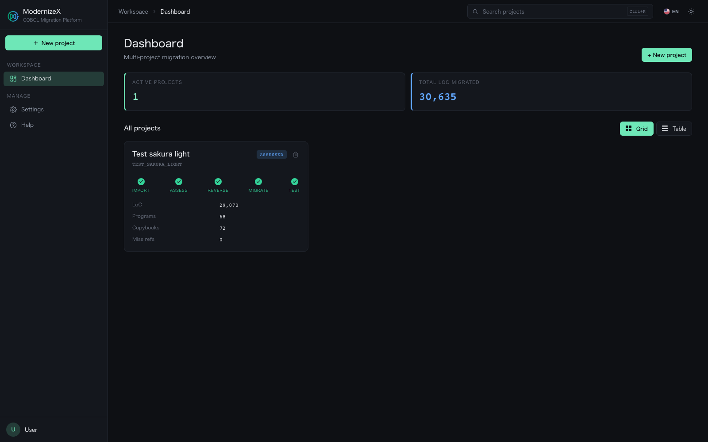

Dashboard は *マルチプロジェクトのマイグレーション概要* 画面で、次の内容を表示します。

- **サマリータイル:** **Active Projects** および **Total LoC Migrated**。
- **All projects** — 2 つの表示モード **Grid** / **Table** を備えたプロジェクト一覧（右上のトグルで切り替え）。
- 各 **プロジェクトカード** には次の情報が表示されます。
  - プロジェクト名、プロジェクトコード、および **ステータス**（例: `ASSESSED`、`MIGRATED`）。
  - パイプラインの進捗バー: **IMPORT → ASSESS → REVERSE → MIGRATE → TEST**（完了したステップには ✓ が付きます）。
  - 主要な数値: **LoC**、**Programs**、**Copybooks**、**Miss refs**。
  - プロジェクトを削除するためのゴミ箱アイコン。
- **+ New project** ボタン。

プロジェクトカードをクリックすると、そのプロジェクトが開き、**Project Overview** 画面に切り替わります。

---

## 3. Creating a New Project

**画面遷移:** **+ New project** をクリック（サイドバー上部または Dashboard 上）

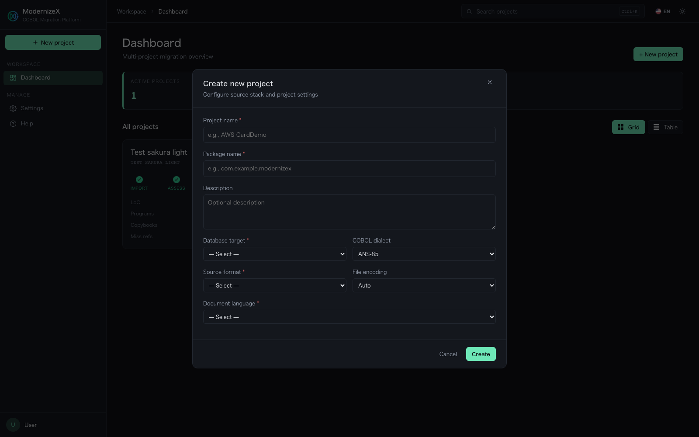

**Create new project** ダイアログ（*Configure source stack and project settings*）が開きます。各フィールドに入力します（`*` が付いているものは必須です）。

| フィールド | 必須 | 説明 / 値 |
|---|---|---|
| **Project name** | ✔ | プロジェクト名。例: `AWS CardDemo`。 |
| **Package name** | ✔ | Java のルートパッケージ。例: `com.example.modernizex`。 |
| **Description** | — | 任意の説明。 |
| **Database target** | ✔ | ターゲットデータベース: **PostgreSQL** / **Oracle**。 |
| **COBOL dialect** | — | COBOL の方言: **ANS-85**（デフォルト）、IBM、HP、Fujitsu、ADABAS、Micro Focus、COBOL 2002、ACOS-77。 |
| **Source format** | ✔ | ソース形式: **Fixed** / **Tandem** / **Variable** / **Free**。 |
| **File encoding** | — | エンコーディング: **Auto**（デフォルト）、UTF-8、Shift-JIS、MS-932、CP1252。 |
| **Document language** | ✔ | 生成ドキュメントの言語: **English** / **Japanese**。 |

**Create** をクリックしてプロジェクトを作成します（中止する場合は **Cancel**）。作成後、アプリはプロジェクトを開き、**Project Overview** 画面を表示します。

---

## 4. Project Overview

**画面遷移:** Project → サイドバー `ASSESSMENT` → **Overview**

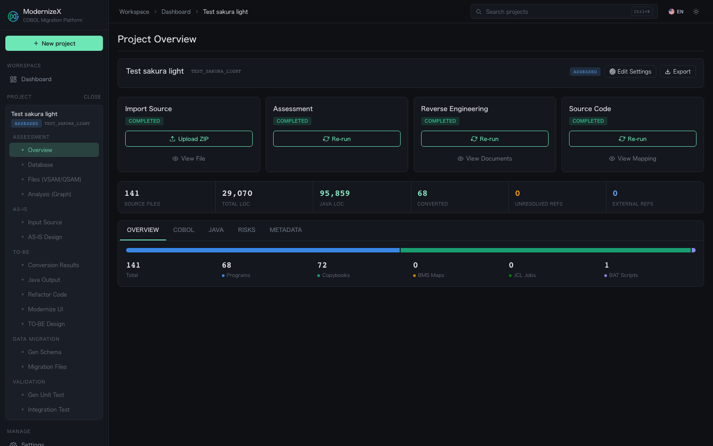

これは、プロジェクトのパイプライン全体を統括する中心的な画面です。プロジェクトヘッダーには、プロジェクト名、コード、ステータスピルに加えて、2 つのボタンが表示されます。**⚙️ Edit Settings**（プロジェクト設定の変更）と **Export**（プロジェクトレポートのエクスポート）です。

### 4.1. パイプラインカード

上部にある 4 つのカードは主要なステージを表します。各カードにはステータスラベル（`COMPLETED` / `NOT STARTED` / `RUNNING` など）と対応するアクションボタンがあります。

| カード | ステータスの例 | 主なアクション | 補助リンク |
|---|---|---|---|
| **Import Source** | COMPLETED | **Upload ZIP** | View File |
| **Assessment** | COMPLETED | **Re-run** | — |
| **Reverse Engineering** | COMPLETED | **Re-run** | View Documents |
| **Source Code** | COMPLETED | **Re-run** | View Mapping |

### 4.2. サマリーメトリクスバー

パイプラインカードのすぐ下には、メトリクスの帯があります。**Source Files**、**Total LOC**、**Java LOC**、**Converted**、**Unresolved Refs**、**External Refs**。

### 4.3. 詳細タブ

下部エリアには 5 つのタブがあります。**OVERVIEW · COBOL · JAVA · RISKS · METADATA**。

**OVERVIEW タブ** — コードベースの資産内訳: Total、Programs、Copybooks、BMS Maps、JCL Jobs、BAT Scripts。

**COBOL タブ** — ステップ数（Lines-of-Code）の統計:

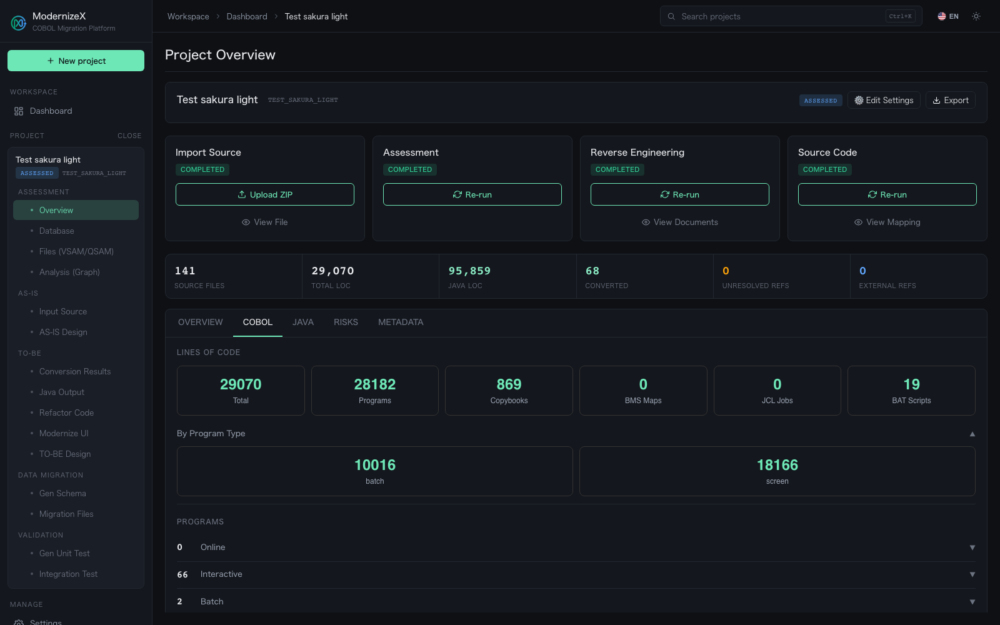

- **Lines of Code:** Total、Programs、Copybooks、BMS Maps、JCL Jobs、BAT Scripts。
- **By Program Type:** `batch` / `screen` に分類。
- **Programs:** Online / Interactive / Batch に分類。

**JAVA タブ** — Java の生成結果:

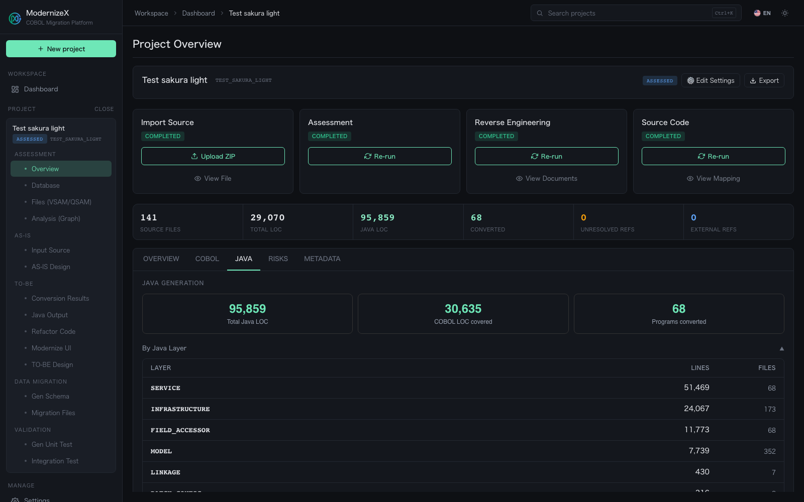

- **Java Generation:** Total Java LOC、カバーされた COBOL LOC、変換されたプログラム数。
- **By Java Layer:** アーキテクチャレイヤーごとの行数とファイル数（SERVICE、INFRASTRUCTURE、FIELD_ACCESSOR、MODEL、LINKAGE など）。

**RISKS タブ** — 参照リスクの一覧:

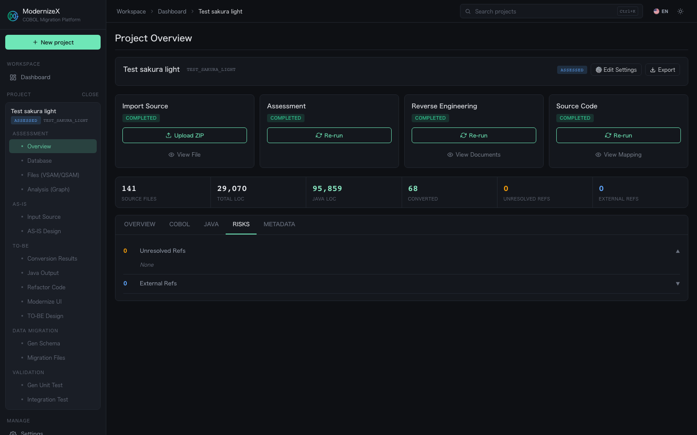

- **Unresolved Refs** — 解決できなかった参照（対応が必要）。
- **External Refs** — 外部コンポーネントへの参照。

**METADATA タブ** — スナップショットの技術的な詳細:

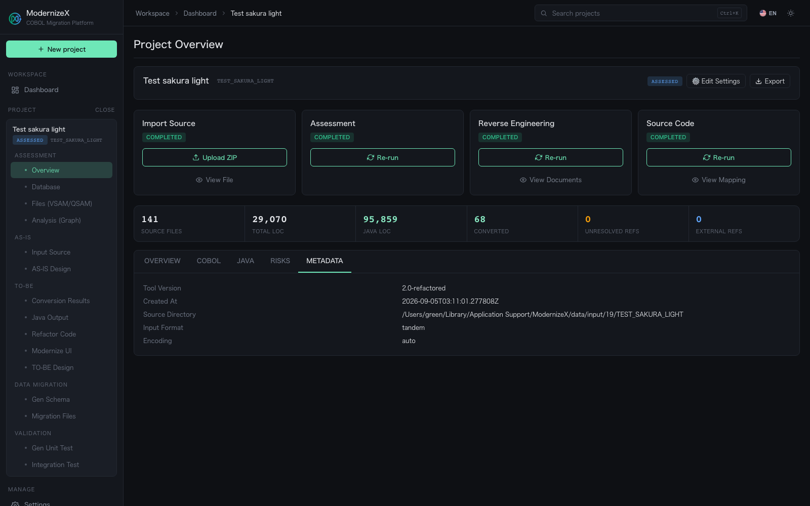

- Tool Version、Created At、Source Directory、Input Format、Encoding。

---

## 5. Assessment — Database

**画面遷移:** Project → サイドバー `ASSESSMENT` → **Database**

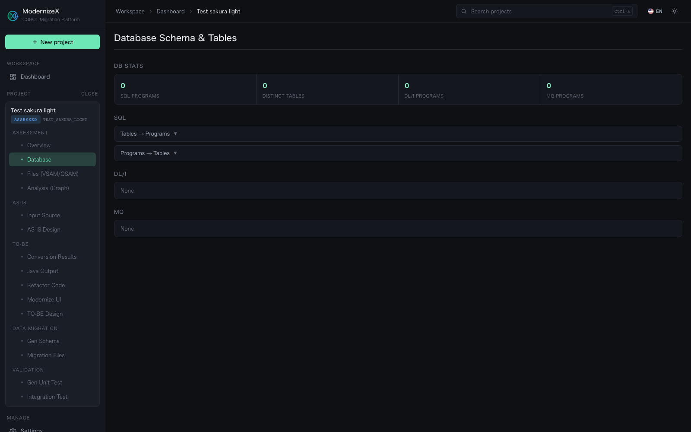

**Database Schema & Tables** 画面では、COBOL プログラムが SQL/DB2、DL/I、MQ を介してデータとどのようにやり取りしているかを分析します。

- **DB Stats:** サマリー数値 — **SQL Programs**、**Distinct Tables**、**DL/I Programs**、**MQ Programs**。
- **SQL:** 展開可能な 2 つの関係テーブル — **Tables → Programs**（各テーブルにアクセスするプログラム）および **Programs → Tables**（各プログラムが使用するテーブル）。
- **DL/I:** DL/I（IMS）を使用するプログラムの一覧。
- **MQ:** MQ キューを使用するプログラムの一覧。

ターゲットスキーマの生成やデータマイグレーションを行う前に、この画面でデータアクセスの範囲を把握します。ファイルのみで構成されるシステム（VSAM/QSAM のみ）の場合、これらの数値が 0 になるのは正常です。

---

## 6. Assessment — Files (VSAM/QSAM)

**画面遷移:** Project → サイドバー `ASSESSMENT` → **Files (VSAM/QSAM)**

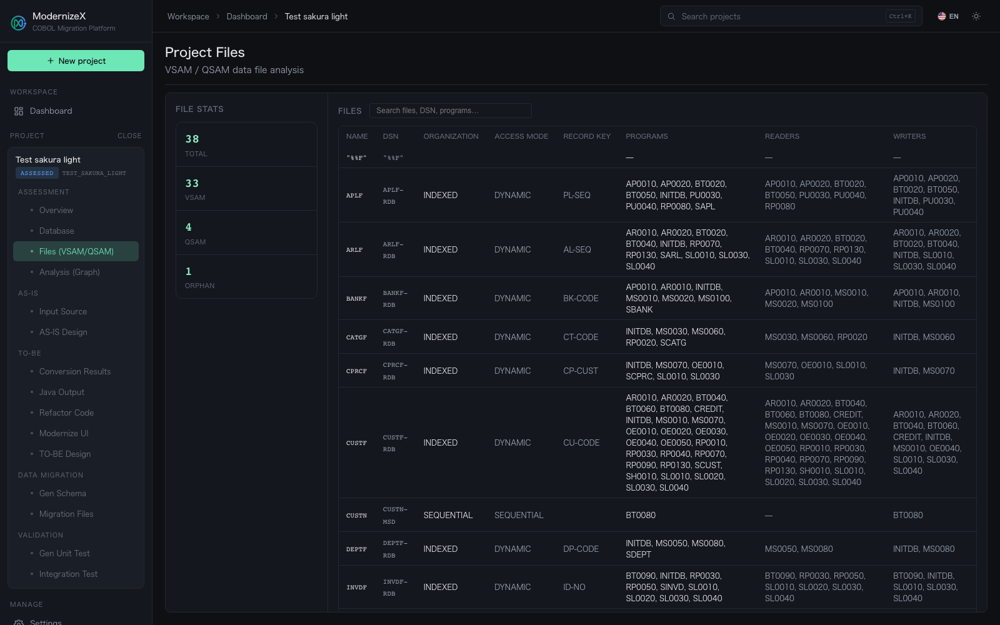

**Project Files** 画面（*VSAM / QSAM data file analysis*）には、レガシーシステムのすべての順次/索引データファイルが一覧表示されます。

- **File Stats:** ファイル総数と、**VSAM**、**QSAM**、**Orphan**（どのプログラムからも参照されていないファイル）の件数。
- ファイル名、DSN、またはプログラム名で一覧を絞り込むための **検索ボックス**。
- **ファイル詳細テーブル**（列: **Name**、**DSN**、**Organization**（INDEXED/SEQUENTIAL など）、**Access Mode**（DYNAMIC/SEQUENTIAL/RANDOM など）、**Record Key**、**Programs**（ファイルを使用するプログラム）、**Readers**、**Writers**）。

この画面を使って、VSAM データマイグレーションの範囲を把握します（第 17 章を参照）。

---

## 7. Assessment — Analysis (Graph)

**画面遷移:** Project → サイドバー `ASSESSMENT` → **Analysis (Graph)**

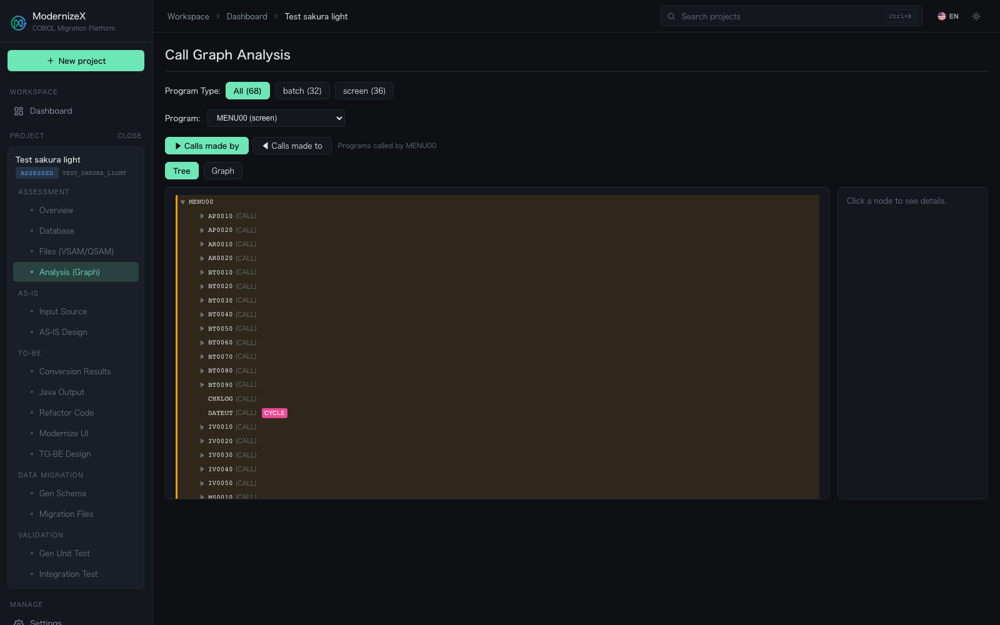

**Call Graph Analysis** 画面では、プログラム間の呼び出し関係を可視化します。

**使い方:**

1. **Program Type** でフィルタリングします: **All**、**batch**、または **screen**（件数付き）。
2. **Program** ドロップダウンでプログラムを選択します（例: `MENU00`）。
3. 分析の方向を選択します。
   - **Calls made by** — 選択したプログラムから *呼び出される* プログラム。
   - **Calls made to** — 選択したプログラムを *呼び出す* プログラム。
4. **Tree** と **Graph** の表示モードを切り替えます。Tree モードでは、各エッジに呼び出しタイプ（`CALL`）のラベルが付き、再帰的な呼び出し連鎖には **CYCLE** バッジが表示されます。

**Graph** モードでは、図がノードとエッジとして描画され、次のレイアウトオプションを利用できます。

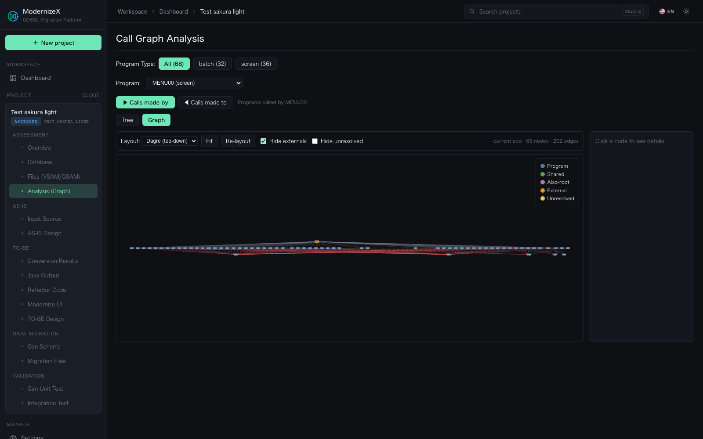

- **Layout**（例: *Dagre top-down*）と、**Fit**、**Re-layout** ボタン。
- 表示を見やすくするための **Hide externals** / **Hide unresolved** オプション。
- ツールバー右上のノード/エッジカウンター（例: *66 nodes · 202 edges*）。
- **Legend:** Program、Shared、Also-root、External、Unresolved。
- **ノードをクリック** すると、右側のパネルにその詳細が表示されます（*Click a node to see details*）。

この画面を使って依存関係を理解し、マイグレーションの順序に優先順位を付けます。

---

## 8. AS-IS — Input Source

**画面遷移:** Project → サイドバー `AS-IS` → **Input Source**

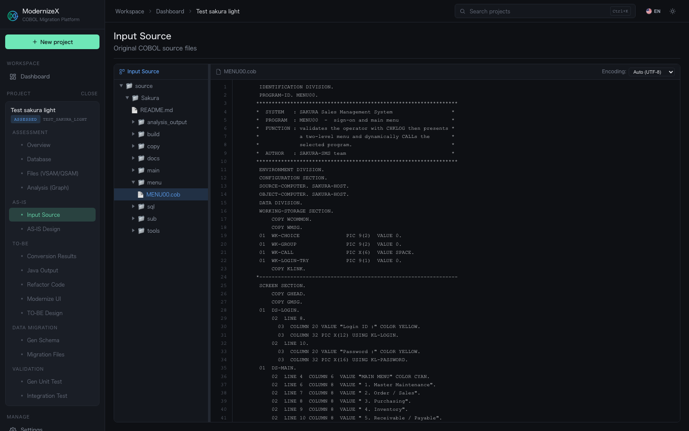

**Input Source** 画面（*Original COBOL source files*）では、取り込まれたすべての元の COBOL ソースに加えて、Assessment ステップで生成された分析成果物（`analysis_output/` — パース済みプログラムの JSON、制御フローグラフなど）を参照できます。

**使い方:**

1. 左側のファイルツリーで、フォルダを展開して（▶/▼ アイコンをクリック）ソース構造を参照します。
2. ファイル（`.cob`、`.cbl`、`.cpy`、`.jcl` など）をクリックすると、右側のソースビューアに内容（行番号付き）が表示されます。
3. 文字化けが表示される場合は、ビューア上部の **Encoding** ドロップダウン（デフォルト **Auto**）を変更します。
4. マイグレーション全体を通じて、この画面を元ソースの参照に利用します。

> ソースは、Project Overview の *Import Source* カードにある **Upload ZIP** ボタンから取り込みます。

---

## 9. AS-IS — AS-IS Design

**画面遷移:** Project → サイドバー `AS-IS` → **AS-IS Design**

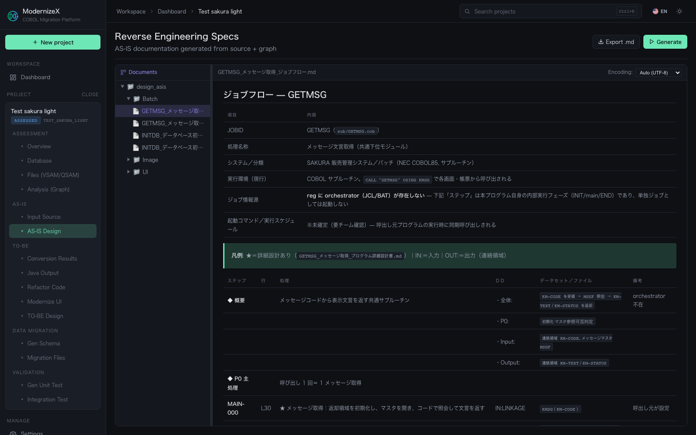

**Reverse Engineering Specs** 画面（*AS-IS documentation generated from source + graph*）では、ソースおよびグラフ分析に基づいて、現行の COBOL システムを説明するドキュメントを生成します。

**手順:**

1. **Generate** をクリックして AS-IS ドキュメントを生成します（または Project Overview の *Reverse Engineering* カードで **Re-run** をクリックします）。
2. 生成が完了すると、左側の列にフォルダ別（例: `design_asis/Batch`、`Image`、`UI`）に整理されたドキュメントツリーが表示されます。ドキュメントを選択すると、右側のペインでその内容を読むことができます。ドキュメントは、プロジェクト作成時に選択した **Document language**（English または Japanese）で作成されます。
3. **Export .md** でドキュメントをエクスポートします。

> Reverse Engineering が `NOT STARTED` の間は、**Generate** をクリックするまでドキュメントの列は空のままです。

---

## 10. TO-BE — Conversion Results

**画面遷移:** Project → サイドバー `TO-BE` → **Conversion Results**

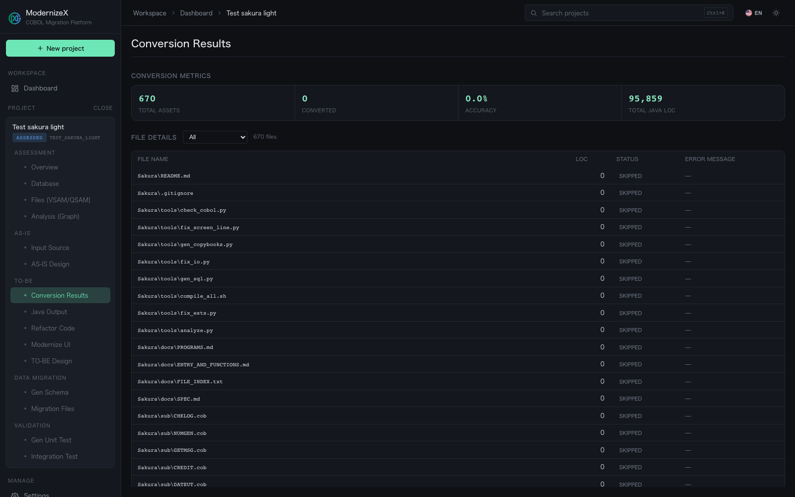

**Conversion Results** 画面では、COBOL → Java 変換の結果を要約します。

- **Conversion Metrics:** **Total Assets**、**Converted**、**Accuracy**、**Total Java LOC**。
- **File Details:** ステータスフィルタのドロップダウン（**All** / **SUCCESS** / **FAILED** / **UNSUPPORTED** / **SKIPPED** / **PENDING**）と、ファイルごとの結果テーブル（列: **File Name**、**LOC**、**Status**、**Error Message**）。COBOL 以外の資産（ドキュメント、ツール、スクリプト）は `SKIPPED` としてマークされます。

**使い方:**

1. Project Overview の *Source Code* カードで **Re-run** をクリックして、変換を（再）実行します。
2. `FAILED` または `UNSUPPORTED` ステータスのファイルをフィルタリングして確認し、**Error Message** 列を読んで問題を解決します。
3. 次に進む前に、**Accuracy** メトリクスが目標を満たしていることを確認します。

---

## 11. TO-BE — Class & Schema Mapping

**画面遷移:** Project Overview → *Source Code* カード → **View Mapping**

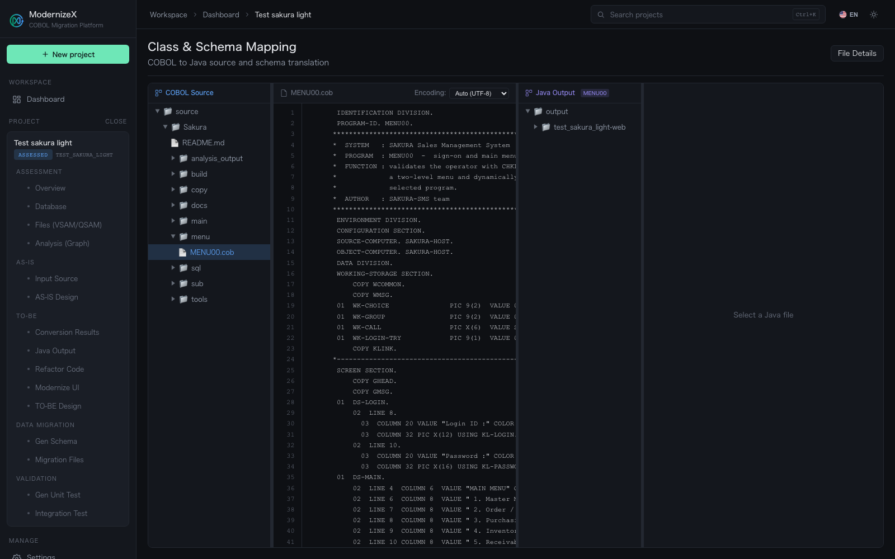

**Class & Schema Mapping** 画面（*COBOL to Java source and schema translation*）では、元のソースと生成された出力を左右に並べて直接比較でき、3 つのペインで構成されます。

1. **COBOL Source** — COBOL ソースツリー。
2. **COBOL コードペイン** — 選択した COBOL ファイルの内容（**Encoding** セレクター付き）。
3. **Java Output** — 選択した COBOL プログラムから生成された Java ファイル。Java ファイルを選択すると、対応する内容が表示されます。

**File Details** ボタン（右上）をクリックすると、比較対象のファイルペアに関する詳細情報が表示されます。この画面を使って、COBOL のロジックが正しく Java に変換されたことを確認します。

---

## 12. TO-BE — Java Output

**画面遷移:** Project → サイドバー `TO-BE` → **Java Output**

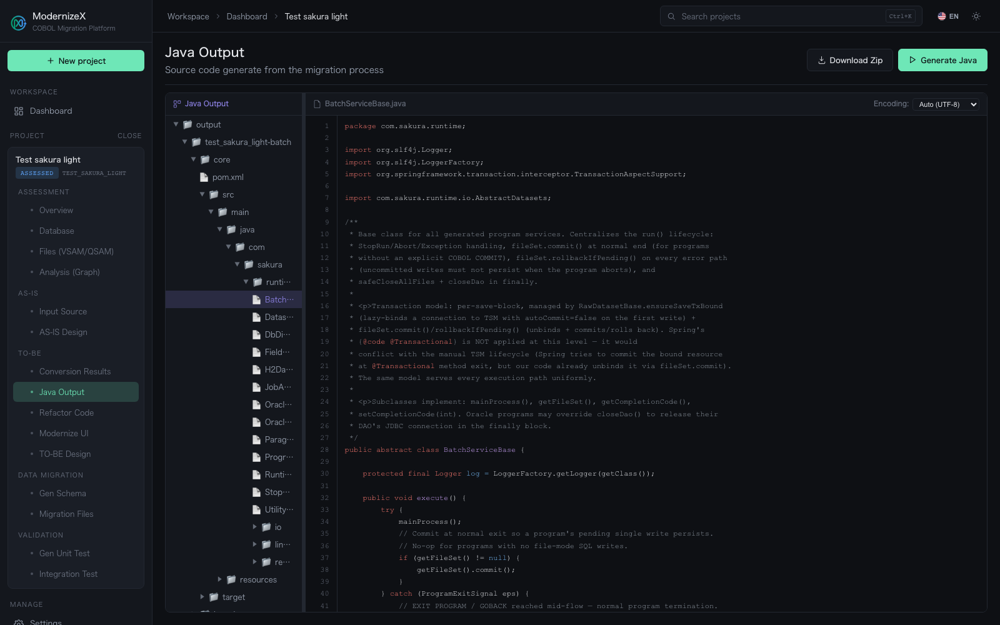

**Java Output** 画面（*Source code generate from the migration process*）では、生成された Java プロジェクト全体を参照できます。

**使い方:**

1. COBOL → Java 生成をまだ実行していない場合は、**Generate Java**（右上）をクリックして実行します。
2. 左側のファイルツリーを展開して、プロジェクト構造を参照します。出力は `output/<project>-batch`（バッチプログラム）、`output/<project>-web`（オンライン/画面プログラム）、`unittest-report` などのモジュールに分かれています。
3. `.java` ファイル（または `.xml`、`.yml` など）をクリックすると、右側のコードビューアに内容が表示されます。
4. **Download Zip**（右上）をクリックすると、Java プロジェクト全体をダウンロードできます。

---

## 13. TO-BE — Refactor Code

**画面遷移:** Project → サイドバー `TO-BE` → **Refactor Code**

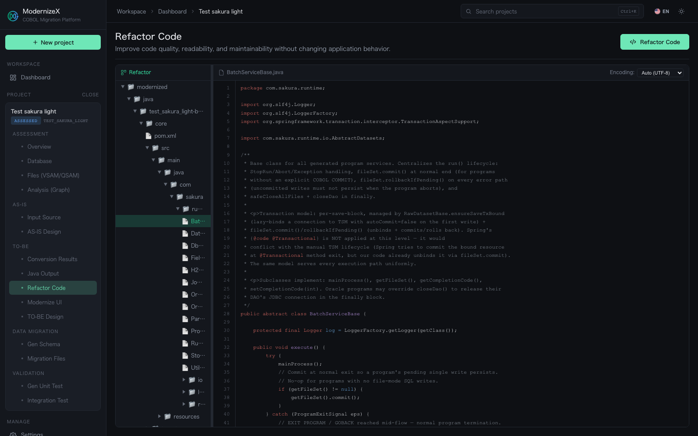

**Refactor Code** 画面（*Improve code quality, readability, and maintainability without changing application behavior*）では、生成された Java の動作を変えずに、コードの品質を向上させるリファクタリングを行います。

**手順:**

1. **Refactor Code**（右上）をクリックして、リファクタリング処理を実行します。
2. 左側の `Refactor/modernized/` ツリーで結果を参照します。
3. ファイルを選択すると、右側のペインにリファクタリング後のコードが表示されます。

> リファクタリングを実行する前は、結果ツリーは空です。

---

## 14. TO-BE — Modernize UI

**画面遷移:** Project → サイドバー `TO-BE` → **Modernize UI**

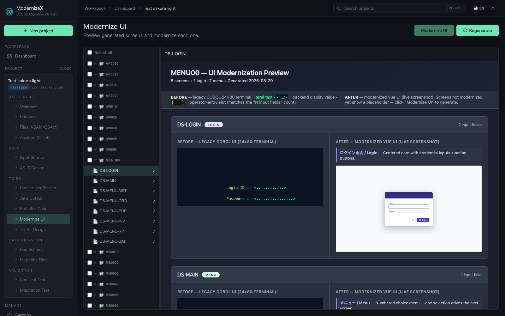

**Modernize UI** 画面（*Preview generated screens and modernize each one*）では、レガシーの COBOL 端末画面をモダンな Web インターフェースへ変換します。

**使い方:**

1. 左側のツリーには、すべての画面タイプのプログラム（例: `MENU00`、`AP0010` など）が一覧表示されます。プログラムを展開すると、個々の画面（`DS-…`）が表示されます。すでにモダナイズ済みの画面には ✓ が付きます。
2. チェックボックス（または **Select all**）で処理対象の画面を選択し、**Modernize UI** をクリックしてモダンな Web バージョンを生成します。生成済みの画面をやり直すには **Regenerate** を使用します。
3. 画面をクリックすると **UI Modernization Preview** が開きます。各画面について、**BEFORE** の表示（レガシー COBOL 3270 24×80 端末）と **AFTER** のデザイン（モダナイズされた Web UI）が左右に並べて表示され、提案されたインターフェースをレビューできます。

---

## 15. TO-BE — TO-BE Design

**画面遷移:** Project → サイドバー `TO-BE` → **TO-BE Design**

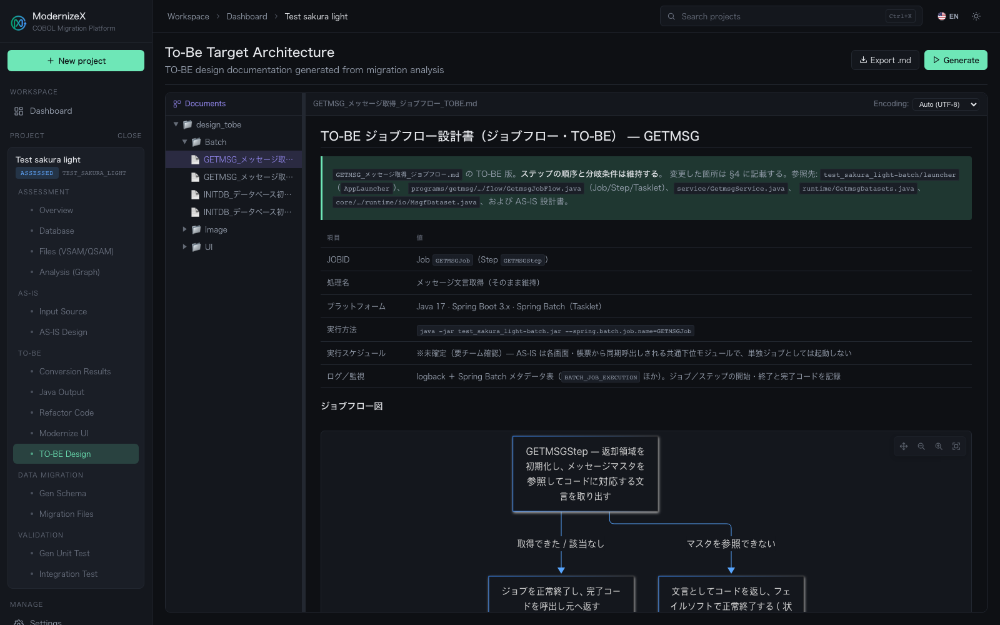

**To-Be Target Architecture** 画面（*TO-BE design documentation generated from migration analysis*）では、ターゲットの Java アーキテクチャを説明するドキュメントを生成します。

**手順:**

1. **Generate** をクリックして TO-BE ドキュメントを生成します。
2. 左側のツリー（AS-IS ドキュメントと同様の構成。例: `design_tobe/Batch`、`Image`、`UI`）で TO-BE ドキュメントを選択して、ターゲットアーキテクチャ、詳細なサービス設計、およびマイグレーションに関する意思決定を確認します。
3. **Export .md** でドキュメントをエクスポートします。

> TO-BE に取り組む前に、AS-IS ドキュメントを完成させ、レビューしておくことを推奨します。

---

## 16. Data Migration — Gen Schema

**画面遷移:** Project → サイドバー `DATA MIGRATION` → **Gen Schema**

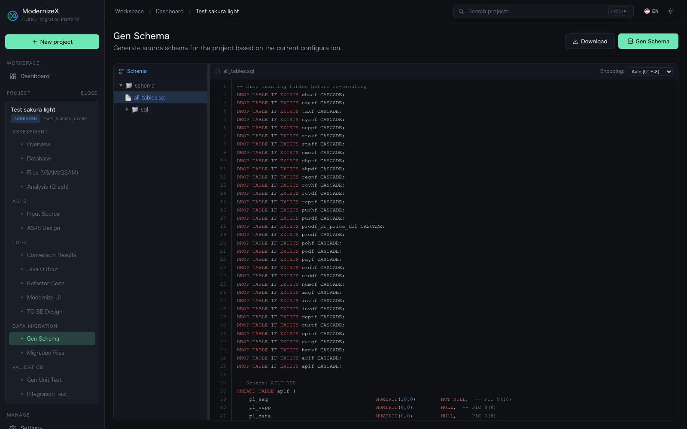

**Gen Schema** 画面（*Generate source schema for the project based on the current configuration*）では、レガシーのデータ定義からターゲットデータベースのスキーマを生成します。

**手順:**

1. **Gen Schema**（右上）をクリックしてスキーマを生成します。
2. `schema/` ツリーで結果を参照します。例: 統合された `all_tables.sql` ファイルや、テーブルごとの DDL を含む `sql/` フォルダ。
3. ファイルを選択すると、右側のビューアにその DDL の内容（`CREATE TABLE …`）が表示されます。
4. **Download** をクリックしてスキーマスクリプトをダウンロードします。

---

## 17. Data Migration — Migration Files

**画面遷移:** Project → サイドバー `DATA MIGRATION` → **Migration Files**

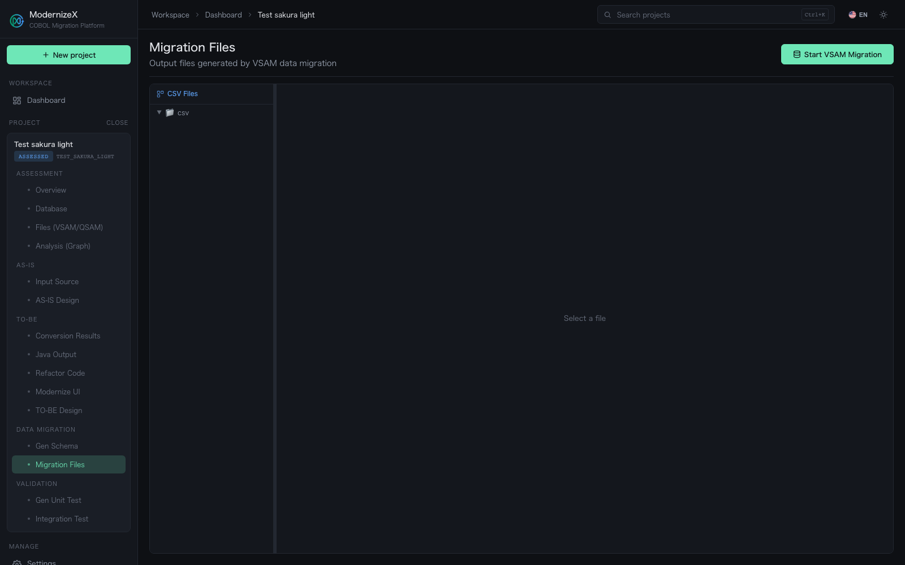

**Migration Files** 画面（*Output files generated by VSAM data migration*）では、VSAM マイグレーションによって生成されたデータファイルを管理します。

**手順:**

1. **Start VSAM Migration**（右上）をクリックして、VSAM データのマイグレーションを開始します。
2. 左側の列の `csv/` ツリーで生成された CSV ファイルを参照します。
3. ファイルを選択すると、右側のペインにそのデータがプレビュー表示されます。

> マイグレーションを実行する前は、`csv/` フォルダは空です。

---

## 18. Validation — Gen Unit Test

**画面遷移:** Project → サイドバー `VALIDATION` → **Gen Unit Test**

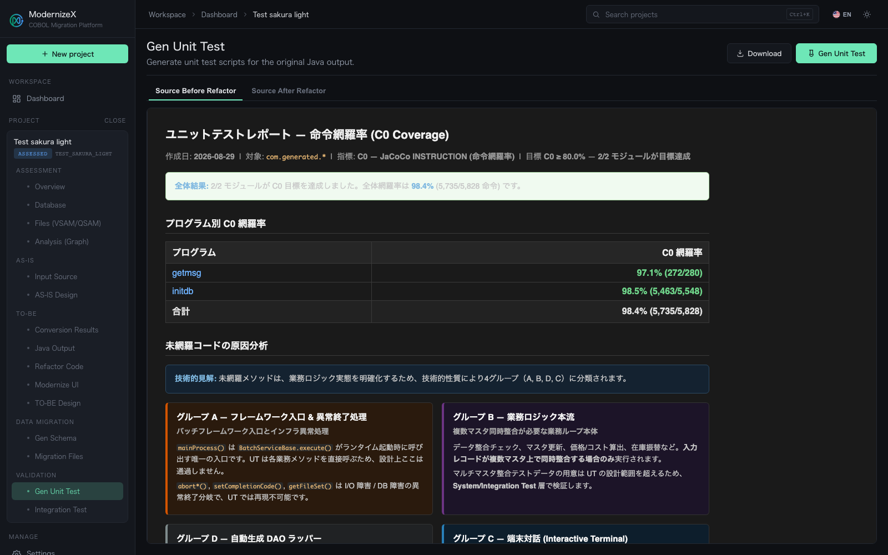

**Gen Unit Test** 画面（*Generate unit test scripts for the original Java output*）では、Java コードのユニットテストを生成・管理します。

**使い方:**

1. **Gen Unit Test**（右上）をクリックして、ユニットテストを生成・実行します。
2. **Source Before Refactor** / **Source After Refactor** タブで、対象とするソースの範囲を選択します。
3. **Unit Test Report** を確認します。プログラムごとのステートメントカバレッジ（**C0 Coverage**）と全体の合計に加えて、カバーされていないコード（フレームワークの I/O 分岐、DAO のエラーパス、対話型端末グループなど）に関する注記が表示されます。
4. **Download** をクリックして、テストレポート/スクリプトをダウンロードします。

> 生成前は、画面にレポートは表示されません。

---

## 19. Validation — Integration Test

**画面遷移:** Project → サイドバー `VALIDATION` → **Integration Test**

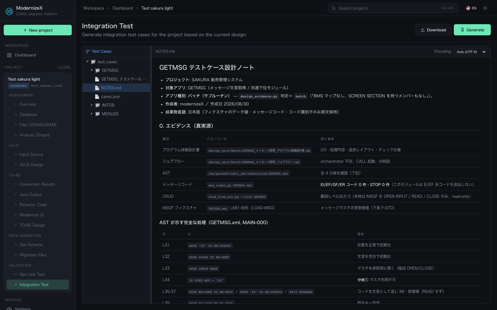

**Integration Test** 画面（*Generate integration test cases for the project based on the current design*）では、統合テストシナリオを生成・管理します。

**使い方:**

1. **Generate**（右上）をクリックして、現在の設計に基づく統合テストケースを生成します。
2. 左側の `test_cases/` ツリー（プログラムごとに 1 フォルダ。例: `MENU00`、`INITDB`）でテストケースを参照し、ファイルを選択して詳細を確認します。
3. **Download** をクリックしてテストケースをダウンロードします。

> 先に Design Docs（AS-IS/TO-BE）を生成しておく必要があります。設計ドキュメントが準備できていない場合、画面に生成を促すメッセージが表示されます。

---

## 20. Settings

**画面遷移:** サイドバー `MANAGE` → **Settings**

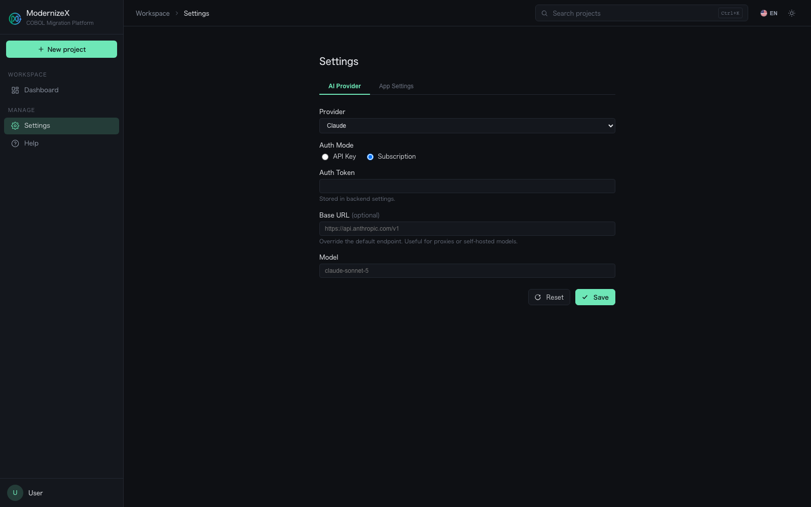

**Settings** 画面には 2 つのタブがあります。**AI Provider** と **App Settings**。

**AI Provider タブ** — パイプラインで使用する AI モデルを設定します。

- **Provider** — モデルのプロバイダー: **Claude** / **Gemini** / **Codex**。
- **Auth Mode** — **API Key** または **Subscription**。
- **Auth Token** — API キー / トークン（バックエンドの設定に保存されます）。
- **Base URL** *(任意)* — デフォルトのエンドポイントを上書きします（例: Claude の場合 `https://api.anthropic.com/v1`）。プロキシやセルフホストのモデルで役立ちます。
- **Model** — モデル名（例: `claude-sonnet-5`）。

**Save** をクリックして保存するか、**Reset** をクリックしてデフォルトに戻します。

---

## 21. Help

**画面遷移:** サイドバー `MANAGE` → **Help**

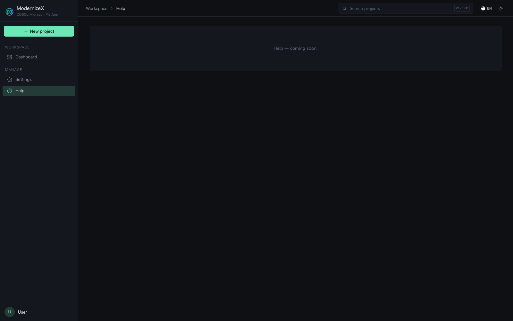

**Help** 画面では、アプリ内ドキュメントとサポートを提供します。*（現在準備中 — "Help — coming soon"。）*

---

## 22. Delivery & Project Closeout

パイプラインの進行に伴ってプロジェクトのステータスが進み（例: アセスメント完了後は `ASSESSED`）、すべてのステップが完了すると **MIGRATED** に到達します（Dashboard および Project Overview 画面の上部に表示されます）。

**エクスポート可能な成果物:**

| 項目 | 場所 | エクスポート方法 |
|---|---|---|
| AS-IS ドキュメント | AS-IS → AS-IS Design | **Export .md** |
| TO-BE ドキュメント | TO-BE → TO-BE Design | **Export .md** |
| Java ソース（プロジェクト） | TO-BE → Java Output | **Download Zip** |
| データベーススキーマ（DDL） | Data Migration → Gen Schema | **Download** |
| ユニットテストレポート / スクリプト | Validation → Gen Unit Test | **Download** |
| 統合テストケース | Validation → Integration Test | **Download** |
| プロジェクトレポート | Project Overview | **Export** |

**納品前チェックリスト:**

- [ ] ソースが取り込まれ、スナップショットが安定している（Import Source が `COMPLETED`）。
- [ ] Assessment が完了し、対応すべき **Unresolved Refs** が残っていない（RISKS タブ）。
- [ ] AS-IS および TO-BE ドキュメントが生成され、レビュー済みである。
- [ ] 変換が要求される **Accuracy** を満たし、`FAILED`/`UNSUPPORTED` のファイルが解決されている。
- [ ] データベーススキーマとデータファイルが生成され、検証済みである。
- [ ] Unit Test および Integration Test が生成され、目標に対して合格している（C0 カバレッジをレビュー済み）。
- [ ] すべての成果物ドキュメントとソースがエクスポートされている。

---

## Appendix A — Glossary

| 用語 | 意味 |
|---|---|
| **AS-IS** | レガシーシステムの現状を記述したドキュメント（リバースエンジニアリングによるもの） |
| **TO-BE** | モダナイズされたシステムのあるべき姿の設計（フォワード設計） |
| **SAD / SDD** | Software Architecture Document（ソフトウェアアーキテクチャドキュメント） / Software Design Document（ソフトウェア設計書） |
| **Copybook** | 共有される COBOL のデータ構造（`.cpy`） |
| **JCL** | Job Control Language — メインフレームのジョブ制御スクリプト |
| **CICS / BMS** | IBM のオンライントランザクションシステム / 3270 画面定義 |
| **VSAM / QSAM** | メインフレームの索引形式 / 順次形式のファイルフォーマット |
| **DL/I** | IMS 階層型データベースへのアクセスインターフェース |
| **MQ** | メッセージキュー |
| **COMP-3** | COBOL のパック 10 進数の数値型 |
| **DDL** | Data Definition Language — データベース構造を作成するステートメント |
| **C0 Coverage** | ステートメントカバレッジ — ユニットテストによって実行された実行可能ステートメントの割合（%） |
| **Snapshot** | ある時点でのソースをバージョン管理して取得したもの |

---

## Appendix B — Keyboard Shortcuts

| キー | 機能 |
|---|---|
| `Ctrl+K` | プロジェクト検索ボックス（Search projects）を開く |

---

## Appendix C — Deployment & AI Provider

- **オンプレミスデプロイ:** ModernizeX は社内インフラ内にインストールされます（パッケージ化されたインストーラーを使用 — *ModernizeX_Installation_Guide* を参照）。ソースコードを顧客のシステム内に留める必要がある環境に適しています。
- **AI 設定（Settings → AI Provider）:**
  - **Provider** — モデルのプロバイダーを選択します（**Claude**、**Gemini**、または **Codex**）。
  - **Auth Mode** — **API Key**（BYOK: 顧客自身のキーを使用）または **Subscription**。
  - **Base URL** *(任意)* — カスタムエンドポイントを指定します。社内プロキシや **セルフホストのモデル** を利用してアウトバウンドアクセスを制限する場合に使用します。
  - **Model** — パイプラインで使用するモデル名を指定します。

---

*— ドキュメントはここまで —*
