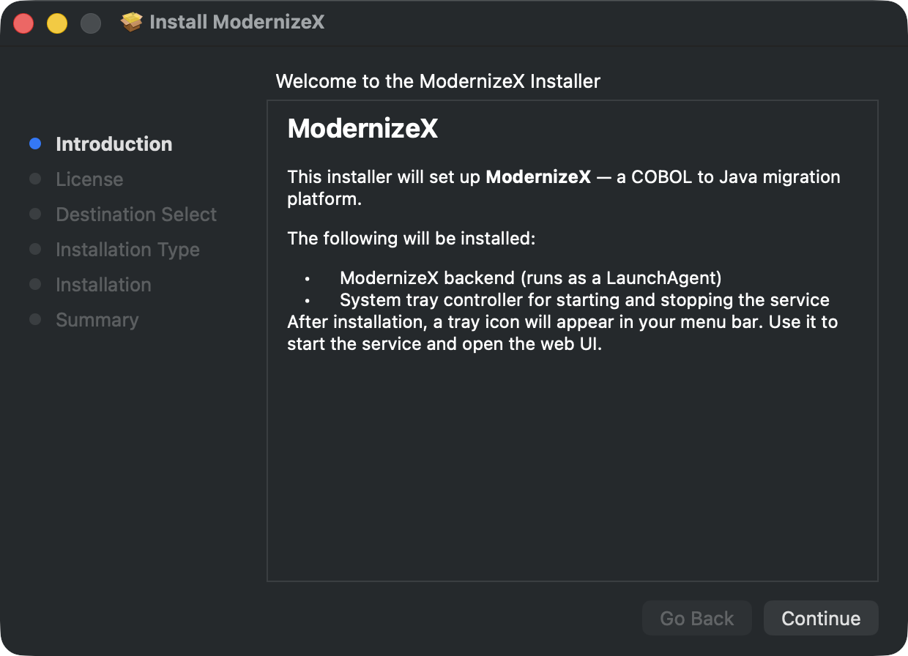
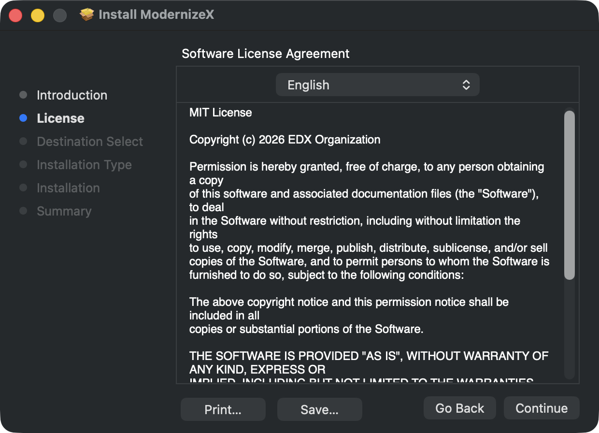
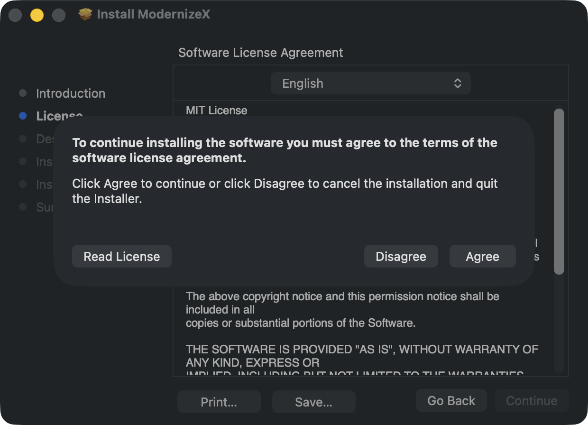
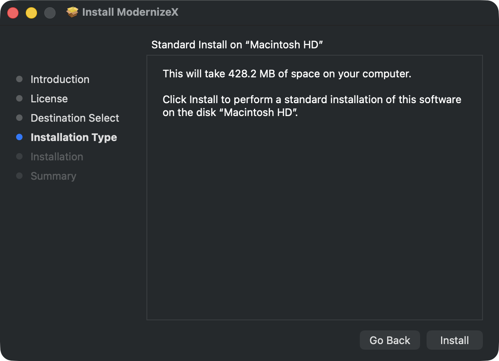
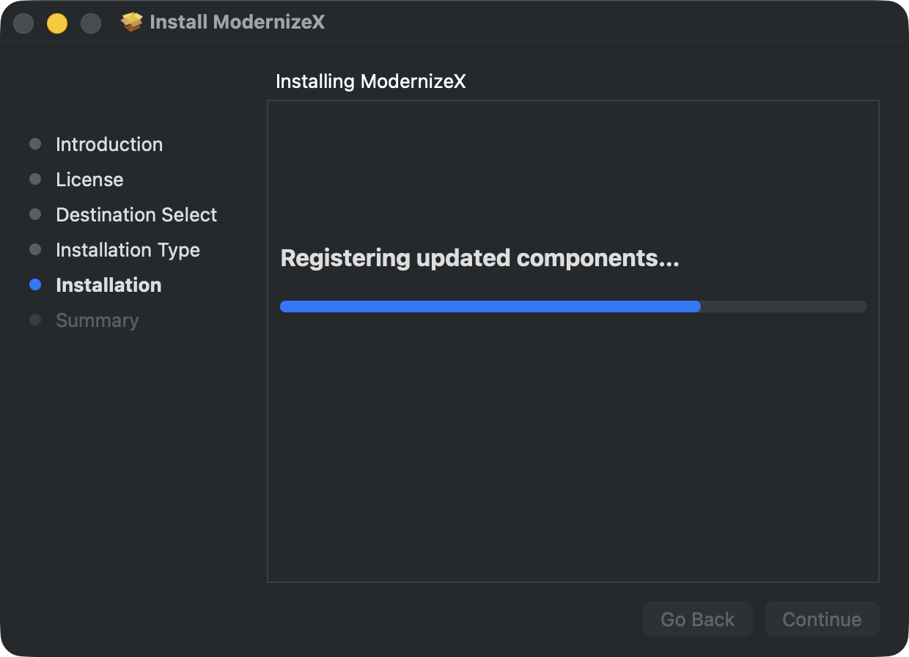
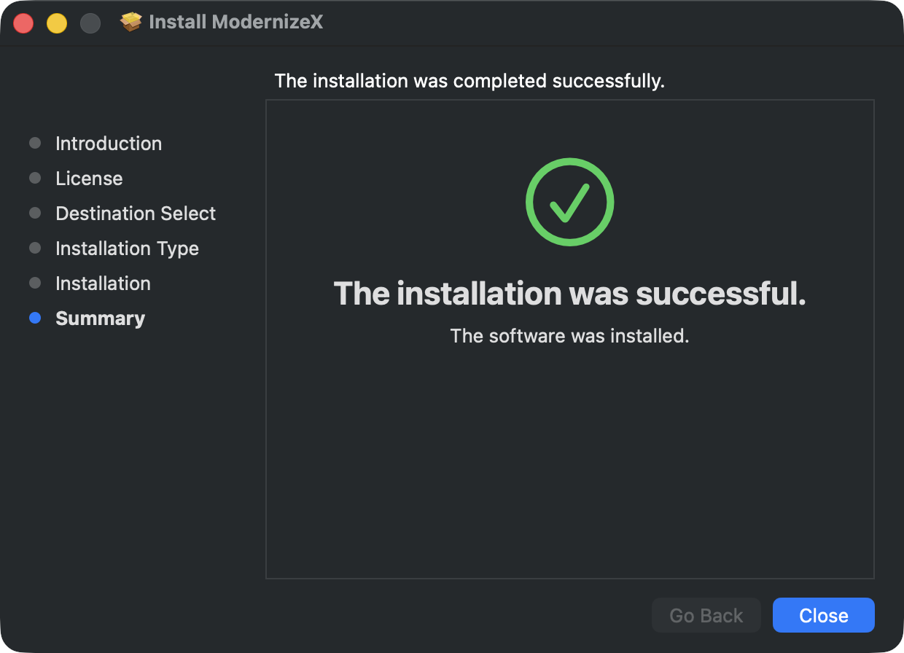
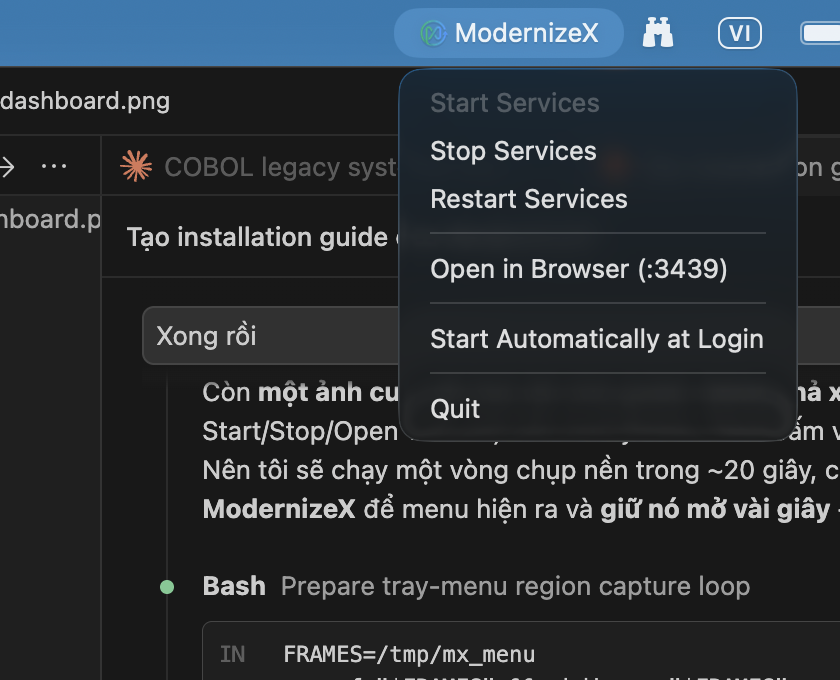
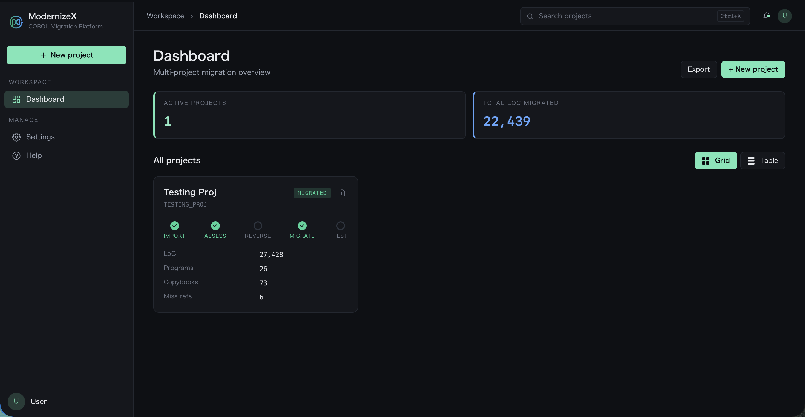

# ModernizeX — Installation Guide (macOS)

**COBOL → Java Modernization Platform** · Build `dev-621e257`

<br clear="left" />

> This document explains how to install the **ModernizeX** application on macOS from the `ModernizeX-dev-621e257.pkg` package. Every screenshot in this document was captured directly from the actual installation process.

> 🎬 **Video walkthrough (~64 seconds, English narration + background music):** [`ModernizeX_Installation_Guide.mp4`](ModernizeX_Installation_Guide.mp4) — a narrated slideshow covering all installation steps, with English subtitles.

---

## 1. Overview

ModernizeX is a source-code modernization platform: it analyzes, reverse-engineers, and converts legacy COBOL systems to Java. The installer sets up:

| Component | Description |
|---|---|
| **ModernizeX backend** | The background service, running as a **LaunchAgent** (API port `3438`, Web UI port `3439`) |
| **System tray controller** | A **menu bar** icon to Start / Stop the service and open the Web UI |
| **Embedded JRE (OpenJDK 21.0.7)** | Java bundled in for **both Apple Silicon (arm64) and Intel (x86_64)** — no separate Java install required |

---

## 2. System Requirements

| Item | Requirement |
|---|---|
| Operating system | **macOS 13.0 (Ventura) or later** |
| CPU architecture | Apple Silicon (M-series) or Intel — both supported |
| Free disk space | ~ **430 MB** |
| Privileges | An **admin** account (password required during install) |
| Network ports | `3438` and `3439` must be free |
| Java | **Not required** — already embedded in the package |

---

## 3. Before Installing — Allow Through Gatekeeper

The `dev-621e257` package is an **unsigned internal build**. On first open, macOS Gatekeeper will block it with a message like *"...cannot be opened because it is from an unidentified developer"* / *"Apple could not verify..."*.

Choose **one of the two methods** below to allow it:

**Method A — Right-click (recommended, fastest):**
1. In Finder, **Control-click (right-click)** the `ModernizeX-dev-621e257.pkg` file.
2. Choose **Open** → in the warning dialog, click **Open** once more.

**Method B — Via System Settings:**
1. Double-click the `.pkg` file (macOS will block it the first time).
2. Open **System Settings → Privacy & Security**.
3. Scroll to the **Security** section, find the prompt about "ModernizeX-dev-621e257.pkg" → click **Open Anyway**.
4. Authenticate with Touch ID or your password, then click **Open** in the next dialog.

> 💡 Once allowed a single time, the installation steps below will appear normally.

---

## 4. Installation Steps

### Step 1 — Introduction

The installer opens a welcome screen summarizing what will be installed. Click **Continue**.



---

### Step 2 — License

Read the **Software License Agreement** (the **ModernizeX Commercial License**, © 2026 ModernizeX Organization). Click **Continue**.



A confirmation dialog appears — click **Agree** to accept and continue.



---

### Step 3 — Installation Type

The screen shows the install size (~**428 MB**) and the destination volume (*Macintosh HD*). This is a standard installation — click **Install**.



> ℹ️ The application is always installed to `/Applications/ModernizeX.app` (the location cannot be changed).

---

### Step 4 — Admin Authentication

macOS requires administrator privileges to write files to `/Applications` and register the LaunchAgents. When prompted:

- Authenticate with **Touch ID**, **or**
- Enter your **admin username & password** → click **Install Software**.

> 🔒 *This step may be skipped quickly if the machine authenticated recently or Touch ID is used — that is why this document has no screenshot of the authentication step.*

---

### Step 5 — Installing

The progress bar runs through several phases: *Preparing → Configuring → Writing files → Running package scripts → Registering components*. This takes about **30–60 seconds**.



During the *Running package scripts* phase, the installer automatically:
- Writes the `installer.properties` configuration file.
- Installs and registers **2 LaunchAgents** (backend + tray).
- Starts the **tray controller** (the menu bar icon).

---

### Step 6 — Summary

The message **"The installation was successful."** appears with a green checkmark. Click **Close** to close the installer.



> When asked whether to move the `.pkg` file to the Trash, choose whichever you prefer (**Keep** to retain it is fine).

---

## 5. After Installation

### 5.1. The Menu Bar Icon

Right after installation, the **♾️ ModernizeX** icon appears in the **menu bar** (top-right corner of the screen).


### 5.2. The Service Control Menu

**Click the ♾️ ModernizeX icon** to open the control menu:



| Menu item | Function |
|---|---|
| **Start Services** | Start the backend service (dimmed while already running) |
| **Stop Services** | Stop the service |
| **Restart Services** | Restart the service |
| **Open in Browser (:3439)** | Open the Web UI in your browser |
| **Start Automatically at Login** | Toggle auto-start when you log in |
| **Quit** | Quit the tray controller |

> By default the service does **not** auto-start at boot (`auto.start.on.boot=false`). If the backend is not running yet, click **Start Services** first.

### 5.3. Opening the Web UI

Click **Open in Browser (:3439)** — the ModernizeX **Dashboard** opens at `http://localhost:3439`.



At this point, ModernizeX is ready to use. 🎉

---

## 6. Verify the Installation

Run the following commands in **Terminal** to confirm a successful installation:

```bash
# 1) The app is present in /Applications
ls -d /Applications/ModernizeX.app

# 2) Both LaunchAgents are registered (shows a PID if running)
launchctl list | grep modernizex
#   →  com.edx.modernizex        (backend)
#   →  com.edx.modernizex-tray   (tray)

# 3) The backend is listening on ports 3438 and 3439
lsof -nP -iTCP:3438 -sTCP:LISTEN
lsof -nP -iTCP:3439 -sTCP:LISTEN

# 4) The Web UI responds with HTTP 200
curl -s -o /dev/null -w "%{http_code}\n" http://localhost:3439/
```

---

## 7. File Locations After Install

| Component | Path |
|---|---|
| Application | `/Applications/ModernizeX.app` |
| Configuration | `~/Library/Application Support/ModernizeX/config/installer.properties` |
| Project data | `~/Library/Application Support/ModernizeX/data` |
| Logs | `~/Library/Application Support/ModernizeX/logs/` (`backend.log`, `tray.log`, `installer.log`) |
| LaunchAgent (backend) | `~/Library/LaunchAgents/com.edx.modernizex.plist` |
| LaunchAgent (tray) | `~/Library/LaunchAgents/com.edx.modernizex-tray.plist` |

---

## 8. Troubleshooting

| Symptom | Resolution |
|---|---|
| **Cannot open the .pkg file** ("unidentified developer") | Follow **Section 3** (Gatekeeper): right-click → Open, or System Settings → Privacy & Security → *Open Anyway*. |
| **No icon in the menu bar** | Restart the tray: `launchctl kickstart -k gui/$(id -u)/com.edx.modernizex-tray` — or open `/Applications/ModernizeX.app`. |
| **Web UI won't open / blank page** | Make sure the backend is running: click **Start Services** in the tray menu. Check `backend.log`. |
| **Service won't start** | Ports `3438`/`3439` may be taken by another app. Check with `lsof -nP -iTCP:3439 -sTCP:LISTEN`. See the log: `~/Library/Application Support/ModernizeX/logs/backend-err.log`. |
| **View the install log** | `cat "~/Library/Application Support/ModernizeX/logs/installer.log"` |

---

## 9. Uninstall

Run the following commands in **Terminal** to fully remove ModernizeX:

```bash
UID_=$(id -u)

# 1) Stop & unregister both LaunchAgents
launchctl bootout gui/$UID_/com.edx.modernizex 2>/dev/null
launchctl bootout gui/$UID_/com.edx.modernizex-tray 2>/dev/null

# 2) Remove the LaunchAgent plist files
rm -f ~/Library/LaunchAgents/com.edx.modernizex.plist
rm -f ~/Library/LaunchAgents/com.edx.modernizex-tray.plist

# 3) Remove the application
rm -rf /Applications/ModernizeX.app

# 4) (Optional) Remove configuration, data, and logs
#    ⚠️ Skip this step if you want to KEEP your migrated project data
rm -rf ~/Library/Application\ Support/ModernizeX
```

> The original uninstaller (`preuninstall.sh`) will **ask whether to keep or delete data** before removing it — project data lives at `~/Library/Application Support/ModernizeX/data`.

---

## 10. Version Information

| Attribute | Value |
|---|---|
| Package name | `ModernizeX-dev-621e257.pkg` |
| Bundle Identifier | `com.edx.modernizex` |
| Version | `dev-621e257` |
| Embedded JRE | OpenJDK **21.0.7** (arm64 + x86_64) |
| Backend / frontend ports | `3438` / `3439` |
| License | ModernizeX Commercial License — © 2026 ModernizeX Organization (see [LICENSE](LICENSE)) |
| Minimum macOS | 13.0 |

---

*This document was created for the `ModernizeX-dev-621e257.pkg` installation package. Screenshots were captured directly from the macOS Installer.*
