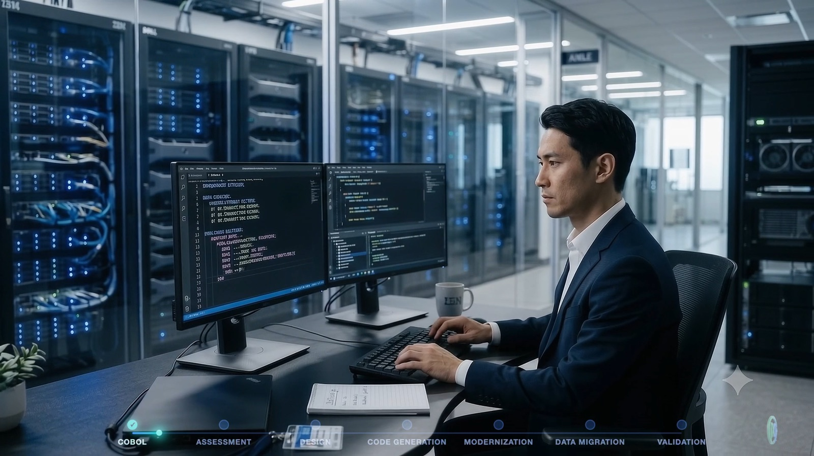
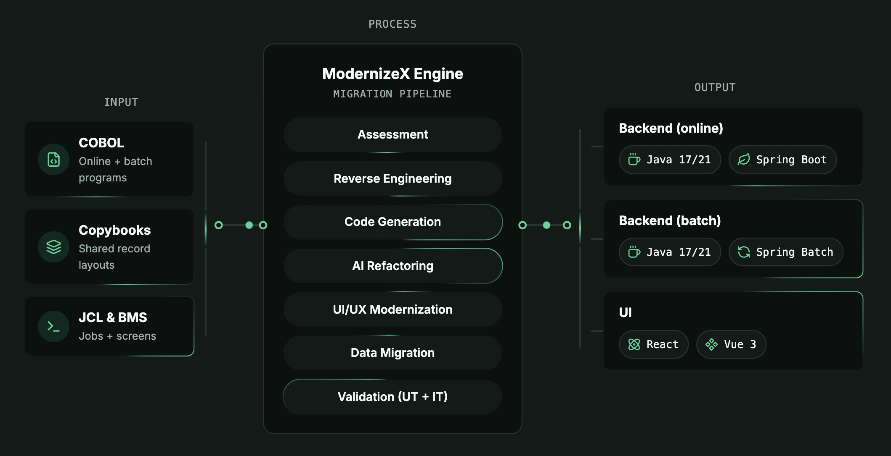

# ModernizeX

**English** | [日本語](README.md)

**AIR-GAPPED COBOL MODERNIZATION**

> ## Modernize your COBOL systems — without a line of code leaving your network.
>
> One hybrid engine — deterministic AST parsing plus LLM — takes legacy COBOL to modern Java: assessed, migrated and validated end-to-end, running locally in your own environment.

Built for regulated industries: **Banking · Government · Insurance**

| **38 h** | **95%** | **100%** |
|:---:|:---:|:---:|
| measured end-to-end migration — SAKURA-SMS, 30,635 LOC | initial compilation rate | on-premise source code retention |

🌐 [modernizex.com](https://modernizex.com/) · **Baseline v1.0** · © 2026 ModernizeX Organization · [Commercial License](LICENSE)

---

## 🎬 Watch ModernizeX in Action

See how ModernizeX transforms legacy COBOL systems into clean Java architecture in a 90-second walkthrough — from CICS screens to a running Java system.

*Click the image to watch the teaser on [YouTube](https://www.youtube.com/watch?v=93FG-AqhURQ).*

---

## Why ModernizeX

Three pillars separate the engine from a generic code-translation tool:

1. **One orchestrated pipeline** — seven stages, each a checkpoint you can resume, re-run or roll back. No CLI required.
2. **Dependencies mapped before generation** — a deterministic AST pre-parser maps every dependency before the LLM ever touches the code, eliminating hallucination.
3. **Your code never leaves your network** — on-prem / air-gapped deployment with bring-your-own-key LLM support for regulated industries.

## One pipeline. Seven stages. No manual hand-off.

Every run moves through the same seven checkpoints — end to end, resumable at any point.

## Measured on real codebases

Per-stage effort, measured on a complete end-to-end pipeline run — not simulated.

| Stage | SAKURA-SMS · 68 programs · 30,635 LOC |
|---|---|
| Assessment | 0.2 h |
| Reverse Engineering | 2 h |
| Code Generation | 0.3 h |
| Code Refactoring | 10 h |
| UI/UX Modernization | 0.5 h |
| Data Migration | 1 h |
| Validation (UT / IT) | 12 / 12 h |
| **Total (pipeline)** | **38 h** |
| Fully manual (estimated) | > 12 man-months |

SAKURA-SMS was migrated end-to-end in 38 h through validation — 66 web + 2 batch Maven modules compiling clean out of the box, per-screen Vue 3 UI, unit tests passing on 68/68 modules.

## Documentation

| Document | English | 日本語 |
|---|---|---|
| **Whitepaper** — architecture, seven-stage pipeline, SAKURA-SMS case study | [EN](ModernizeX_Whitepaper_v1.0.md) | [JA](ModernizeX_Whitepaper_v1.0_JA.md) |
| **Effort Evaluation** — measured migration effort on a real run | [EN](ModernizeX_Effort_Evaluation_v1.0.md) | [JA](ModernizeX_Effort_Evaluation_v1.0_JA.md) |
| **End-User Guide** — full walkthrough of the application UI | [EN](ModernizeX_EndUser_Guide_EN.md) | [JA](ModernizeX_EndUser_Guide_JA.md) |
| **Installation Guide** (macOS) | [EN](ModernizeX_Installation_Guide_EN.md) | [JA](ModernizeX_Installation_Guide_JA.md) |
| **Installation video** (~64 s, EN narration) | [ModernizeX_Installation_Guide.mp4](ModernizeX_Installation_Guide.mp4) | |

All End-User Guide screenshots are captured directly from the live application (build `2.0-refactored`, guide v2.1).

## How ModernizeX Offline Licensing Works

1. **Scope the engagement** — start with a free assessment. We size the work with you and issue a license covering your codebase.
2. **Place the license file** — download the signed `license.json` and save it under `~/.modernizex/`.
3. **Migrate offline** — run the migration tool. It verifies the Ed25519 signature offline and tracks quota locally; the portal never sees your usage.

## Start free. Scale to a full migration.

| Assessment | Migration | Enterprise Partnership |
|---|---|---|
| **Free** | **Custom** · per project | **Contact us** |
| Codebase complexity analysis · dependency mapping report · migration roadmap & timeline · cost estimate · 30-minute review call | Full-service modernization: Java migration & modernization, architecture design documents, UT/IT with traceability matrix, phased deployment plan, 100% functional parity guarantee | Ongoing partnership: optimized cost, priority scheduling, continuous modernization pipeline, on-site workshops, executive reporting |

Every engagement starts with a free assessment — [view pricing plans](https://modernizex.com/).

## Contact

**ModernizeX** — professional software migration toolsets, automating legacy COBOL-to-Java modernization.

📧 [info@modernizex.com](mailto:info@modernizex.com) · 🌐 [modernizex.com](https://modernizex.com/)

© 2026 ModernizeX. All rights reserved.
