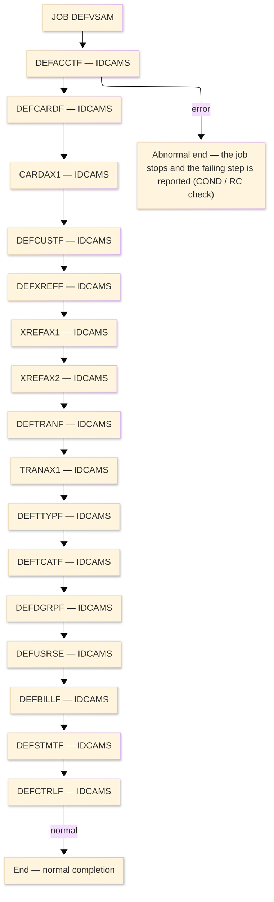

# Job flow — DEFVSAM

| Item | Content |
|---|---|
| JOBID | DEFVSAM（`DEFVSAM.jcl`） |
| Process name（処理名称） | Define the 12 VSAM KSDS clusters (IDCAMS) |
| System / Category | ORION-CCMS (ORION Credit Card Management System) / Batch (IBM z/OS mainframe) |
| Runtime environment (current) | z/OS JCL — IDCAMS utility |
| Job data source | JCL (`datastore/jcl_jobs.json` ／ `DEFVSAM.jcl`) |
| Launch command / schedule | Submitted manually / by the operations schedule — ※ not determined (ask the team) |

### Job flow diagram

> **Symbol legend**: ★＝the step runs a program that has its own program design in this folder ｜ IN:／OUT:／SYSIN:／ENV:／LOG:＝DD direction ｜ `(concat)`＝library/dataset concatenation ｜ `&&name`＝temporary dataset (deleted at step end) ｜ SYSOUT＝report/log output

| Step | Line | Processing | ＤＤ | Dataset / File | Notes |
|---|---|---|---|---|---|
| **JOB** | L1 | JOB card — CLASS=A, MSGCLASS=X, REGION=0M | ENV:JOBLIB | `ORION.LOADLIB` | load library |
| **◆ Overview** |  | Define the 12 VSAM KSDS clusters (IDCAMS). | ・Overall: | `DB2 tables / VSAM master → updated tables / report` |  |
|  |  |  | ・P0: | `16 step(s)` |  |
|  |  |  | ・Input: | `DB2 tables (via plan) / sequential feed` |  |
|  |  |  | ・Output: | `updated VSAM/DB2 + SYSOUT report` |  |
| **◆ P0 Main processing** |  | the job's regular run |  |  |  |
| **DEFACCTF** | L0 | IDCAMS utility step — VSAM cluster define / REPRO load (no business COBOL logic). |  |  | PGM=IDCAMS |
|  | L3 |  | LOG:SYSPRINT |  | SYSOUT=* |
|  | L4 |  | SYSIN:SYSIN | `(instream)` |  |
| **DEFCARDF** | L0 | IDCAMS utility step — VSAM cluster define / REPRO load (no business COBOL logic). |  |  | PGM=IDCAMS |
|  | L21 |  | LOG:SYSPRINT |  | SYSOUT=* |
|  | L22 |  | SYSIN:SYSIN | `(instream)` |  |
| **CARDAX1** | L0 | IDCAMS utility step — VSAM cluster define / REPRO load (no business COBOL logic). |  |  | PGM=IDCAMS |
|  | L39 |  | LOG:SYSPRINT |  | SYSOUT=* |
|  | L40 |  | SYSIN:SYSIN | `(instream)` |  |
| **DEFCUSTF** | L0 | IDCAMS utility step — VSAM cluster define / REPRO load (no business COBOL logic). |  |  | PGM=IDCAMS |
|  | L58 |  | LOG:SYSPRINT |  | SYSOUT=* |
|  | L59 |  | SYSIN:SYSIN | `(instream)` |  |
| **DEFXREFF** | L0 | IDCAMS utility step — VSAM cluster define / REPRO load (no business COBOL logic). |  |  | PGM=IDCAMS |
|  | L76 |  | LOG:SYSPRINT |  | SYSOUT=* |
|  | L77 |  | SYSIN:SYSIN | `(instream)` |  |
| **XREFAX1** | L0 | IDCAMS utility step — VSAM cluster define / REPRO load (no business COBOL logic). |  |  | PGM=IDCAMS |
|  | L94 |  | LOG:SYSPRINT |  | SYSOUT=* |
|  | L95 |  | SYSIN:SYSIN | `(instream)` |  |
| **XREFAX2** | L0 | IDCAMS utility step — VSAM cluster define / REPRO load (no business COBOL logic). |  |  | PGM=IDCAMS |
|  | L113 |  | LOG:SYSPRINT |  | SYSOUT=* |
|  | L114 |  | SYSIN:SYSIN | `(instream)` |  |
| **DEFTRANF** | L0 | IDCAMS utility step — VSAM cluster define / REPRO load (no business COBOL logic). |  |  | PGM=IDCAMS |
|  | L132 |  | LOG:SYSPRINT |  | SYSOUT=* |
|  | L133 |  | SYSIN:SYSIN | `(instream)` |  |
| **TRANAX1** | L0 | IDCAMS utility step — VSAM cluster define / REPRO load (no business COBOL logic). |  |  | PGM=IDCAMS |
|  | L150 |  | LOG:SYSPRINT |  | SYSOUT=* |
|  | L151 |  | SYSIN:SYSIN | `(instream)` |  |
| **DEFTTYPF** | L0 | IDCAMS utility step — VSAM cluster define / REPRO load (no business COBOL logic). |  |  | PGM=IDCAMS |
|  | L169 |  | LOG:SYSPRINT |  | SYSOUT=* |
|  | L170 |  | SYSIN:SYSIN | `(instream)` |  |
| **DEFTCATF** | L0 | IDCAMS utility step — VSAM cluster define / REPRO load (no business COBOL logic). |  |  | PGM=IDCAMS |
|  | L187 |  | LOG:SYSPRINT |  | SYSOUT=* |
|  | L188 |  | SYSIN:SYSIN | `(instream)` |  |
| **DEFDGRPF** | L0 | IDCAMS utility step — VSAM cluster define / REPRO load (no business COBOL logic). |  |  | PGM=IDCAMS |
|  | L205 |  | LOG:SYSPRINT |  | SYSOUT=* |
|  | L206 |  | SYSIN:SYSIN | `(instream)` |  |
| **DEFUSRSE** | L0 | IDCAMS utility step — VSAM cluster define / REPRO load (no business COBOL logic). |  |  | PGM=IDCAMS |
|  | L223 |  | LOG:SYSPRINT |  | SYSOUT=* |
|  | L224 |  | SYSIN:SYSIN | `(instream)` |  |
| **DEFBILLF** | L0 | IDCAMS utility step — VSAM cluster define / REPRO load (no business COBOL logic). |  |  | PGM=IDCAMS |
|  | L241 |  | LOG:SYSPRINT |  | SYSOUT=* |
|  | L242 |  | SYSIN:SYSIN | `(instream)` |  |
| **DEFSTMTF** | L0 | IDCAMS utility step — VSAM cluster define / REPRO load (no business COBOL logic). |  |  | PGM=IDCAMS |
|  | L259 |  | LOG:SYSPRINT |  | SYSOUT=* |
|  | L260 |  | SYSIN:SYSIN | `(instream)` |  |
| **DEFCTRLF** | L0 | IDCAMS utility step — VSAM cluster define / REPRO load (no business COBOL logic). |  |  | PGM=IDCAMS |
|  | L277 |  | LOG:SYSPRINT |  | SYSOUT=* |
|  | L278 |  | SYSIN:SYSIN | `(instream)` |  |
| **End** | - | Normal completion sets RC=0; a step return code above the COND threshold stops the job and the failing step is reported. Abends are captured to CEEDUMP/SYSUDUMP. | LOG:- | `SYSOUT / MSGCLASS` | - |
