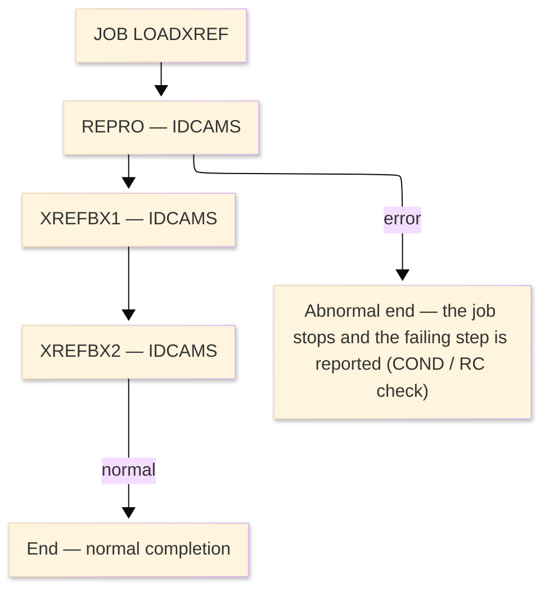

# Job flow — LOADXREF

| Item | Content |
|---|---|
| JOBID | LOADXREF（`LOADXREF.jcl`） |
| Process name（処理名称） | Initial IDCAMS REPRO load of the card cross-reference KSDS |
| System / Category | ORION-CCMS (ORION Credit Card Management System) / Batch (IBM z/OS mainframe) |
| Runtime environment (current) | z/OS JCL — IDCAMS utility |
| Job data source | JCL (`datastore/jcl_jobs.json` ／ `LOADXREF.jcl`) |
| Launch command / schedule | Submitted manually / by the operations schedule — ※ not determined (ask the team) |

### Job flow diagram

> **Symbol legend**: ★＝the step runs a program that has its own program design in this folder ｜ IN:／OUT:／SYSIN:／ENV:／LOG:＝DD direction ｜ `(concat)`＝library/dataset concatenation ｜ `&&name`＝temporary dataset (deleted at step end) ｜ SYSOUT＝report/log output

| Step | Line | Processing | ＤＤ | Dataset / File | Notes |
|---|---|---|---|---|---|
| **JOB** | L1 | JOB card — CLASS=A, MSGCLASS=X, REGION=0M | ENV:JOBLIB | `ORION.LOADLIB` | load library |
| **◆ Overview** |  | Initial IDCAMS REPRO load of the card cross-reference KSDS. | ・Overall: | `ORION.XREFFILE.SEQ → updated tables / report` |  |
|  |  |  | ・P0: | `3 step(s)` |  |
|  |  |  | ・Input: | `ORION.XREFFILE.SEQ, ORION.XREFFILE` |  |
|  |  |  | ・Output: | `updated VSAM/DB2 + SYSOUT report` |  |
| **◆ P0 Main processing** |  | the job's regular run |  |  |  |
| **REPRO** | L0 | IDCAMS utility step — VSAM cluster define / REPRO load (no business COBOL logic). |  |  | PGM=IDCAMS |
|  | L3 |  | LOG:SYSPRINT |  | SYSOUT=* |
|  | L4 |  | IN:SEQIN | `ORION.XREFFILE.SEQ` | DISP=SHR |
|  | L5 |  | IN:VSAMOUT | `ORION.XREFFILE` | DISP=SHR |
|  | L6 |  | SYSIN:SYSIN | `(instream)` |  |
| **XREFBX1** | L0 | IDCAMS utility step — VSAM cluster define / REPRO load (no business COBOL logic). |  |  | PGM=IDCAMS |
|  | L12 |  | LOG:SYSPRINT |  | SYSOUT=* |
|  | L13 |  | OUT:IDCUT1 | `&&IDCUT1` | DISP=NEW,DELETE; UNIT=SYSDA; SPACE=['CYL', ['2', '1']]; temporary dataset |
|  | L14 |  | OUT:IDCUT2 | `&&IDCUT2` | DISP=NEW,DELETE; UNIT=SYSDA; SPACE=['CYL', ['2', '1']]; temporary dataset |
|  | L15 |  | SYSIN:SYSIN | `(instream)` |  |
| **XREFBX2** | L0 | IDCAMS utility step — VSAM cluster define / REPRO load (no business COBOL logic). |  |  | PGM=IDCAMS |
|  | L20 |  | LOG:SYSPRINT |  | SYSOUT=* |
|  | L21 |  | OUT:IDCUT1 | `&&IDCUT1` | DISP=NEW,DELETE; UNIT=SYSDA; SPACE=['CYL', ['2', '1']]; temporary dataset |
|  | L22 |  | OUT:IDCUT2 | `&&IDCUT2` | DISP=NEW,DELETE; UNIT=SYSDA; SPACE=['CYL', ['2', '1']]; temporary dataset |
|  | L23 |  | SYSIN:SYSIN | `(instream)` |  |
| **End** | - | Normal completion sets RC=0; a step return code above the COND threshold stops the job and the failing step is reported. Abends are captured to CEEDUMP/SYSUDUMP. | LOG:- | `SYSOUT / MSGCLASS` | - |
