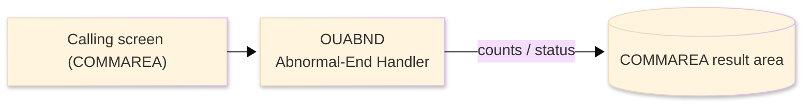
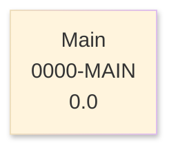

# Batch Program Design Document — OUABND_AbendHandler

**Common header**

| System name | Program ID | Created/updated on／Author | Changed lines |
|---|---|---|---|
| ORION-CCMS (ORION Credit Card Management System) | OUABND | Created 2026-09-28／modernizeX | — |

## 1. Program overview

### 1.1 I/O diagram

### 1.2 Function overview

build a diagnostic line and issue a CICS ABEND with dump so the failure is captured.

### 1.3 I/O overview

| File / table / area | DD / access | Copybook | I/O | Type | Organisation |
|---|---|---|---|---|---|
| Request / result area | COMMAREA (linkage) | KCOMM | I-O | Main | linkage |
| Request / result area | COMMAREA (linkage) | (sub linkage copybook) | I-O | Main | linkage |

### 1.4 Called subprograms / modules

| Program ID | Call type | Function | Interface |
|---|---|---|---|
| — | — | This program calls no sub-program | — |

### 1.5 DB tables & SQL

No SQL used — pure VSAM/CICS file I/O.

### 1.6 Special notes

- Invocation: EXEC CICS LINK PROGRAM('OUABND') COMMAREA(KABND-PARM) END-EXEC.

## 2. Processing details（処理内容）

### 1. Main（0000-MAIN）　[0.0]　(L21)
1) Main: drive the overall processing — run initialisation, the main work and termination in turn.

## 3. Structure diagram（構造図）

## 4. Output specifications (file / table)

### 4.1 COMMAREA result / work area（KABND） — 126 bytes (result / work area returned in the COMMAREA)

| Level | Item name | Field name | Type | Bytes | Position | Source | How the value is set |
|---|---|---|---|---|---|---|---|
| 01 | Parm | KABND-PARM | group | 126 | 1 | — | group item |
| 05 | Program | KA-PROGRAM | X(08) | 8 | 1 | Master/COMMAREA | record key |
| 05 | Paragraph | KA-PARAGRAPH | X(30) | 30 | 9 | Master/COMMAREA | set from the transaction / account being processed |
| 05 | Resp Cd | KA-RESP-CD | S9(09) | 4 | 39 | Master/COMMAREA | set from the transaction / account being processed |
| 05 | Reas Cd | KA-REAS-CD | S9(09) | 4 | 43 | Master/COMMAREA | set from the transaction / account being processed |
| 05 | Detail | KA-DETAIL | X(80) | 80 | 47 | Master/COMMAREA | set from the transaction / account being processed |

## 5. In/out parameters & check specifications

### 5.1 Parameters

| Category | Name | Type / length | Meaning | Value / source |
|---|---|---|---|---|
| Linkage (COMMAREA) | ORION-COMMAREA | group (KCOMM) | shared communication area passed on every EXEC CICS LINK | supplied by the calling screen |
| Linkage (KABND) | KA-PROGRAM | X(08) | program | request/result field in the work area |
| Linkage (KABND) | KA-PARAGRAPH | X(30) | paragraph | request/result field in the work area |
| Linkage (KABND) | KA-RESP-CD | S9(09) | resp cd | request/result field in the work area |
| Linkage (KABND) | KA-REAS-CD | S9(09) | reas cd | request/result field in the work area |
| Linkage (KABND) | KA-DETAIL | X(80) | detail | request/result field in the work area |
| Return | COMMAREA status | flag / text | outcome of the call | set by this program before it returns |

### 5.2 Checks

| No. | Check type | Target | Trigger condition | Action / message |
|---|---|---|---|---|
| 1 | Response | CICS file response | a file response other than normal or not-found | the error is recorded in the COMMAREA status and the browse/step ends |

## 6. Modification summary

| No. | Change date | Title | Summary of the change |
|---|---|---|---|
| 1 | 2026.09.28 | Initial AS-IS reverse design | Document generated by modernizeX from the extracted AST and datastore; no functional change. |

