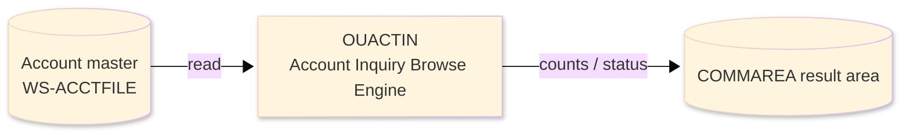
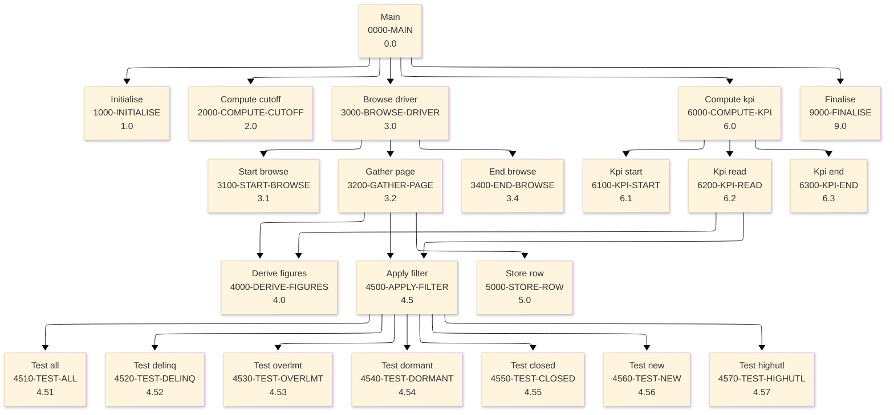

# Batch Program Design Document — OUACTIN_AccountInquiryBrowse

**Common header**

| System name | Program ID | Created/updated on／Author | Changed lines |
|---|---|---|---|
| ORION-CCMS (ORION Credit Card Management System) | OUACTIN | Created 2026-09-28／modernizeX | — |

## 1. Program overview

### 1.1 I/O diagram

### 1.2 Function overview

browse the account master (ACCTFILE) with STARTBR / READNEXT / ENDBR, apply the filter chosen on the OCACTIN screen and hand back one page (up to 13) of matching accounts together with the derived figures (available credit, utilisation) and page-level portfolio totals.

### 1.3 I/O overview

| File / table / area | DD / access | Copybook | I/O | Type | Organisation |
|---|---|---|---|---|---|
| Account master | EXEC CICS FILE(WS-ACCTFILE) | RACCT | I | Main | VSAM KSDS |
| Request / result area | COMMAREA (linkage) | KCOMM | I-O | Main | linkage |

### 1.4 Called subprograms / modules

| Program ID | Call type | Function | Interface |
|---|---|---|---|
| — | — | This program calls no sub-program | — |

### 1.5 DB tables & SQL

No SQL used — pure VSAM/CICS file I/O.

### 1.6 Special notes

- Invocation: EXEC CICS LINK PROGRAM('OUACTIN') COMMAREA(KACTIN-AREA) END-EXEC. INTERFACE: copybook KACTIN (request + response + rows) This one browse engine REPLACES the following batch print reports - each was a sequential ACCTFILE scan that produced the very figures this sub now computes on demand: OBRDELQ delinquent accounts -> filter DELINQUENT OBRLIMIT over-limit accounts -> filter OVER-LIMIT OBRDORM dormant (no activity) -> filter DORMANT OBRCLOSE closed / inactive -> filter CLOSED OBRNEW newly opened accounts -> filter NEW OBRUTIL high-utilisation band -> filter HIGH-UTIL OBRAVAIL available credit list -> AVAILABLE column OBRAGE account aging by open -> NEW / open-date test OBRINACT inactive accounts -> DORMANT / CLOSED OBRACCT full account listing -> filter ALL OBRPORT portfolio balance roll -> page balance totals OBRKPI key indicators (count) -> matched / scanned MAINTENANCE LOG 0001 2026-08-07 Original - consolidated account browse. BUSINESS RULES APPLIED PER FILTER ALL every account on the file. DELINQUENT carries a debit balance yet paid less this cycle than the minimum due (2% of balance, floor 25). OVER-LIMIT current balance exceeds the credit limit. DORMANT no credit and no debit posted this cycle. CLOSED active status is not 'Y'. NEW opened within the last 90 days. HIGH-UTIL utilisation at or above 80% of the credit limit. Derived for every row : available = limit - balance ; utilisation = balance / limit * 100 (guarded, capped 999).
- Linked from: OCACTIN.

## 2. Processing details（処理内容）

### 1. Main（0000-MAIN）　[0.0]　(L122)
1) Main: drive the overall processing — run initialisation, the main work and termination in turn.
2) In turn, carry out: initialise, compute cutoff, browse driver, compute kpi, finalise.

### 2. Initialise（1000-INITIALISE）　[1.0]　(L132)
1) Initialise: prepare the work area, clear the result counters and set the initial status.

### 3. Compute cutoff（2000-COMPUTE-CUTOFF）　[2.0]　(L148)
1) Compute cutoff: perform the compute cutoff step of the processing.

### 4. Browse driver（3000-BROWSE-DRIVER）　[3.0]　(L158)
1) Browse driver: perform the browse driver step of the processing.
2) When br started (L160), take the branch for that case.
3) In turn, carry out: start browse, gather page, end browse.

### 5. Start browse（3100-START-BROWSE）　[3.1]　(L177)
1) Start browse: position a browse on Account master.
2) Depending on ws resp cd (L185): response = normal, response = not-found, response (ENDFILE), OTHER.

### 6. Gather page（3200-GATHER-PAGE）　[3.2]　(L201)
1) Gather page: read the next record from Account master.
2) Depending on ws resp cd (L208): response = normal, response (ENDFILE), OTHER.
3) In turn, carry out: derive figures, apply filter, store row.

### 7. End browse（3400-END-BROWSE）　[3.4]　(L226)
1) End browse: end the browse on Account master.
2) When br started (L227), take the branch for that case.

### 8. Derive figures（4000-DERIVE-FIGURES）　[4.0]　(L237)
1) Derive figures: perform the derive figures step of the processing.
2) When ac credit limit > 0 AND ac curr bal > 0 (L239), take the branch for that case.
3) When ac curr bal > 0 AND ws min due < ws min floor (L251), take the branch for that case.

### 9. Apply filter（4500-APPLY-FILTER）　[4.5]　(L257)
1) Apply filter: perform the apply filter step of the processing.
2) Depending on TRUE (L259): kai f all, kai f delinq, kai f overlmt, kai f dormant.
3) In turn, carry out: test all, test delinq, test overlmt, test dormant, test closed, test new, test highutl, test all.

### 10. Test all（4510-TEST-ALL）　[4.51]　(L280)
1) Test all: perform the test all step of the processing.

### 11. Test delinq（4520-TEST-DELINQ）　[4.52]　(L286)
1) Test delinq: perform the test delinq step of the processing.
2) When ac curr bal > 0 AND ac cyc credit < ws min due (L287), take the branch for that case.

### 12. Test overlmt（4530-TEST-OVERLMT）　[4.53]　(L295)
1) Test overlmt: perform the test overlmt step of the processing.
2) When ac curr bal > ac credit limit (L296), take the branch for that case.

### 13. Test dormant（4540-TEST-DORMANT）　[4.54]　(L302)
1) Test dormant: perform the test dormant step of the processing.
2) When ac cyc credit = 0 AND ac cyc debit = 0 (L303), take the branch for that case.

### 14. Test closed（4550-TEST-CLOSED）　[4.55]　(L310)
1) Test closed: perform the test closed step of the processing.
2) When ac active status NOT = 'Y' (L311), take the branch for that case.

### 15. Test new（4560-TEST-NEW）　[4.56]　(L318)
1) Test new: perform the test new step of the processing.
2) When ac open date(1:4) NUMERIC AND ac open date(6:2) NUMERIC AND ac open date(9:2) NUMERIC (L319), take the branch for that case.

### 16. Test highutl（4570-TEST-HIGHUTL）　[4.57]　(L334)
1) Test highutl: perform the test highutl step of the processing.
2) When ws utilr >= 80.00 (L335), take the branch for that case.

### 17. Store row（5000-STORE-ROW）　[5.0]　(L342)
1) Store row: perform the store row step of the processing.

### 18. Compute kpi（6000-COMPUTE-KPI）　[6.0]　(L359)
1) Compute kpi: perform the compute kpi step of the processing.
2) When kai do kpi (L360), take the branch for that case.
3) In turn, carry out: kpi start, kpi read, kpi end.

### 19. Kpi start（6100-KPI-START）　[6.1]　(L377)
1) Kpi start: position a browse on Account master.
2) Depending on ws resp cd (L387): response = normal, OTHER.

### 20. Kpi read（6200-KPI-READ）　[6.2]　(L396)
1) Kpi read: read the next record from Account master.
2) Depending on ws resp cd (L403): response = normal, OTHER.
3) In turn, carry out: derive figures, apply filter.

### 21. Kpi end（6300-KPI-END）　[6.3]　(L418)
1) Kpi end: end the browse on Account master.

### 22. Finalise（9000-FINALISE）　[9.0]　(L426)
1) Finalise: set the final status and return the accumulated counts to the caller.
2) When kai error (L427), take the branch for that case.

## 3. Structure diagram（構造図）

## 4. Output specifications (file / table)

### 4.1 COMMAREA result / work area（KACTIN） — 763 bytes (result / work area returned in the COMMAREA)

| Level | Item name | Field name | Type | Bytes | Position | Source | How the value is set |
|---|---|---|---|---|---|---|---|
| 01 | Area | KACTIN-AREA | group | 763 | 1 | — | group item |
| 05 | Filter | KAI-FILTER | X(01) | 0 | 1 | Master/COMMAREA | record key |
| 88 | F All | KAI-F-ALL | — | 0 | 1 | Master/COMMAREA | record key |
| 88 | F Delinq | KAI-F-DELINQ | — | 0 | 1 | Master/COMMAREA | record key |
| 88 | F Overlmt | KAI-F-OVERLMT | — | 0 | 1 | Master/COMMAREA | record key |
| 88 | F Dormant | KAI-F-DORMANT | — | 0 | 1 | Master/COMMAREA | record key |
| 88 | F Closed | KAI-F-CLOSED | — | 0 | 1 | Master/COMMAREA | record key |
| 88 | F New | KAI-F-NEW | — | 0 | 1 | Master/COMMAREA | record key |
| 88 | F Highutl | KAI-F-HIGHUTL | — | 0 | 1 | Master/COMMAREA | record key |
| 05 | Start Key | KAI-START-KEY | 9(11) | 11 | 1 | Master/COMMAREA | record key |
| 05 | Want Kpi | KAI-WANT-KPI | X(01) | 0 | 12 | Master/COMMAREA | group item |
| 88 | Do Kpi | KAI-DO-KPI | — | 0 | 12 | Master/COMMAREA | set from the transaction / account being processed |
| 88 | Skip Kpi | KAI-SKIP-KPI | — | 0 | 12 | Master/COMMAREA | set from the transaction / account being processed |
| 05 | Return Cd | KAI-RETURN-CD | X(01) | 0 | 12 | Master/COMMAREA | group item |
| 88 | Ok | KAI-OK | — | 0 | 12 | Master/COMMAREA | set from the transaction / account being processed |
| 88 | Error | KAI-ERROR | — | 0 | 12 | Master/COMMAREA | set from the transaction / account being processed |
| 05 | Row Count | KAI-ROW-COUNT | 9(02) | 2 | 12 | Master/COMMAREA | set from the transaction / account being processed |
| 05 | More Sw | KAI-MORE-SW | X(01) | 0 | 14 | Master/COMMAREA | group item |
| 88 | More | KAI-MORE | — | 0 | 14 | Master/COMMAREA | set from the transaction / account being processed |
| 88 | No More | KAI-NO-MORE | — | 0 | 14 | Master/COMMAREA | set from the transaction / account being processed |
| 05 | Next Key | KAI-NEXT-KEY | 9(11) | 11 | 14 | Master/COMMAREA | set from the transaction / account being processed |
| 05 | Scan Count | KAI-SCAN-COUNT | 9(07) | 7 | 25 | Master/COMMAREA | set from the transaction / account being processed |
| 05 | Pop Count | KAI-POP-COUNT | 9(09) | 9 | 32 | Master/COMMAREA | set from the transaction / account being processed |
| 05 | Pop Bal Tot | KAI-POP-BAL-TOT | S9(15)V99 | 17 | 41 | Master/COMMAREA | set from the transaction / account being processed |
| 05 | Pop Avl Tot | KAI-POP-AVL-TOT | S9(15)V99 | 17 | 58 | Master/COMMAREA | set from the transaction / account being processed |
| 05 | Row | KAI-ROW | group | 689 | 75 | Master/COMMAREA | group item |
| 10 | R Id | KAI-R-ID | 9(11) | 11 | 75 | Master/COMMAREA | set from the transaction / account being processed |
| 10 | R Status | KAI-R-STATUS | X(01) | 1 | 86 | Master/COMMAREA | set from the transaction / account being processed |
| 10 | R Bal | KAI-R-BAL | S9(10)V99 | 12 | 87 | Master/COMMAREA | set from the transaction / account being processed |
| 10 | R Limit | KAI-R-LIMIT | S9(10)V99 | 12 | 99 | Master/COMMAREA | set from the transaction / account being processed |
| 10 | R Avail | KAI-R-AVAIL | S9(10)V99 | 12 | 111 | Master/COMMAREA | set from the transaction / account being processed |
| 10 | R Util | KAI-R-UTIL | 9(03)V99 | 5 | 123 | Master/COMMAREA | set from the transaction / account being processed |

## 5. In/out parameters & check specifications

### 5.1 Parameters

| Category | Name | Type / length | Meaning | Value / source |
|---|---|---|---|---|
| Linkage (COMMAREA) | ORION-COMMAREA | group (KCOMM) | shared communication area passed on every EXEC CICS LINK | supplied by the calling screen |
| Linkage (KACTIN) | KAI-F-ALL | — | f all | request/result field in the work area |
| Linkage (KACTIN) | KAI-F-DELINQ | — | f delinq | request/result field in the work area |
| Linkage (KACTIN) | KAI-F-OVERLMT | — | f overlmt | request/result field in the work area |
| Linkage (KACTIN) | KAI-F-DORMANT | — | f dormant | request/result field in the work area |
| Linkage (KACTIN) | KAI-F-CLOSED | — | f closed | request/result field in the work area |
| Linkage (KACTIN) | KAI-F-NEW | — | f new | request/result field in the work area |
| Linkage (KACTIN) | KAI-F-HIGHUTL | — | f highutl | request/result field in the work area |
| Linkage (KACTIN) | KAI-START-KEY | 9(11) | start key | request/result field in the work area |
| Linkage (KACTIN) | KAI-DO-KPI | — | do kpi | request/result field in the work area |
| Linkage (KACTIN) | KAI-SKIP-KPI | — | skip kpi | request/result field in the work area |
| Linkage (KACTIN) | KAI-OK | — | ok | request/result field in the work area |
| Linkage (KACTIN) | KAI-ERROR | — | error | request/result field in the work area |
| Linkage (KACTIN) | KAI-ROW-COUNT | 9(02) | row count | request/result field in the work area |
| Linkage (KACTIN) | KAI-MORE | — | more | request/result field in the work area |
| Return | COMMAREA status | flag / text | outcome of the call | set by this program before it returns |

### 5.2 Checks

| No. | Check type | Target | Trigger condition | Action / message |
|---|---|---|---|---|
| 1 | Response | CICS file response | a file response other than normal or not-found | the error is recorded in the COMMAREA status and the browse/step ends |

## 6. Modification summary

| No. | Change date | Title | Summary of the change |
|---|---|---|---|
| 1 | 2026.09.28 | Initial AS-IS reverse design | Document generated by modernizeX from the extracted AST and datastore; no functional change. |

