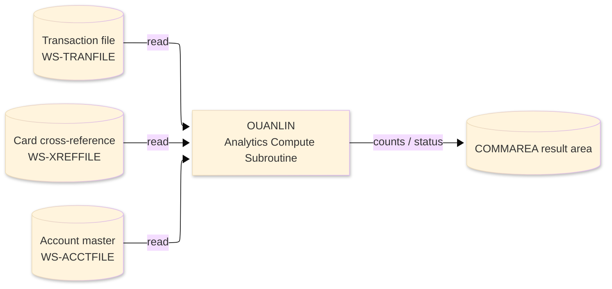
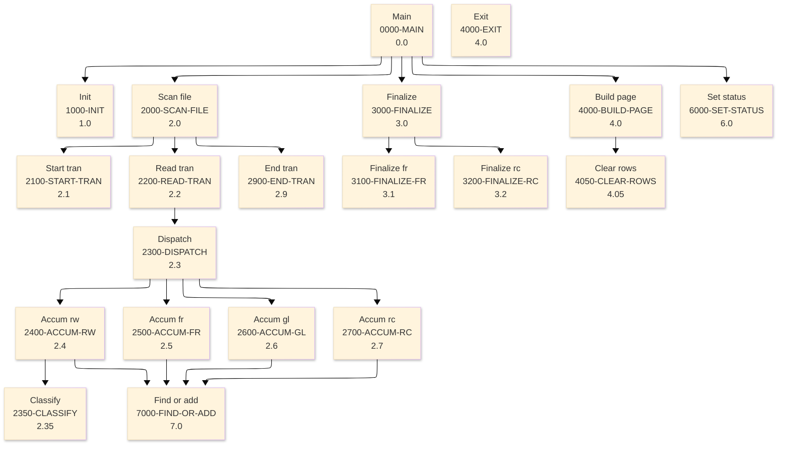

# Batch Program Design Document — OUANLIN_AnalyticsCompute

**Common header**

| System name | Program ID | Created/updated on／Author | Changed lines |
|---|---|---|---|
| ORION-CCMS (ORION Credit Card Management System) | OUANLIN | Created 2026-09-28／modernizeX | — |

## 1. Program overview

### 1.1 I/O diagram

### 1.2 Function overview

scan the transaction master (TRANFILE) and, for the requested mode, compute an analytics result set, then return one page of rows plus two mode- specific grand totals to the caller. RW rewards : points accrued per card. FR fraud : cards flagged for large amount or high transaction velocity. GL general ledger : totals by type as debit/credit RC recon : movement per account vs balance.

### 1.3 I/O overview

| File / table / area | DD / access | Copybook | I/O | Type | Organisation |
|---|---|---|---|---|---|
| Transaction file | EXEC CICS FILE(WS-TRANFILE) | RTRAN | I | Main | VSAM KSDS |
| Card cross-reference | EXEC CICS FILE(WS-XREFFILE) | RXREF | I | Sub | VSAM KSDS |
| Account master | EXEC CICS FILE(WS-ACCTFILE) | RACCT | I | Sub | VSAM KSDS |
| Request / result area | COMMAREA (linkage) | KCOMM | I-O | Main | linkage |

### 1.4 Called subprograms / modules

| Program ID | Call type | Function | Interface |
|---|---|---|---|
| — | — | This program calls no sub-program | — |

### 1.5 DB tables & SQL

No SQL used — pure VSAM/CICS file I/O.

### 1.6 Special notes

- Invocation: EXEC CICS LINK PROGRAM('OUANLIN') COMMAREA(KANLB-PARM) LENGTH(LENGTH OF KANLB-PARM) END-EXEC. FILES : TRANFILE (browse), XREFFILE (read), ACCTFILE (read). Every EXEC CICS command tests RESP. REPLACES: batch reports OBRWD / OBRWDRPT (rewards), OBRFRD (fraud), OBGLEX (gl extract) and OBRECON (reconciliation) with a single on-line inquiry. RETURN : ends with GOBACK (subroutine convention). MAINTENANCE LOG 0001 2026-08-07 Original - four analytics modes. PROCESSING NARRATIVE 1. Validate the mode and clear the in-storage result table. 2. Browse TRANFILE from the start of file (bounded by a scan cap for on-line responsiveness) accumulating the mode-specific figures keyed by card, account or type. 3. Finalise fraud (keep only flagged cards) and recon (compare each account movement to its balance). 4. Copy the requested page of rows (by row offset) into the COMMAREA and publish counts, totals and the MORE flag.
- Linked from: OCANLIN.

## 2. Processing details（処理内容）

### 1. Main（0000-MAIN）　[0.0]　(L124)
1) Main: drive the overall processing — run initialisation, the main work and termination in turn.
2) When kab status NOT = '99' (L126), take the branch for that case.
3) In turn, carry out: init, scan file, finalize, build page, set status.

### 2. Init（1000-INIT）　[1.0]　(L136)
1) Init: prepare the work area, clear the result counters and set the initial status.
2) When ws max rows < 1 OR ws max rows > 6 (L148), take the branch for that case.
3) Depending on kab mode (L151): 'RW', 'FR', 'GL', 'RC'.

### 3. Scan file（2000-SCAN-FILE）　[2.0]　(L163)
1) Scan file: perform the scan file step of the processing.
2) When ws br on (L165), take the branch for that case.
3) In turn, carry out: start tran, read tran, end tran.

### 4. Start tran（2100-START-TRAN）　[2.1]　(L174)
1) Start tran: position a browse on Transaction file.
2) Depending on ws resp cd (L182): response = normal, response = not-found, response (ENDFILE), OTHER.

### 5. Read tran（2200-READ-TRAN）　[2.2]　(L199)
1) Read tran: read the next record from Transaction file.
2) Depending on ws resp cd (L206): response = normal, response (ENDFILE), OTHER.
3) In turn, carry out: dispatch.

### 6. Dispatch（2300-DISPATCH）　[2.3]　(L219)
1) Dispatch: perform the dispatch step of the processing.
2) Depending on kab mode (L220): 'RW', 'FR', 'GL', 'RC'.
3) In turn, carry out: accum rw, accum fr, accum gl, accum rc.

### 7. Classify（2350-CLASSIFY）　[2.35]　(L231)
1) Classify: classify the current item and set the corresponding indicator.
2) Depending on tr type cd (L232): 'PY', 'CR', 'FE', 'IN'.

### 8. Accum rw（2400-ACCUM-RW）　[2.4]　(L244)
1) Accum rw: perform the accum rw step of the processing.
2) When ws is purchase (L246), take the branch for that case.
3) In turn, carry out: classify, find or add.

### 9. Accum fr（2500-ACCUM-FR）　[2.5]　(L268)
1) Accum fr: perform the accum fr step of the processing.
2) When slot ok (L271), take the branch for that case.
3) In turn, carry out: find or add.

### 10. Accum gl（2600-ACCUM-GL）　[2.6]　(L281)
1) Accum gl: perform the accum gl step of the processing.
2) When slot ok (L285), take the branch for that case.
3) In turn, carry out: find or add.

### 11. Accum rc（2700-ACCUM-RC）　[2.7]　(L300)
1) Accum rc: read the Card cross-reference record.
2) When tr type cd = 'PY' OR tr type cd = 'CR' (L301), take the branch for that case.
3) Depending on ws resp cd (L315): response = normal, response = not-found, OTHER.
4) In turn, carry out: find or add.

### 12. End tran（2900-END-TRAN）　[2.9]　(L332)
1) End tran: end the browse on Transaction file.

### 13. Finalize（3000-FINALIZE）　[3.0]　(L340)
1) Finalize: set the final status and return the accumulated counts to the caller.
2) Depending on kab mode (L341): 'FR', 'RC', OTHER.
3) In turn, carry out: finalize fr, finalize rc.

### 14. Finalize fr（3100-FINALIZE-FR）　[3.1]　(L352)
1) Finalize fr: set the final status and return the accumulated counts to the caller.
2) In turn, carry out: inline.

### 15. Finalize rc（3200-FINALIZE-RC）　[3.2]　(L388)
1) Finalize rc: read the Account master record.
2) In turn, carry out: inline.

### 16. Build page（4000-BUILD-PAGE）　[4.0]　(L423)
1) Build page: perform the build page step of the processing.
2) When ws res cnt = ZEROS (L432), take the branch for that case.
3) When ws start idx < 1 (L436), take the branch for that case.
4) When ws idx <= ws res cnt (L451), take the branch for that case.
5) In turn, carry out: clear rows, inline.

### 17. Exit（4000-EXIT）　[4.0]　(L454)
1) Exit: perform the exit step of the processing.

### 18. Clear rows（4050-CLEAR-ROWS）　[4.05]　(L459)
1) Clear rows: perform the clear rows step of the processing.
2) In turn, carry out: inline.

### 19. Set status（6000-SET-STATUS）　[6.0]　(L470)
1) Set status: perform the set status step of the processing.
2) When kab status = '99' (L471), take the branch for that case.

### 20. Find or add（7000-FIND-OR-ADD）　[7.0]　(L485)
1) Find or add: perform the find or add step of the processing.
2) When NOT slot ok (L495), take the branch for that case.
3) In turn, carry out: inline.

## 3. Structure diagram（構造図）

## 4. Output specifications (file / table)

### 4.1 COMMAREA result / work area（KANLB） — 490 bytes (result / work area returned in the COMMAREA)

| Level | Item name | Field name | Type | Bytes | Position | Source | How the value is set |
|---|---|---|---|---|---|---|---|
| 01 | Parm | KANLB-PARM | group | 490 | 1 | — | group item |
| 05 | Request | KAB-REQUEST | group | 8 | 1 | Master/COMMAREA | record key |
| 10 | Mode | KAB-MODE | X(02) | 2 | 1 | Master/COMMAREA | record key |
| 10 | Start Off | KAB-START-OFF | 9(04) | 4 | 3 | Master/COMMAREA | set from the transaction / account being processed |
| 10 | Max Rows | KAB-MAX-ROWS | 9(02) | 2 | 7 | Master/COMMAREA | set from the transaction / account being processed |
| 05 | Result | KAB-RESULT | group | 22 | 9 | Master/COMMAREA | group item |
| 10 | Status | KAB-STATUS | X(02) | 2 | 9 | Master/COMMAREA | set from the transaction / account being processed |
| 10 | Row Cnt | KAB-ROW-CNT | 9(02) | 2 | 11 | Master/COMMAREA | set from the transaction / account being processed |
| 10 | Result Cnt | KAB-RESULT-CNT | 9(04) | 4 | 13 | Master/COMMAREA | set from the transaction / account being processed |
| 10 | Scanned | KAB-SCANNED | 9(09) | 9 | 17 | Master/COMMAREA | set from the transaction / account being processed |
| 10 | Disc | KAB-DISC | 9(04) | 4 | 26 | Master/COMMAREA | set from the transaction / account being processed |
| 10 | More | KAB-MORE | X(01) | 1 | 30 | Master/COMMAREA | set from the transaction / account being processed |
| 05 | Totals | KAB-TOTALS | group | 34 | 31 | Master/COMMAREA | group item |
| 10 | Tot 1 | KAB-TOT-1 | S9(15)V99 | 17 | 31 | Master/COMMAREA | set from the transaction / account being processed |
| 10 | Tot 2 | KAB-TOT-2 | S9(15)V99 | 17 | 48 | Master/COMMAREA | set from the transaction / account being processed |
| 05 | Rows | KAB-ROWS | group | 426 | 65 | Master/COMMAREA | group item |
| 10 | Row | KAB-ROW | group | 426 | 65 | Master/COMMAREA | group item |
| 15 | R Key | KAB-R-KEY | X(16) | 16 | 65 | Master/COMMAREA | set from the transaction / account being processed |
| 15 | R Info | KAB-R-INFO | X(16) | 16 | 81 | Master/COMMAREA | set from the transaction / account being processed |
| 15 | R Cnt | KAB-R-CNT | 9(09) | 9 | 97 | Master/COMMAREA | set from the transaction / account being processed |
| 15 | R Amt | KAB-R-AMT | S9(13)V99 | 15 | 106 | Master/COMMAREA | set from the transaction / account being processed |
| 15 | R Val | KAB-R-VAL | S9(13)V99 | 15 | 121 | Master/COMMAREA | set from the transaction / account being processed |

## 5. In/out parameters & check specifications

### 5.1 Parameters

| Category | Name | Type / length | Meaning | Value / source |
|---|---|---|---|---|
| Linkage (COMMAREA) | ORION-COMMAREA | group (KCOMM) | shared communication area passed on every EXEC CICS LINK | supplied by the calling screen |
| Linkage (KANLB) | KAB-MODE | X(02) | mode | request/result field in the work area |
| Linkage (KANLB) | KAB-START-OFF | 9(04) | start off | request/result field in the work area |
| Linkage (KANLB) | KAB-MAX-ROWS | 9(02) | max rows | request/result field in the work area |
| Linkage (KANLB) | KAB-STATUS | X(02) | status | request/result field in the work area |
| Linkage (KANLB) | KAB-ROW-CNT | 9(02) | row cnt | request/result field in the work area |
| Linkage (KANLB) | KAB-RESULT-CNT | 9(04) | result cnt | request/result field in the work area |
| Linkage (KANLB) | KAB-SCANNED | 9(09) | scanned | request/result field in the work area |
| Linkage (KANLB) | KAB-DISC | 9(04) | disc | request/result field in the work area |
| Linkage (KANLB) | KAB-MORE | X(01) | more | request/result field in the work area |
| Linkage (KANLB) | KAB-TOT-1 | S9(15)V99 | tot 1 | request/result field in the work area |
| Linkage (KANLB) | KAB-TOT-2 | S9(15)V99 | tot 2 | request/result field in the work area |
| Linkage (KANLB) | KAB-R-KEY | X(16) | r key | request/result field in the work area |
| Linkage (KANLB) | KAB-R-INFO | X(16) | r info | request/result field in the work area |
| Linkage (KANLB) | KAB-R-CNT | 9(09) | r cnt | request/result field in the work area |
| Return | COMMAREA status | flag / text | outcome of the call | set by this program before it returns |

### 5.2 Checks

| No. | Check type | Target | Trigger condition | Action / message |
|---|---|---|---|---|
| 1 | Response | CICS file response | a file response other than normal or not-found | the error is recorded in the COMMAREA status and the browse/step ends |

## 6. Modification summary

| No. | Change date | Title | Summary of the change |
|---|---|---|---|
| 1 | 2026.09.28 | Initial AS-IS reverse design | Document generated by modernizeX from the extracted AST and datastore; no functional change. |

