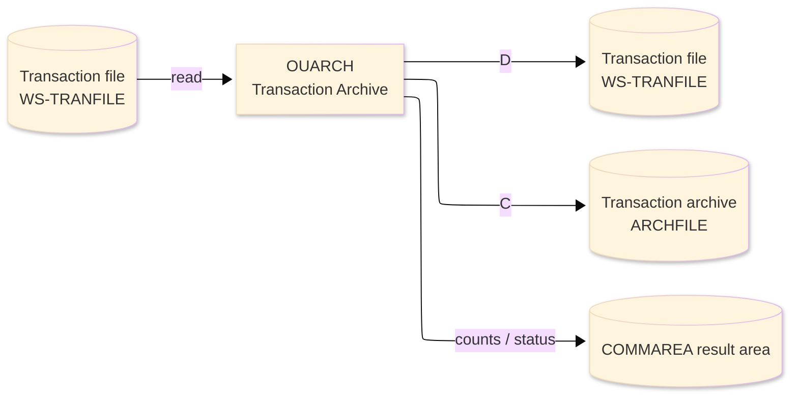
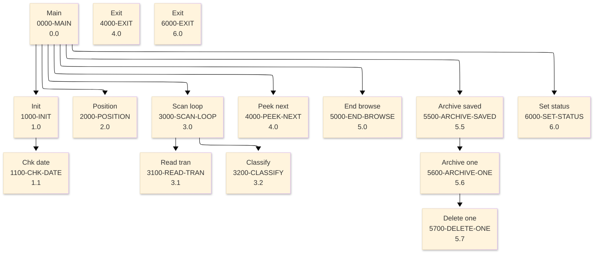

# Batch Program Design Document — OUARCH_TransactionArchive

**Common header**

| System name | Program ID | Created/updated on／Author | Changed lines |
|---|---|---|---|
| ORION-CCMS (ORION Credit Card Management System) | OUARCH | Created 2026-09-28／modernizeX | — |

## 1. Program overview

### 1.1 I/O diagram

### 1.2 Function overview

on-line port of batch OBARCH. Browse TRANFILE in key order and capture every transaction whose process date is before the cutoff into an in-core save table (bounded so the transaction stays short). After the browse ends, each captured record is copied to the archive file (ARCHFILE, WRITE) and then removed from the live file (DELETE FROM TRANFILE). Counts and the archived amount are returned in the KARCH block that is overlaid on the shared

### 1.3 I/O overview

| File / table / area | DD / access | Copybook | I/O | Type | Organisation |
|---|---|---|---|---|---|
| Transaction file | EXEC CICS FILE(WS-TRANFILE) | RTRAN | I-O | Main | VSAM KSDS |
| Transaction archive | EXEC CICS FILE(ARCHFILE) | RTRAN | O | Sub | VSAM KSDS |
| Request / result area | COMMAREA (linkage) | KCOMM | I-O | Main | linkage |

### 1.4 Called subprograms / modules

| Program ID | Call type | Function | Interface |
|---|---|---|---|
| — | — | This program calls no sub-program | — |

### 1.5 DB tables & SQL

No SQL used — pure VSAM/CICS file I/O.

### 1.6 Special notes

- Invocation: EXEC CICS LINK PROGRAM('OUARCH') COMMAREA(ORION-COMMAREA) LENGTH(LENGTH OF ORION-COMMAREA) END-EXEC. FILES : TRANFILE browse and DELETE, ARCHFILE WRITE. RETURN : ends with GOBACK (subroutine convention). MAINTENANCE LOG 0001 2026-08-07 Original - on-line transaction archive sub.
- Linked from: OCUTIL.

## 2. Processing details（処理内容）

### 1. Main（0000-MAIN）　[0.0]　(L77)
1) Main: drive the overall processing — run initialisation, the main work and termination in turn.
2) When kar status NOT = '99' (L80), take the branch for that case.
3) In turn, carry out: init, position, scan loop, peek next, end browse, archive saved, set status.

### 2. Init（1000-INIT）　[1.0]　(L96)
1) Init: prepare the work area, clear the result counters and set the initial status.
2) When ws max > ZEROS AND ws max < ws max save (L109), take the branch for that case.
3) When ws dt ok NOT = 'Y' (L114), take the branch for that case.
4) In turn, carry out: chk date.

### 3. Chk date（1100-CHK-DATE）　[1.1]　(L121)
1) Chk date: perform the chk date step of the processing.
2) When ws dt(5:1) = '-' AND ws dt(8:1) = '-' (L124), take the branch for that case.

### 4. Position（2000-POSITION）　[2.0]　(L134)
1) Position: position a browse on Transaction file.
2) When kar start tran = SPACES OR kar start tran = low values (L135), take the branch for that case.
3) Depending on ws resp cd (L146): response = normal, response = not-found, response (ENDFILE), OTHER.

### 5. Scan loop（3000-SCAN-LOOP）　[3.0]　(L160)
1) Scan loop: perform the scan loop step of the processing.
2) When NOT ws eof yes (L162), take the branch for that case.
3) In turn, carry out: read tran, classify.

### 6. Read tran（3100-READ-TRAN）　[3.1]　(L177)
1) Read tran: read the next record from Transaction file.
2) Depending on ws resp cd (L184): response = normal, response (ENDFILE), OTHER.

### 7. Classify（3200-CLASSIFY）　[3.2]　(L198)
1) Classify: classify the current item and set the corresponding indicator.
2) When ws proc date < kar cutoff (L201), take the branch for that case.

### 8. Peek next（4000-PEEK-NEXT）　[4.0]　(L213)
1) Peek next: read the next record from Transaction file.
2) When ws eof yes (L214), take the branch for that case.
3) Depending on ws resp cd (L224): response = normal, response (ENDFILE), OTHER.

### 9. Exit（4000-EXIT）　[4.0]　(L234)
1) Exit: perform the exit step of the processing.

### 10. End browse（5000-END-BROWSE）　[5.0]　(L239)
1) End browse: end the browse on Transaction file.

### 11. Archive saved（5500-ARCHIVE-SAVED）　[5.5]　(L247)
1) Archive saved: perform the archive saved step of the processing.
2) In turn, carry out: inline, archive one.

### 12. Archive one（5600-ARCHIVE-ONE）　[5.6]　(L257)
1) Archive one: add a record to the Transaction archive.
2) Depending on ws resp cd (L264): response = normal, response = duplicate, OTHER.
3) In turn, carry out: delete one, delete one.

### 13. Delete one（5700-DELETE-ONE）　[5.7]　(L278)
1) Delete one: delete the Transaction file record.
2) When ws resp cd = response = normal (L284), take the branch for that case.

### 14. Set status（6000-SET-STATUS）　[6.0]　(L292)
1) Set status: perform the set status step of the processing.
2) When kar status = '99' (L293), take the branch for that case.
3) When kar read = ZEROS (L296), take the branch for that case.

### 15. Exit（6000-EXIT）　[6.0]　(L303)
1) Exit: perform the exit step of the processing.

## 3. Structure diagram（構造図）

## 4. Output specifications (file / table)

### 4.1 Transaction file（RTRAN） — 350 bytes (output record)

| Level | Item name | Field name | Type | Bytes | Position | Source | How the value is set |
|---|---|---|---|---|---|---|---|
| 01 | Rec | TRAN-REC | group | 350 | 1 | — | group item |
| 05 | Id | TR-ID | X(16) | 16 | 1 | Master/COMMAREA | record key |
| 05 | Type Cd | TR-TYPE-CD | X(02) | 2 | 17 | Master/COMMAREA | set from the transaction / account being processed |
| 05 | Cat Cd | TR-CAT-CD | 9(04) | 4 | 19 | Master/COMMAREA | set from the transaction / account being processed |
| 05 | Source | TR-SOURCE | X(10) | 10 | 23 | Master/COMMAREA | set from the transaction / account being processed |
| 05 | Desc | TR-DESC | X(100) | 100 | 33 | Master/COMMAREA | set from the transaction / account being processed |
| 05 | Amt | TR-AMT | S9(09)V99 | 11 | 133 | Master/COMMAREA | set from the transaction / account being processed |
| 05 | Merchant Id | TR-MERCHANT-ID | 9(09) | 9 | 144 | Master/COMMAREA | set from the transaction / account being processed |
| 05 | Merchant Name | TR-MERCHANT-NAME | X(50) | 50 | 153 | Master/COMMAREA | set from the transaction / account being processed |
| 05 | Merchant City | TR-MERCHANT-CITY | X(50) | 50 | 203 | Master/COMMAREA | set from the transaction / account being processed |
| 05 | Merchant Zip | TR-MERCHANT-ZIP | X(10) | 10 | 253 | Master/COMMAREA | set from the transaction / account being processed |
| 05 | Card Num | TR-CARD-NUM | X(16) | 16 | 263 | Master/COMMAREA | set from the transaction / account being processed |
| 05 | Orig Ts | TR-ORIG-TS | X(26) | 26 | 279 | Master/COMMAREA | set from the transaction / account being processed |
| 05 | Proc Ts | TR-PROC-TS | X(26) | 26 | 305 | Master/COMMAREA | set from the transaction / account being processed |
| 05 | Filler | FILLER | X(20) | 20 | 331 | Master/COMMAREA | set from the transaction / account being processed |

### 4.2 Transaction archive（RTRAN） — 350 bytes (output record)

| Level | Item name | Field name | Type | Bytes | Position | Source | How the value is set |
|---|---|---|---|---|---|---|---|
| 01 | Rec | TRAN-REC | group | 350 | 1 | — | group item |
| 05 | Id | TR-ID | X(16) | 16 | 1 | Master/COMMAREA | record key |
| 05 | Type Cd | TR-TYPE-CD | X(02) | 2 | 17 | Master/COMMAREA | set from the transaction / account being processed |
| 05 | Cat Cd | TR-CAT-CD | 9(04) | 4 | 19 | Master/COMMAREA | set from the transaction / account being processed |
| 05 | Source | TR-SOURCE | X(10) | 10 | 23 | Master/COMMAREA | set from the transaction / account being processed |
| 05 | Desc | TR-DESC | X(100) | 100 | 33 | Master/COMMAREA | set from the transaction / account being processed |
| 05 | Amt | TR-AMT | S9(09)V99 | 11 | 133 | Master/COMMAREA | set from the transaction / account being processed |
| 05 | Merchant Id | TR-MERCHANT-ID | 9(09) | 9 | 144 | Master/COMMAREA | set from the transaction / account being processed |
| 05 | Merchant Name | TR-MERCHANT-NAME | X(50) | 50 | 153 | Master/COMMAREA | set from the transaction / account being processed |
| 05 | Merchant City | TR-MERCHANT-CITY | X(50) | 50 | 203 | Master/COMMAREA | set from the transaction / account being processed |
| 05 | Merchant Zip | TR-MERCHANT-ZIP | X(10) | 10 | 253 | Master/COMMAREA | set from the transaction / account being processed |
| 05 | Card Num | TR-CARD-NUM | X(16) | 16 | 263 | Master/COMMAREA | set from the transaction / account being processed |
| 05 | Orig Ts | TR-ORIG-TS | X(26) | 26 | 279 | Master/COMMAREA | set from the transaction / account being processed |
| 05 | Proc Ts | TR-PROC-TS | X(26) | 26 | 305 | Master/COMMAREA | set from the transaction / account being processed |
| 05 | Filler | FILLER | X(20) | 20 | 331 | Master/COMMAREA | set from the transaction / account being processed |

## 5. In/out parameters & check specifications

### 5.1 Parameters

| Category | Name | Type / length | Meaning | Value / source |
|---|---|---|---|---|
| Linkage (COMMAREA) | ORION-COMMAREA | group (KCOMM) | shared communication area passed on every EXEC CICS LINK | supplied by the calling screen |
| Linkage (KARCH) | KAR-CUTOFF | X(10) | cutoff | request/result field in the work area |
| Linkage (KARCH) | KAR-START-TRAN | X(16) | start tran | request/result field in the work area |
| Linkage (KARCH) | KAR-MAX | 9(07) | max | request/result field in the work area |
| Linkage (KARCH) | KAR-STATUS | X(02) | status | request/result field in the work area |
| Linkage (KARCH) | KAR-MSG | X(50) | msg | request/result field in the work area |
| Linkage (KARCH) | KAR-READ | 9(07) | read | request/result field in the work area |
| Linkage (KARCH) | KAR-ARCHIVED | 9(07) | archived | request/result field in the work area |
| Linkage (KARCH) | KAR-DELETED | 9(07) | deleted | request/result field in the work area |
| Linkage (KARCH) | KAR-KEPT | 9(07) | kept | request/result field in the work area |
| Linkage (KARCH) | KAR-ERRORS | 9(07) | errors | request/result field in the work area |
| Linkage (KARCH) | KAR-ARCH-AMT | S9(13)V99 | arch amt | request/result field in the work area |
| Linkage (KARCH) | KAR-NEXT-TRAN | X(16) | next tran | request/result field in the work area |
| Linkage (KARCH) | KAR-MORE | X(01) | more | request/result field in the work area |
| Return | COMMAREA status | flag / text | outcome of the call | set by this program before it returns |

### 5.2 Checks

| No. | Check type | Target | Trigger condition | Action / message |
|---|---|---|---|---|
| 1 | Response | CICS file response | a file response other than normal or not-found | the error is recorded in the COMMAREA status and the browse/step ends |

## 6. Modification summary

| No. | Change date | Title | Summary of the change |
|---|---|---|---|
| 1 | 2026.09.28 | Initial AS-IS reverse design | Document generated by modernizeX from the extracted AST and datastore; no functional change. |

