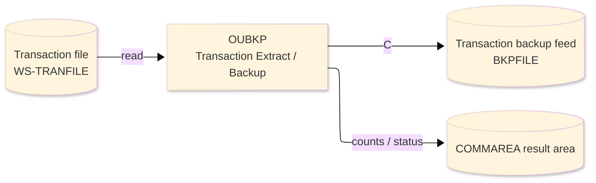
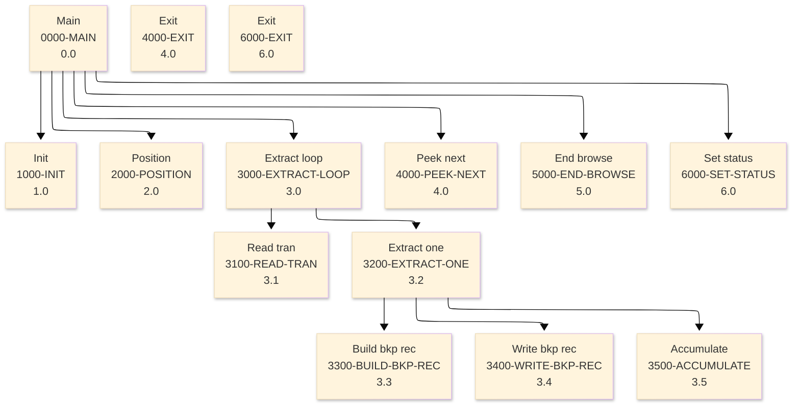

# Batch Program Design Document — OUBKP_TransactionBackup

**Common header**

| System name | Program ID | Created/updated on／Author | Changed lines |
|---|---|---|---|
| ORION-CCMS (ORION Credit Card Management System) | OUBKP | Created 2026-09-28／modernizeX | — |

## 1. Program overview

### 1.1 I/O diagram

### 1.2 Function overview

on-line port of batch OBTRANB. Browse TRANFILE in key order, build a pipe-delimited flat backup record for each transaction and WRITE it to the backup feed (BKPFILE, keyed by transaction id). Running total, credit and debit amounts plus record counts are returned in the KBKP block that is overlaid on the shared

### 1.3 I/O overview

| File / table / area | DD / access | Copybook | I/O | Type | Organisation |
|---|---|---|---|---|---|
| Transaction file | EXEC CICS FILE(WS-TRANFILE) | RTRAN | I | Main | VSAM KSDS |
| Transaction backup feed | EXEC CICS FILE(BKPFILE) | RTRAN | O | Sub | VSAM KSDS |
| Request / result area | COMMAREA (linkage) | KCOMM | I-O | Main | linkage |

### 1.4 Called subprograms / modules

| Program ID | Call type | Function | Interface |
|---|---|---|---|
| — | — | This program calls no sub-program | — |

### 1.5 DB tables & SQL

No SQL used — pure VSAM/CICS file I/O.

### 1.6 Special notes

- Invocation: EXEC CICS LINK PROGRAM('OUBKP') COMMAREA(ORION-COMMAREA) LENGTH(LENGTH OF ORION-COMMAREA) END-EXEC. FILES : TRANFILE browse, BKPFILE WRITE. RETURN : ends with GOBACK (subroutine convention). MAINTENANCE LOG 0001 2026-08-07 Original - on-line transaction backup sub.
- Linked from: OCUTIL.

## 2. Processing details（処理内容）

### 1. Main（0000-MAIN）　[0.0]　(L78)
1) Main: drive the overall processing — run initialisation, the main work and termination in turn.
2) When kbk status NOT = '99' (L81), take the branch for that case.
3) In turn, carry out: init, position, extract loop, peek next, end browse, set status.

### 2. Init（1000-INIT）　[1.0]　(L96)
1) Init: prepare the work area, clear the result counters and set the initial status.

### 3. Position（2000-POSITION）　[2.0]　(L110)
1) Position: position a browse on Transaction file.
2) When kbk start key = SPACES OR kbk start key = low values (L111), take the branch for that case.
3) Depending on ws resp cd (L122): response = normal, response = not-found, response (ENDFILE), OTHER.

### 4. Extract loop（3000-EXTRACT-LOOP）　[3.0]　(L136)
1) Extract loop: perform the extract loop step of the processing.
2) When NOT ws eof yes (L138), take the branch for that case.
3) In turn, carry out: read tran, extract one.

### 5. Read tran（3100-READ-TRAN）　[3.1]　(L147)
1) Read tran: read the next record from Transaction file.
2) Depending on ws resp cd (L154): response = normal, response (ENDFILE), OTHER.

### 6. Extract one（3200-EXTRACT-ONE）　[3.2]　(L167)
1) Extract one: perform the extract one step of the processing.
2) In turn, carry out: build bkp rec, write bkp rec, accumulate.

### 7. Build bkp rec（3300-BUILD-BKP-REC）　[3.3]　(L175)
1) Build bkp rec: perform the build bkp rec step of the processing.

### 8. Write bkp rec（3400-WRITE-BKP-REC）　[3.4]　(L189)
1) Write bkp rec: add a record to the Transaction backup feed.
2) Depending on ws resp cd (L196): response = normal, response = duplicate, OTHER.

### 9. Accumulate（3500-ACCUMULATE）　[3.5]　(L207)
1) Accumulate: perform the accumulate step of the processing.
2) When tr amt < ZERO (L209), take the branch for that case.

### 10. Peek next（4000-PEEK-NEXT）　[4.0]　(L218)
1) Peek next: read the next record from Transaction file.
2) When ws eof yes (L219), take the branch for that case.
3) Depending on ws resp cd (L229): response = normal, response (ENDFILE), OTHER.

### 11. Exit（4000-EXIT）　[4.0]　(L239)
1) Exit: perform the exit step of the processing.

### 12. End browse（5000-END-BROWSE）　[5.0]　(L244)
1) End browse: end the browse on Transaction file.

### 13. Set status（6000-SET-STATUS）　[6.0]　(L252)
1) Set status: perform the set status step of the processing.
2) When kbk status = '99' (L253), take the branch for that case.
3) When kbk read = ZEROS (L256), take the branch for that case.

### 14. Exit（6000-EXIT）　[6.0]　(L263)
1) Exit: perform the exit step of the processing.

## 3. Structure diagram（構造図）

## 4. Output specifications (file / table)

### 4.1 Transaction backup feed（RTRAN） — 350 bytes (output record)

| Level | Item name | Field name | Type | Bytes | Position | Source | How the value is set |
|---|---|---|---|---|---|---|---|
| 01 | Rec | TRAN-REC | group | 350 | 1 | — | group item |
| 05 | Id | TR-ID | X(16) | 16 | 1 | Master/COMMAREA | record key |
| 05 | Type Cd | TR-TYPE-CD | X(02) | 2 | 17 | Master/COMMAREA | set from the transaction / account being processed |
| 05 | Cat Cd | TR-CAT-CD | 9(04) | 4 | 19 | Master/COMMAREA | set from the transaction / account being processed |
| 05 | Source | TR-SOURCE | X(10) | 10 | 23 | Master/COMMAREA | set from the transaction / account being processed |
| 05 | Desc | TR-DESC | X(100) | 100 | 33 | Master/COMMAREA | set from the transaction / account being processed |
| 05 | Amt | TR-AMT | S9(09)V99 | 11 | 133 | Master/COMMAREA | set from the transaction / account being processed |
| 05 | Merchant Id | TR-MERCHANT-ID | 9(09) | 9 | 144 | Master/COMMAREA | set from the transaction / account being processed |
| 05 | Merchant Name | TR-MERCHANT-NAME | X(50) | 50 | 153 | Master/COMMAREA | set from the transaction / account being processed |
| 05 | Merchant City | TR-MERCHANT-CITY | X(50) | 50 | 203 | Master/COMMAREA | set from the transaction / account being processed |
| 05 | Merchant Zip | TR-MERCHANT-ZIP | X(10) | 10 | 253 | Master/COMMAREA | set from the transaction / account being processed |
| 05 | Card Num | TR-CARD-NUM | X(16) | 16 | 263 | Master/COMMAREA | set from the transaction / account being processed |
| 05 | Orig Ts | TR-ORIG-TS | X(26) | 26 | 279 | Master/COMMAREA | set from the transaction / account being processed |
| 05 | Proc Ts | TR-PROC-TS | X(26) | 26 | 305 | Master/COMMAREA | set from the transaction / account being processed |
| 05 | Filler | FILLER | X(20) | 20 | 331 | Master/COMMAREA | set from the transaction / account being processed |

## 5. In/out parameters & check specifications

### 5.1 Parameters

| Category | Name | Type / length | Meaning | Value / source |
|---|---|---|---|---|
| Linkage (COMMAREA) | ORION-COMMAREA | group (KCOMM) | shared communication area passed on every EXEC CICS LINK | supplied by the calling screen |
| Linkage (KBKP) | KBK-START-KEY | X(16) | start key | request/result field in the work area |
| Linkage (KBKP) | KBK-MAX | 9(07) | max | request/result field in the work area |
| Linkage (KBKP) | KBK-STATUS | X(02) | status | request/result field in the work area |
| Linkage (KBKP) | KBK-MSG | X(50) | msg | request/result field in the work area |
| Linkage (KBKP) | KBK-READ | 9(07) | read | request/result field in the work area |
| Linkage (KBKP) | KBK-WRITTEN | 9(07) | written | request/result field in the work area |
| Linkage (KBKP) | KBK-ERRORS | 9(07) | errors | request/result field in the work area |
| Linkage (KBKP) | KBK-TOT-AMT | S9(13)V99 | tot amt | request/result field in the work area |
| Linkage (KBKP) | KBK-CREDIT-AMT | S9(13)V99 | credit amt | request/result field in the work area |
| Linkage (KBKP) | KBK-DEBIT-AMT | S9(13)V99 | debit amt | request/result field in the work area |
| Linkage (KBKP) | KBK-NEXT-KEY | X(16) | next key | request/result field in the work area |
| Linkage (KBKP) | KBK-MORE | X(01) | more | request/result field in the work area |
| Return | COMMAREA status | flag / text | outcome of the call | set by this program before it returns |

### 5.2 Checks

| No. | Check type | Target | Trigger condition | Action / message |
|---|---|---|---|---|
| 1 | Response | CICS file response | a file response other than normal or not-found | the error is recorded in the COMMAREA status and the browse/step ends |

## 6. Modification summary

| No. | Change date | Title | Summary of the change |
|---|---|---|---|
| 1 | 2026.09.28 | Initial AS-IS reverse design | Document generated by modernizeX from the extracted AST and datastore; no functional change. |

