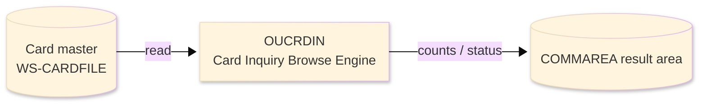
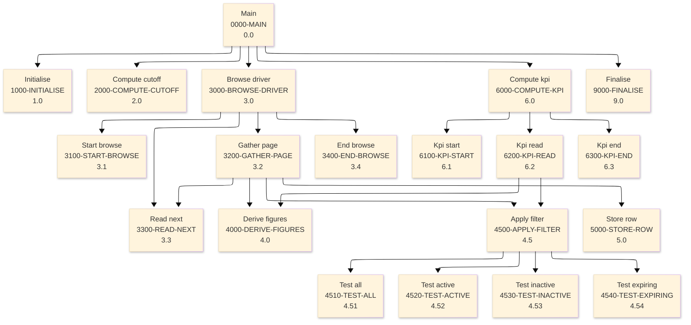

# Batch Program Design Document — OUCRDIN_CardInquiryBrowse

**Common header**

| System name | Program ID | Created/updated on／Author | Changed lines |
|---|---|---|---|
| ORION-CCMS (ORION Credit Card Management System) | OUCRDIN | Created 2026-09-28／modernizeX | — |

## 1. Program overview

### 1.1 I/O diagram

### 1.2 Function overview

browse the card master (CARDFILE) with STARTBR / READNEXT / ENDBR, apply the filter chosen on the OCCRDIN screen and hand back one page (up to 13) of matching cards with card number, owning account, embossed name, expiry date and active status, plus active / inactive tallies for the page.

### 1.3 I/O overview

| File / table / area | DD / access | Copybook | I/O | Type | Organisation |
|---|---|---|---|---|---|
| Card master | EXEC CICS FILE(WS-CARDFILE) | RCARD | I | Main | VSAM KSDS |
| Request / result area | COMMAREA (linkage) | KCOMM | I-O | Main | linkage |

### 1.4 Called subprograms / modules

| Program ID | Call type | Function | Interface |
|---|---|---|---|
| — | — | This program calls no sub-program | — |

### 1.5 DB tables & SQL

No SQL used — pure VSAM/CICS file I/O.

### 1.6 Special notes

- Invocation: EXEC CICS LINK PROGRAM('OUCRDIN') COMMAREA(KCRDIN-AREA) END-EXEC. INTERFACE: copybook KCRDIN (request + response + rows) This one browse engine REPLACES the following batch card reports - each was a sequential CARDFILE scan: OBCARDP card master listing -> filter ALL OBRCARD active / inactive tally -> filter ACTIVE/INACTIVE OBCARDX cards expiring soon -> filter EXPIRING-SOON OBRCHLDR cardholder name roster -> embossed-name column MAINTENANCE LOG 0001 2026-08-07 Original - consolidated card browse. BUSINESS RULES APPLIED PER FILTER ALL every card on the file. ACTIVE active status = 'Y'. INACTIVE active status not 'Y'. EXPIRING-SOON expiry date falls within the next 60 days (from today, inclusive, not already past).
- Linked from: OCCRDIN.

## 2. Processing details（処理内容）

### 1. Main（0000-MAIN）　[0.0]　(L104)
1) Main: drive the overall processing — run initialisation, the main work and termination in turn.
2) In turn, carry out: initialise, compute cutoff, browse driver, compute kpi, finalise.

### 2. Initialise（1000-INITIALISE）　[1.0]　(L114)
1) Initialise: prepare the work area, clear the result counters and set the initial status.

### 3. Compute cutoff（2000-COMPUTE-CUTOFF）　[2.0]　(L129)
1) Compute cutoff: perform the compute cutoff step of the processing.

### 4. Browse driver（3000-BROWSE-DRIVER）　[3.0]　(L139)
1) Browse driver: perform the browse driver step of the processing.
2) When br started (L141), take the branch for that case.
3) In turn, carry out: start browse, read next, gather page, end browse.

### 5. Start browse（3100-START-BROWSE）　[3.1]　(L161)
1) Start browse: position a browse on Card master.
2) Depending on ws resp cd (L169): response = normal, response = not-found, response (ENDFILE), OTHER.

### 6. Gather page（3200-GATHER-PAGE）　[3.2]　(L185)
1) Gather page: perform the gather page step of the processing.
2) When read ok (L187), take the branch for that case.
3) In turn, carry out: read next, derive figures, apply filter, store row.

### 7. Read next（3300-READ-NEXT）　[3.3]　(L198)
1) Read next: read the next record from Card master.
2) Depending on ws resp cd (L206): response = normal, response (ENDFILE), OTHER.

### 8. End browse（3400-END-BROWSE）　[3.4]　(L219)
1) End browse: end the browse on Card master.
2) When br started (L220), take the branch for that case.

### 9. Derive figures（4000-DERIVE-FIGURES）　[4.0]　(L230)
1) Derive figures: perform the derive figures step of the processing.
2) When cd expiry date(1:4) NUMERIC AND cd expiry date(6:2) NUMERIC AND cd expiry date(9:2) NUMERIC (L233), take the branch for that case.

### 10. Apply filter（4500-APPLY-FILTER）　[4.5]　(L246)
1) Apply filter: perform the apply filter step of the processing.
2) Depending on TRUE (L248): kci f all, kci f active, kci f inactive, kci f expiring.
3) In turn, carry out: test all, test active, test inactive, test expiring, test all.

### 11. Test all（4510-TEST-ALL）　[4.51]　(L263)
1) Test all: perform the test all step of the processing.

### 12. Test active（4520-TEST-ACTIVE）　[4.52]　(L268)
1) Test active: perform the test active step of the processing.
2) When cd active status = 'Y' (L269), take the branch for that case.

### 13. Test inactive（4530-TEST-INACTIVE）　[4.53]　(L275)
1) Test inactive: perform the test inactive step of the processing.
2) When cd active status NOT = 'Y' (L276), take the branch for that case.

### 14. Test expiring（4540-TEST-EXPIRING）　[4.54]　(L283)
1) Test expiring: perform the test expiring step of the processing.
2) When ws exp valid AND ws exp int >= ws today int AND ws exp int <= ws cut int (L284), take the branch for that case.

### 15. Store row（5000-STORE-ROW）　[5.0]　(L293)
1) Store row: perform the store row step of the processing.

### 16. Compute kpi（6000-COMPUTE-KPI）　[6.0]　(L308)
1) Compute kpi: perform the compute kpi step of the processing.
2) When kci do kpi (L309), take the branch for that case.
3) In turn, carry out: kpi start, kpi read, kpi end.

### 17. Kpi start（6100-KPI-START）　[6.1]　(L322)
1) Kpi start: position a browse on Card master.
2) Depending on ws resp cd (L332): response = normal, OTHER.

### 18. Kpi read（6200-KPI-READ）　[6.2]　(L341)
1) Kpi read: read the next record from Card master.
2) Depending on ws resp cd (L348): response = normal, OTHER.
3) In turn, carry out: derive figures, apply filter.

### 19. Kpi end（6300-KPI-END）　[6.3]　(L365)
1) Kpi end: end the browse on Card master.

### 20. Finalise（9000-FINALISE）　[9.0]　(L373)
1) Finalise: set the final status and return the accumulated counts to the caller.
2) When kci error (L374), take the branch for that case.

## 3. Structure diagram（構造図）

## 4. Output specifications (file / table)

### 4.1 COMMAREA result / work area（KCRDIN） — 813 bytes (result / work area returned in the COMMAREA)

| Level | Item name | Field name | Type | Bytes | Position | Source | How the value is set |
|---|---|---|---|---|---|---|---|
| 01 | Area | KCRDIN-AREA | group | 813 | 1 | — | group item |
| 05 | Filter | KCI-FILTER | X(01) | 0 | 1 | Master/COMMAREA | record key |
| 88 | F All | KCI-F-ALL | — | 0 | 1 | Master/COMMAREA | record key |
| 88 | F Active | KCI-F-ACTIVE | — | 0 | 1 | Master/COMMAREA | record key |
| 88 | F Inactive | KCI-F-INACTIVE | — | 0 | 1 | Master/COMMAREA | record key |
| 88 | F Expiring | KCI-F-EXPIRING | — | 0 | 1 | Master/COMMAREA | record key |
| 05 | Start Key | KCI-START-KEY | X(16) | 16 | 1 | Master/COMMAREA | record key |
| 05 | Want Kpi | KCI-WANT-KPI | X(01) | 0 | 17 | Master/COMMAREA | group item |
| 88 | Do Kpi | KCI-DO-KPI | — | 0 | 17 | Master/COMMAREA | set from the transaction / account being processed |
| 88 | Skip Kpi | KCI-SKIP-KPI | — | 0 | 17 | Master/COMMAREA | set from the transaction / account being processed |
| 05 | Return Cd | KCI-RETURN-CD | X(01) | 0 | 17 | Master/COMMAREA | group item |
| 88 | Ok | KCI-OK | — | 0 | 17 | Master/COMMAREA | set from the transaction / account being processed |
| 88 | Error | KCI-ERROR | — | 0 | 17 | Master/COMMAREA | set from the transaction / account being processed |
| 05 | Row Count | KCI-ROW-COUNT | 9(02) | 2 | 17 | Master/COMMAREA | set from the transaction / account being processed |
| 05 | More Sw | KCI-MORE-SW | X(01) | 0 | 19 | Master/COMMAREA | group item |
| 88 | More | KCI-MORE | — | 0 | 19 | Master/COMMAREA | set from the transaction / account being processed |
| 88 | No More | KCI-NO-MORE | — | 0 | 19 | Master/COMMAREA | set from the transaction / account being processed |
| 05 | Next Key | KCI-NEXT-KEY | X(16) | 16 | 19 | Master/COMMAREA | set from the transaction / account being processed |
| 05 | Scan Count | KCI-SCAN-COUNT | 9(07) | 7 | 35 | Master/COMMAREA | set from the transaction / account being processed |
| 05 | Active Cnt | KCI-ACTIVE-CNT | 9(09) | 9 | 42 | Master/COMMAREA | set from the transaction / account being processed |
| 05 | Inactive Cnt | KCI-INACTIVE-CNT | 9(09) | 9 | 51 | Master/COMMAREA | set from the transaction / account being processed |
| 05 | Row | KCI-ROW | group | 754 | 60 | Master/COMMAREA | group item |
| 10 | R Num | KCI-R-NUM | X(16) | 16 | 60 | Master/COMMAREA | set from the transaction / account being processed |
| 10 | R Acct | KCI-R-ACCT | 9(11) | 11 | 76 | Master/COMMAREA | set from the transaction / account being processed |
| 10 | R Name | KCI-R-NAME | X(20) | 20 | 87 | Master/COMMAREA | set from the transaction / account being processed |
| 10 | R Expiry | KCI-R-EXPIRY | X(10) | 10 | 107 | Master/COMMAREA | set from the transaction / account being processed |
| 10 | R Status | KCI-R-STATUS | X(01) | 1 | 117 | Master/COMMAREA | set from the transaction / account being processed |

## 5. In/out parameters & check specifications

### 5.1 Parameters

| Category | Name | Type / length | Meaning | Value / source |
|---|---|---|---|---|
| Linkage (COMMAREA) | ORION-COMMAREA | group (KCOMM) | shared communication area passed on every EXEC CICS LINK | supplied by the calling screen |
| Linkage (KCRDIN) | KCI-F-ALL | — | f all | request/result field in the work area |
| Linkage (KCRDIN) | KCI-F-ACTIVE | — | f active | request/result field in the work area |
| Linkage (KCRDIN) | KCI-F-INACTIVE | — | f inactive | request/result field in the work area |
| Linkage (KCRDIN) | KCI-F-EXPIRING | — | f expiring | request/result field in the work area |
| Linkage (KCRDIN) | KCI-START-KEY | X(16) | start key | request/result field in the work area |
| Linkage (KCRDIN) | KCI-DO-KPI | — | do kpi | request/result field in the work area |
| Linkage (KCRDIN) | KCI-SKIP-KPI | — | skip kpi | request/result field in the work area |
| Linkage (KCRDIN) | KCI-OK | — | ok | request/result field in the work area |
| Linkage (KCRDIN) | KCI-ERROR | — | error | request/result field in the work area |
| Linkage (KCRDIN) | KCI-ROW-COUNT | 9(02) | row count | request/result field in the work area |
| Linkage (KCRDIN) | KCI-MORE | — | more | request/result field in the work area |
| Linkage (KCRDIN) | KCI-NO-MORE | — | no more | request/result field in the work area |
| Linkage (KCRDIN) | KCI-NEXT-KEY | X(16) | next key | request/result field in the work area |
| Linkage (KCRDIN) | KCI-SCAN-COUNT | 9(07) | scan count | request/result field in the work area |
| Return | COMMAREA status | flag / text | outcome of the call | set by this program before it returns |

### 5.2 Checks

| No. | Check type | Target | Trigger condition | Action / message |
|---|---|---|---|---|
| 1 | Response | CICS file response | a file response other than normal or not-found | the error is recorded in the COMMAREA status and the browse/step ends |

## 6. Modification summary

| No. | Change date | Title | Summary of the change |
|---|---|---|---|
| 1 | 2026.09.28 | Initial AS-IS reverse design | Document generated by modernizeX from the extracted AST and datastore; no functional change. |

