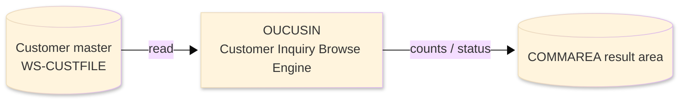
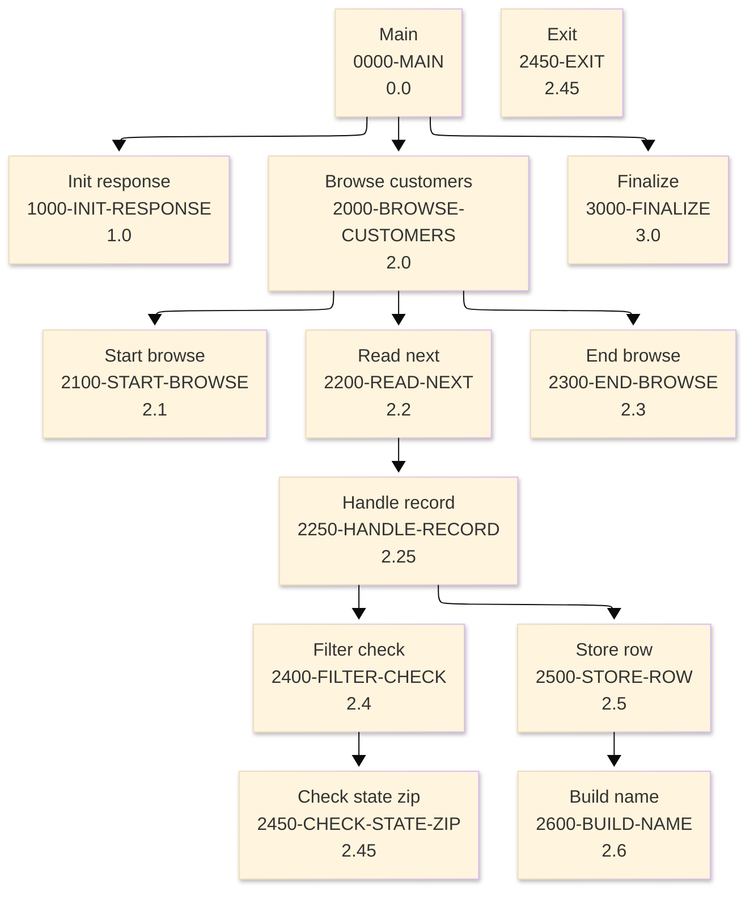

# Batch Program Design Document — OUCUSIN_CustomerInquiryBrowse

**Common header**

| System name | Program ID | Created/updated on／Author | Changed lines |
|---|---|---|---|
| ORION-CCMS (ORION Credit Card Management System) | OUCUSIN | Created 2026-09-28／modernizeX | — |

## 1. Program overview

### 1.1 I/O diagram

### 1.2 Function overview

browse the customer master (CUSTFILE) applying a filter (customer-id range / FICO band / state + ZIP prefix) and return ONE page of matching rows in the KCUSIN-AREA commarea, together with the filter-wide aggregates (records scanned, matches found and the average FICO of the matched set).

### 1.3 I/O overview

| File / table / area | DD / access | Copybook | I/O | Type | Organisation |
|---|---|---|---|---|---|
| Customer master | EXEC CICS FILE(WS-CUSTFILE) | RCUST | I | Main | VSAM KSDS |
| Request / result area | COMMAREA (linkage) | KCOMM | I-O | Main | linkage |

### 1.4 Called subprograms / modules

| Program ID | Call type | Function | Interface |
|---|---|---|---|
| — | — | This program calls no sub-program | — |

### 1.5 DB tables & SQL

No SQL used — pure VSAM/CICS file I/O.

### 1.6 Special notes

- Invocation: EXEC CICS LINK PROGRAM('OUCUSIN') COMMAREA(KCUSIN-AREA) END-EXEC. FILES : CUSTFILE (browse - STARTBR / READNEXT / ENDBR) DESIGN The whole (filtered) customer set is scanned on every call so the aggregates are genuine totals - the same figures the OBCUSTP / OBRSCORE / OBRZIP batch listings used to print. While scanning, the first WS-MAX-ROWS matches whose key is greater than the resume key (KUI-START-KEY) are captured as the page; if a further match exists the more-switch is set.
- Linked from: OCCUSIN.

## 2. Processing details（処理内容）

### 1. Main（0000-MAIN）　[0.0]　(L66)
1) Main: drive the overall processing — run initialisation, the main work and termination in turn.
2) In turn, carry out: init response, browse customers, finalize.

### 2. Init response（1000-INIT-RESPONSE）　[1.0]　(L74)
1) Init response: prepare the work area, clear the result counters and set the initial status.

### 3. Browse customers（2000-BROWSE-CUSTOMERS）　[2.0]　(L92)
1) Browse customers: perform the browse customers step of the processing.
2) When NOT end of file (L94), take the branch for that case.
3) When kui row count > ZEROS (L99), take the branch for that case.
4) In turn, carry out: start browse, read next, end browse.

### 4. Start browse（2100-START-BROWSE）　[2.1]　(L106)
1) Start browse: position a browse on Customer master.
2) When kui f idrange (L107), take the branch for that case.
3) Depending on ws resp cd (L118): response = normal, response = not-found, response (ENDFILE), OTHER.

### 5. Read next（2200-READ-NEXT）　[2.2]　(L134)
1) Read next: read the next record from Customer master.
2) Depending on ws resp cd (L141): response = normal, response (ENDFILE), OTHER.
3) In turn, carry out: handle record.

### 6. Handle record（2250-HANDLE-RECORD）　[2.25]　(L153)
1) Handle record: perform the handle record step of the processing.
2) When kui f idrange AND cu id > kui id to (L155), take the branch for that case.
3) In turn, carry out: filter check, store row.

### 7. End browse（2300-END-BROWSE）　[2.3]　(L180)
1) End browse: end the browse on Customer master.

### 8. Filter check（2400-FILTER-CHECK）　[2.4]　(L188)
1) Filter check: perform the filter check step of the processing.
2) Depending on TRUE (L190): kui f idrange, kui f fico, kui f stzip, OTHER.
3) In turn, carry out: check state zip.

### 9. Check state zip（2450-CHECK-STATE-ZIP）　[2.45]　(L210)
1) Check state zip: perform the check state zip step of the processing.
2) When cu addr state NOT = kui state (L211), take the branch for that case.
3) When ws ziplen = ZEROS (L220), take the branch for that case.
4) In turn, carry out: inline.

### 10. Exit（2450-EXIT）　[2.45]　(L227)
1) Exit: perform the exit step of the processing.

### 11. Store row（2500-STORE-ROW）　[2.5]　(L233)
1) Store row: perform the store row step of the processing.
2) In turn, carry out: build name.

### 12. Build name（2600-BUILD-NAME）　[2.6]　(L245)
1) Build name: perform the build name step of the processing.

### 13. Finalize（3000-FINALIZE）　[3.0]　(L255)
1) Finalize: set the final status and return the accumulated counts to the caller.
2) When kui match count > ZEROS (L256), take the branch for that case.

## 3. Structure diagram（構造図）

## 4. Output specifications (file / table)

### 4.1 COMMAREA result / work area（KCUSIN） — 792 bytes (result / work area returned in the COMMAREA)

| Level | Item name | Field name | Type | Bytes | Position | Source | How the value is set |
|---|---|---|---|---|---|---|---|
| 01 | Area | KCUSIN-AREA | group | 792 | 1 | — | group item |
| 05 | Request | KUI-REQUEST | group | 45 | 1 | Master/COMMAREA | record key |
| 10 | Filter | KUI-FILTER | X(01) | 0 | 1 | Master/COMMAREA | record key |
| 88 | F Idrange | KUI-F-IDRANGE | — | 0 | 1 | Master/COMMAREA | record key |
| 88 | F Fico | KUI-F-FICO | — | 0 | 1 | Master/COMMAREA | record key |
| 88 | F Stzip | KUI-F-STZIP | — | 0 | 1 | Master/COMMAREA | record key |
| 10 | Id From | KUI-ID-FROM | 9(09) | 9 | 1 | Master/COMMAREA | record key |
| 10 | Id To | KUI-ID-TO | 9(09) | 9 | 10 | Master/COMMAREA | set from the transaction / account being processed |
| 10 | Fico From | KUI-FICO-FROM | 9(03) | 3 | 19 | Master/COMMAREA | set from the transaction / account being processed |
| 10 | Fico To | KUI-FICO-TO | 9(03) | 3 | 22 | Master/COMMAREA | set from the transaction / account being processed |
| 10 | State | KUI-STATE | X(02) | 2 | 25 | Master/COMMAREA | set from the transaction / account being processed |
| 10 | Zip | KUI-ZIP | X(10) | 10 | 27 | Master/COMMAREA | set from the transaction / account being processed |
| 10 | Start Key | KUI-START-KEY | 9(09) | 9 | 37 | Master/COMMAREA | set from the transaction / account being processed |
| 05 | Response | KUI-RESPONSE | group | 45 | 46 | Master/COMMAREA | group item |
| 10 | Return Cd | KUI-RETURN-CD | X(01) | 0 | 46 | Master/COMMAREA | group item |
| 88 | Ok | KUI-OK | — | 0 | 46 | Master/COMMAREA | set from the transaction / account being processed |
| 88 | Error | KUI-ERROR | — | 0 | 46 | Master/COMMAREA | set from the transaction / account being processed |
| 10 | Row Count | KUI-ROW-COUNT | 9(02) | 2 | 46 | Master/COMMAREA | set from the transaction / account being processed |
| 10 | More Sw | KUI-MORE-SW | X(01) | 0 | 48 | Master/COMMAREA | group item |
| 88 | More | KUI-MORE | — | 0 | 48 | Master/COMMAREA | set from the transaction / account being processed |
| 88 | No More | KUI-NO-MORE | — | 0 | 48 | Master/COMMAREA | set from the transaction / account being processed |
| 10 | Next Key | KUI-NEXT-KEY | 9(09) | 9 | 48 | Master/COMMAREA | set from the transaction / account being processed |
| 10 | Scan Count | KUI-SCAN-COUNT | 9(07) | 7 | 57 | Master/COMMAREA | set from the transaction / account being processed |
| 10 | Match Count | KUI-MATCH-COUNT | 9(07) | 7 | 64 | Master/COMMAREA | set from the transaction / account being processed |
| 10 | Fico Tot | KUI-FICO-TOT | 9(11) | 11 | 71 | Master/COMMAREA | set from the transaction / account being processed |
| 10 | Fico Avg | KUI-FICO-AVG | 9(03) | 3 | 82 | Master/COMMAREA | set from the transaction / account being processed |
| 10 | Fico Min | KUI-FICO-MIN | 9(03) | 3 | 85 | Master/COMMAREA | set from the transaction / account being processed |
| 10 | Fico Max | KUI-FICO-MAX | 9(03) | 3 | 88 | Master/COMMAREA | set from the transaction / account being processed |
| 05 | Rows | KUI-ROWS | group | 702 | 91 | Master/COMMAREA | group item |
| 10 | Row | KUI-ROW | group | 702 | 91 | Master/COMMAREA | group item |
| 15 | Id | KUR-ID | 9(09) | 9 | 91 | Master/COMMAREA | set from the transaction / account being processed |
| 15 | Name | KUR-NAME | X(30) | 30 | 100 | Master/COMMAREA | set from the transaction / account being processed |
| 15 | State | KUR-STATE | X(02) | 2 | 130 | Master/COMMAREA | set from the transaction / account being processed |
| 15 | Zip | KUR-ZIP | X(10) | 10 | 132 | Master/COMMAREA | set from the transaction / account being processed |
| 15 | Fico | KUR-FICO | 9(03) | 3 | 142 | Master/COMMAREA | set from the transaction / account being processed |

## 5. In/out parameters & check specifications

### 5.1 Parameters

| Category | Name | Type / length | Meaning | Value / source |
|---|---|---|---|---|
| Linkage (COMMAREA) | ORION-COMMAREA | group (KCOMM) | shared communication area passed on every EXEC CICS LINK | supplied by the calling screen |
| Linkage (KCUSIN) | KUI-F-IDRANGE | — | f idrange | request/result field in the work area |
| Linkage (KCUSIN) | KUI-F-FICO | — | f fico | request/result field in the work area |
| Linkage (KCUSIN) | KUI-F-STZIP | — | f stzip | request/result field in the work area |
| Linkage (KCUSIN) | KUI-ID-FROM | 9(09) | id from | request/result field in the work area |
| Linkage (KCUSIN) | KUI-ID-TO | 9(09) | id to | request/result field in the work area |
| Linkage (KCUSIN) | KUI-FICO-FROM | 9(03) | fico from | request/result field in the work area |
| Linkage (KCUSIN) | KUI-FICO-TO | 9(03) | fico to | request/result field in the work area |
| Linkage (KCUSIN) | KUI-STATE | X(02) | state | request/result field in the work area |
| Linkage (KCUSIN) | KUI-ZIP | X(10) | zip | request/result field in the work area |
| Linkage (KCUSIN) | KUI-START-KEY | 9(09) | start key | request/result field in the work area |
| Linkage (KCUSIN) | KUI-OK | — | ok | request/result field in the work area |
| Linkage (KCUSIN) | KUI-ERROR | — | error | request/result field in the work area |
| Linkage (KCUSIN) | KUI-ROW-COUNT | 9(02) | row count | request/result field in the work area |
| Linkage (KCUSIN) | KUI-MORE | — | more | request/result field in the work area |
| Return | COMMAREA status | flag / text | outcome of the call | set by this program before it returns |

### 5.2 Checks

| No. | Check type | Target | Trigger condition | Action / message |
|---|---|---|---|---|
| 1 | Response | CICS file response | a file response other than normal or not-found | the error is recorded in the COMMAREA status and the browse/step ends |

## 6. Modification summary

| No. | Change date | Title | Summary of the change |
|---|---|---|---|
| 1 | 2026.09.28 | Initial AS-IS reverse design | Document generated by modernizeX from the extracted AST and datastore; no functional change. |

