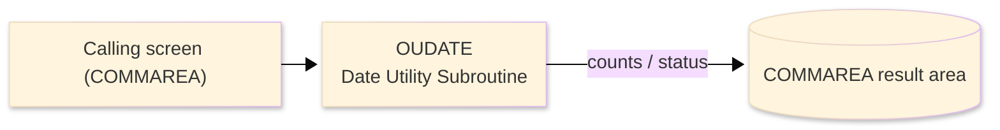
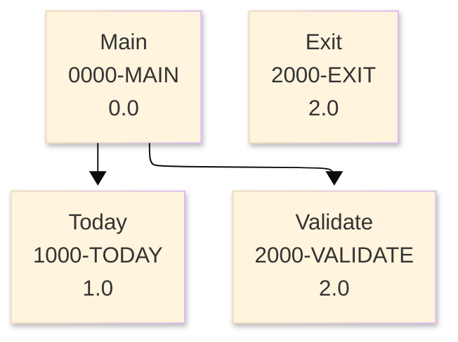

# Batch Program Design Document — OUDATE_DateUtility

**Common header**

| System name | Program ID | Created/updated on／Author | Changed lines |
|---|---|---|---|
| ORION-CCMS (ORION Credit Card Management System) | OUDATE | Created 2026-09-28／modernizeX | — |

## 1. Program overview

### 1.1 I/O diagram

### 1.2 Function overview

VALD = validate YYYY-MM-DD ; TODY = current date ; FMT = pass through (already YYYY-MM-DD).

### 1.3 I/O overview

| File / table / area | DD / access | Copybook | I/O | Type | Organisation |
|---|---|---|---|---|---|
| Request / result area | COMMAREA (linkage) | KCOMM | I-O | Main | linkage |
| Request / result area | COMMAREA (linkage) | (sub linkage copybook) | I-O | Main | linkage |

### 1.4 Called subprograms / modules

| Program ID | Call type | Function | Interface |
|---|---|---|---|
| — | — | This program calls no sub-program | — |

### 1.5 DB tables & SQL

No SQL used — pure VSAM/CICS file I/O.

### 1.6 Special notes

- Invocation: / EXEC CICS LINK)
- Linked from: OCACCTA, OCACCTU, OCCARDA, OCCARDU, OCREPT.

## 2. Processing details（処理内容）

### 1. Main（0000-MAIN）　[0.0]　(L31)
1) Main: drive the overall processing — run initialisation, the main work and termination in turn.
2) Depending on kd func (L33): 'TODY', 'VALD', 'FMT ', OTHER.
3) In turn, carry out: today, validate.

### 2. Today（1000-TODAY）　[1.0]　(L41)
1) Today: perform the today step of the processing.

### 3. Validate（2000-VALIDATE）　[2.0]　(L48)
1) Validate: perform the validate step of the processing.
2) When kd date in(1:4) NOT NUMERIC OR kd date in(6:2) NOT NUMERIC OR kd date in(9:2) NOT NUMERIC (L50), take the branch for that case.
3) When ws m < 1 OR ws m > 12 (L59), take the branch for that case.
4) Depending on ws m (L63): 2, 4, 6, 9.
5) When ws d < 1 OR ws d > ws dim (L71), take the branch for that case.

### 4. Exit（2000-EXIT）　[2.0]　(L74)
1) Exit: perform the exit step of the processing.

## 3. Structure diagram（構造図）

## 4. Output specifications (file / table)

### 4.1 COMMAREA result / work area（KDATE） — 26 bytes (result / work area returned in the COMMAREA)

| Level | Item name | Field name | Type | Bytes | Position | Source | How the value is set |
|---|---|---|---|---|---|---|---|
| 01 | Parm | KDATE-PARM | group | 26 | 1 | — | group item |
| 05 | Func | KD-FUNC | X(04) | 4 | 1 | Master/COMMAREA | record key |
| 05 | Date In | KD-DATE-IN | X(10) | 10 | 5 | Master/COMMAREA | set from the transaction / account being processed |
| 05 | Date Out | KD-DATE-OUT | X(10) | 10 | 15 | Master/COMMAREA | set from the transaction / account being processed |
| 05 | Status | KD-STATUS | X(02) | 2 | 25 | Master/COMMAREA | set from the transaction / account being processed |

## 5. In/out parameters & check specifications

### 5.1 Parameters

| Category | Name | Type / length | Meaning | Value / source |
|---|---|---|---|---|
| Linkage (COMMAREA) | ORION-COMMAREA | group (KCOMM) | shared communication area passed on every EXEC CICS LINK | supplied by the calling screen |
| Linkage (KDATE) | KD-FUNC | X(04) | func | request/result field in the work area |
| Linkage (KDATE) | KD-DATE-IN | X(10) | date in | request/result field in the work area |
| Linkage (KDATE) | KD-DATE-OUT | X(10) | date out | request/result field in the work area |
| Linkage (KDATE) | KD-STATUS | X(02) | status | request/result field in the work area |
| Return | COMMAREA status | flag / text | outcome of the call | set by this program before it returns |

### 5.2 Checks

| No. | Check type | Target | Trigger condition | Action / message |
|---|---|---|---|---|
| 1 | Response | CICS file response | a file response other than normal or not-found | the error is recorded in the COMMAREA status and the browse/step ends |

## 6. Modification summary

| No. | Change date | Title | Summary of the change |
|---|---|---|---|
| 1 | 2026.09.28 | Initial AS-IS reverse design | Document generated by modernizeX from the extracted AST and datastore; no functional change. |

