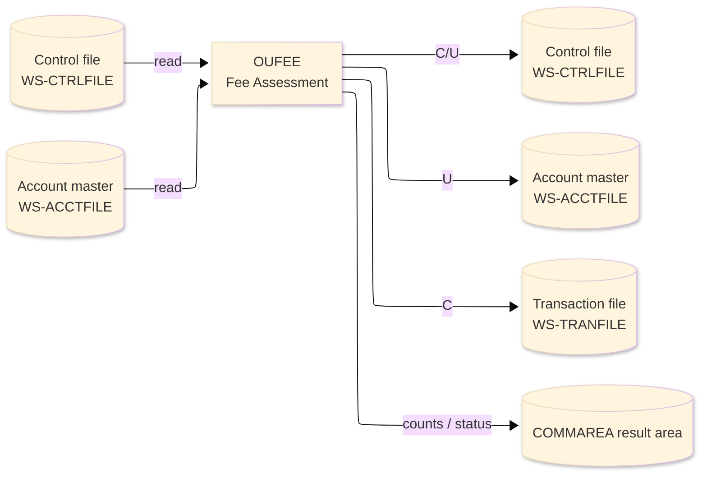
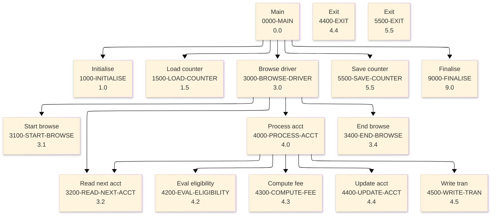

# Batch Program Design Document — OUFEE_FeeAssessment

**Common header**

| System name | Program ID | Created/updated on／Author | Changed lines |
|---|---|---|---|
| ORION-CCMS (ORION Credit Card Management System) | OUFEE | Created 2026-09-28／modernizeX | — |

## 1. Program overview

### 1.1 I/O diagram

### 1.2 Function overview

assess over-limit and late fees on demand. Browses the account master (ACCTFILE); an active account is over limit when the balance exceeds the credit limit and delinquent when the balance is positive yet the cycle credit is below the minimum due (2% of balance, floor 25). Each condition adds its flat fee; the total fee is READ ... UPDATE added to the balance and cycle debit, the account REWRITTEN, and a fee transaction (type 'FE') is WRITTEN to TRANFILE using an id drawn from CTRLFILE key 'TRANID'. Ports OBLFEE (VSAM) and ODFEE (DB2).

### 1.3 I/O overview

| File / table / area | DD / access | Copybook | I/O | Type | Organisation |
|---|---|---|---|---|---|
| Control file | EXEC CICS FILE(WS-CTRLFILE) | RCTRL | I-O | Main | VSAM KSDS |
| Account master | EXEC CICS FILE(WS-ACCTFILE) | RACCT | I-O | Sub | VSAM KSDS |
| Transaction file | EXEC CICS FILE(WS-TRANFILE) | RTRAN | O | Sub | VSAM KSDS |
| Request / result area | COMMAREA (linkage) | KCOMM | I-O | Main | linkage |

### 1.4 Called subprograms / modules

| Program ID | Call type | Function | Interface |
|---|---|---|---|
| — | — | This program calls no sub-program | — |

### 1.5 DB tables & SQL

No SQL used — pure VSAM/CICS file I/O.

### 1.6 Special notes

- Invocation: EXEC CICS LINK PROGRAM('OUFEE') COMMAREA(ORION-COMMAREA) END-EXEC. REQUEST : KO-PARM-ACCT optional single account (0 = all).
- Linked from: OCOPS.
- Result / status: KO-READ scanned KO-SELECT assessed KO-UPDATE rewritten KO-TRAN fee trans KO-C1 over-limit KO-C2 late KO-C3 both KO-AMT-1 total fees KO-AMT-2 late KO-AMT-3 over.

## 2. Processing details（処理内容）

### 1. Main（0000-MAIN）　[0.0]　(L114)
1) Main: drive the overall processing — run initialisation, the main work and termination in turn.
2) In turn, carry out: initialise, load counter, browse driver, save counter, finalise.

### 2. Initialise（1000-INITIALISE）　[1.0]　(L125)
1) Initialise: prepare the work area, clear the result counters and set the initial status.
2) When ko parm acct > ZERO (L142), take the branch for that case.

### 3. Load counter（1500-LOAD-COUNTER）　[1.5]　(L159)
1) Load counter: read the Control file record.
2) Depending on ws resp cd (L170): response = normal, response = not-found, OTHER.

### 4. Browse driver（3000-BROWSE-DRIVER）　[3.0]　(L184)
1) Browse driver: perform the browse driver step of the processing.
2) When br started (L186), take the branch for that case.
3) In turn, carry out: start browse, read next acct, process acct, end browse.

### 5. Start browse（3100-START-BROWSE）　[3.1]　(L195)
1) Start browse: position a browse on Account master.
2) When filter active (L196), take the branch for that case.
3) Depending on ws resp cd (L207): response = normal, response = not-found, OTHER.

### 6. Read next acct（3200-READ-NEXT-ACCT）　[3.2]　(L221)
1) Read next acct: read the next record from Account master.
2) Depending on ws resp cd (L228): response = normal, response (ENDFILE), OTHER.

### 7. Process acct（4000-PROCESS-ACCT）　[4.0]　(L241)
1) Process acct: perform the process acct step of the processing.
2) When filter active AND ac id NOT = ws filter acct (L242), take the branch for that case.
3) In turn, carry out: eval eligibility, compute fee, update acct, write tran, read next acct.

### 8. Eval eligibility（4200-EVAL-ELIGIBILITY）　[4.2]　(L260)
1) Eval eligibility: perform the eval eligibility step of the processing.
2) When ac curr bal > ac credit limit (L264), take the branch for that case.
3) When ac curr bal > ZERO (L267), take the branch for that case.
4) When is over limit OR is delinquent (L277), take the branch for that case.

### 9. Compute fee（4300-COMPUTE-FEE）　[4.3]　(L283)
1) Compute fee: perform the compute fee step of the processing.
2) When is delinquent (L285), take the branch for that case.
3) When is over limit (L290), take the branch for that case.
4) When is over limit AND is delinquent (L295), take the branch for that case.

### 10. Update acct（4400-UPDATE-ACCT）　[4.4]　(L303)
1) Update acct: read the Account master record; save the updated Account master record.
2) When ws resp cd NOT = response = normal (L311), take the branch for that case.
3) When ws resp cd = response = normal (L322), take the branch for that case.

### 11. Exit（4400-EXIT）　[4.4]　(L328)
1) Exit: perform the exit step of the processing.

### 12. Write tran（4500-WRITE-TRAN）　[4.5]　(L333)
1) Write tran: add a record to the Transaction file.
2) When ws resp cd = response = normal (L357), take the branch for that case.

### 13. End browse（3400-END-BROWSE）　[3.4]　(L363)
1) End browse: end the browse on Account master.
2) When br started (L364), take the branch for that case.

### 14. Save counter（5500-SAVE-COUNTER）　[5.5]　(L373)
1) Save counter: read the Control file record; save the updated Control file record; add a record to the Control file.
2) When ko tran cnt = ZERO (L374), take the branch for that case.
3) When ws resp cd = response = normal (L385), take the branch for that case.

### 15. Exit（5500-EXIT）　[5.5]　(L403)
1) Exit: perform the exit step of the processing.

### 16. Finalise（9000-FINALISE）　[9.0]　(L408)
1) Finalise: set the final status and return the accumulated counts to the caller.
2) When ko error (L409), take the branch for that case.

## 3. Structure diagram（構造図）

## 4. Output specifications (file / table)

### 4.1 Control file（RCTRL） — 60 bytes (output record)

| Level | Item name | Field name | Type | Bytes | Position | Source | How the value is set |
|---|---|---|---|---|---|---|---|
| 01 | Rec | CTRL-REC | group | 60 | 1 | — | group item |
| 05 | Key | CT-KEY | X(08) | 8 | 1 | Master/COMMAREA | record key |
| 05 | Last Value | CT-LAST-VALUE | 9(11) | 11 | 9 | Master/COMMAREA | set from the transaction / account being processed |
| 05 | Desc | CT-DESC | X(30) | 30 | 20 | Master/COMMAREA | set from the transaction / account being processed |
| 05 | Filler | FILLER | X(11) | 11 | 50 | Master/COMMAREA | set from the transaction / account being processed |

### 4.2 Account master（RACCT） — 300 bytes (output record)

| Level | Item name | Field name | Type | Bytes | Position | Source | How the value is set |
|---|---|---|---|---|---|---|---|
| 01 | Rec | ACCT-REC | group | 300 | 1 | — | group item |
| 05 | Id | AC-ID | 9(11) | 11 | 1 | Master/COMMAREA | record key |
| 05 | Active Status | AC-ACTIVE-STATUS | X(01) | 1 | 12 | Master/COMMAREA | set from the transaction / account being processed |
| 05 | Curr Bal | AC-CURR-BAL | S9(10)V99 | 12 | 13 | Master/COMMAREA | set from the transaction / account being processed |
| 05 | Credit Limit | AC-CREDIT-LIMIT | S9(10)V99 | 12 | 25 | Master/COMMAREA | set from the transaction / account being processed |
| 05 | Cash Limit | AC-CASH-LIMIT | S9(10)V99 | 12 | 37 | Master/COMMAREA | set from the transaction / account being processed |
| 05 | Open Date | AC-OPEN-DATE | X(10) | 10 | 49 | Master/COMMAREA | set from the transaction / account being processed |
| 05 | Expiry Date | AC-EXPIRY-DATE | X(10) | 10 | 59 | Master/COMMAREA | set from the transaction / account being processed |
| 05 | Reissue Date | AC-REISSUE-DATE | X(10) | 10 | 69 | Master/COMMAREA | set from the transaction / account being processed |
| 05 | Cyc Credit | AC-CYC-CREDIT | S9(10)V99 | 12 | 79 | Master/COMMAREA | set from the transaction / account being processed |
| 05 | Cyc Debit | AC-CYC-DEBIT | S9(10)V99 | 12 | 91 | Master/COMMAREA | set from the transaction / account being processed |
| 05 | Addr Zip | AC-ADDR-ZIP | X(10) | 10 | 103 | Master/COMMAREA | set from the transaction / account being processed |
| 05 | Group Id | AC-GROUP-ID | X(10) | 10 | 113 | Master/COMMAREA | set from the transaction / account being processed |
| 05 | Filler | FILLER | X(178) | 178 | 123 | Master/COMMAREA | set from the transaction / account being processed |

### 4.3 Transaction file（RTRAN） — 350 bytes (output record)

| Level | Item name | Field name | Type | Bytes | Position | Source | How the value is set |
|---|---|---|---|---|---|---|---|
| 01 | Rec | TRAN-REC | group | 350 | 1 | — | group item |
| 05 | Id | TR-ID | X(16) | 16 | 1 | Master/COMMAREA | record key |
| 05 | Type Cd | TR-TYPE-CD | X(02) | 2 | 17 | Master/COMMAREA | set from the transaction / account being processed |
| 05 | Cat Cd | TR-CAT-CD | 9(04) | 4 | 19 | Master/COMMAREA | set from the transaction / account being processed |
| 05 | Source | TR-SOURCE | X(10) | 10 | 23 | Master/COMMAREA | set from the transaction / account being processed |
| 05 | Desc | TR-DESC | X(100) | 100 | 33 | Master/COMMAREA | set from the transaction / account being processed |
| 05 | Amt | TR-AMT | S9(09)V99 | 11 | 133 | Master/COMMAREA | set from the transaction / account being processed |
| 05 | Merchant Id | TR-MERCHANT-ID | 9(09) | 9 | 144 | Master/COMMAREA | set from the transaction / account being processed |
| 05 | Merchant Name | TR-MERCHANT-NAME | X(50) | 50 | 153 | Master/COMMAREA | set from the transaction / account being processed |
| 05 | Merchant City | TR-MERCHANT-CITY | X(50) | 50 | 203 | Master/COMMAREA | set from the transaction / account being processed |
| 05 | Merchant Zip | TR-MERCHANT-ZIP | X(10) | 10 | 253 | Master/COMMAREA | set from the transaction / account being processed |
| 05 | Card Num | TR-CARD-NUM | X(16) | 16 | 263 | Master/COMMAREA | set from the transaction / account being processed |
| 05 | Orig Ts | TR-ORIG-TS | X(26) | 26 | 279 | Master/COMMAREA | set from the transaction / account being processed |
| 05 | Proc Ts | TR-PROC-TS | X(26) | 26 | 305 | Master/COMMAREA | set from the transaction / account being processed |
| 05 | Filler | FILLER | X(20) | 20 | 331 | Master/COMMAREA | set from the transaction / account being processed |

## 5. In/out parameters & check specifications

### 5.1 Parameters

| Category | Name | Type / length | Meaning | Value / source |
|---|---|---|---|---|
| Linkage (COMMAREA) | ORION-COMMAREA | group (KCOMM) | shared communication area passed on every EXEC CICS LINK | supplied by the calling screen |
| Linkage (KOPS) | KO-FN-POST | — | fn post | request/result field in the work area |
| Linkage (KOPS) | KO-FN-PAY | — | fn pay | request/result field in the work area |
| Linkage (KOPS) | KO-FN-INT | — | fn int | request/result field in the work area |
| Linkage (KOPS) | KO-FN-FEE | — | fn fee | request/result field in the work area |
| Linkage (KOPS) | KO-FN-CHGF | — | fn chgf | request/result field in the work area |
| Linkage (KOPS) | KO-FN-CLOS | — | fn clos | request/result field in the work area |
| Linkage (KOPS) | KO-FN-RNEW | — | fn rnew | request/result field in the work area |
| Linkage (KOPS) | KO-FN-CYCL | — | fn cycl | request/result field in the work area |
| Linkage (KOPS) | KO-PARM-ACCT | 9(11) | parm acct | request/result field in the work area |
| Linkage (KOPS) | KO-PARM-CARD | X(16) | parm card | request/result field in the work area |
| Linkage (KOPS) | KO-PARM-AMT | S9(10)V99 | parm amt | request/result field in the work area |
| Linkage (KOPS) | KO-PARM-DATE | X(10) | parm date | request/result field in the work area |
| Linkage (KOPS) | KO-OK | — | ok | request/result field in the work area |
| Linkage (KOPS) | KO-WARN | — | warn | request/result field in the work area |
| Return | COMMAREA status | flag / text | outcome of the call | set by this program before it returns |

### 5.2 Checks

| No. | Check type | Target | Trigger condition | Action / message |
|---|---|---|---|---|
| 1 | Response | CICS file response | a file response other than normal or not-found | the error is recorded in the COMMAREA status and the browse/step ends |

## 6. Modification summary

| No. | Change date | Title | Summary of the change |
|---|---|---|---|
| 1 | 2026.09.28 | Initial AS-IS reverse design | Document generated by modernizeX from the extracted AST and datastore; no functional change. |

