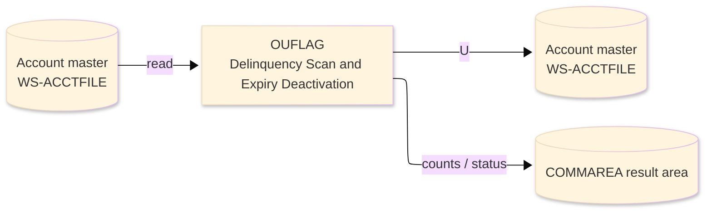
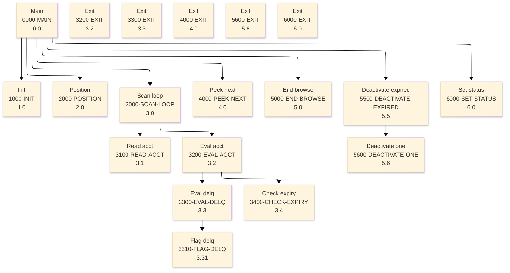

# Batch Program Design Document — OUFLAG_DelinquencyScan

**Common header**

| System name | Program ID | Created/updated on／Author | Changed lines |
|---|---|---|---|
| ORION-CCMS (ORION Credit Card Management System) | OUFLAG | Created 2026-09-28／modernizeX | — |

## 1. Program overview

### 1.1 I/O diagram

### 1.2 Function overview

on-line port of batch OBDELQ (delinquency aging) and the expiry pass. Browse ACCTFILE in account order; for each active account compute the minimum due, flag delinquency and classify it into a 30 / 60 / 90 aging bucket by credit utilisation, and capture accounts whose expiry date has passed the cutoff. Expired accounts are then re-read for UPDATE and REWRITTEN with an inactive status. Counts and money totals are returned in the KFLAG block overlaid on CA-WORK-AREA.

### 1.3 I/O overview

| File / table / area | DD / access | Copybook | I/O | Type | Organisation |
|---|---|---|---|---|---|
| Account master | EXEC CICS FILE(WS-ACCTFILE) | RACCT | I-O | Main | VSAM KSDS |
| Request / result area | COMMAREA (linkage) | KCOMM | I-O | Main | linkage |

### 1.4 Called subprograms / modules

| Program ID | Call type | Function | Interface |
|---|---|---|---|
| — | — | This program calls no sub-program | — |

### 1.5 DB tables & SQL

No SQL used — pure VSAM/CICS file I/O.

### 1.6 Special notes

- Invocation: EXEC CICS LINK PROGRAM('OUFLAG') COMMAREA(ORION-COMMAREA) LENGTH(LENGTH OF ORION-COMMAREA) END-EXEC. FILES : ACCTFILE browse and READ UPDATE / REWRITE. RETURN : ends with GOBACK (subroutine convention). MAINTENANCE LOG 0001 2026-08-07 Original - on-line delinquency+expiry sub.
- Linked from: OCUTIL.

## 2. Processing details（処理内容）

### 1. Main（0000-MAIN）　[0.0]　(L84)
1) Main: drive the overall processing — run initialisation, the main work and termination in turn.
2) When kfl status NOT = '99' (L87), take the branch for that case.
3) In turn, carry out: init, position, scan loop, peek next, end browse, deactivate expired, set status.

### 2. Init（1000-INIT）　[1.0]　(L105)
1) Init: prepare the work area, clear the result counters and set the initial status.
2) Depending on kfl mode (L119): 'BOTH', 'DELQ', 'EXPY', OTHER.
3) When kfl status NOT = '99' AND do expy (L131), take the branch for that case.

### 3. Position（2000-POSITION）　[2.0]　(L140)
1) Position: position a browse on Account master.
2) Depending on ws resp cd (L148): response = normal, response = not-found, response (ENDFILE), OTHER.

### 4. Scan loop（3000-SCAN-LOOP）　[3.0]　(L162)
1) Scan loop: perform the scan loop step of the processing.
2) When NOT ws eof yes (L164), take the branch for that case.
3) In turn, carry out: read acct, eval acct.

### 5. Read acct（3100-READ-ACCT）　[3.1]　(L173)
1) Read acct: read the next record from Account master.
2) Depending on ws resp cd (L180): response = normal, response (ENDFILE), OTHER.

### 6. Eval acct（3200-EVAL-ACCT）　[3.2]　(L194)
1) Eval acct: perform the eval acct step of the processing.
2) When ac active status = 'N' (L196), take the branch for that case.
3) When do delq (L200), take the branch for that case.
4) When do expy (L203), take the branch for that case.
5) In turn, carry out: eval delq, check expiry.

### 7. Exit（3200-EXIT）　[3.2]　(L206)
1) Exit: perform the exit step of the processing.

### 8. Eval delq（3300-EVAL-DELQ）　[3.3]　(L211)
1) Eval delq: perform the eval delq step of the processing.
2) When ac curr bal <= ZERO (L212), take the branch for that case.
3) When ws min due < ws min due floor (L217), take the branch for that case.
4) When ac cyc credit >= ws min due (L220), take the branch for that case.
5) In turn, carry out: flag delq.

### 9. Exit（3300-EXIT）　[3.3]　(L225)
1) Exit: perform the exit step of the processing.

### 10. Flag delq（3310-FLAG-DELQ）　[3.31]　(L230)
1) Flag delq: perform the flag delq step of the processing.
2) When ws shortfall < ZERO (L233), take the branch for that case.
3) When ac credit limit > ZERO (L236), take the branch for that case.
4) Depending on TRUE (L242): ws util >= 100.00, ws util >= 90.00, OTHER.

### 11. Check expiry（3400-CHECK-EXPIRY）　[3.4]　(L256)
1) Check expiry: perform the check expiry step of the processing.
2) When ac expiry date NOT = SPACES AND ac expiry date NOT = low values AND ac expiry date < kfl cutoff (L257), take the branch for that case.

### 12. Peek next（4000-PEEK-NEXT）　[4.0]　(L272)
1) Peek next: read the next record from Account master.
2) When ws eof yes (L273), take the branch for that case.
3) Depending on ws resp cd (L283): response = normal, response (ENDFILE), OTHER.

### 13. Exit（4000-EXIT）　[4.0]　(L293)
1) Exit: perform the exit step of the processing.

### 14. End browse（5000-END-BROWSE）　[5.0]　(L298)
1) End browse: end the browse on Account master.

### 15. Deactivate expired（5500-DEACTIVATE-EXPIRED）　[5.5]　(L307)
1) Deactivate expired: perform the deactivate expired step of the processing.
2) In turn, carry out: inline, deactivate one.

### 16. Deactivate one（5600-DEACTIVATE-ONE）　[5.6]　(L315)
1) Deactivate one: read the Account master record; save the updated Account master record.
2) When ws resp cd NOT = response = normal (L324), take the branch for that case.
3) When ac active status = 'N' (L328), take the branch for that case.
4) When ws resp cd = response = normal (L341), take the branch for that case.

### 17. Exit（5600-EXIT）　[5.6]　(L346)
1) Exit: perform the exit step of the processing.

### 18. Set status（6000-SET-STATUS）　[6.0]　(L351)
1) Set status: perform the set status step of the processing.
2) When kfl status = '99' (L352), take the branch for that case.
3) When kfl read = ZEROS (L355), take the branch for that case.

### 19. Exit（6000-EXIT）　[6.0]　(L362)
1) Exit: perform the exit step of the processing.

## 3. Structure diagram（構造図）

## 4. Output specifications (file / table)

### 4.1 Account master（RACCT） — 300 bytes (output record)

| Level | Item name | Field name | Type | Bytes | Position | Source | How the value is set |
|---|---|---|---|---|---|---|---|
| 01 | Rec | ACCT-REC | group | 300 | 1 | — | group item |
| 05 | Id | AC-ID | 9(11) | 11 | 1 | Master/COMMAREA | record key |
| 05 | Active Status | AC-ACTIVE-STATUS | X(01) | 1 | 12 | Master/COMMAREA | set from the transaction / account being processed |
| 05 | Curr Bal | AC-CURR-BAL | S9(10)V99 | 12 | 13 | Master/COMMAREA | set from the transaction / account being processed |
| 05 | Credit Limit | AC-CREDIT-LIMIT | S9(10)V99 | 12 | 25 | Master/COMMAREA | set from the transaction / account being processed |
| 05 | Cash Limit | AC-CASH-LIMIT | S9(10)V99 | 12 | 37 | Master/COMMAREA | set from the transaction / account being processed |
| 05 | Open Date | AC-OPEN-DATE | X(10) | 10 | 49 | Master/COMMAREA | set from the transaction / account being processed |
| 05 | Expiry Date | AC-EXPIRY-DATE | X(10) | 10 | 59 | Master/COMMAREA | set from the transaction / account being processed |
| 05 | Reissue Date | AC-REISSUE-DATE | X(10) | 10 | 69 | Master/COMMAREA | set from the transaction / account being processed |
| 05 | Cyc Credit | AC-CYC-CREDIT | S9(10)V99 | 12 | 79 | Master/COMMAREA | set from the transaction / account being processed |
| 05 | Cyc Debit | AC-CYC-DEBIT | S9(10)V99 | 12 | 91 | Master/COMMAREA | set from the transaction / account being processed |
| 05 | Addr Zip | AC-ADDR-ZIP | X(10) | 10 | 103 | Master/COMMAREA | set from the transaction / account being processed |
| 05 | Group Id | AC-GROUP-ID | X(10) | 10 | 113 | Master/COMMAREA | set from the transaction / account being processed |
| 05 | Filler | FILLER | X(178) | 178 | 123 | Master/COMMAREA | set from the transaction / account being processed |

## 5. In/out parameters & check specifications

### 5.1 Parameters

| Category | Name | Type / length | Meaning | Value / source |
|---|---|---|---|---|
| Linkage (COMMAREA) | ORION-COMMAREA | group (KCOMM) | shared communication area passed on every EXEC CICS LINK | supplied by the calling screen |
| Linkage (KFLAG) | KFL-MODE | X(04) | mode | request/result field in the work area |
| Linkage (KFLAG) | KFL-CUTOFF | X(10) | cutoff | request/result field in the work area |
| Linkage (KFLAG) | KFL-START-ACCT | 9(11) | start acct | request/result field in the work area |
| Linkage (KFLAG) | KFL-MAX | 9(07) | max | request/result field in the work area |
| Linkage (KFLAG) | KFL-STATUS | X(02) | status | request/result field in the work area |
| Linkage (KFLAG) | KFL-MSG | X(50) | msg | request/result field in the work area |
| Linkage (KFLAG) | KFL-READ | 9(07) | read | request/result field in the work area |
| Linkage (KFLAG) | KFL-SKIPPED | 9(07) | skipped | request/result field in the work area |
| Linkage (KFLAG) | KFL-CURRENT | 9(07) | current | request/result field in the work area |
| Linkage (KFLAG) | KFL-DELQ | 9(07) | delq | request/result field in the work area |
| Linkage (KFLAG) | KFL-B30 | 9(07) | b30 | request/result field in the work area |
| Linkage (KFLAG) | KFL-B60 | 9(07) | b60 | request/result field in the work area |
| Linkage (KFLAG) | KFL-B90 | 9(07) | b90 | request/result field in the work area |
| Linkage (KFLAG) | KFL-EXPIRED | 9(07) | expired | request/result field in the work area |
| Return | COMMAREA status | flag / text | outcome of the call | set by this program before it returns |

### 5.2 Checks

| No. | Check type | Target | Trigger condition | Action / message |
|---|---|---|---|---|
| 1 | Response | CICS file response | a file response other than normal or not-found | the error is recorded in the COMMAREA status and the browse/step ends |

## 6. Modification summary

| No. | Change date | Title | Summary of the change |
|---|---|---|---|
| 1 | 2026.09.28 | Initial AS-IS reverse design | Document generated by modernizeX from the extracted AST and datastore; no functional change. |

