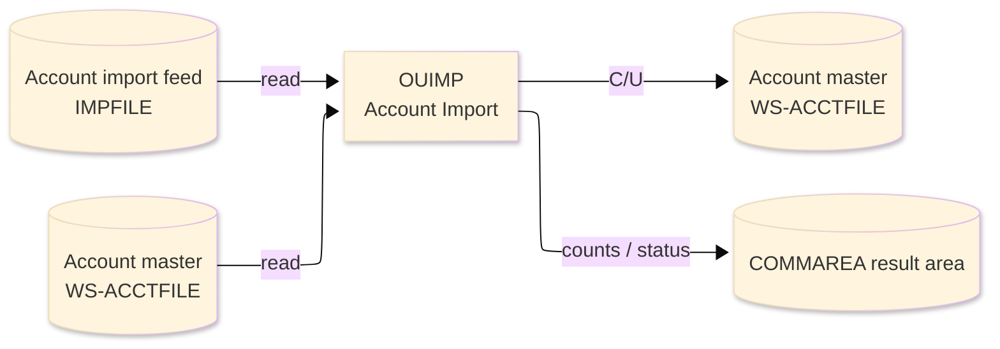
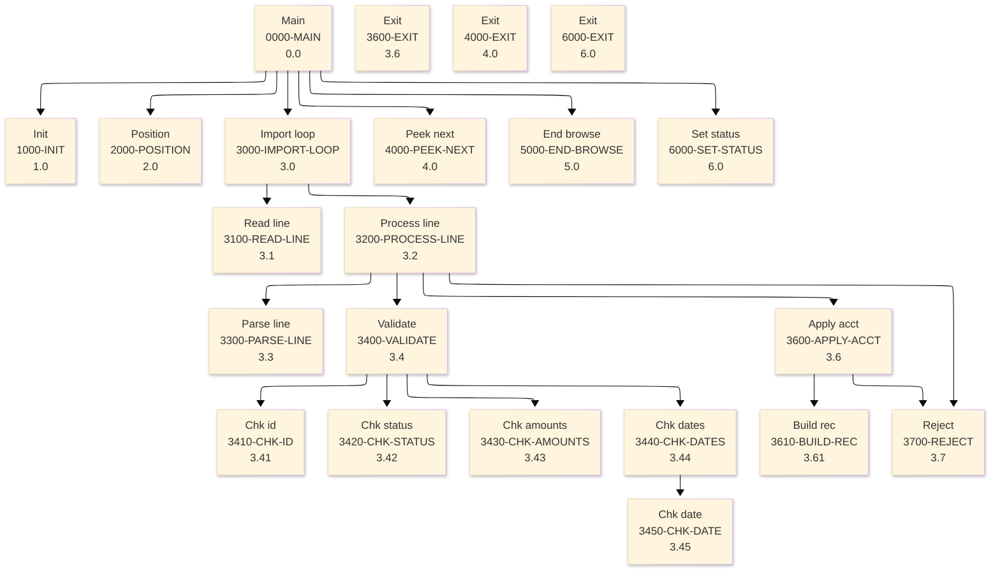

# Batch Program Design Document — OUIMP_AccountImport

**Common header**

| System name | Program ID | Created/updated on／Author | Changed lines |
|---|---|---|---|
| ORION-CCMS (ORION Credit Card Management System) | OUIMP | Created 2026-09-28／modernizeX | — |

## 1. Program overview

### 1.1 I/O diagram

### 1.2 Function overview

on-line port of batch OBIMP. Browse the staged import feed (IMPFILE, KSDS key IMP-KEY) where each record carries one CSV-style account line, split the line with UNSTRING, validate the record type, key, status, monetary amounts and dates, then apply it to the account master (ACCTFILE) - REWRITE when the key exists, WRITE when it is new. Invalid rows are counted with the last reject reason; header and non account rows are skipped. Counts are returned in the KIMP block overlaid on the shared

### 1.3 I/O overview

| File / table / area | DD / access | Copybook | I/O | Type | Organisation |
|---|---|---|---|---|---|
| Account import feed | EXEC CICS FILE(IMPFILE) | — | I | Main | VSAM KSDS |
| Account master | EXEC CICS FILE(WS-ACCTFILE) | RACCT | I-O | Sub | VSAM KSDS |
| Request / result area | COMMAREA (linkage) | KCOMM | I-O | Main | linkage |

### 1.4 Called subprograms / modules

| Program ID | Call type | Function | Interface |
|---|---|---|---|
| — | — | This program calls no sub-program | — |

### 1.5 DB tables & SQL

No SQL used — pure VSAM/CICS file I/O.

### 1.6 Special notes

- Invocation: EXEC CICS LINK PROGRAM('OUIMP') COMMAREA(ORION-COMMAREA) LENGTH(LENGTH OF ORION-COMMAREA) END-EXEC. FILES : IMPFILE browse, ACCTFILE READ UPDATE / REWRITE / WRITE. RETURN : ends with GOBACK (subroutine convention). MAINTENANCE LOG 0001 2026-08-07 Original - on-line account import sub.
- Linked from: OCUTIL.

## 2. Processing details（処理内容）

### 1. Main（0000-MAIN）　[0.0]　(L112)
1) Main: drive the overall processing — run initialisation, the main work and termination in turn.
2) When kim status NOT = '99' (L115), take the branch for that case.
3) In turn, carry out: init, position, import loop, peek next, end browse, set status.

### 2. Init（1000-INIT）　[1.0]　(L130)
1) Init: prepare the work area, clear the result counters and set the initial status.

### 3. Position（2000-POSITION）　[2.0]　(L145)
1) Position: position a browse on Account import feed.
2) When kim start key = SPACES OR kim start key = low values (L146), take the branch for that case.
3) Depending on ws resp cd (L157): response = normal, response = not-found, response (ENDFILE), OTHER.

### 4. Import loop（3000-IMPORT-LOOP）　[3.0]　(L171)
1) Import loop: perform the import loop step of the processing.
2) When NOT ws eof yes (L173), take the branch for that case.
3) In turn, carry out: read line, process line.

### 5. Read line（3100-READ-LINE）　[3.1]　(L182)
1) Read line: read the next record from Account import feed.
2) Depending on ws resp cd (L189): response = normal, response (ENDFILE), OTHER.

### 6. Process line（3200-PROCESS-LINE）　[3.2]　(L202)
1) Process line: perform the process line step of the processing.
2) Depending on ws type chk (L206): 'RECTYPE', 'CUST', 'ACCT', OTHER.
3) In turn, carry out: parse line, validate, apply acct, reject, reject.

### 7. Parse line（3300-PARSE-LINE）　[3.3]　(L225)
1) Parse line: perform the parse line step of the processing.

### 8. Validate（3400-VALIDATE）　[3.4]　(L239)
1) Validate: perform the validate step of the processing.
2) When ws fld cnt < 13 (L242), take the branch for that case.
3) When rec valid (L246), take the branch for that case.
4) When rec valid (L249), take the branch for that case.
5) When rec valid (L252), take the branch for that case.
6) In turn, carry out: chk id, chk status, chk amounts, chk dates.

### 9. Chk id（3410-CHK-ID）　[3.41]　(L261)
1) Chk id: perform the chk id step of the processing.
2) When FUNCTION test numval(ws f id) NOT = 0 (L262), take the branch for that case.

### 10. Chk status（3420-CHK-STATUS）　[3.42]　(L275)
1) Chk status: perform the chk status step of the processing.
2) When ws status chk NOT = 'Y' AND ws status chk NOT = 'N' (L277), take the branch for that case.

### 11. Chk amounts（3430-CHK-AMOUNTS）　[3.43]　(L284)
1) Chk amounts: perform the chk amounts step of the processing.
2) When FUNCTION test numval(ws f bal) NOT = 0 (L285), take the branch for that case.
3) When rec valid (L291), take the branch for that case.
4) When rec valid (L299), take the branch for that case.
5) When rec valid (L307), take the branch for that case.

### 12. Chk dates（3440-CHK-DATES）　[3.44]　(L326)
1) Chk dates: perform the chk dates step of the processing.
2) When ws dt ok NOT = 'Y' (L329), take the branch for that case.
3) When rec valid (L333), take the branch for that case.
4) When rec valid (L341), take the branch for that case.
5) In turn, carry out: chk date, chk date, chk date.

### 13. Chk date（3450-CHK-DATE）　[3.45]　(L352)
1) Chk date: perform the chk date step of the processing.
2) When ws dt(5:1) = '-' AND ws dt(8:1) = '-' (L355), take the branch for that case.

### 14. Apply acct（3600-APPLY-ACCT）　[3.6]　(L365)
1) Apply acct: read the Account master record; save the updated Account master record; add a record to the Account master.
2) Depending on ws resp cd (L374): response = normal, response = not-found, OTHER.
3) When acct exists (L385), take the branch for that case.
4) In turn, carry out: reject, build rec, reject, reject.

### 15. Exit（3600-EXIT）　[3.6]　(L413)
1) Exit: perform the exit step of the processing.

### 16. Build rec（3610-BUILD-REC）　[3.61]　(L418)
1) Build rec: perform the build rec step of the processing.

### 17. Reject（3700-REJECT）　[3.7]　(L435)
1) Reject: perform the reject step of the processing.

### 18. Peek next（4000-PEEK-NEXT）　[4.0]　(L443)
1) Peek next: read the next record from Account import feed.
2) When ws eof yes (L444), take the branch for that case.
3) Depending on ws resp cd (L454): response = normal, response (ENDFILE), OTHER.

### 19. Exit（4000-EXIT）　[4.0]　(L464)
1) Exit: perform the exit step of the processing.

### 20. End browse（5000-END-BROWSE）　[5.0]　(L469)
1) End browse: end the browse on Account import feed.

### 21. Set status（6000-SET-STATUS）　[6.0]　(L477)
1) Set status: perform the set status step of the processing.
2) When kim status = '99' (L478), take the branch for that case.
3) When kim read = ZEROS (L481), take the branch for that case.

### 22. Exit（6000-EXIT）　[6.0]　(L488)
1) Exit: perform the exit step of the processing.

## 3. Structure diagram（構造図）

## 4. Output specifications (file / table)

### 4.1 Account master（RACCT） — 300 bytes (output record)

| Level | Item name | Field name | Type | Bytes | Position | Source | How the value is set |
|---|---|---|---|---|---|---|---|
| 01 | Rec | ACCT-REC | group | 300 | 1 | — | group item |
| 05 | Id | AC-ID | 9(11) | 11 | 1 | Master/COMMAREA | record key |
| 05 | Active Status | AC-ACTIVE-STATUS | X(01) | 1 | 12 | Master/COMMAREA | set from the transaction / account being processed |
| 05 | Curr Bal | AC-CURR-BAL | S9(10)V99 | 12 | 13 | Master/COMMAREA | set from the transaction / account being processed |
| 05 | Credit Limit | AC-CREDIT-LIMIT | S9(10)V99 | 12 | 25 | Master/COMMAREA | set from the transaction / account being processed |
| 05 | Cash Limit | AC-CASH-LIMIT | S9(10)V99 | 12 | 37 | Master/COMMAREA | set from the transaction / account being processed |
| 05 | Open Date | AC-OPEN-DATE | X(10) | 10 | 49 | Master/COMMAREA | set from the transaction / account being processed |
| 05 | Expiry Date | AC-EXPIRY-DATE | X(10) | 10 | 59 | Master/COMMAREA | set from the transaction / account being processed |
| 05 | Reissue Date | AC-REISSUE-DATE | X(10) | 10 | 69 | Master/COMMAREA | set from the transaction / account being processed |
| 05 | Cyc Credit | AC-CYC-CREDIT | S9(10)V99 | 12 | 79 | Master/COMMAREA | set from the transaction / account being processed |
| 05 | Cyc Debit | AC-CYC-DEBIT | S9(10)V99 | 12 | 91 | Master/COMMAREA | set from the transaction / account being processed |
| 05 | Addr Zip | AC-ADDR-ZIP | X(10) | 10 | 103 | Master/COMMAREA | set from the transaction / account being processed |
| 05 | Group Id | AC-GROUP-ID | X(10) | 10 | 113 | Master/COMMAREA | set from the transaction / account being processed |
| 05 | Filler | FILLER | X(178) | 178 | 123 | Master/COMMAREA | set from the transaction / account being processed |

## 5. In/out parameters & check specifications

### 5.1 Parameters

| Category | Name | Type / length | Meaning | Value / source |
|---|---|---|---|---|
| Linkage (COMMAREA) | ORION-COMMAREA | group (KCOMM) | shared communication area passed on every EXEC CICS LINK | supplied by the calling screen |
| Linkage (KIMP) | KIM-START-KEY | X(08) | start key | request/result field in the work area |
| Linkage (KIMP) | KIM-MAX | 9(07) | max | request/result field in the work area |
| Linkage (KIMP) | KIM-STATUS | X(02) | status | request/result field in the work area |
| Linkage (KIMP) | KIM-MSG | X(50) | msg | request/result field in the work area |
| Linkage (KIMP) | KIM-READ | 9(07) | read | request/result field in the work area |
| Linkage (KIMP) | KIM-ADDED | 9(07) | added | request/result field in the work area |
| Linkage (KIMP) | KIM-UPDATED | 9(07) | updated | request/result field in the work area |
| Linkage (KIMP) | KIM-ACCEPTED | 9(07) | accepted | request/result field in the work area |
| Linkage (KIMP) | KIM-REJECTED | 9(07) | rejected | request/result field in the work area |
| Linkage (KIMP) | KIM-SKIPPED | 9(07) | skipped | request/result field in the work area |
| Linkage (KIMP) | KIM-ERRORS | 9(07) | errors | request/result field in the work area |
| Linkage (KIMP) | KIM-LAST-REASON | X(20) | last reason | request/result field in the work area |
| Linkage (KIMP) | KIM-LAST-KEY | X(08) | last key | request/result field in the work area |
| Linkage (KIMP) | KIM-NEXT-KEY | X(08) | next key | request/result field in the work area |
| Return | COMMAREA status | flag / text | outcome of the call | set by this program before it returns |

### 5.2 Checks

| No. | Check type | Target | Trigger condition | Action / message |
|---|---|---|---|---|
| 1 | Response | CICS file response | a file response other than normal or not-found | the error is recorded in the COMMAREA status and the browse/step ends |

## 6. Modification summary

| No. | Change date | Title | Summary of the change |
|---|---|---|---|
| 1 | 2026.09.28 | Initial AS-IS reverse design | Document generated by modernizeX from the extracted AST and datastore; no functional change. |

