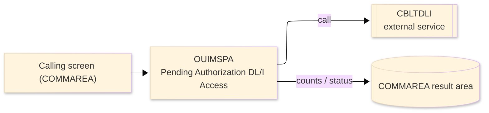
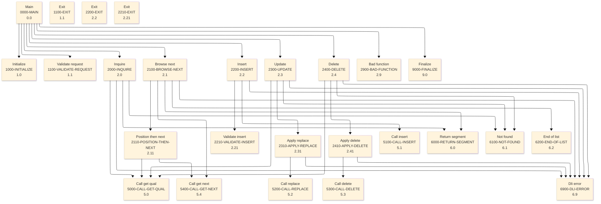

# Batch Program Design Document — OUIMSPA_PendingAuthDLI

**Common header**

| System name | Program ID | Created/updated on／Author | Changed lines |
|---|---|---|---|
| ORION-CCMS (ORION Credit Card Management System) | OUIMSPA | Created 2026-09-28／modernizeX | — |

## 1. Program overview

### 1.1 I/O diagram

### 1.2 Function overview

read / browse / insert / update / delete the PAUSEG root segment in IMS database OPAUDB using

### 1.3 I/O overview

| File / table / area | DD / access | Copybook | I/O | Type | Organisation |
|---|---|---|---|---|---|
| Request / result area | COMMAREA (linkage) | KCOMM | I-O | Main | linkage |
| Request / result area | COMMAREA (linkage) | (sub linkage copybook) | I-O | Main | linkage |

### 1.4 Called subprograms / modules

| Program ID | Call type | Function | Interface |
|---|---|---|---|
| CBLTDLI | CALL (external) | IMS DL/I call interface | no source in reg |

### 1.5 DB tables & SQL

No SQL used — pure VSAM/CICS file I/O.

### 1.6 Special notes

- Invocation: 'CBLTDLI'. The requested operation and its data travel in the CICS commarea work area (KCOMM / CA-WORK-AREA) laid out as WS-PAU-LINK. DL/I : GU by key = inquire one pending authorization GU key > = browse next (key ascending) ISRT = insert a new pending authorization GHU + REPL = update the decision / status GHU + DLET = purge a pending authorization CALL : EXEC CICS LINK PROGRAM('OUIMSPA') COMMAREA(ORION-COMMAREA) - the DB-PCB is passed by CICS on the PROCEDURE DIVISION USING list.
- Linked from: OCPAUIN.
- Result / status: this is a sub - it ends with GOBACK and issues no EXEC CICS; all database I/O is plain CBLTDLI.
- Uses IMS DL/I (`CBLTDLI`) against the pending-authorization database.

## 2. Processing details（処理内容）

### 1. Main（0000-MAIN）　[0.0]　(L73)
1) Main: drive the overall processing — run initialisation, the main work and termination in turn.
2) When pl badfunc (L76), take the branch for that case.
3) Depending on TRUE (L80): pl inquire, pl browse next, pl insert, pl update.
4) In turn, carry out: initialize, validate request, finalize, inquire, browse next, insert, update, delete, bad function, finalize.

### 2. Initialize（1000-INITIALIZE）　[1.0]　(L99)
1) Initialize: prepare the work area, clear the result counters and set the initial status.

### 3. Validate request（1100-VALIDATE-REQUEST）　[1.1]　(L109)
1) Validate request: perform the validate request step of the processing.
2) When NOT(pl inquire OR pl browse next OR pl insert OR pl update OR pl delete) (L110), take the branch for that case.
3) When pl inquire OR pl insert OR pl update OR pl delete (L117), take the branch for that case.

### 4. Exit（1100-EXIT）　[1.1]　(L124)
1) Exit: perform the exit step of the processing.

### 5. Inquire（2000-INQUIRE）　[2.0]　(L129)
1) Inquire: perform the inquire step of the processing.
2) Depending on ws dli status (L134): odli st ok, odli st notfound, OTHER.
3) In turn, carry out: call get qual, return segment, not found, dli error.

### 6. Browse next（2100-BROWSE-NEXT）　[2.1]　(L151)
1) Browse next: perform the browse next step of the processing.
2) When ws pl key = SPACES OR ws pl key = low values (L152), take the branch for that case.
3) Depending on ws dli status (L157): odli st ok, odli st notfound, odli st enddb, OTHER.
4) In turn, carry out: call get next, position then next, return segment, end of list, end of list, dli error.

### 7. Position then next（2110-POSITION-THEN-NEXT）　[2.11]　(L172)
1) Position then next: perform the position then next step of the processing.
2) Depending on ws dli status (L177): odli st ok, odli st notfound, OTHER.
3) In turn, carry out: call get qual, call get next, call get qual.

### 8. Insert（2200-INSERT）　[2.2]　(L193)
1) Insert: perform the insert step of the processing.
2) When pl badfunc (L197), take the branch for that case.
3) Depending on ws dli status (L202): odli st ok, odli st dup, OTHER.
4) In turn, carry out: validate insert, call insert, dli error.

### 9. Exit（2200-EXIT）　[2.2]　(L215)
1) Exit: perform the exit step of the processing.

### 10. Validate insert（2210-VALIDATE-INSERT）　[2.21]　(L222)
1) Validate insert: perform the validate insert step of the processing.
2) When pa card num = SPACES OR pa card num = low values (L223), take the branch for that case.
3) When pa acct id NOT NUMERIC (L229), take the branch for that case.
4) When pa status = SPACE OR pa status = low value (L235), take the branch for that case.

### 11. Exit（2210-EXIT）　[2.21]　(L238)
1) Exit: perform the exit step of the processing.

### 12. Update（2300-UPDATE）　[2.3]　(L245)
1) Update: perform the update step of the processing.
2) Depending on ws dli status (L250): odli st ok, odli st notfound, OTHER.
3) In turn, carry out: call get qual, apply replace, not found, dli error.

### 13. Apply replace（2310-APPLY-REPLACE）　[2.31]　(L259)
1) Apply replace: perform the apply replace step of the processing.
2) Depending on ws dli status (L264): odli st ok, OTHER.
3) In turn, carry out: call replace, dli error.

### 14. Delete（2400-DELETE）　[2.4]　(L276)
1) Delete: perform the delete step of the processing.
2) Depending on ws dli status (L281): odli st ok, odli st notfound, OTHER.
3) In turn, carry out: call get qual, apply delete, not found, dli error.

### 15. Apply delete（2410-APPLY-DELETE）　[2.41]　(L290)
1) Apply delete: perform the apply delete step of the processing.
2) Depending on ws dli status (L293): odli st ok, OTHER.
3) In turn, carry out: call delete, dli error.

### 16. Bad function（2900-BAD-FUNCTION）　[2.9]　(L303)
1) Bad function: perform the bad function step of the processing.

### 17. Call get qual（5000-CALL-GET-QUAL）　[5.0]　(L311)
1) Call get qual: perform the call get qual step of the processing.

### 18. Call get next（5400-CALL-GET-NEXT）　[5.4]　(L322)
1) Call get next: perform the call get next step of the processing.

### 19. Call insert（5100-CALL-INSERT）　[5.1]　(L333)
1) Call insert: perform the call insert step of the processing.

### 20. Call replace（5200-CALL-REPLACE）　[5.2]　(L343)
1) Call replace: perform the call replace step of the processing.

### 21. Call delete（5300-CALL-DELETE）　[5.3]　(L352)
1) Call delete: perform the call delete step of the processing.

### 22. Return segment（6000-RETURN-SEGMENT）　[6.0]　(L361)
1) Return segment: perform the return segment step of the processing.

### 23. Not found（6100-NOT-FOUND）　[6.1]　(L370)
1) Not found: perform the not found step of the processing.

### 24. End of list（6200-END-OF-LIST）　[6.2]　(L378)
1) End of list: perform the end of list step of the processing.

### 25. Dli error（6900-DLI-ERROR）　[6.9]　(L386)
1) Dli error: perform the dli error step of the processing.

### 26. Finalize（9000-FINALIZE）　[9.0]　(L402)
1) Finalize: set the final status and return the accumulated counts to the caller.
2) When ws pl status = odli st ok (L404), take the branch for that case.

## 3. Structure diagram（構造図）

## 4. Output specifications (file / table)

### 4.1 COMMAREA result / work area（KDLI） — 32 bytes (result / work area returned in the COMMAREA)

| Level | Item name | Field name | Type | Bytes | Position | Source | How the value is set |
|---|---|---|---|---|---|---|---|
| 01 | Functions | ODLI-FUNCTIONS | group | 32 | 1 | — | group item |
| 05 | Gu | ODLI-GU | X(04) | 4 | 1 | Master/COMMAREA | record key |
| 05 | Ghu | ODLI-GHU | X(04) | 4 | 5 | Master/COMMAREA | set from the transaction / account being processed |
| 05 | Gn | ODLI-GN | X(04) | 4 | 9 | Master/COMMAREA | set from the transaction / account being processed |
| 05 | Ghn | ODLI-GHN | X(04) | 4 | 13 | Master/COMMAREA | set from the transaction / account being processed |
| 05 | Gnp | ODLI-GNP | X(04) | 4 | 17 | Master/COMMAREA | set from the transaction / account being processed |
| 05 | Isrt | ODLI-ISRT | X(04) | 4 | 21 | Master/COMMAREA | set from the transaction / account being processed |
| 05 | Repl | ODLI-REPL | X(04) | 4 | 25 | Master/COMMAREA | set from the transaction / account being processed |
| 05 | Dlet | ODLI-DLET | X(04) | 4 | 29 | Master/COMMAREA | set from the transaction / account being processed |

## 5. In/out parameters & check specifications

### 5.1 Parameters

| Category | Name | Type / length | Meaning | Value / source |
|---|---|---|---|---|
| Linkage (COMMAREA) | ORION-COMMAREA | group (KCOMM) | shared communication area passed on every EXEC CICS LINK | supplied by the calling screen |
| Linkage (KDLI) | ODLI-GU | X(04) | gu | request/result field in the work area |
| Linkage (KDLI) | ODLI-GHU | X(04) | ghu | request/result field in the work area |
| Linkage (KDLI) | ODLI-GN | X(04) | gn | request/result field in the work area |
| Linkage (KDLI) | ODLI-GHN | X(04) | ghn | request/result field in the work area |
| Linkage (KDLI) | ODLI-GNP | X(04) | gnp | request/result field in the work area |
| Linkage (KDLI) | ODLI-ISRT | X(04) | isrt | request/result field in the work area |
| Linkage (KDLI) | ODLI-REPL | X(04) | repl | request/result field in the work area |
| Linkage (KDLI) | ODLI-DLET | X(04) | dlet | request/result field in the work area |
| Linkage (KDLI) | ODLI-ST-OK | X(02) | st ok | request/result field in the work area |
| Linkage (KDLI) | ODLI-ST-NOTFOUND | X(02) | st notfound | request/result field in the work area |
| Linkage (KDLI) | ODLI-ST-ENDDB | X(02) | st enddb | request/result field in the work area |
| Linkage (KDLI) | ODLI-ST-NOTPOS | X(02) | st notpos | request/result field in the work area |
| Linkage (KDLI) | ODLI-ST-DUP | X(02) | st dup | request/result field in the work area |
| Linkage (KDLI) | ODLI-ST-NOSPACE | X(02) | st nospace | request/result field in the work area |
| Return | COMMAREA status | flag / text | outcome of the call | set by this program before it returns |

### 5.2 Checks

| No. | Check type | Target | Trigger condition | Action / message |
|---|---|---|---|---|
| 1 | Response | CICS file response | a file response other than normal or not-found | the error is recorded in the COMMAREA status and the browse/step ends |

## 6. Modification summary

| No. | Change date | Title | Summary of the change |
|---|---|---|---|
| 1 | 2026.09.28 | Initial AS-IS reverse design | Document generated by modernizeX from the extracted AST and datastore; no functional change. |

