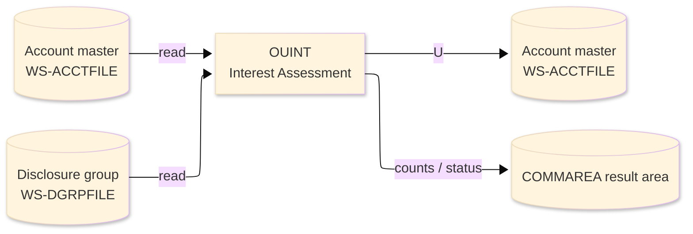
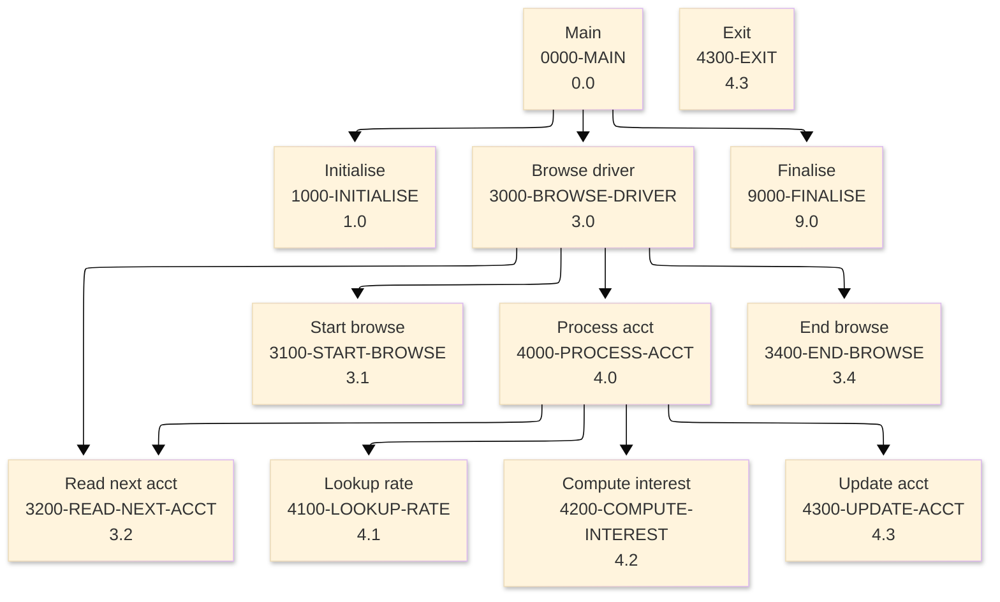

# Batch Program Design Document — OUINT_InterestAssessment

**Common header**

| System name | Program ID | Created/updated on／Author | Changed lines |
|---|---|---|---|
| ORION-CCMS (ORION Credit Card Management System) | OUINT | Created 2026-09-28／modernizeX | — |

## 1. Program overview

### 1.1 I/O diagram

### 1.2 Function overview

assess one month of interest on revolving balances on demand. Browses the account master (ACCTFILE) with STARTBR / READNEXT / ENDBR; for every active account carrying a positive balance it looks up the annual interest rate for the account's disclosure group (DGRPFILE, type 'IN'), computes monthly interest = balance * rate / 1200, READs the account for UPDATE, adds the interest to the balance and the cycle debit bucket and REWRITEs the account. Ports the interest batches OBINTC (VSAM) and ODINTC (DB2).

### 1.3 I/O overview

| File / table / area | DD / access | Copybook | I/O | Type | Organisation |
|---|---|---|---|---|---|
| Account master | EXEC CICS FILE(WS-ACCTFILE) | RACCT | I-O | Main | VSAM KSDS |
| Disclosure group | EXEC CICS FILE(WS-DGRPFILE) | RDGRP | I | Sub | VSAM KSDS |
| Request / result area | COMMAREA (linkage) | KCOMM | I-O | Main | linkage |

### 1.4 Called subprograms / modules

| Program ID | Call type | Function | Interface |
|---|---|---|---|
| — | — | This program calls no sub-program | — |

### 1.5 DB tables & SQL

No SQL used — pure VSAM/CICS file I/O.

### 1.6 Special notes

- Invocation: EXEC CICS LINK PROGRAM('OUINT') COMMAREA(ORION-COMMAREA) END-EXEC. REQUEST : KO-PARM-ACCT optional single account (0 = all).
- Linked from: OCOPS.
- Result / status: KO-READ examined KO-SELECT eligible KO-POSTED charged KO-UPDATE accts rewritten KO-SKIP skipped KO-C1 rate defaulted KO-AMT-1 total interest KO-AMT-2 balance before KO-AMT-3 balance after.

## 2. Processing details（処理内容）

### 1. Main（0000-MAIN）　[0.0]　(L74)
1) Main: drive the overall processing — run initialisation, the main work and termination in turn.
2) In turn, carry out: initialise, browse driver, finalise.

### 2. Initialise（1000-INITIALISE）　[1.0]　(L83)
1) Initialise: prepare the work area, clear the result counters and set the initial status.
2) When ko parm acct > ZERO (L100), take the branch for that case.

### 3. Browse driver（3000-BROWSE-DRIVER）　[3.0]　(L109)
1) Browse driver: perform the browse driver step of the processing.
2) When br started (L111), take the branch for that case.
3) In turn, carry out: start browse, read next acct, process acct, end browse.

### 4. Start browse（3100-START-BROWSE）　[3.1]　(L120)
1) Start browse: position a browse on Account master.
2) When filter active (L121), take the branch for that case.
3) Depending on ws resp cd (L132): response = normal, response = not-found, OTHER.

### 5. Read next acct（3200-READ-NEXT-ACCT）　[3.2]　(L146)
1) Read next acct: read the next record from Account master.
2) Depending on ws resp cd (L153): response = normal, response (ENDFILE), OTHER.

### 6. Process acct（4000-PROCESS-ACCT）　[4.0]　(L167)
1) Process acct: perform the process acct step of the processing.
2) When filter active AND ac id NOT = ws filter acct (L168), take the branch for that case.
3) In turn, carry out: lookup rate, compute interest, update acct, read next acct.

### 7. Lookup rate（4100-LOOKUP-RATE）　[4.1]　(L191)
1) Lookup rate: read the Disclosure group record.
2) Depending on ws resp cd (L202): response = normal, OTHER.
3) When rate not found (L209), take the branch for that case.

### 8. Compute interest（4200-COMPUTE-INTEREST）　[4.2]　(L216)
1) Compute interest: perform the compute interest step of the processing.
2) When ws int amt < ZERO (L219), take the branch for that case.

### 9. Update acct（4300-UPDATE-ACCT）　[4.3]　(L226)
1) Update acct: read the Account master record; save the updated Account master record.
2) When ws int amt <= ZERO (L227), take the branch for that case.
3) When ws resp cd NOT = response = normal (L239), take the branch for that case.
4) When ws resp cd = response = normal (L251), take the branch for that case.

### 10. Exit（4300-EXIT）　[4.3]　(L260)
1) Exit: perform the exit step of the processing.

### 11. End browse（3400-END-BROWSE）　[3.4]　(L265)
1) End browse: end the browse on Account master.
2) When br started (L266), take the branch for that case.

### 12. Finalise（9000-FINALISE）　[9.0]　(L275)
1) Finalise: set the final status and return the accumulated counts to the caller.
2) When ko error (L276), take the branch for that case.

## 3. Structure diagram（構造図）

## 4. Output specifications (file / table)

### 4.1 Account master（RACCT） — 300 bytes (output record)

| Level | Item name | Field name | Type | Bytes | Position | Source | How the value is set |
|---|---|---|---|---|---|---|---|
| 01 | Rec | ACCT-REC | group | 300 | 1 | — | group item |
| 05 | Id | AC-ID | 9(11) | 11 | 1 | Master/COMMAREA | record key |
| 05 | Active Status | AC-ACTIVE-STATUS | X(01) | 1 | 12 | Master/COMMAREA | set from the transaction / account being processed |
| 05 | Curr Bal | AC-CURR-BAL | S9(10)V99 | 12 | 13 | Master/COMMAREA | set from the transaction / account being processed |
| 05 | Credit Limit | AC-CREDIT-LIMIT | S9(10)V99 | 12 | 25 | Master/COMMAREA | set from the transaction / account being processed |
| 05 | Cash Limit | AC-CASH-LIMIT | S9(10)V99 | 12 | 37 | Master/COMMAREA | set from the transaction / account being processed |
| 05 | Open Date | AC-OPEN-DATE | X(10) | 10 | 49 | Master/COMMAREA | set from the transaction / account being processed |
| 05 | Expiry Date | AC-EXPIRY-DATE | X(10) | 10 | 59 | Master/COMMAREA | set from the transaction / account being processed |
| 05 | Reissue Date | AC-REISSUE-DATE | X(10) | 10 | 69 | Master/COMMAREA | set from the transaction / account being processed |
| 05 | Cyc Credit | AC-CYC-CREDIT | S9(10)V99 | 12 | 79 | Master/COMMAREA | set from the transaction / account being processed |
| 05 | Cyc Debit | AC-CYC-DEBIT | S9(10)V99 | 12 | 91 | Master/COMMAREA | set from the transaction / account being processed |
| 05 | Addr Zip | AC-ADDR-ZIP | X(10) | 10 | 103 | Master/COMMAREA | set from the transaction / account being processed |
| 05 | Group Id | AC-GROUP-ID | X(10) | 10 | 113 | Master/COMMAREA | set from the transaction / account being processed |
| 05 | Filler | FILLER | X(178) | 178 | 123 | Master/COMMAREA | set from the transaction / account being processed |

## 5. In/out parameters & check specifications

### 5.1 Parameters

| Category | Name | Type / length | Meaning | Value / source |
|---|---|---|---|---|
| Linkage (COMMAREA) | ORION-COMMAREA | group (KCOMM) | shared communication area passed on every EXEC CICS LINK | supplied by the calling screen |
| Linkage (KOPS) | KO-FN-POST | — | fn post | request/result field in the work area |
| Linkage (KOPS) | KO-FN-PAY | — | fn pay | request/result field in the work area |
| Linkage (KOPS) | KO-FN-INT | — | fn int | request/result field in the work area |
| Linkage (KOPS) | KO-FN-FEE | — | fn fee | request/result field in the work area |
| Linkage (KOPS) | KO-FN-CHGF | — | fn chgf | request/result field in the work area |
| Linkage (KOPS) | KO-FN-CLOS | — | fn clos | request/result field in the work area |
| Linkage (KOPS) | KO-FN-RNEW | — | fn rnew | request/result field in the work area |
| Linkage (KOPS) | KO-FN-CYCL | — | fn cycl | request/result field in the work area |
| Linkage (KOPS) | KO-PARM-ACCT | 9(11) | parm acct | request/result field in the work area |
| Linkage (KOPS) | KO-PARM-CARD | X(16) | parm card | request/result field in the work area |
| Linkage (KOPS) | KO-PARM-AMT | S9(10)V99 | parm amt | request/result field in the work area |
| Linkage (KOPS) | KO-PARM-DATE | X(10) | parm date | request/result field in the work area |
| Linkage (KOPS) | KO-OK | — | ok | request/result field in the work area |
| Linkage (KOPS) | KO-WARN | — | warn | request/result field in the work area |
| Return | COMMAREA status | flag / text | outcome of the call | set by this program before it returns |

### 5.2 Checks

| No. | Check type | Target | Trigger condition | Action / message |
|---|---|---|---|---|
| 1 | Response | CICS file response | a file response other than normal or not-found | the error is recorded in the COMMAREA status and the browse/step ends |

## 6. Modification summary

| No. | Change date | Title | Summary of the change |
|---|---|---|---|
| 1 | 2026.09.28 | Initial AS-IS reverse design | Document generated by modernizeX from the extracted AST and datastore; no functional change. |

