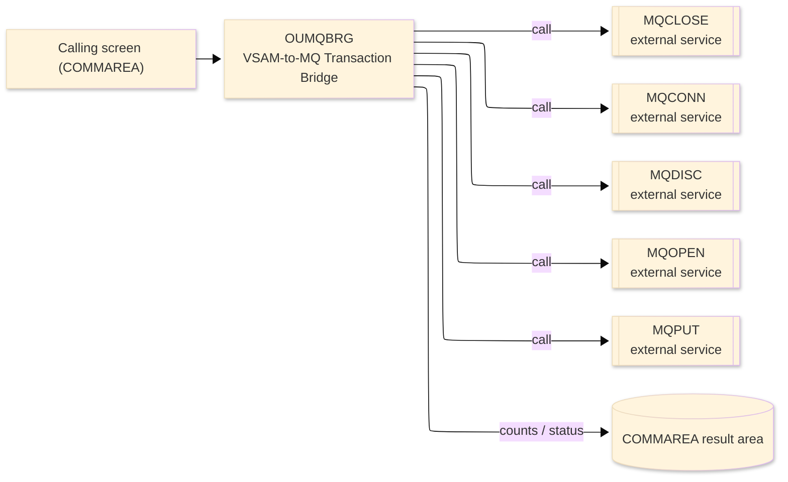
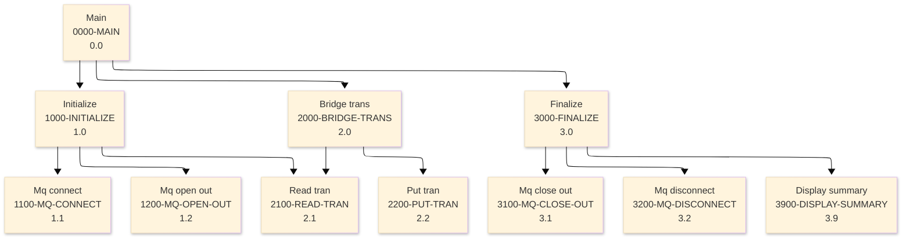

# Batch Program Design Document — OUMQBRG_MQTransactionBridge

**Common header**

| System name | Program ID | Created/updated on／Author | Changed lines |
|---|---|---|---|
| ORION-CCMS (ORION Credit Card Management System) | OUMQBRG | Created 2026-09-28／modernizeX | — |

## 1. Program overview

### 1.1 I/O diagram

### 1.2 Function overview

read TRANFILE (VSAM KSDS) sequentially and MQPUT each transaction to the outbound queue for a downstream consumer, with counts. RUN : batch, driven by jcl/RUNMQBRG.jcl (PGM=OUMQBRG). DESIGN OUMQBRG is the outbound half of the ORION MQ story: it drains the posted-transaction store (TRANFILE) and republishes every record as an MQ message on ORION.TRAN.OUTBOUND.QUEUE so that downstream systems (fraud, analytics, general ledger) receive a real-time transaction feed. Flow: 1. OPEN the KSDS for sequential (key-order) input. 2. MQCONN to the queue manager and MQOPEN the outbound queue for output. 3. For each transaction, wrap the record image in a small routing header and MQPUT it, counting puts and errors. 4. MQCLOSE the queue, MQDISC from the queue manager and CLOSE the file; print the run counts. Every MQI verb is a native

### 1.3 I/O overview

| File / table / area | DD / access | Copybook | I/O | Type | Organisation |
|---|---|---|---|---|---|
| Request / result area | COMMAREA (linkage) | KCOMM | I-O | Main | linkage |
| Request / result area | COMMAREA (linkage) | (sub linkage copybook) | I-O | Main | linkage |

### 1.4 Called subprograms / modules

| Program ID | Call type | Function | Interface |
|---|---|---|---|
| MQCLOSE | CALL (external) | MQ close queue | no source in reg |
| MQCONN | CALL (external) | MQ connect | no source in reg |
| MQDISC | CALL (external) | MQ disconnect | no source in reg |
| MQOPEN | CALL (external) | MQ open queue | no source in reg |
| MQPUT | CALL (external) | MQ put message | no source in reg |

### 1.5 DB tables & SQL

No SQL used — pure VSAM/CICS file I/O.

### 1.6 Special notes

- Invocation: )
- Uses IBM MQ (MQI CALL interface); the queue manager is an external dependency.

## 2. Processing details（処理内容）

### 1. Main（0000-MAIN）　[0.0]　(L115)
1) Main: drive the overall processing — run initialisation, the main work and termination in turn.
2) In turn, carry out: initialize, bridge trans, finalize.

### 2. Initialize（1000-INITIALIZE）　[1.0]　(L125)
1) Initialize: prepare the work area, clear the result counters and set the initial status.
2) When ws tran fs = '00' (L129), take the branch for that case.
3) When mq is up (L136), take the branch for that case.
4) When tran open (L139), take the branch for that case.
5) In turn, carry out: mq connect, mq open out, read tran.

### 3. Mq connect（1100-MQ-CONNECT）　[1.1]　(L145)
1) Mq connect: perform the mq connect step of the processing.
2) When mq cc ok (L149), take the branch for that case.

### 4. Mq open out（1200-MQ-OPEN-OUT）　[1.2]　(L160)
1) Mq open out: perform the mq open out step of the processing.
2) When mq cc ok (L168), take the branch for that case.

### 5. Bridge trans（2000-BRIDGE-TRANS）　[2.0]　(L180)
1) Bridge trans: perform the bridge trans step of the processing.
2) When mq is up AND mq q open (L182), take the branch for that case.
3) In turn, carry out: put tran, read tran.

### 6. Read tran（2100-READ-TRAN）　[2.1]　(L191)
1) Read tran: perform the read tran step of the processing.
2) When ws tran fs NOT = '00' AND ws tran fs NOT = '10' (L196), take the branch for that case.

### 7. Put tran（2200-PUT-TRAN）　[2.2]　(L203)
1) Put tran: perform the put tran step of the processing.
2) When mq cc ok (L217), take the branch for that case.

### 8. Finalize（3000-FINALIZE）　[3.0]　(L227)
1) Finalize: set the final status and return the accumulated counts to the caller.
2) When mq q open (L228), take the branch for that case.
3) When mq connected (L231), take the branch for that case.
4) When tran open (L234), take the branch for that case.
5) In turn, carry out: mq close out, mq disconnect, display summary.

### 9. Mq close out（3100-MQ-CLOSE-OUT）　[3.1]　(L244)
1) Mq close out: perform the mq close out step of the processing.
2) When NOT mq cc ok (L250), take the branch for that case.

### 10. Mq disconnect（3200-MQ-DISCONNECT）　[3.2]　(L256)
1) Mq disconnect: perform the mq disconnect step of the processing.
2) When NOT mq cc ok (L260), take the branch for that case.

### 11. Display summary（3900-DISPLAY-SUMMARY）　[3.9]　(L266)
1) Display summary: perform the display summary step of the processing.

## 3. Structure diagram（構造図）

## 4. Output specifications (file / table)

### 4.1 COMMAREA result / work area（KMQ） — 16 bytes (result / work area returned in the COMMAREA)

| Level | Item name | Field name | Type | Bytes | Position | Source | How the value is set |
|---|---|---|---|---|---|---|---|
| 01 | Handles | MQ-HANDLES | group | 16 | 1 | — | group item |
| 05 | Hconn | MQ-HCONN | S9(09) | 4 | 1 | Master/COMMAREA | record key |
| 05 | Hobj Req | MQ-HOBJ-REQ | S9(09) | 4 | 5 | Master/COMMAREA | set from the transaction / account being processed |
| 05 | Hobj Rpy | MQ-HOBJ-RPY | S9(09) | 4 | 9 | Master/COMMAREA | set from the transaction / account being processed |
| 05 | Hobj Out | MQ-HOBJ-OUT | S9(09) | 4 | 13 | Master/COMMAREA | set from the transaction / account being processed |

## 5. In/out parameters & check specifications

### 5.1 Parameters

| Category | Name | Type / length | Meaning | Value / source |
|---|---|---|---|---|
| Linkage (COMMAREA) | ORION-COMMAREA | group (KCOMM) | shared communication area passed on every EXEC CICS LINK | supplied by the calling screen |
| Linkage (KMQ) | MQ-HCONN | S9(09) | hconn | request/result field in the work area |
| Linkage (KMQ) | MQ-HOBJ-REQ | S9(09) | hobj req | request/result field in the work area |
| Linkage (KMQ) | MQ-HOBJ-RPY | S9(09) | hobj rpy | request/result field in the work area |
| Linkage (KMQ) | MQ-HOBJ-OUT | S9(09) | hobj out | request/result field in the work area |
| Linkage (KMQ) | MQ-OPEN-OPTIONS | S9(09) | open options | request/result field in the work area |
| Linkage (KMQ) | MQ-CLOSE-OPTIONS | S9(09) | close options | request/result field in the work area |
| Linkage (KMQ) | MQ-BUFFER-LEN | S9(09) | buffer len | request/result field in the work area |
| Linkage (KMQ) | MQ-DATA-LEN | S9(09) | data len | request/result field in the work area |
| Linkage (KMQ) | MQ-CC-OK | — | cc ok | request/result field in the work area |
| Linkage (KMQ) | MQ-CC-WARNING | — | cc warning | request/result field in the work area |
| Linkage (KMQ) | MQ-CC-FAILED | — | cc failed | request/result field in the work area |
| Linkage (KMQ) | MQ-RC-NONE | — | rc none | request/result field in the work area |
| Linkage (KMQ) | MQ-RC-NO-MSG | — | rc no msg | request/result field in the work area |
| Linkage (KMQ) | MQ-OD-STRUC-ID | X(04) | od struc id | request/result field in the work area |
| Return | COMMAREA status | flag / text | outcome of the call | set by this program before it returns |

### 5.2 Checks

| No. | Check type | Target | Trigger condition | Action / message |
|---|---|---|---|---|
| 1 | Response | MQ call | a non-zero MQ completion/reason code | the failure is reported in the COMMAREA status and the call ends |

## 6. Modification summary

| No. | Change date | Title | Summary of the change |
|---|---|---|---|
| 1 | 2026.09.28 | Initial AS-IS reverse design | Document generated by modernizeX from the extracted AST and datastore; no functional change. |

