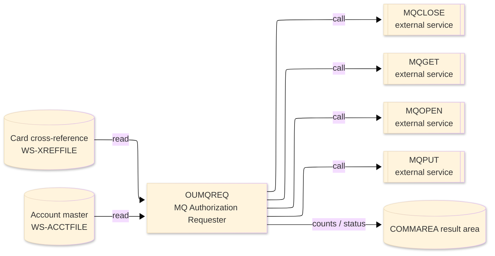
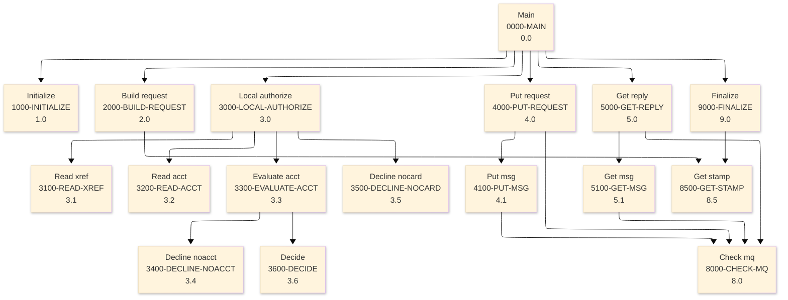

# Batch Program Design Document — OUMQREQ_MQAuthRequester

**Common header**

| System name | Program ID | Created/updated on／Author | Changed lines |
|---|---|---|---|
| ORION-CCMS (ORION Credit Card Management System) | OUMQREQ | Created 2026-09-28／modernizeX | — |

## 1. Program overview

### 1.1 I/O diagram

### 1.2 Function overview

build an auth request, MQPUT to the request queue MQGET the reply; also authorize the card locally via XREF -> ACCT (no live QMGR needed).

### 1.3 I/O overview

| File / table / area | DD / access | Copybook | I/O | Type | Organisation |
|---|---|---|---|---|---|
| Card cross-reference | EXEC CICS FILE(WS-XREFFILE) | RXREF | I | Main | VSAM KSDS |
| Account master | EXEC CICS FILE(WS-ACCTFILE) | RACCT | I | Sub | VSAM KSDS |
| Request / result area | COMMAREA (linkage) | KCOMM | I-O | Main | linkage |

### 1.4 Called subprograms / modules

| Program ID | Call type | Function | Interface |
|---|---|---|---|
| MQCLOSE | CALL (external) | MQ close queue | no source in reg |
| MQGET | CALL (external) | MQ get message | no source in reg |
| MQOPEN | CALL (external) | MQ open queue | no source in reg |
| MQPUT | CALL (external) | MQ put message | no source in reg |

### 1.5 DB tables & SQL

No SQL used — pure VSAM/CICS file I/O.

### 1.6 Special notes

- Invocation: )
- Linked from: OCAUTHQ.
- Uses IBM MQ (MQI CALL interface); the queue manager is an external dependency.

## 2. Processing details（処理内容）

### 1. Main（0000-MAIN）　[0.0]　(L103)
1) Main: drive the overall processing — run initialisation, the main work and termination in turn.
2) In turn, carry out: initialize, build request, local authorize, put request, get reply, finalize.

### 2. Initialize（1000-INITIALIZE）　[1.0]　(L115)
1) Initialize: prepare the work area, clear the result counters and set the initial status.

### 3. Build request（2000-BUILD-REQUEST）　[2.0]　(L126)
1) Build request: perform the build request step of the processing.
2) In turn, carry out: get stamp.

### 4. Local authorize（3000-LOCAL-AUTHORIZE）　[3.0]　(L142)
1) Local authorize: perform the local authorize step of the processing.
2) Depending on TRUE (L146): io error, rec not found, OTHER.
3) In turn, carry out: read xref, decline nocard, read acct, evaluate acct.

### 5. Read xref（3100-READ-XREF）　[3.1]　(L162)
1) Read xref: read the Card cross-reference record.
2) Depending on ws resp cd (L170): response = normal, response = not-found, OTHER.

### 6. Read acct（3200-READ-ACCT）　[3.2]　(L183)
1) Read acct: read the Account master record.
2) Depending on ws resp cd (L191): response = normal, response = not-found, OTHER.

### 7. Evaluate acct（3300-EVALUATE-ACCT）　[3.3]　(L204)
1) Evaluate acct: perform the evaluate acct step of the processing.
2) Depending on TRUE (L205): io error, rec not found, OTHER.
3) In turn, carry out: decline noacct, decide.

### 8. Decline noacct（3400-DECLINE-NOACCT）　[3.4]　(L217)
1) Decline noacct: perform the decline noacct step of the processing.

### 9. Decline nocard（3500-DECLINE-NOCARD）　[3.5]　(L224)
1) Decline nocard: perform the decline nocard step of the processing.

### 10. Decide（3600-DECIDE）　[3.6]　(L231)
1) Decide: perform the decide step of the processing.
2) Depending on TRUE (L234): ac active status NOT = 'Y', aq amount > ws amt, OTHER.

### 11. Put request（4000-PUT-REQUEST）　[4.0]　(L252)
1) Put request: perform the put request step of the processing.
2) When mq is up (L261), take the branch for that case.
3) In turn, carry out: check mq, put msg.

### 12. Put msg（4100-PUT-MSG）　[4.1]　(L267)
1) Put msg: perform the put msg step of the processing.
2) In turn, carry out: check mq, check mq.

### 13. Get reply（5000-GET-REPLY）　[5.0]　(L289)
1) Get reply: perform the get reply step of the processing.
2) When mq is up (L298), take the branch for that case.
3) In turn, carry out: check mq, get msg.

### 14. Get msg（5100-GET-MSG）　[5.1]　(L304)
1) Get msg: perform the get msg step of the processing.
2) When mq cc ok (L314), take the branch for that case.
3) In turn, carry out: check mq, check mq.

### 15. Check mq（8000-CHECK-MQ）　[8.0]　(L334)
1) Check mq: perform the check mq step of the processing.
2) When mq cc ok (L335), take the branch for that case.

### 16. Get stamp（8500-GET-STAMP）　[8.5]　(L345)
1) Get stamp: perform the get stamp step of the processing.

### 17. Finalize（9000-FINALIZE）　[9.0]　(L362)
1) Finalize: set the final status and return the accumulated counts to the caller.
2) When as errored (L365), take the branch for that case.
3) In turn, carry out: get stamp.

## 3. Structure diagram（構造図）

## 4. Output specifications (file / table)

### 4.1 COMMAREA result / work area（KMQ） — 16 bytes (result / work area returned in the COMMAREA)

| Level | Item name | Field name | Type | Bytes | Position | Source | How the value is set |
|---|---|---|---|---|---|---|---|
| 01 | Handles | MQ-HANDLES | group | 16 | 1 | — | group item |
| 05 | Hconn | MQ-HCONN | S9(09) | 4 | 1 | Master/COMMAREA | record key |
| 05 | Hobj Req | MQ-HOBJ-REQ | S9(09) | 4 | 5 | Master/COMMAREA | set from the transaction / account being processed |
| 05 | Hobj Rpy | MQ-HOBJ-RPY | S9(09) | 4 | 9 | Master/COMMAREA | set from the transaction / account being processed |
| 05 | Hobj Out | MQ-HOBJ-OUT | S9(09) | 4 | 13 | Master/COMMAREA | set from the transaction / account being processed |

## 5. In/out parameters & check specifications

### 5.1 Parameters

| Category | Name | Type / length | Meaning | Value / source |
|---|---|---|---|---|
| Linkage (COMMAREA) | ORION-COMMAREA | group (KCOMM) | shared communication area passed on every EXEC CICS LINK | supplied by the calling screen |
| Linkage (KMQ) | MQ-HCONN | S9(09) | hconn | request/result field in the work area |
| Linkage (KMQ) | MQ-HOBJ-REQ | S9(09) | hobj req | request/result field in the work area |
| Linkage (KMQ) | MQ-HOBJ-RPY | S9(09) | hobj rpy | request/result field in the work area |
| Linkage (KMQ) | MQ-HOBJ-OUT | S9(09) | hobj out | request/result field in the work area |
| Linkage (KMQ) | MQ-OPEN-OPTIONS | S9(09) | open options | request/result field in the work area |
| Linkage (KMQ) | MQ-CLOSE-OPTIONS | S9(09) | close options | request/result field in the work area |
| Linkage (KMQ) | MQ-BUFFER-LEN | S9(09) | buffer len | request/result field in the work area |
| Linkage (KMQ) | MQ-DATA-LEN | S9(09) | data len | request/result field in the work area |
| Linkage (KMQ) | MQ-CC-OK | — | cc ok | request/result field in the work area |
| Linkage (KMQ) | MQ-CC-WARNING | — | cc warning | request/result field in the work area |
| Linkage (KMQ) | MQ-CC-FAILED | — | cc failed | request/result field in the work area |
| Linkage (KMQ) | MQ-RC-NONE | — | rc none | request/result field in the work area |
| Linkage (KMQ) | MQ-RC-NO-MSG | — | rc no msg | request/result field in the work area |
| Linkage (KMQ) | MQ-OD-STRUC-ID | X(04) | od struc id | request/result field in the work area |
| Return | COMMAREA status | flag / text | outcome of the call | set by this program before it returns |

### 5.2 Checks

| No. | Check type | Target | Trigger condition | Action / message |
|---|---|---|---|---|
| 1 | Response | MQ call | a non-zero MQ completion/reason code | the failure is reported in the COMMAREA status and the call ends |

## 6. Modification summary

| No. | Change date | Title | Summary of the change |
|---|---|---|---|
| 1 | 2026.09.28 | Initial AS-IS reverse design | Document generated by modernizeX from the extracted AST and datastore; no functional change. |

