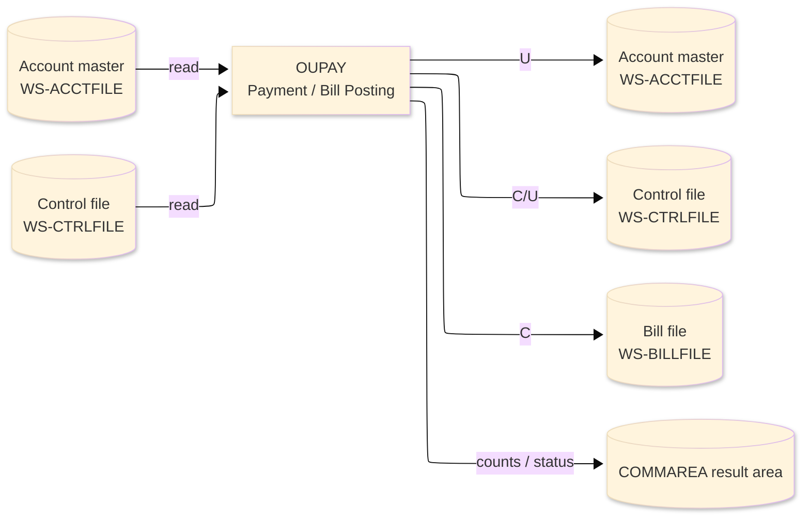
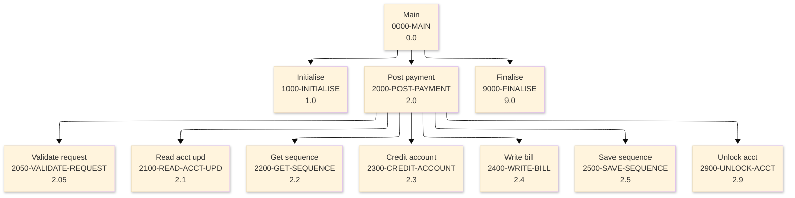

# Batch Program Design Document — OUPAY_PaymentPosting

**Common header**

| System name | Program ID | Created/updated on／Author | Changed lines |
|---|---|---|---|
| ORION-CCMS (ORION Credit Card Management System) | OUPAY | Created 2026-09-28／modernizeX | — |

## 1. Program overview

### 1.1 I/O diagram

### 1.2 Function overview

post one bill payment against an account on demand. Validates the amount and the account (must exist and be active), READs the account for UPDATE, reduces the current balance and raises the cycle credit bucket, REWRITEs the account, draws a bill-id from the control file (CTRLFILE key 'BILLID') and WRITEs a posted bill record (BILLFILE) carrying a confirmation number. Ports the payment posters OBPAY (VSAM) and ODBILL (DB2).

### 1.3 I/O overview

| File / table / area | DD / access | Copybook | I/O | Type | Organisation |
|---|---|---|---|---|---|
| Account master | EXEC CICS FILE(WS-ACCTFILE) | RACCT | I-O | Main | VSAM KSDS |
| Control file | EXEC CICS FILE(WS-CTRLFILE) | RCTRL | I-O | Sub | VSAM KSDS |
| Bill file | EXEC CICS FILE(WS-BILLFILE) | RBILL | O | Sub | VSAM KSDS |
| Request / result area | COMMAREA (linkage) | KCOMM | I-O | Main | linkage |

### 1.4 Called subprograms / modules

| Program ID | Call type | Function | Interface |
|---|---|---|---|
| — | — | This program calls no sub-program | — |

### 1.5 DB tables & SQL

No SQL used — pure VSAM/CICS file I/O.

### 1.6 Special notes

- Invocation: EXEC CICS LINK PROGRAM('OUPAY') COMMAREA(ORION-COMMAREA) END-EXEC. REQUEST : KO-PARM-ACCT account id ; KO-PARM-AMT amount ; KO-PARM-DATE optional pay date (else run date).
- Linked from: OCOPS.
- Result / status: KO-POSTED 1 when posted KO-REJECT 1 when refused KO-C1 assigned bill id KO-AMT-1 amount posted KO-AMT-2 new balance.

## 2. Processing details（処理内容）

### 1. Main（0000-MAIN）　[0.0]　(L85)
1) Main: drive the overall processing — run initialisation, the main work and termination in turn.
2) In turn, carry out: initialise, post payment, finalise.

### 2. Initialise（1000-INITIALISE）　[1.0]　(L94)
1) Initialise: prepare the work area, clear the result counters and set the initial status.
2) When ko parm date = SPACES OR ko parm date = low values (L117), take the branch for that case.

### 3. Post payment（2000-POST-PAYMENT）　[2.0]　(L125)
1) Post payment: perform the post payment step of the processing.
2) When not rejected (L127), take the branch for that case.
3) When not rejected (L130), take the branch for that case.
4) When not rejected (L133), take the branch for that case.
5) When not rejected (L136), take the branch for that case.
6) In turn, carry out: validate request, read acct upd, get sequence, credit account, write bill, save sequence, unlock acct.

### 4. Validate request（2050-VALIDATE-REQUEST）　[2.05]　(L148)
1) Validate request: perform the validate request step of the processing.
2) When ko parm amt <= ZERO (L149), take the branch for that case.
3) When not rejected AND ko parm acct = ZERO (L154), take the branch for that case.

### 5. Read acct upd（2100-READ-ACCT-UPD）　[2.1]　(L163)
1) Read acct upd: read the Account master record.
2) Depending on ws resp cd (L172): response = normal, response = not-found, OTHER.

### 6. Get sequence（2200-GET-SEQUENCE）　[2.2]　(L194)
1) Get sequence: read the Control file record.
2) Depending on ws resp cd (L203): response = normal, response = not-found, OTHER.
3) When not rejected (L216), take the branch for that case.

### 7. Credit account（2300-CREDIT-ACCOUNT）　[2.3]　(L222)
1) Credit account: save the updated Account master record.
2) When ws resp cd = response = normal (L231), take the branch for that case.

### 8. Write bill（2400-WRITE-BILL）　[2.4]　(L241)
1) Write bill: add a record to the Bill file.
2) Depending on ws resp cd (L256): response = normal, OTHER.

### 9. Save sequence（2500-SAVE-SEQUENCE）　[2.5]　(L271)
1) Save sequence: save the updated Control file record; add a record to the Control file.
2) When ctrl available (L272), take the branch for that case.
3) When ws resp cd NOT = response = normal (L290), take the branch for that case.

### 10. Unlock acct（2900-UNLOCK-ACCT）　[2.9]　(L298)
1) Unlock acct: release the record read for update so it is not held.

### 11. Finalise（9000-FINALISE）　[9.0]　(L307)
1) Finalise: set the final status and return the accumulated counts to the caller.
2) When ko error (L308), take the branch for that case.

## 3. Structure diagram（構造図）

## 4. Output specifications (file / table)

### 4.1 Account master（RACCT） — 300 bytes (output record)

| Level | Item name | Field name | Type | Bytes | Position | Source | How the value is set |
|---|---|---|---|---|---|---|---|
| 01 | Rec | ACCT-REC | group | 300 | 1 | — | group item |
| 05 | Id | AC-ID | 9(11) | 11 | 1 | Master/COMMAREA | record key |
| 05 | Active Status | AC-ACTIVE-STATUS | X(01) | 1 | 12 | Master/COMMAREA | set from the transaction / account being processed |
| 05 | Curr Bal | AC-CURR-BAL | S9(10)V99 | 12 | 13 | Master/COMMAREA | set from the transaction / account being processed |
| 05 | Credit Limit | AC-CREDIT-LIMIT | S9(10)V99 | 12 | 25 | Master/COMMAREA | set from the transaction / account being processed |
| 05 | Cash Limit | AC-CASH-LIMIT | S9(10)V99 | 12 | 37 | Master/COMMAREA | set from the transaction / account being processed |
| 05 | Open Date | AC-OPEN-DATE | X(10) | 10 | 49 | Master/COMMAREA | set from the transaction / account being processed |
| 05 | Expiry Date | AC-EXPIRY-DATE | X(10) | 10 | 59 | Master/COMMAREA | set from the transaction / account being processed |
| 05 | Reissue Date | AC-REISSUE-DATE | X(10) | 10 | 69 | Master/COMMAREA | set from the transaction / account being processed |
| 05 | Cyc Credit | AC-CYC-CREDIT | S9(10)V99 | 12 | 79 | Master/COMMAREA | set from the transaction / account being processed |
| 05 | Cyc Debit | AC-CYC-DEBIT | S9(10)V99 | 12 | 91 | Master/COMMAREA | set from the transaction / account being processed |
| 05 | Addr Zip | AC-ADDR-ZIP | X(10) | 10 | 103 | Master/COMMAREA | set from the transaction / account being processed |
| 05 | Group Id | AC-GROUP-ID | X(10) | 10 | 113 | Master/COMMAREA | set from the transaction / account being processed |
| 05 | Filler | FILLER | X(178) | 178 | 123 | Master/COMMAREA | set from the transaction / account being processed |

### 4.2 Control file（RCTRL） — 60 bytes (output record)

| Level | Item name | Field name | Type | Bytes | Position | Source | How the value is set |
|---|---|---|---|---|---|---|---|
| 01 | Rec | CTRL-REC | group | 60 | 1 | — | group item |
| 05 | Key | CT-KEY | X(08) | 8 | 1 | Master/COMMAREA | record key |
| 05 | Last Value | CT-LAST-VALUE | 9(11) | 11 | 9 | Master/COMMAREA | set from the transaction / account being processed |
| 05 | Desc | CT-DESC | X(30) | 30 | 20 | Master/COMMAREA | set from the transaction / account being processed |
| 05 | Filler | FILLER | X(11) | 11 | 50 | Master/COMMAREA | set from the transaction / account being processed |

### 4.3 Bill file（RBILL） — 81 bytes (output record)

| Level | Item name | Field name | Type | Bytes | Position | Source | How the value is set |
|---|---|---|---|---|---|---|---|
| 01 | Rec | BILL-REC | group | 81 | 1 | — | group item |
| 05 | Id | BL-ID | 9(11) | 11 | 1 | Master/COMMAREA | record key |
| 05 | Acct Id | BL-ACCT-ID | 9(11) | 11 | 12 | Master/COMMAREA | set from the transaction / account being processed |
| 05 | Amount | BL-AMOUNT | S9(10)V99 | 12 | 23 | Master/COMMAREA | set from the transaction / account being processed |
| 05 | Pay Date | BL-PAY-DATE | X(10) | 10 | 35 | Master/COMMAREA | set from the transaction / account being processed |
| 05 | Confirm Num | BL-CONFIRM-NUM | X(16) | 16 | 45 | Master/COMMAREA | set from the transaction / account being processed |
| 05 | Status | BL-STATUS | X(01) | 1 | 61 | Master/COMMAREA | set from the transaction / account being processed |
| 05 | Filler | FILLER | X(20) | 20 | 62 | Master/COMMAREA | set from the transaction / account being processed |

## 5. In/out parameters & check specifications

### 5.1 Parameters

| Category | Name | Type / length | Meaning | Value / source |
|---|---|---|---|---|
| Linkage (COMMAREA) | ORION-COMMAREA | group (KCOMM) | shared communication area passed on every EXEC CICS LINK | supplied by the calling screen |
| Linkage (KOPS) | KO-FN-POST | — | fn post | request/result field in the work area |
| Linkage (KOPS) | KO-FN-PAY | — | fn pay | request/result field in the work area |
| Linkage (KOPS) | KO-FN-INT | — | fn int | request/result field in the work area |
| Linkage (KOPS) | KO-FN-FEE | — | fn fee | request/result field in the work area |
| Linkage (KOPS) | KO-FN-CHGF | — | fn chgf | request/result field in the work area |
| Linkage (KOPS) | KO-FN-CLOS | — | fn clos | request/result field in the work area |
| Linkage (KOPS) | KO-FN-RNEW | — | fn rnew | request/result field in the work area |
| Linkage (KOPS) | KO-FN-CYCL | — | fn cycl | request/result field in the work area |
| Linkage (KOPS) | KO-PARM-ACCT | 9(11) | parm acct | request/result field in the work area |
| Linkage (KOPS) | KO-PARM-CARD | X(16) | parm card | request/result field in the work area |
| Linkage (KOPS) | KO-PARM-AMT | S9(10)V99 | parm amt | request/result field in the work area |
| Linkage (KOPS) | KO-PARM-DATE | X(10) | parm date | request/result field in the work area |
| Linkage (KOPS) | KO-OK | — | ok | request/result field in the work area |
| Linkage (KOPS) | KO-WARN | — | warn | request/result field in the work area |
| Return | COMMAREA status | flag / text | outcome of the call | set by this program before it returns |

### 5.2 Checks

| No. | Check type | Target | Trigger condition | Action / message |
|---|---|---|---|---|
| 1 | Response | CICS file response | a file response other than normal or not-found | the error is recorded in the COMMAREA status and the browse/step ends |

## 6. Modification summary

| No. | Change date | Title | Summary of the change |
|---|---|---|---|
| 1 | 2026.09.28 | Initial AS-IS reverse design | Document generated by modernizeX from the extracted AST and datastore; no functional change. |

