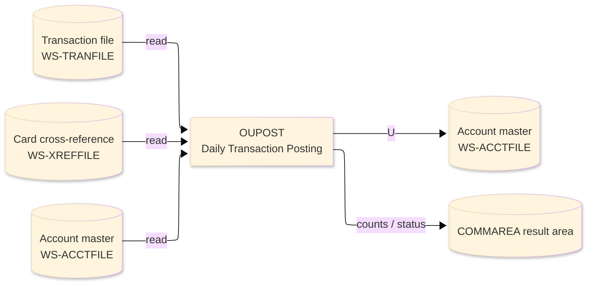
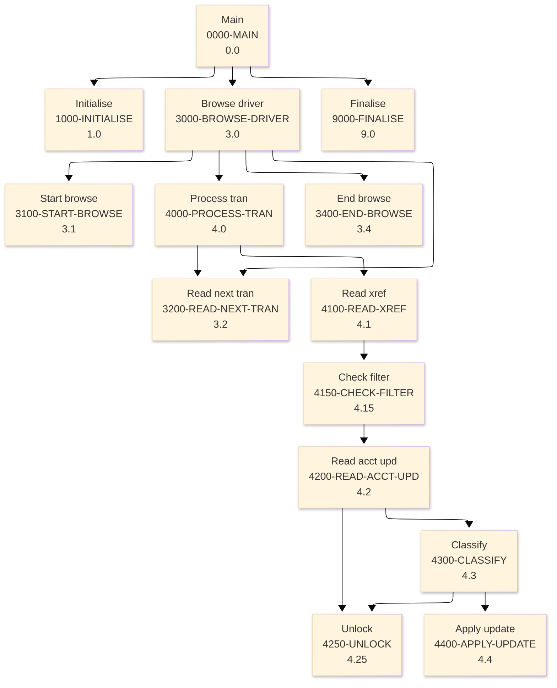

# Batch Program Design Document — OUPOST_TransactionPosting

**Common header**

| System name | Program ID | Created/updated on／Author | Changed lines |
|---|---|---|---|
| ORION-CCMS (ORION Credit Card Management System) | OUPOST | Created 2026-09-28／modernizeX | — |

## 1. Program overview

### 1.1 I/O diagram

### 1.2 Function overview

apply transactions to account balances on demand. Browses the transaction store (TRANFILE) with STARTBR / READNEXT / ENDBR. For each transaction it resolves the card to its owning account through the card cross-reference (XREFFILE), READs that account for UPDATE, classifies the transaction as a credit (type PY / CR) or a debit, enforces the credit limit on debits, applies the amount to the balance and the cycle credit / debit buckets and REWRITEs the account. Counts are returned in the KOPS commarea. Ports the batch posters OBTRANP (VSAM) and ODTRANP (DB2) into one online engine.

### 1.3 I/O overview

| File / table / area | DD / access | Copybook | I/O | Type | Organisation |
|---|---|---|---|---|---|
| Transaction file | EXEC CICS FILE(WS-TRANFILE) | RTRAN | I | Main | VSAM KSDS |
| Card cross-reference | EXEC CICS FILE(WS-XREFFILE) | RXREF | I | Sub | VSAM KSDS |
| Account master | EXEC CICS FILE(WS-ACCTFILE) | RACCT | I-O | Sub | VSAM KSDS |
| Request / result area | COMMAREA (linkage) | KCOMM | I-O | Main | linkage |

### 1.4 Called subprograms / modules

| Program ID | Call type | Function | Interface |
|---|---|---|---|
| — | — | This program calls no sub-program | — |

### 1.5 DB tables & SQL

No SQL used — pure VSAM/CICS file I/O.

### 1.6 Special notes

- Invocation: EXEC CICS LINK PROGRAM('OUPOST') COMMAREA(ORION-COMMAREA) END-EXEC.
- Linked from: OCOPS.
- Result / status: KO-READ trans read KO-SELECT selected KO-POSTED posted KO-UPDATE accts rewritten KO-REJECT rejected KO-C1 no-xref KO-C2 no-account KO-C3 over-limit KO-AMT-1 debit total KO-AMT-2 credit total KO-AMT-3 net (debit-credit).

## 2. Processing details（処理内容）

### 1. Main（0000-MAIN）　[0.0]　(L79)
1) Main: drive the overall processing — run initialisation, the main work and termination in turn.
2) In turn, carry out: initialise, browse driver, finalise.

### 2. Initialise（1000-INITIALISE）　[1.0]　(L88)
1) Initialise: prepare the work area, clear the result counters and set the initial status.
2) When ko parm acct > ZERO (L105), take the branch for that case.

### 3. Browse driver（3000-BROWSE-DRIVER）　[3.0]　(L115)
1) Browse driver: perform the browse driver step of the processing.
2) When br started (L117), take the branch for that case.
3) In turn, carry out: start browse, read next tran, process tran, end browse.

### 4. Start browse（3100-START-BROWSE）　[3.1]　(L126)
1) Start browse: position a browse on Transaction file.
2) Depending on ws resp cd (L134): response = normal, response = not-found, OTHER.

### 5. Read next tran（3200-READ-NEXT-TRAN）　[3.2]　(L149)
1) Read next tran: read the next record from Transaction file.
2) Depending on ws resp cd (L156): response = normal, response (ENDFILE), OTHER.

### 6. Process tran（4000-PROCESS-TRAN）　[4.0]　(L169)
1) Process tran: perform the process tran step of the processing.
2) When tr card num = SPACES OR tr card num = low values (L172), take the branch for that case.
3) In turn, carry out: read xref, read next tran.

### 7. Read xref（4100-READ-XREF）　[4.1]　(L182)
1) Read xref: read the Card cross-reference record.
2) Depending on ws resp cd (L190): response = normal, response = not-found, OTHER.
3) In turn, carry out: check filter.

### 8. Check filter（4150-CHECK-FILTER）　[4.15]　(L202)
1) Check filter: perform the check filter step of the processing.
2) When filter active AND xr acct id NOT = ws filter acct (L203), take the branch for that case.
3) In turn, carry out: read acct upd.

### 9. Read acct upd（4200-READ-ACCT-UPD）　[4.2]　(L212)
1) Read acct upd: read the Account master record.
2) Depending on ws resp cd (L221): response = normal, response = not-found, OTHER.
3) In turn, carry out: classify, unlock.

### 10. Unlock（4250-UNLOCK）　[4.25]　(L234)
1) Unlock: release the record read for update so it is not held.

### 11. Classify（4300-CLASSIFY）　[4.3]　(L244)
1) Classify: classify the current item and set the corresponding indicator.
2) Depending on tr type cd (L245): ws cr type 1, ws cr type 2, OTHER.
3) In turn, carry out: apply update, unlock, apply update.

### 12. Apply update（4400-APPLY-UPDATE）　[4.4]　(L264)
1) Apply update: save the updated Account master record.
2) When ws is credit (L265), take the branch for that case.
3) When ws resp cd = response = normal (L277), take the branch for that case.

### 13. End browse（3400-END-BROWSE）　[3.4]　(L291)
1) End browse: end the browse on Transaction file.
2) When br started (L292), take the branch for that case.

### 14. Finalise（9000-FINALISE）　[9.0]　(L301)
1) Finalise: set the final status and return the accumulated counts to the caller.
2) When ko error (L303), take the branch for that case.

## 3. Structure diagram（構造図）

## 4. Output specifications (file / table)

### 4.1 Account master（RACCT） — 300 bytes (output record)

| Level | Item name | Field name | Type | Bytes | Position | Source | How the value is set |
|---|---|---|---|---|---|---|---|
| 01 | Rec | ACCT-REC | group | 300 | 1 | — | group item |
| 05 | Id | AC-ID | 9(11) | 11 | 1 | Master/COMMAREA | record key |
| 05 | Active Status | AC-ACTIVE-STATUS | X(01) | 1 | 12 | Master/COMMAREA | set from the transaction / account being processed |
| 05 | Curr Bal | AC-CURR-BAL | S9(10)V99 | 12 | 13 | Master/COMMAREA | set from the transaction / account being processed |
| 05 | Credit Limit | AC-CREDIT-LIMIT | S9(10)V99 | 12 | 25 | Master/COMMAREA | set from the transaction / account being processed |
| 05 | Cash Limit | AC-CASH-LIMIT | S9(10)V99 | 12 | 37 | Master/COMMAREA | set from the transaction / account being processed |
| 05 | Open Date | AC-OPEN-DATE | X(10) | 10 | 49 | Master/COMMAREA | set from the transaction / account being processed |
| 05 | Expiry Date | AC-EXPIRY-DATE | X(10) | 10 | 59 | Master/COMMAREA | set from the transaction / account being processed |
| 05 | Reissue Date | AC-REISSUE-DATE | X(10) | 10 | 69 | Master/COMMAREA | set from the transaction / account being processed |
| 05 | Cyc Credit | AC-CYC-CREDIT | S9(10)V99 | 12 | 79 | Master/COMMAREA | set from the transaction / account being processed |
| 05 | Cyc Debit | AC-CYC-DEBIT | S9(10)V99 | 12 | 91 | Master/COMMAREA | set from the transaction / account being processed |
| 05 | Addr Zip | AC-ADDR-ZIP | X(10) | 10 | 103 | Master/COMMAREA | set from the transaction / account being processed |
| 05 | Group Id | AC-GROUP-ID | X(10) | 10 | 113 | Master/COMMAREA | set from the transaction / account being processed |
| 05 | Filler | FILLER | X(178) | 178 | 123 | Master/COMMAREA | set from the transaction / account being processed |

## 5. In/out parameters & check specifications

### 5.1 Parameters

| Category | Name | Type / length | Meaning | Value / source |
|---|---|---|---|---|
| Linkage (COMMAREA) | ORION-COMMAREA | group (KCOMM) | shared communication area passed on every EXEC CICS LINK | supplied by the calling screen |
| Linkage (KOPS) | KO-FN-POST | — | fn post | request/result field in the work area |
| Linkage (KOPS) | KO-FN-PAY | — | fn pay | request/result field in the work area |
| Linkage (KOPS) | KO-FN-INT | — | fn int | request/result field in the work area |
| Linkage (KOPS) | KO-FN-FEE | — | fn fee | request/result field in the work area |
| Linkage (KOPS) | KO-FN-CHGF | — | fn chgf | request/result field in the work area |
| Linkage (KOPS) | KO-FN-CLOS | — | fn clos | request/result field in the work area |
| Linkage (KOPS) | KO-FN-RNEW | — | fn rnew | request/result field in the work area |
| Linkage (KOPS) | KO-FN-CYCL | — | fn cycl | request/result field in the work area |
| Linkage (KOPS) | KO-PARM-ACCT | 9(11) | parm acct | request/result field in the work area |
| Linkage (KOPS) | KO-PARM-CARD | X(16) | parm card | request/result field in the work area |
| Linkage (KOPS) | KO-PARM-AMT | S9(10)V99 | parm amt | request/result field in the work area |
| Linkage (KOPS) | KO-PARM-DATE | X(10) | parm date | request/result field in the work area |
| Linkage (KOPS) | KO-OK | — | ok | request/result field in the work area |
| Linkage (KOPS) | KO-WARN | — | warn | request/result field in the work area |
| Return | COMMAREA status | flag / text | outcome of the call | set by this program before it returns |

### 5.2 Checks

| No. | Check type | Target | Trigger condition | Action / message |
|---|---|---|---|---|
| 1 | Response | CICS file response | a file response other than normal or not-found | the error is recorded in the COMMAREA status and the browse/step ends |

## 6. Modification summary

| No. | Change date | Title | Summary of the change |
|---|---|---|---|
| 1 | 2026.09.28 | Initial AS-IS reverse design | Document generated by modernizeX from the extracted AST and datastore; no functional change. |

