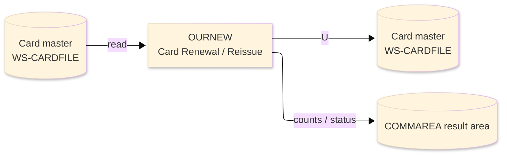
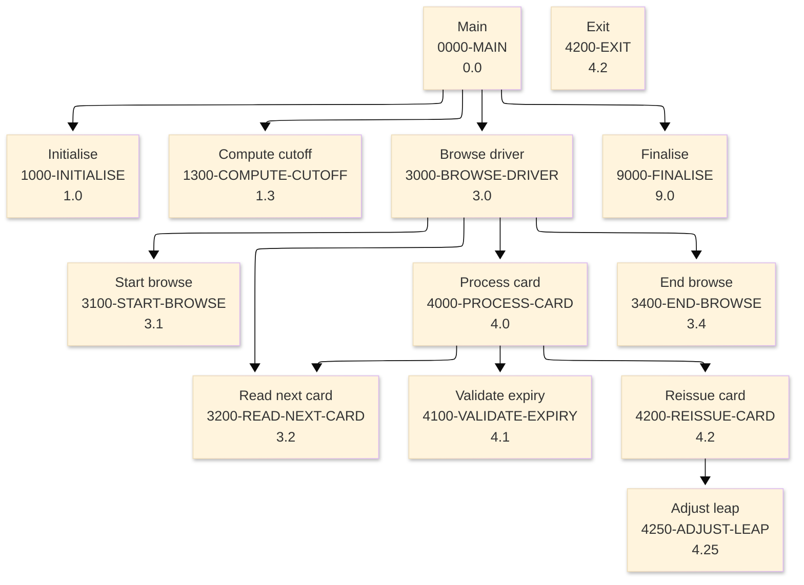

# Batch Program Design Document — OURNEW_CardRenewal

**Common header**

| System name | Program ID | Created/updated on／Author | Changed lines |
|---|---|---|---|
| ORION-CCMS (ORION Credit Card Management System) | OURNEW | Created 2026-09-28／modernizeX | — |

## 1. Program overview

### 1.1 I/O diagram

### 1.2 Function overview

reissue cards approaching expiry on demand. Browses the card master (CARDFILE); an active card whose expiry date is valid and falls on or before a lead-time cutoff (run date + 90 days) is reissued: the expiry year is extended by three years, a Feb-29 expiry landing on a non-leap year is clamped to Feb-28, the card is READ for UPDATE and REWRITTEN. Ports the batch renewer OBRENEW, keeping its leap-year normalisation intact.

### 1.3 I/O overview

| File / table / area | DD / access | Copybook | I/O | Type | Organisation |
|---|---|---|---|---|---|
| Card master | EXEC CICS FILE(WS-CARDFILE) | RCARD | I-O | Main | VSAM KSDS |
| Request / result area | COMMAREA (linkage) | KCOMM | I-O | Main | linkage |

### 1.4 Called subprograms / modules

| Program ID | Call type | Function | Interface |
|---|---|---|---|
| — | — | This program calls no sub-program | — |

### 1.5 DB tables & SQL

No SQL used — pure VSAM/CICS file I/O.

### 1.6 Special notes

- Invocation: EXEC CICS LINK PROGRAM('OURNEW') COMMAREA(ORION-COMMAREA) END-EXEC. REQUEST : KO-PARM-CARD optional single card (spaces = all).
- Linked from: OCOPS.
- Result / status: KO-READ cards read KO-POSTED reissued KO-UPDATE rewritten KO-C1 not due KO-C2 inactive KO-C3 bad expiry date.

## 2. Processing details（処理内容）

### 1. Main（0000-MAIN）　[0.0]　(L104)
1) Main: drive the overall processing — run initialisation, the main work and termination in turn.
2) In turn, carry out: initialise, compute cutoff, browse driver, finalise.

### 2. Initialise（1000-INITIALISE）　[1.0]　(L114)
1) Initialise: prepare the work area, clear the result counters and set the initial status.
2) When ko parm card NOT = SPACES AND ko parm card NOT = low values (L131), take the branch for that case.

### 3. Compute cutoff（1300-COMPUTE-CUTOFF）　[1.3]　(L141)
1) Compute cutoff: perform the compute cutoff step of the processing.

### 4. Browse driver（3000-BROWSE-DRIVER）　[3.0]　(L157)
1) Browse driver: perform the browse driver step of the processing.
2) When br started (L159), take the branch for that case.
3) In turn, carry out: start browse, read next card, process card, end browse.

### 5. Start browse（3100-START-BROWSE）　[3.1]　(L168)
1) Start browse: position a browse on Card master.
2) When filter active (L169), take the branch for that case.
3) Depending on ws resp cd (L180): response = normal, response = not-found, OTHER.

### 6. Read next card（3200-READ-NEXT-CARD）　[3.2]　(L194)
1) Read next card: read the next record from Card master.
2) Depending on ws resp cd (L201): response = normal, response (ENDFILE), OTHER.

### 7. Process card（4000-PROCESS-CARD）　[4.0]　(L214)
1) Process card: perform the process card step of the processing.
2) When filter active AND cd num NOT = ws filter card (L215), take the branch for that case.
3) In turn, carry out: validate expiry, reissue card, read next card.

### 8. Validate expiry（4100-VALIDATE-EXPIRY）　[4.1]　(L234)
1) Validate expiry: perform the validate expiry step of the processing.
2) When ws exp year x IS NOT NUMERIC (L239), take the branch for that case.
3) When ws exp mm x IS NOT NUMERIC (L242), take the branch for that case.
4) When ws exp dd x IS NOT NUMERIC (L245), take the branch for that case.

### 9. Reissue card（4200-REISSUE-CARD）　[4.2]　(L251)
1) Reissue card: read the Card master record; save the updated Card master record.
2) When wne mm = '02' AND wne dd = '29' (L255), take the branch for that case.
3) When ws resp cd NOT = response = normal (L265), take the branch for that case.
4) When ws resp cd = response = normal (L275), take the branch for that case.
5) In turn, carry out: adjust leap.

### 10. Exit（4200-EXIT）　[4.2]　(L282)
1) Exit: perform the exit step of the processing.

### 11. Adjust leap（4250-ADJUST-LEAP）　[4.25]　(L288)
1) Adjust leap: perform the adjust leap step of the processing.
2) When ws leap r4 = 0 AND(ws leap r100 NOT = 0 OR ws leap r400 = 0) (L292), take the branch for that case.

### 12. End browse（3400-END-BROWSE）　[3.4]　(L301)
1) End browse: end the browse on Card master.
2) When br started (L302), take the branch for that case.

### 13. Finalise（9000-FINALISE）　[9.0]　(L311)
1) Finalise: set the final status and return the accumulated counts to the caller.
2) When ko error (L312), take the branch for that case.

## 3. Structure diagram（構造図）

## 4. Output specifications (file / table)

### 4.1 Card master（RCARD） — 150 bytes (output record)

| Level | Item name | Field name | Type | Bytes | Position | Source | How the value is set |
|---|---|---|---|---|---|---|---|
| 01 | Rec | CARD-REC | group | 150 | 1 | — | group item |
| 05 | Num | CD-NUM | X(16) | 16 | 1 | Master/COMMAREA | record key |
| 05 | Acct Id | CD-ACCT-ID | 9(11) | 11 | 17 | Master/COMMAREA | set from the transaction / account being processed |
| 05 | Cvv | CD-CVV | X(03) | 3 | 28 | Master/COMMAREA | set from the transaction / account being processed |
| 05 | Embossed Name | CD-EMBOSSED-NAME | X(50) | 50 | 31 | Master/COMMAREA | set from the transaction / account being processed |
| 05 | Expiry Date | CD-EXPIRY-DATE | X(10) | 10 | 81 | Master/COMMAREA | set from the transaction / account being processed |
| 05 | Active Status | CD-ACTIVE-STATUS | X(01) | 1 | 91 | Master/COMMAREA | set from the transaction / account being processed |
| 05 | Filler | FILLER | X(59) | 59 | 92 | Master/COMMAREA | set from the transaction / account being processed |

## 5. In/out parameters & check specifications

### 5.1 Parameters

| Category | Name | Type / length | Meaning | Value / source |
|---|---|---|---|---|
| Linkage (COMMAREA) | ORION-COMMAREA | group (KCOMM) | shared communication area passed on every EXEC CICS LINK | supplied by the calling screen |
| Linkage (KOPS) | KO-FN-POST | — | fn post | request/result field in the work area |
| Linkage (KOPS) | KO-FN-PAY | — | fn pay | request/result field in the work area |
| Linkage (KOPS) | KO-FN-INT | — | fn int | request/result field in the work area |
| Linkage (KOPS) | KO-FN-FEE | — | fn fee | request/result field in the work area |
| Linkage (KOPS) | KO-FN-CHGF | — | fn chgf | request/result field in the work area |
| Linkage (KOPS) | KO-FN-CLOS | — | fn clos | request/result field in the work area |
| Linkage (KOPS) | KO-FN-RNEW | — | fn rnew | request/result field in the work area |
| Linkage (KOPS) | KO-FN-CYCL | — | fn cycl | request/result field in the work area |
| Linkage (KOPS) | KO-PARM-ACCT | 9(11) | parm acct | request/result field in the work area |
| Linkage (KOPS) | KO-PARM-CARD | X(16) | parm card | request/result field in the work area |
| Linkage (KOPS) | KO-PARM-AMT | S9(10)V99 | parm amt | request/result field in the work area |
| Linkage (KOPS) | KO-PARM-DATE | X(10) | parm date | request/result field in the work area |
| Linkage (KOPS) | KO-OK | — | ok | request/result field in the work area |
| Linkage (KOPS) | KO-WARN | — | warn | request/result field in the work area |
| Return | COMMAREA status | flag / text | outcome of the call | set by this program before it returns |

### 5.2 Checks

| No. | Check type | Target | Trigger condition | Action / message |
|---|---|---|---|---|
| 1 | Response | CICS file response | a file response other than normal or not-found | the error is recorded in the COMMAREA status and the browse/step ends |

## 6. Modification summary

| No. | Change date | Title | Summary of the change |
|---|---|---|---|
| 1 | 2026.09.28 | Initial AS-IS reverse design | Document generated by modernizeX from the extracted AST and datastore; no functional change. |

