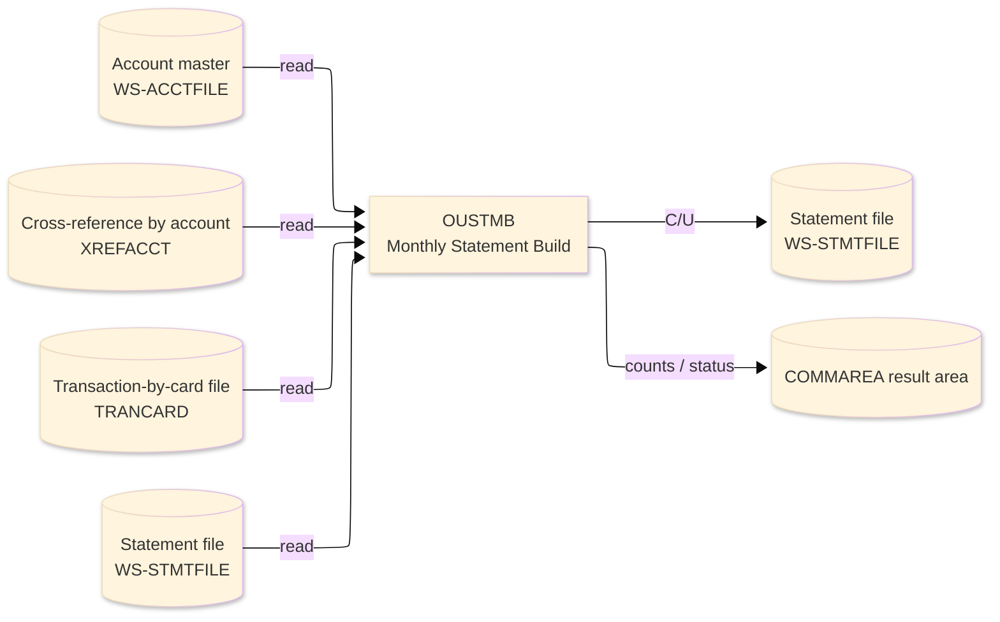
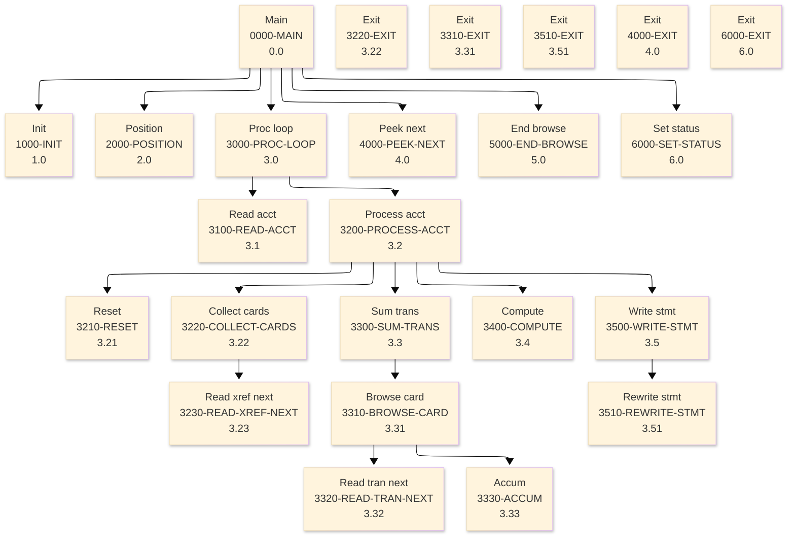

# Batch Program Design Document — OUSTMB_StatementBuild

**Common header**

| System name | Program ID | Created/updated on／Author | Changed lines |
|---|---|---|---|
| ORION-CCMS (ORION Credit Card Management System) | OUSTMB | Created 2026-09-28／modernizeX | — |

## 1. Program overview

### 1.1 I/O diagram

### 1.2 Function overview

on-line port of batch OBSTMT. Browse ACCTFILE in account-id order; for each account collect its cards from XREFFILE (alternate index on XR-ACCT-ID), aggregate every transaction from TRANFILE (alternate index on TR-CARD-NUM) into cycle credit and debit totals, compute opening / closing balance and minimum due, then WRITE (or REWRITE) the statement master (STMTFILE, key ST-KEY). Counts and grand totals are returned in the KSTMTB block that is overlaid on the shared

### 1.3 I/O overview

| File / table / area | DD / access | Copybook | I/O | Type | Organisation |
|---|---|---|---|---|---|
| Account master | EXEC CICS FILE(WS-ACCTFILE) | RACCT | I | Main | VSAM KSDS |
| Cross-reference by account | EXEC CICS FILE(XREFACCT) | RXREF | I | Sub | VSAM KSDS |
| Transaction-by-card file | EXEC CICS FILE(TRANCARD) | RTRAN | I | Sub | VSAM KSDS |
| Statement file | EXEC CICS FILE(WS-STMTFILE) | RSTMT | I-O | Sub | VSAM KSDS |
| Request / result area | COMMAREA (linkage) | KCOMM | I-O | Main | linkage |

### 1.4 Called subprograms / modules

| Program ID | Call type | Function | Interface |
|---|---|---|---|
| — | — | This program calls no sub-program | — |

### 1.5 DB tables & SQL

No SQL used — pure VSAM/CICS file I/O.

### 1.6 Special notes

- Invocation: EXEC CICS LINK PROGRAM('OUSTMB') COMMAREA(ORION-COMMAREA) LENGTH(LENGTH OF ORION-COMMAREA) END-EXEC. FILES : ACCTFILE browse, XREFFILE alt-index browse, TRANFILE alt-index browse, STMTFILE write / rewrite. RETURN : ends with GOBACK (subroutine convention). MAINTENANCE LOG 0001 2026-08-07 Original - on-line statement build sub.
- Linked from: OCUTIL.

## 2. Processing details（処理内容）

### 1. Main（0000-MAIN）　[0.0]　(L98)
1) Main: drive the overall processing — run initialisation, the main work and termination in turn.
2) When ksm status NOT = '99' (L101), take the branch for that case.
3) In turn, carry out: init, position, proc loop, peek next, end browse, set status.

### 2. Init（1000-INIT）　[1.0]　(L116)
1) Init: prepare the work area, clear the result counters and set the initial status.
2) When ksm cycle = ZEROS (L128), take the branch for that case.

### 3. Position（2000-POSITION）　[2.0]　(L135)
1) Position: position a browse on Account master.
2) Depending on ws resp cd (L143): response = normal, response = not-found, response (ENDFILE), OTHER.

### 4. Proc loop（3000-PROC-LOOP）　[3.0]　(L157)
1) Proc loop: perform the proc loop step of the processing.
2) When NOT ws eof yes (L159), take the branch for that case.
3) In turn, carry out: read acct, process acct.

### 5. Read acct（3100-READ-ACCT）　[3.1]　(L168)
1) Read acct: read the next record from Account master.
2) Depending on ws resp cd (L175): response = normal, response (ENDFILE), OTHER.

### 6. Process acct（3200-PROCESS-ACCT）　[3.2]　(L188)
1) Process acct: perform the process acct step of the processing.
2) When ws tran this = ZERO (L193), take the branch for that case.
3) In turn, carry out: reset, collect cards, sum trans, compute, write stmt.

### 7. Reset（3210-RESET）　[3.21]　(L203)
1) Reset: perform the reset step of the processing.

### 8. Collect cards（3220-COLLECT-CARDS）　[3.22]　(L215)
1) Collect cards: position a browse on Cross-reference by account; end the browse on Cross-reference by account.
2) When ws resp cd NOT = response = normal (L224), take the branch for that case.
3) In turn, carry out: read xref next, inline, read xref next.

### 9. Exit（3220-EXIT）　[3.22]　(L244)
1) Exit: perform the exit step of the processing.

### 10. Read xref next（3230-READ-XREF-NEXT）　[3.23]　(L249)
1) Read xref next: read the next record from Cross-reference by account.
2) Depending on ws resp cd (L256): response = normal, response (ENDFILE), OTHER.

### 11. Sum trans（3300-SUM-TRANS）　[3.3]　(L268)
1) Sum trans: perform the sum trans step of the processing.
2) In turn, carry out: inline, browse card.

### 12. Browse card（3310-BROWSE-CARD）　[3.31]　(L277)
1) Browse card: position a browse on Transaction-by-card file; end the browse on Transaction-by-card file.
2) When ws resp cd NOT = response = normal (L286), take the branch for that case.
3) In turn, carry out: read tran next, inline, accum, read tran next.

### 13. Exit（3310-EXIT）　[3.31]　(L303)
1) Exit: perform the exit step of the processing.

### 14. Read tran next（3320-READ-TRAN-NEXT）　[3.32]　(L308)
1) Read tran next: read the next record from Transaction-by-card file.
2) Depending on ws resp cd (L315): response = normal, response (ENDFILE), OTHER.

### 15. Accum（3330-ACCUM）　[3.33]　(L327)
1) Accum: perform the accum step of the processing.
2) When ws tcyc = ksm cycle (L333), take the branch for that case.

### 16. Compute（3400-COMPUTE）　[3.4]　(L344)
1) Compute: perform the compute step of the processing.
2) When ws close bal <= ZERO (L348), take the branch for that case.

### 17. Write stmt（3500-WRITE-STMT）　[3.5]　(L364)
1) Write stmt: add a record to the Statement file.
2) Depending on ws resp cd (L380): response = normal, response = duplicate, OTHER.
3) In turn, carry out: rewrite stmt.

### 18. Rewrite stmt（3510-REWRITE-STMT）　[3.51]　(L391)
1) Rewrite stmt: read the Statement file record; save the updated Statement file record.
2) When ws resp cd NOT = response = normal (L399), take the branch for that case.
3) When ws resp cd = response = normal (L414), take the branch for that case.

### 19. Exit（3510-EXIT）　[3.51]　(L419)
1) Exit: perform the exit step of the processing.

### 20. Peek next（4000-PEEK-NEXT）　[4.0]　(L425)
1) Peek next: read the next record from Account master.
2) When ws eof yes (L426), take the branch for that case.
3) Depending on ws resp cd (L436): response = normal, response (ENDFILE), OTHER.

### 21. Exit（4000-EXIT）　[4.0]　(L446)
1) Exit: perform the exit step of the processing.

### 22. End browse（5000-END-BROWSE）　[5.0]　(L451)
1) End browse: end the browse on Account master.

### 23. Set status（6000-SET-STATUS）　[6.0]　(L459)
1) Set status: perform the set status step of the processing.
2) When ksm status = '99' (L460), take the branch for that case.
3) When ksm acct read = ZEROS (L463), take the branch for that case.

### 24. Exit（6000-EXIT）　[6.0]　(L470)
1) Exit: perform the exit step of the processing.

## 3. Structure diagram（構造図）

## 4. Output specifications (file / table)

### 4.1 Statement file（RSTMT） — 107 bytes (output record)

| Level | Item name | Field name | Type | Bytes | Position | Source | How the value is set |
|---|---|---|---|---|---|---|---|
| 01 | Rec | STMT-REC | group | 107 | 1 | — | group item |
| 05 | Key | ST-KEY | group | 17 | 1 | Master/COMMAREA | record key |
| 10 | Acct Id | ST-ACCT-ID | 9(11) | 11 | 1 | Master/COMMAREA | record key |
| 10 | Cycle | ST-CYCLE | 9(06) | 6 | 12 | Master/COMMAREA | set from the transaction / account being processed |
| 05 | Open Bal | ST-OPEN-BAL | S9(10)V99 | 12 | 18 | Master/COMMAREA | set from the transaction / account being processed |
| 05 | Close Bal | ST-CLOSE-BAL | S9(10)V99 | 12 | 30 | Master/COMMAREA | set from the transaction / account being processed |
| 05 | Total Credit | ST-TOTAL-CREDIT | S9(10)V99 | 12 | 42 | Master/COMMAREA | set from the transaction / account being processed |
| 05 | Total Debit | ST-TOTAL-DEBIT | S9(10)V99 | 12 | 54 | Master/COMMAREA | set from the transaction / account being processed |
| 05 | Min Due | ST-MIN-DUE | S9(10)V99 | 12 | 66 | Master/COMMAREA | set from the transaction / account being processed |
| 05 | Due Date | ST-DUE-DATE | X(10) | 10 | 78 | Master/COMMAREA | set from the transaction / account being processed |
| 05 | Filler | FILLER | X(20) | 20 | 88 | Master/COMMAREA | set from the transaction / account being processed |

## 5. In/out parameters & check specifications

### 5.1 Parameters

| Category | Name | Type / length | Meaning | Value / source |
|---|---|---|---|---|
| Linkage (COMMAREA) | ORION-COMMAREA | group (KCOMM) | shared communication area passed on every EXEC CICS LINK | supplied by the calling screen |
| Linkage (KSTMTB) | KSM-CYCLE | 9(06) | cycle | request/result field in the work area |
| Linkage (KSTMTB) | KSM-DUE-DATE | X(10) | due date | request/result field in the work area |
| Linkage (KSTMTB) | KSM-START-ACCT | 9(11) | start acct | request/result field in the work area |
| Linkage (KSTMTB) | KSM-MAX | 9(07) | max | request/result field in the work area |
| Linkage (KSTMTB) | KSM-STATUS | X(02) | status | request/result field in the work area |
| Linkage (KSTMTB) | KSM-MSG | X(50) | msg | request/result field in the work area |
| Linkage (KSTMTB) | KSM-ACCT-READ | 9(07) | acct read | request/result field in the work area |
| Linkage (KSTMTB) | KSM-STMT-WRITTEN | 9(07) | stmt written | request/result field in the work area |
| Linkage (KSTMTB) | KSM-NO-TRAN | 9(07) | no tran | request/result field in the work area |
| Linkage (KSTMTB) | KSM-ERRORS | 9(07) | errors | request/result field in the work area |
| Linkage (KSTMTB) | KSM-TOT-CREDIT | S9(13)V99 | tot credit | request/result field in the work area |
| Linkage (KSTMTB) | KSM-TOT-DEBIT | S9(13)V99 | tot debit | request/result field in the work area |
| Linkage (KSTMTB) | KSM-NEXT-ACCT | 9(11) | next acct | request/result field in the work area |
| Linkage (KSTMTB) | KSM-MORE | X(01) | more | request/result field in the work area |
| Return | COMMAREA status | flag / text | outcome of the call | set by this program before it returns |

### 5.2 Checks

| No. | Check type | Target | Trigger condition | Action / message |
|---|---|---|---|---|
| 1 | Response | CICS file response | a file response other than normal or not-found | the error is recorded in the COMMAREA status and the browse/step ends |

## 6. Modification summary

| No. | Change date | Title | Summary of the change |
|---|---|---|---|
| 1 | 2026.09.28 | Initial AS-IS reverse design | Document generated by modernizeX from the extracted AST and datastore; no functional change. |

