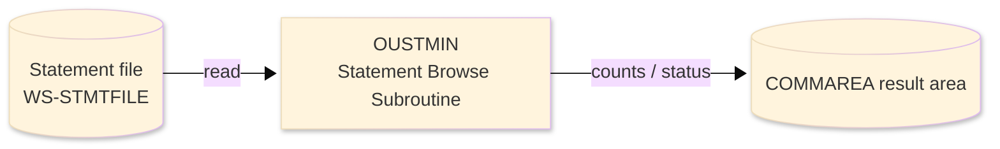
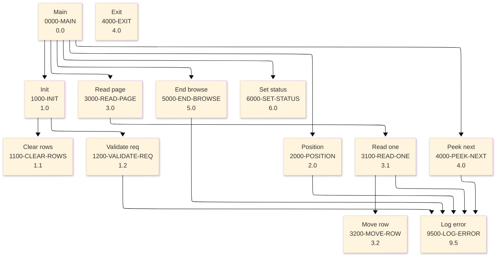

# Batch Program Design Document — OUSTMIN_StatementBrowse

**Common header**

| System name | Program ID | Created/updated on／Author | Changed lines |
|---|---|---|---|
| ORION-CCMS (ORION Credit Card Management System) | OUSTMIN | Created 2026-09-28／modernizeX | — |

## 1. Program overview

### 1.1 I/O diagram

### 1.2 Function overview

return one page of statement rows from STMTFILE positioned at the requested account / cycle. The caller fills KSB-REQUEST, LINKs this program and reads back KSB-

### 1.3 I/O overview

| File / table / area | DD / access | Copybook | I/O | Type | Organisation |
|---|---|---|---|---|---|
| Statement file | EXEC CICS FILE(WS-STMTFILE) | RSTMT | I | Main | VSAM KSDS |
| Request / result area | COMMAREA (linkage) | KCOMM | I-O | Main | linkage |

### 1.4 Called subprograms / modules

| Program ID | Call type | Function | Interface |
|---|---|---|---|
| — | — | This program calls no sub-program | — |

### 1.5 DB tables & SQL

No SQL used — pure VSAM/CICS file I/O.

### 1.6 Special notes

- Invocation: EXEC CICS LINK PROGRAM('OUSTMIN') COMMAREA(KSTMB-PARM) LENGTH(LENGTH OF KSTMB-PARM) END-EXEC. FILES : STMTFILE (browse - STARTBR / READNEXT / ENDBR) RETURN : ends with GOBACK (subroutine convention). MAINTENANCE LOG 0001 2026-08-07 Original - statement page browse. PROCESSING NARRATIVE 1. Validate the request; only the ACCT browse mode is supported. Reset the result occurrences. 2. Build the composite start key from the request and STARTBR the statement file GREATER-THAN-OR-EQUAL. 3. READNEXT up to the requested number of rows into the output occurrence table, moving balances and dates. 4. If the page filled without end-of-file, READNEXT one more record; its key becomes the next-page start and MORE is set so the caller can enable PF8 paging. 5. ENDBR and publish the row count and completion status. Any abnormal RESP writes a diagnostic to the CSSL log.
- Linked from: OCSTMIN.
- Result / status: and KSB-ROWS. The browse is opened GTEQ on the composite key ST-KEY (ST-ACCT-ID + ST-CYCLE), up to KSB-MAX-ROWS records are read forward, one extra record is peeked to publish the next-page key and the MORE flag, then the browse is closed. Every EXEC CICS command tests RESP and file failures are logged. CALL : EXEC CICS LINK PROGRAM('OUSTMIN') COMMAREA(KSTMB-PARM) LENGTH(LENGTH OF KSTMB-PARM) END-EXEC. FILES : STMTFILE (browse - STARTBR / READNEXT / ENDBR) RETURN : ends with GOBACK (subroutine convention). MAINTENANCE LOG 0001 2026-08-07 Original - statement page browse. PROCESSING NARRATIVE 1. Validate the request; only the ACCT browse mode is supported. Reset the result occurrences. 2. Build the composite start key from the request and STARTBR the statement file GREATER-THAN-OR-EQUAL. 3. READNEXT up to the requested number of rows into the output occurrence table, moving balances and dates. 4. If the page filled without end-of-file, READNEXT one more record; its key becomes the next-page start and MORE is set so the caller can enable PF8 paging. 5. ENDBR and publish the row count and completion status. Any abnormal RESP writes a diagnostic to the CSSL log.

## 2. Processing details（処理内容）

### 1. Main（0000-MAIN）　[0.0]　(L88)
1) Main: drive the overall processing — run initialisation, the main work and termination in turn.
2) When ksb status NOT = '99' (L90), take the branch for that case.
3) In turn, carry out: init, position, read page, peek next, end browse, set status.

### 2. Init（1000-INIT）　[1.0]　(L104)
1) Init: prepare the work area, clear the result counters and set the initial status.
2) In turn, carry out: clear rows, validate req.

### 3. Clear rows（1100-CLEAR-ROWS）　[1.1]　(L118)
1) Clear rows: perform the clear rows step of the processing.
2) In turn, carry out: inline.

### 4. Validate req（1200-VALIDATE-REQ）　[1.2]　(L133)
1) Validate req: perform the validate req step of the processing.
2) When ws max rows < 1 OR ws max rows > 6 (L135), take the branch for that case.
3) When ksb mode NOT = 'ACCT' (L138), take the branch for that case.
4) In turn, carry out: log error.

### 5. Position（2000-POSITION）　[2.0]　(L149)
1) Position: position a browse on Statement file.
2) Depending on ws resp cd (L158): response = normal, response = not-found, response (ENDFILE), OTHER.
3) In turn, carry out: log error.

### 6. Read page（3000-READ-PAGE）　[3.0]　(L178)
1) Read page: perform the read page step of the processing.
2) In turn, carry out: read one.

### 7. Read one（3100-READ-ONE）　[3.1]　(L185)
1) Read one: read the next record from Statement file.
2) Depending on ws resp cd (L192): response = normal, response (ENDFILE), OTHER.
3) In turn, carry out: move row, log error.

### 8. Move row（3200-MOVE-ROW）　[3.2]　(L209)
1) Move row: perform the move row step of the processing.

### 9. Peek next（4000-PEEK-NEXT）　[4.0]　(L222)
1) Peek next: read the next record from Statement file.
2) When ws eof yes (L223), take the branch for that case.
3) Depending on ws resp cd (L233): response = normal, response (ENDFILE), OTHER.
4) In turn, carry out: log error.

### 10. Exit（4000-EXIT）　[4.0]　(L247)
1) Exit: perform the exit step of the processing.

### 11. End browse（5000-END-BROWSE）　[5.0]　(L252)
1) End browse: end the browse on Statement file.
2) When ws resp cd NOT = response = normal (L257), take the branch for that case.
3) In turn, carry out: log error.

### 12. Set status（6000-SET-STATUS）　[6.0]　(L267)
1) Set status: perform the set status step of the processing.
2) When ksb status = '99' (L269), take the branch for that case.

### 13. Log error（9500-LOG-ERROR）　[9.5]　(L283)
1) Log error: perform the log error step of the processing.

## 3. Structure diagram（構造図）

## 4. Output specifications (file / table)

### 4.1 COMMAREA result / work area（KSTMB） — 567 bytes (result / work area returned in the COMMAREA)

| Level | Item name | Field name | Type | Bytes | Position | Source | How the value is set |
|---|---|---|---|---|---|---|---|
| 01 | Parm | KSTMB-PARM | group | 567 | 1 | — | group item |
| 05 | Request | KSB-REQUEST | group | 23 | 1 | Master/COMMAREA | record key |
| 10 | Mode | KSB-MODE | X(04) | 4 | 1 | Master/COMMAREA | record key |
| 10 | Start Acct | KSB-START-ACCT | 9(11) | 11 | 5 | Master/COMMAREA | set from the transaction / account being processed |
| 10 | Start Cycle | KSB-START-CYCLE | 9(06) | 6 | 16 | Master/COMMAREA | set from the transaction / account being processed |
| 10 | Max Rows | KSB-MAX-ROWS | 9(02) | 2 | 22 | Master/COMMAREA | set from the transaction / account being processed |
| 05 | Result | KSB-RESULT | group | 22 | 24 | Master/COMMAREA | group item |
| 10 | Status | KSB-STATUS | X(02) | 2 | 24 | Master/COMMAREA | set from the transaction / account being processed |
| 10 | Row Cnt | KSB-ROW-CNT | 9(02) | 2 | 26 | Master/COMMAREA | set from the transaction / account being processed |
| 10 | Next Acct | KSB-NEXT-ACCT | 9(11) | 11 | 28 | Master/COMMAREA | set from the transaction / account being processed |
| 10 | Next Cycle | KSB-NEXT-CYCLE | 9(06) | 6 | 39 | Master/COMMAREA | set from the transaction / account being processed |
| 10 | More | KSB-MORE | X(01) | 1 | 45 | Master/COMMAREA | set from the transaction / account being processed |
| 05 | Rows | KSB-ROWS | group | 522 | 46 | Master/COMMAREA | group item |
| 10 | Row | KSB-ROW | group | 522 | 46 | Master/COMMAREA | group item |
| 15 | R Acct | KSB-R-ACCT | 9(11) | 11 | 46 | Master/COMMAREA | set from the transaction / account being processed |
| 15 | R Cycle | KSB-R-CYCLE | 9(06) | 6 | 57 | Master/COMMAREA | set from the transaction / account being processed |
| 15 | R Open | KSB-R-OPEN | S9(10)V99 | 12 | 63 | Master/COMMAREA | set from the transaction / account being processed |
| 15 | R Close | KSB-R-CLOSE | S9(10)V99 | 12 | 75 | Master/COMMAREA | set from the transaction / account being processed |
| 15 | R Credit | KSB-R-CREDIT | S9(10)V99 | 12 | 87 | Master/COMMAREA | set from the transaction / account being processed |
| 15 | R Debit | KSB-R-DEBIT | S9(10)V99 | 12 | 99 | Master/COMMAREA | set from the transaction / account being processed |
| 15 | R Mindue | KSB-R-MINDUE | S9(10)V99 | 12 | 111 | Master/COMMAREA | set from the transaction / account being processed |
| 15 | R Duedt | KSB-R-DUEDT | X(10) | 10 | 123 | Master/COMMAREA | set from the transaction / account being processed |

## 5. In/out parameters & check specifications

### 5.1 Parameters

| Category | Name | Type / length | Meaning | Value / source |
|---|---|---|---|---|
| Linkage (COMMAREA) | ORION-COMMAREA | group (KCOMM) | shared communication area passed on every EXEC CICS LINK | supplied by the calling screen |
| Linkage (KSTMB) | KSB-MODE | X(04) | mode | request/result field in the work area |
| Linkage (KSTMB) | KSB-START-ACCT | 9(11) | start acct | request/result field in the work area |
| Linkage (KSTMB) | KSB-START-CYCLE | 9(06) | start cycle | request/result field in the work area |
| Linkage (KSTMB) | KSB-MAX-ROWS | 9(02) | max rows | request/result field in the work area |
| Linkage (KSTMB) | KSB-STATUS | X(02) | status | request/result field in the work area |
| Linkage (KSTMB) | KSB-ROW-CNT | 9(02) | row cnt | request/result field in the work area |
| Linkage (KSTMB) | KSB-NEXT-ACCT | 9(11) | next acct | request/result field in the work area |
| Linkage (KSTMB) | KSB-NEXT-CYCLE | 9(06) | next cycle | request/result field in the work area |
| Linkage (KSTMB) | KSB-MORE | X(01) | more | request/result field in the work area |
| Linkage (KSTMB) | KSB-R-ACCT | 9(11) | r acct | request/result field in the work area |
| Linkage (KSTMB) | KSB-R-CYCLE | 9(06) | r cycle | request/result field in the work area |
| Linkage (KSTMB) | KSB-R-OPEN | S9(10)V99 | r open | request/result field in the work area |
| Linkage (KSTMB) | KSB-R-CLOSE | S9(10)V99 | r close | request/result field in the work area |
| Linkage (KSTMB) | KSB-R-CREDIT | S9(10)V99 | r credit | request/result field in the work area |
| Return | COMMAREA status | flag / text | outcome of the call | set by this program before it returns |

### 5.2 Checks

| No. | Check type | Target | Trigger condition | Action / message |
|---|---|---|---|---|
| 1 | Response | CICS file response | a file response other than normal or not-found | the error is recorded in the COMMAREA status and the browse/step ends |

## 6. Modification summary

| No. | Change date | Title | Summary of the change |
|---|---|---|---|
| 1 | 2026.09.28 | Initial AS-IS reverse design | Document generated by modernizeX from the extracted AST and datastore; no functional change. |

