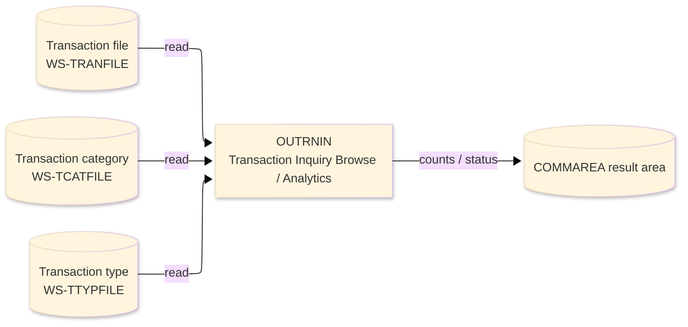
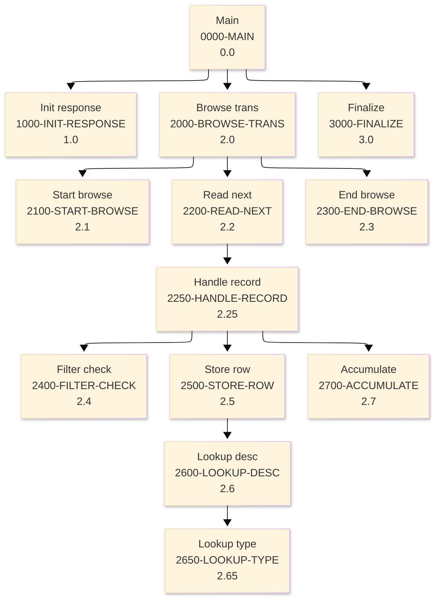

# Batch Program Design Document — OUTRNIN_TransactionInquiryBrowse

**Common header**

| System name | Program ID | Created/updated on／Author | Changed lines |
|---|---|---|---|
| ORION-CCMS (ORION Credit Card Management System) | OUTRNIN | Created 2026-09-28／modernizeX | — |

## 1. Program overview

### 1.1 I/O diagram

### 1.2 Function overview

browse the transaction master (TRANFILE) applying a filter (card / date range / merchant / type + category / amount threshold) and return ONE page of matching transactions in the KTRNIN-AREA commarea, ALONG WITH the filter-wide analytics: - match count and net total (OBTRSUM) - purchase / payment subtotals (OBRTRAN) - fee subtotal (OBRFEE) - interest subtotal (OBRINC) - largest single transaction (OBRTOP) The same figures serve the daily (OBRDAILY) and per-merchant (OBRMERCH) roll-ups by simply keying the date-range or merchant filter. Each displayed row carries the TTYP/TCAT lookup description for its type and category.

### 1.3 I/O overview

| File / table / area | DD / access | Copybook | I/O | Type | Organisation |
|---|---|---|---|---|---|
| Transaction file | EXEC CICS FILE(WS-TRANFILE) | RTRAN | I | Main | VSAM KSDS |
| Transaction category | EXEC CICS FILE(WS-TCATFILE) | RTCAT | I | Sub | VSAM KSDS |
| Transaction type | EXEC CICS FILE(WS-TTYPFILE) | RTTYP | I | Sub | VSAM KSDS |
| Request / result area | COMMAREA (linkage) | KCOMM | I-O | Main | linkage |

### 1.4 Called subprograms / modules

| Program ID | Call type | Function | Interface |
|---|---|---|---|
| — | — | This program calls no sub-program | — |

### 1.5 DB tables & SQL

No SQL used — pure VSAM/CICS file I/O.

### 1.6 Special notes

- Invocation: EXEC CICS LINK PROGRAM('OUTRNIN') COMMAREA(KTRNIN-AREA) END-EXEC. FILES : TRANFILE (browse), TTYPFILE + TCATFILE (lookup) DESIGN The full transaction file is scanned on every call so the analytics are genuine filter-wide totals (not just the page). During the same pass the first WS-MAX-ROWS matches whose key exceeds the resume key (KTI-START-KEY) are captured as the page; a further match sets the more-switch for PF8 paging.
- Linked from: OCTRNIN.

## 2. Processing details（処理内容）

### 1. Main（0000-MAIN）　[0.0]　(L87)
1) Main: drive the overall processing — run initialisation, the main work and termination in turn.
2) In turn, carry out: init response, browse trans, finalize.

### 2. Init response（1000-INIT-RESPONSE）　[1.0]　(L95)
1) Init response: prepare the work area, clear the result counters and set the initial status.

### 3. Browse trans（2000-BROWSE-TRANS）　[2.0]　(L117)
1) Browse trans: perform the browse trans step of the processing.
2) When NOT end of file (L119), take the branch for that case.
3) When kti row count > ZEROS (L124), take the branch for that case.
4) In turn, carry out: start browse, read next, end browse.

### 4. Start browse（2100-START-BROWSE）　[2.1]　(L130)
1) Start browse: position a browse on Transaction file.
2) Depending on ws resp cd (L138): response = normal, response = not-found, response (ENDFILE), OTHER.

### 5. Read next（2200-READ-NEXT）　[2.2]　(L152)
1) Read next: read the next record from Transaction file.
2) Depending on ws resp cd (L159): response = normal, response (ENDFILE), OTHER.
3) In turn, carry out: handle record.

### 6. Handle record（2250-HANDLE-RECORD）　[2.25]　(L172)
1) Handle record: perform the handle record step of the processing.
2) When ws matched (L175), take the branch for that case.
3) In turn, carry out: filter check, accumulate, store row.

### 7. End browse（2300-END-BROWSE）　[2.3]　(L188)
1) End browse: end the browse on Transaction file.

### 8. Filter check（2400-FILTER-CHECK）　[2.4]　(L196)
1) Filter check: perform the filter check step of the processing.
2) Depending on TRUE (L198): kti f card, kti f date, kti f merch, kti f typecat.

### 9. Store row（2500-STORE-ROW）　[2.5]　(L228)
1) Store row: perform the store row step of the processing.
2) In turn, carry out: lookup desc.

### 10. Lookup desc（2600-LOOKUP-DESC）　[2.6]　(L243)
1) Lookup desc: read the Transaction category record.
2) When ws resp cd = response = normal (L260), take the branch for that case.
3) In turn, carry out: lookup type.

### 11. Lookup type（2650-LOOKUP-TYPE）　[2.65]　(L268)
1) Lookup type: read the Transaction type record.
2) When ws resp cd = response = normal (L276), take the branch for that case.

### 12. Accumulate（2700-ACCUMULATE）　[2.7]　(L285)
1) Accumulate: perform the accumulate step of the processing.
2) Depending on tr type cd (L288): ws t purch, ws t pay, ws t fee, ws t int.
3) When ws first (L304), take the branch for that case.

### 13. Finalize（3000-FINALIZE）　[3.0]　(L317)
1) Finalize: set the final status and return the accumulated counts to the caller.

## 3. Structure diagram（構造図）

## 4. Output specifications (file / table)

### 4.1 COMMAREA result / work area（KTRNIN） — 842 bytes (result / work area returned in the COMMAREA)

| Level | Item name | Field name | Type | Bytes | Position | Source | How the value is set |
|---|---|---|---|---|---|---|---|
| 01 | Area | KTRNIN-AREA | group | 842 | 1 | — | group item |
| 05 | Request | KTI-REQUEST | group | 78 | 1 | Master/COMMAREA | record key |
| 10 | Filter | KTI-FILTER | X(01) | 0 | 1 | Master/COMMAREA | record key |
| 88 | F Card | KTI-F-CARD | — | 0 | 1 | Master/COMMAREA | record key |
| 88 | F Date | KTI-F-DATE | — | 0 | 1 | Master/COMMAREA | record key |
| 88 | F Merch | KTI-F-MERCH | — | 0 | 1 | Master/COMMAREA | record key |
| 88 | F Typecat | KTI-F-TYPECAT | — | 0 | 1 | Master/COMMAREA | record key |
| 88 | F Amount | KTI-F-AMOUNT | — | 0 | 1 | Master/COMMAREA | record key |
| 10 | Card | KTI-CARD | X(16) | 16 | 1 | Master/COMMAREA | record key |
| 10 | Date From | KTI-DATE-FROM | X(10) | 10 | 17 | Master/COMMAREA | set from the transaction / account being processed |
| 10 | Date To | KTI-DATE-TO | X(10) | 10 | 27 | Master/COMMAREA | set from the transaction / account being processed |
| 10 | Merch Id | KTI-MERCH-ID | 9(09) | 9 | 37 | Master/COMMAREA | set from the transaction / account being processed |
| 10 | F Type | KTI-F-TYPE | X(02) | 2 | 46 | Master/COMMAREA | set from the transaction / account being processed |
| 10 | F Cat | KTI-F-CAT | 9(04) | 4 | 48 | Master/COMMAREA | set from the transaction / account being processed |
| 10 | Amt Thresh | KTI-AMT-THRESH | S9(09)V99 | 11 | 52 | Master/COMMAREA | set from the transaction / account being processed |
| 10 | Start Key | KTI-START-KEY | X(16) | 16 | 63 | Master/COMMAREA | set from the transaction / account being processed |
| 05 | Response | KTI-RESPONSE | group | 164 | 79 | Master/COMMAREA | group item |
| 10 | Return Cd | KTI-RETURN-CD | X(01) | 0 | 79 | Master/COMMAREA | group item |
| 88 | Ok | KTI-OK | — | 0 | 79 | Master/COMMAREA | set from the transaction / account being processed |
| 88 | Error | KTI-ERROR | — | 0 | 79 | Master/COMMAREA | set from the transaction / account being processed |
| 10 | Row Count | KTI-ROW-COUNT | 9(02) | 2 | 79 | Master/COMMAREA | set from the transaction / account being processed |
| 10 | More Sw | KTI-MORE-SW | X(01) | 0 | 81 | Master/COMMAREA | group item |
| 88 | More | KTI-MORE | — | 0 | 81 | Master/COMMAREA | set from the transaction / account being processed |
| 88 | No More | KTI-NO-MORE | — | 0 | 81 | Master/COMMAREA | set from the transaction / account being processed |
| 10 | Next Key | KTI-NEXT-KEY | X(16) | 16 | 81 | Master/COMMAREA | set from the transaction / account being processed |
| 10 | Scan Count | KTI-SCAN-COUNT | 9(07) | 7 | 97 | Master/COMMAREA | set from the transaction / account being processed |
| 10 | Match Count | KTI-MATCH-COUNT | 9(07) | 7 | 104 | Master/COMMAREA | set from the transaction / account being processed |
| 10 | Net Total | KTI-NET-TOTAL | S9(13)V99 | 15 | 111 | Master/COMMAREA | set from the transaction / account being processed |
| 10 | Max Amt | KTI-MAX-AMT | S9(11)V99 | 13 | 126 | Master/COMMAREA | set from the transaction / account being processed |
| 10 | Max Id | KTI-MAX-ID | X(16) | 16 | 139 | Master/COMMAREA | set from the transaction / account being processed |
| 10 | Purch Cnt | KTI-PURCH-CNT | 9(07) | 7 | 155 | Master/COMMAREA | set from the transaction / account being processed |
| 10 | Purch Sum | KTI-PURCH-SUM | S9(13)V99 | 15 | 162 | Master/COMMAREA | set from the transaction / account being processed |
| 10 | Pay Cnt | KTI-PAY-CNT | 9(07) | 7 | 177 | Master/COMMAREA | set from the transaction / account being processed |
| 10 | Pay Sum | KTI-PAY-SUM | S9(13)V99 | 15 | 184 | Master/COMMAREA | set from the transaction / account being processed |
| 10 | Fee Cnt | KTI-FEE-CNT | 9(07) | 7 | 199 | Master/COMMAREA | set from the transaction / account being processed |
| 10 | Fee Sum | KTI-FEE-SUM | S9(13)V99 | 15 | 206 | Master/COMMAREA | set from the transaction / account being processed |
| 10 | Int Cnt | KTI-INT-CNT | 9(07) | 7 | 221 | Master/COMMAREA | set from the transaction / account being processed |
| 10 | Int Sum | KTI-INT-SUM | S9(13)V99 | 15 | 228 | Master/COMMAREA | set from the transaction / account being processed |
| 05 | Rows | KTI-ROWS | group | 600 | 243 | Master/COMMAREA | group item |
| 10 | Row | KTI-ROW | group | 600 | 243 | Master/COMMAREA | group item |
| 15 | Id | KTR-ID | X(16) | 16 | 243 | Master/COMMAREA | set from the transaction / account being processed |
| 15 | Card | KTR-CARD | X(16) | 16 | 259 | Master/COMMAREA | set from the transaction / account being processed |
| 15 | Tycat | KTR-TYCAT | X(07) | 7 | 275 | Master/COMMAREA | set from the transaction / account being processed |
| 15 | Desc | KTR-DESC | X(20) | 20 | 282 | Master/COMMAREA | set from the transaction / account being processed |
| 15 | Merch | KTR-MERCH | X(20) | 20 | 302 | Master/COMMAREA | set from the transaction / account being processed |
| 15 | Amt | KTR-AMT | S9(09)V99 | 11 | 322 | Master/COMMAREA | set from the transaction / account being processed |
| 15 | Date | KTR-DATE | X(10) | 10 | 333 | Master/COMMAREA | set from the transaction / account being processed |

## 5. In/out parameters & check specifications

### 5.1 Parameters

| Category | Name | Type / length | Meaning | Value / source |
|---|---|---|---|---|
| Linkage (COMMAREA) | ORION-COMMAREA | group (KCOMM) | shared communication area passed on every EXEC CICS LINK | supplied by the calling screen |
| Linkage (KTRNIN) | KTI-F-CARD | — | f card | request/result field in the work area |
| Linkage (KTRNIN) | KTI-F-DATE | — | f date | request/result field in the work area |
| Linkage (KTRNIN) | KTI-F-MERCH | — | f merch | request/result field in the work area |
| Linkage (KTRNIN) | KTI-F-TYPECAT | — | f typecat | request/result field in the work area |
| Linkage (KTRNIN) | KTI-F-AMOUNT | — | f amount | request/result field in the work area |
| Linkage (KTRNIN) | KTI-CARD | X(16) | card | request/result field in the work area |
| Linkage (KTRNIN) | KTI-DATE-FROM | X(10) | date from | request/result field in the work area |
| Linkage (KTRNIN) | KTI-DATE-TO | X(10) | date to | request/result field in the work area |
| Linkage (KTRNIN) | KTI-MERCH-ID | 9(09) | merch id | request/result field in the work area |
| Linkage (KTRNIN) | KTI-F-TYPE | X(02) | f type | request/result field in the work area |
| Linkage (KTRNIN) | KTI-F-CAT | 9(04) | f cat | request/result field in the work area |
| Linkage (KTRNIN) | KTI-AMT-THRESH | S9(09)V99 | amt thresh | request/result field in the work area |
| Linkage (KTRNIN) | KTI-START-KEY | X(16) | start key | request/result field in the work area |
| Linkage (KTRNIN) | KTI-OK | — | ok | request/result field in the work area |
| Return | COMMAREA status | flag / text | outcome of the call | set by this program before it returns |

### 5.2 Checks

| No. | Check type | Target | Trigger condition | Action / message |
|---|---|---|---|---|
| 1 | Response | CICS file response | a file response other than normal or not-found | the error is recorded in the COMMAREA status and the browse/step ends |

## 6. Modification summary

| No. | Change date | Title | Summary of the change |
|---|---|---|---|
| 1 | 2026.09.28 | Initial AS-IS reverse design | Document generated by modernizeX from the extracted AST and datastore; no functional change. |

