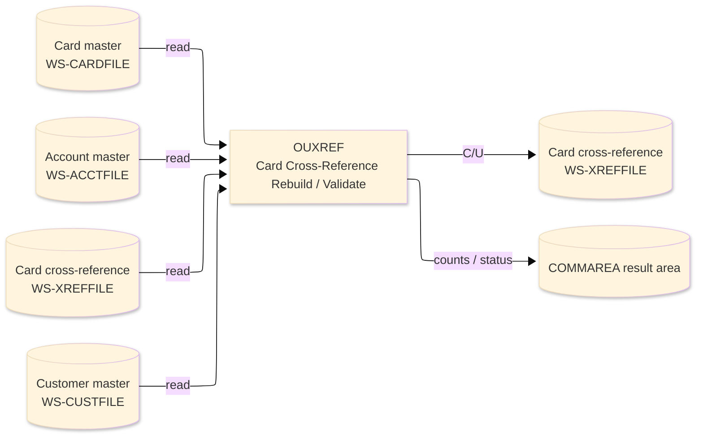
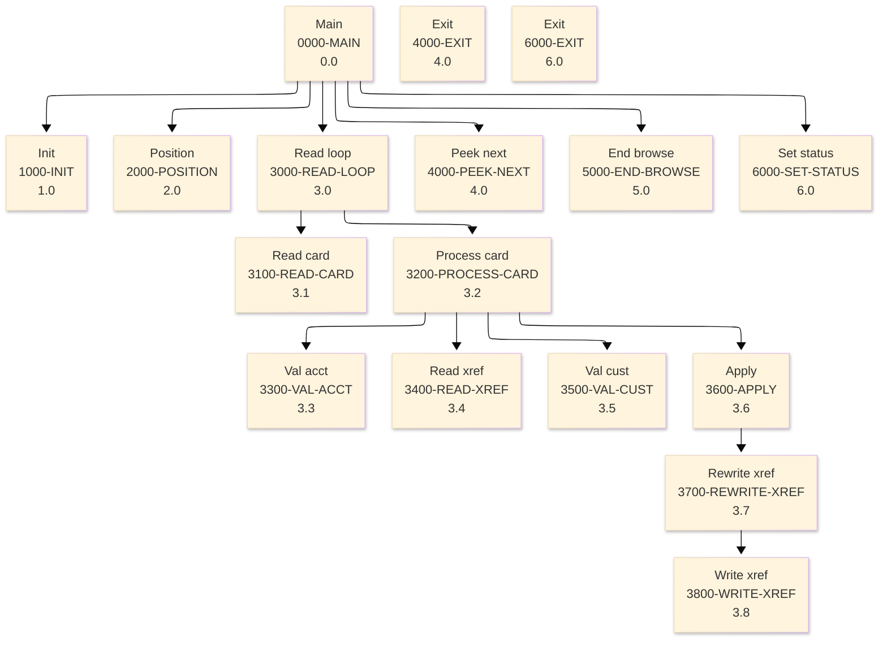

# Batch Program Design Document — OUXREF_XrefRebuild

**Common header**

| System name | Program ID | Created/updated on／Author | Changed lines |
|---|---|---|---|
| ORION-CCMS (ORION Credit Card Management System) | OUXREF | Created 2026-09-28／modernizeX | — |

## 1. Program overview

### 1.1 I/O diagram

### 1.2 Function overview

on-line port of batch OBXREFP. Browse CARDFILE in card-number order; for each card validate the owning account (ACCTFILE), carry the customer id forward from the existing XREFFILE record, validate the customer (CUSTFILE) and - in rebuild mode - correct and REWRITE the cross-reference (or WRITE a fresh record if it vanished). Counts are returned in the KXREF request / result block that is overlaid on the shared

### 1.3 I/O overview

| File / table / area | DD / access | Copybook | I/O | Type | Organisation |
|---|---|---|---|---|---|
| Card master | EXEC CICS FILE(WS-CARDFILE) | RCARD | I | Main | VSAM KSDS |
| Account master | EXEC CICS FILE(WS-ACCTFILE) | RACCT | I | Sub | VSAM KSDS |
| Card cross-reference | EXEC CICS FILE(WS-XREFFILE) | RXREF | I-O | Sub | VSAM KSDS |
| Customer master | EXEC CICS FILE(WS-CUSTFILE) | RCUST | I | Sub | VSAM KSDS |
| Request / result area | COMMAREA (linkage) | KCOMM | I-O | Main | linkage |

### 1.4 Called subprograms / modules

| Program ID | Call type | Function | Interface |
|---|---|---|---|
| — | — | This program calls no sub-program | — |

### 1.5 DB tables & SQL

No SQL used — pure VSAM/CICS file I/O.

### 1.6 Special notes

- Invocation: EXEC CICS LINK PROGRAM('OUXREF') COMMAREA(ORION-COMMAREA) LENGTH(LENGTH OF ORION-COMMAREA) END-EXEC. FILES : CARDFILE browse (STARTBR/READNEXT/ENDBR), ACCTFILE read, CUSTFILE read, XREFFILE read / READ UPDATE / REWRITE / WRITE. RETURN : ends with GOBACK (subroutine convention). MAINTENANCE LOG 0001 2026-08-07 Original - on-line xref rebuild sub.
- Linked from: OCUTIL.

## 2. Processing details（処理内容）

### 1. Main（0000-MAIN）　[0.0]　(L75)
1) Main: drive the overall processing — run initialisation, the main work and termination in turn.
2) When kux status NOT = '99' (L78), take the branch for that case.
3) In turn, carry out: init, position, read loop, peek next, end browse, set status.

### 2. Init（1000-INIT）　[1.0]　(L93)
1) Init: prepare the work area, clear the result counters and set the initial status.
2) Depending on kux mode (L106): 'REBL', 'VALD', OTHER.

### 3. Position（2000-POSITION）　[2.0]　(L118)
1) Position: position a browse on Card master.
2) When kux start card = SPACES OR kux start card = low values (L119), take the branch for that case.
3) Depending on ws resp cd (L130): response = normal, response = not-found, response (ENDFILE), OTHER.

### 4. Read loop（3000-READ-LOOP）　[3.0]　(L147)
1) Read loop: perform the read loop step of the processing.
2) When NOT ws eof yes (L149), take the branch for that case.
3) In turn, carry out: read card, process card.

### 5. Read card（3100-READ-CARD）　[3.1]　(L158)
1) Read card: read the next record from Card master.
2) Depending on ws resp cd (L165): response = normal, response (ENDFILE), OTHER.

### 6. Process card（3200-PROCESS-CARD）　[3.2]　(L180)
1) Process card: perform the process card step of the processing.
2) When ws card ok (L185), take the branch for that case.
3) When ws card ok (L188), take the branch for that case.
4) When ws card ok (L191), take the branch for that case.
5) In turn, carry out: val acct, read xref, val cust, apply.

### 7. Val acct（3300-VAL-ACCT）　[3.3]　(L197)
1) Val acct: read the Account master record.
2) Depending on ws resp cd (L205): response = normal, response = not-found, OTHER.

### 8. Read xref（3400-READ-XREF）　[3.4]　(L220)
1) Read xref: read the Card cross-reference record.
2) Depending on ws resp cd (L228): response = normal, response = not-found, OTHER.

### 9. Val cust（3500-VAL-CUST）　[3.5]　(L241)
1) Val cust: read the Customer master record.
2) Depending on ws resp cd (L249): response = normal, response = not-found, OTHER.

### 10. Apply（3600-APPLY）　[3.6]　(L263)
1) Apply: perform the apply step of the processing.
2) When ws mode validate (L264), take the branch for that case.
3) In turn, carry out: rewrite xref.

### 11. Rewrite xref（3700-REWRITE-XREF）　[3.7]　(L274)
1) Rewrite xref: read the Card cross-reference record; save the updated Card cross-reference record.
2) Depending on ws resp cd (L283): response = normal, response = not-found, OTHER.
3) In turn, carry out: write xref.

### 12. Write xref（3800-WRITE-XREF）　[3.8]　(L305)
1) Write xref: add a record to the Card cross-reference.
2) Depending on ws resp cd (L316): response = normal, response = duplicate, OTHER.

### 13. Peek next（4000-PEEK-NEXT）　[4.0]　(L328)
1) Peek next: read the next record from Card master.
2) When ws eof yes (L329), take the branch for that case.
3) Depending on ws resp cd (L339): response = normal, response (ENDFILE), OTHER.

### 14. Exit（4000-EXIT）　[4.0]　(L349)
1) Exit: perform the exit step of the processing.

### 15. End browse（5000-END-BROWSE）　[5.0]　(L354)
1) End browse: end the browse on Card master.

### 16. Set status（6000-SET-STATUS）　[6.0]　(L362)
1) Set status: perform the set status step of the processing.
2) When kux status = '99' (L363), take the branch for that case.
3) When kux read = ZEROS (L366), take the branch for that case.

### 17. Exit（6000-EXIT）　[6.0]　(L377)
1) Exit: perform the exit step of the processing.

## 3. Structure diagram（構造図）

## 4. Output specifications (file / table)

### 4.1 Card cross-reference（RXREF） — 50 bytes (output record)

| Level | Item name | Field name | Type | Bytes | Position | Source | How the value is set |
|---|---|---|---|---|---|---|---|
| 01 | Rec | XREF-REC | group | 50 | 1 | — | group item |
| 05 | Card Num | XR-CARD-NUM | X(16) | 16 | 1 | Master/COMMAREA | record key |
| 05 | Acct Id | XR-ACCT-ID | 9(11) | 11 | 17 | Master/COMMAREA | set from the transaction / account being processed |
| 05 | Cust Id | XR-CUST-ID | 9(09) | 9 | 28 | Master/COMMAREA | set from the transaction / account being processed |
| 05 | Filler | FILLER | X(14) | 14 | 37 | Master/COMMAREA | set from the transaction / account being processed |

## 5. In/out parameters & check specifications

### 5.1 Parameters

| Category | Name | Type / length | Meaning | Value / source |
|---|---|---|---|---|
| Linkage (COMMAREA) | ORION-COMMAREA | group (KCOMM) | shared communication area passed on every EXEC CICS LINK | supplied by the calling screen |
| Linkage (KXREF) | KUX-MODE | X(04) | mode | request/result field in the work area |
| Linkage (KXREF) | KUX-MAX | 9(07) | max | request/result field in the work area |
| Linkage (KXREF) | KUX-START-CARD | X(16) | start card | request/result field in the work area |
| Linkage (KXREF) | KUX-STATUS | X(02) | status | request/result field in the work area |
| Linkage (KXREF) | KUX-MSG | X(50) | msg | request/result field in the work area |
| Linkage (KXREF) | KUX-READ | 9(07) | read | request/result field in the work area |
| Linkage (KXREF) | KUX-WRITTEN | 9(07) | written | request/result field in the work area |
| Linkage (KXREF) | KUX-UPDATED | 9(07) | updated | request/result field in the work area |
| Linkage (KXREF) | KUX-SKIP-ACCT | 9(07) | skip acct | request/result field in the work area |
| Linkage (KXREF) | KUX-SKIP-XREF | 9(07) | skip xref | request/result field in the work area |
| Linkage (KXREF) | KUX-SKIP-CUST | 9(07) | skip cust | request/result field in the work area |
| Linkage (KXREF) | KUX-ERRORS | 9(07) | errors | request/result field in the work area |
| Linkage (KXREF) | KUX-NEXT-CARD | X(16) | next card | request/result field in the work area |
| Linkage (KXREF) | KUX-MORE | X(01) | more | request/result field in the work area |
| Return | COMMAREA status | flag / text | outcome of the call | set by this program before it returns |

### 5.2 Checks

| No. | Check type | Target | Trigger condition | Action / message |
|---|---|---|---|---|
| 1 | Response | CICS file response | a file response other than normal or not-found | the error is recorded in the COMMAREA status and the browse/step ends |

## 6. Modification summary

| No. | Change date | Title | Summary of the change |
|---|---|---|---|
| 1 | 2026.09.28 | Initial AS-IS reverse design | Document generated by modernizeX from the extracted AST and datastore; no functional change. |

