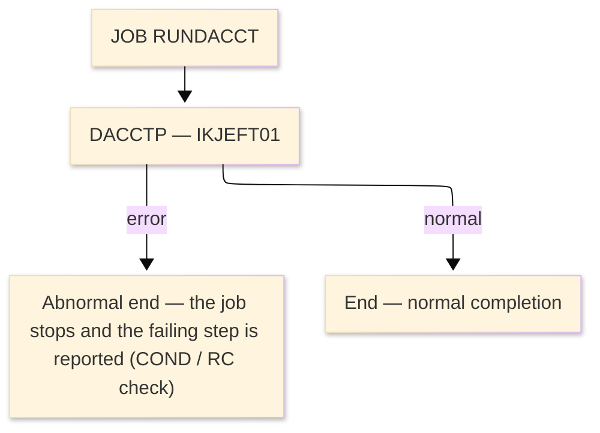

# Job flow — RUNDACCT

| Item | Content |
|---|---|
| JOBID | RUNDACCT（`RUNDACCTP.jcl`） |
| Process name（処理名称） | DB2 Account Posting / Extract |
| System / Category | ORION-CCMS (ORION Credit Card Management System) / Batch (IBM z/OS mainframe) |
| Runtime environment (current) | z/OS JCL — TSO/IKJEFT01 + DB2 (DSN RUN) |
| Job data source | JCL (`datastore/jcl_jobs.json` ／ `RUNDACCTP.jcl`) |
| Launch command / schedule | Submitted manually / by the operations schedule — ※ not determined (ask the team) |

### Job flow diagram

> **Symbol legend**: ★＝the step runs a program that has its own program design in this folder ｜ IN:／OUT:／SYSIN:／ENV:／LOG:＝DD direction ｜ `(concat)`＝library/dataset concatenation ｜ `&&name`＝temporary dataset (deleted at step end) ｜ SYSOUT＝report/log output

| Step | Line | Processing | ＤＤ | Dataset / File | Notes |
|---|---|---|---|---|---|
| **JOB** | L1 | JOB card — CLASS=A, MSGCLASS=X, REGION=0M | ENV:JOBLIB | `ORION.LOADLIB` | load library |
| **◆ Overview** |  | DB2 Account Posting / Extract. | ・Overall: | `DSN.V12R1M0.SDSNEXIT → ORION.DB2.ACCT.EXTRACT` |  |
|  |  |  | ・P0: | `1 step(s)` |  |
|  |  |  | ・Input: | `DSN.V12R1M0.SDSNEXIT, DSN.V12R1M0.SDSNLOAD, ORION.DBRMLIB` |  |
|  |  |  | ・Output: | `ORION.DB2.ACCT.EXTRACT` |  |
| **◆ P0 Main processing** |  | the job's regular run |  |  |  |
| **DACCTP** | L0 | Run **ODACCTP** under TSO batch (`IKJEFT01`, `DSN RUN PROGRAM(ODACCTP)`) — db2 account posting / extract. ODACCTP is bound as a DB2 plan; it has no COBOL source in the reg (external module). |  |  | PGM=IKJEFT01 |
|  | L3 |  | ENV:STEPLIB | `ORION.LOADLIB` | DISP=SHR |
|  | L4 |  | ENV:(concat) | `DSN.V12R1M0.SDSNEXIT` | DISP=SHR |
|  | L5 |  | ENV:(concat) | `DSN.V12R1M0.SDSNLOAD` | DISP=SHR |
|  | L6 |  | IN:DBRMLIB | `ORION.DBRMLIB` | DISP=SHR |
|  | L7 |  | OUT:ACCTEXT | `ORION.DB2.ACCT.EXTRACT` | DISP=NEW,CATLG,DELETE; UNIT=SYSDA; SPACE=['CYL', ['10', '5'], 'RLSE']; DCB={'RECFM': 'FB', 'LRECL': '300', 'BLKSIZE': '0'} |
|  | L8 |  | OUT:RPTFILE |  | SYSOUT=* |
|  | L9 |  | OUT:SYSTSPRT |  | SYSOUT=* |
|  | L10 |  | LOG:SYSPRINT |  | SYSOUT=* |
|  | L11 |  | LOG:SYSOUT |  | SYSOUT=* |
|  | L12 |  | OUT:CEEDUMP |  | SYSOUT=* |
|  | L13 |  | LOG:SYSUDUMP |  | SYSOUT=* |
|  | L14 |  | SYSIN:SYSTSIN | `(instream)` |  |
| **End** | - | Normal completion sets RC=0; a step return code above the COND threshold stops the job and the failing step is reported. Abends are captured to CEEDUMP/SYSUDUMP. | LOG:- | `SYSOUT / MSGCLASS` | - |
