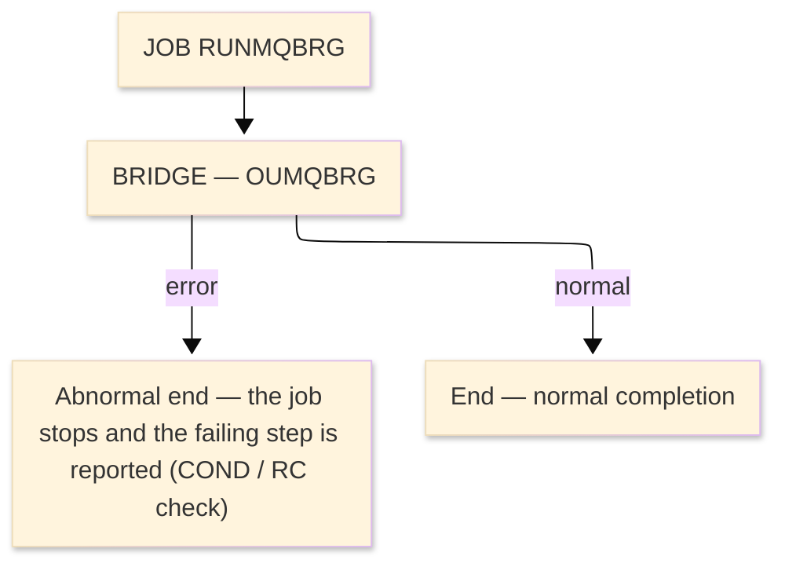

# Job flow — RUNMQBRG

| Item | Content |
|---|---|
| JOBID | RUNMQBRG（`RUNMQBRG.jcl`） |
| Process name（処理名称） | VSAM-to-MQ Transaction Bridge run |
| System / Category | ORION-CCMS (ORION Credit Card Management System) / Batch (IBM z/OS mainframe) |
| Runtime environment (current) | z/OS JCL — IBM MQ batch (OUMQBRG) |
| Job data source | JCL (`datastore/jcl_jobs.json` ／ `RUNMQBRG.jcl`) |
| Launch command / schedule | Submitted manually / by the operations schedule — ※ not determined (ask the team) |

### Job flow diagram

> **Symbol legend**: ★＝the step runs a program that has its own program design in this folder ｜ IN:／OUT:／SYSIN:／ENV:／LOG:＝DD direction ｜ `(concat)`＝library/dataset concatenation ｜ `&&name`＝temporary dataset (deleted at step end) ｜ SYSOUT＝report/log output

| Step | Line | Processing | ＤＤ | Dataset / File | Notes |
|---|---|---|---|---|---|
| **JOB** | L1 | JOB card — CLASS=A, MSGCLASS=X, REGION=0M | ENV:JOBLIB | `ORION.LOADLIB` | load library |
| **◆ Overview** |  | VSAM-to-MQ Transaction Bridge run. | ・Overall: | `MQM.V9R3M0.SCSQLOAD → updated tables / report` |  |
|  |  |  | ・P0: | `1 step(s)` |  |
|  |  |  | ・Input: | `MQM.V9R3M0.SCSQLOAD, MQM.V9R3M0.SCSQANLE, MQM.V9R3M0.SCSQAUTH, ORION.TRANFILE` |  |
|  |  |  | ・Output: | `updated VSAM/DB2 + SYSOUT report` |  |
| **◆ P0 Main processing** |  | the job's regular run |  |  |  |
| **BRIDGE** ★ | L0 | Run **OUMQBRG** — VSAM-to-MQ Transaction Bridge (its program design is in this folder). |  |  | PGM=OUMQBRG |
|  | L3 |  | ENV:STEPLIB | `ORION.LOADLIB` | DISP=SHR |
|  | L4 |  | ENV:(concat) | `MQM.V9R3M0.SCSQLOAD` | DISP=SHR |
|  | L5 |  | ENV:(concat) | `MQM.V9R3M0.SCSQANLE` | DISP=SHR |
|  | L6 |  | ENV:(concat) | `MQM.V9R3M0.SCSQAUTH` | DISP=SHR |
|  | L7 |  | IN:TRANFILE | `ORION.TRANFILE` | DISP=SHR |
|  | L8 |  | LOG:SYSOUT |  | SYSOUT=* |
|  | L9 |  | LOG:SYSPRINT |  | SYSOUT=* |
|  | L10 |  | OUT:CEEDUMP |  | SYSOUT=* |
|  | L11 |  | LOG:SYSUDUMP |  | SYSOUT=* |
| **End** | - | Normal completion sets RC=0; a step return code above the COND threshold stops the job and the failing step is reported. Abends are captured to CEEDUMP/SYSUDUMP. | LOG:- | `SYSOUT / MSGCLASS` | - |
