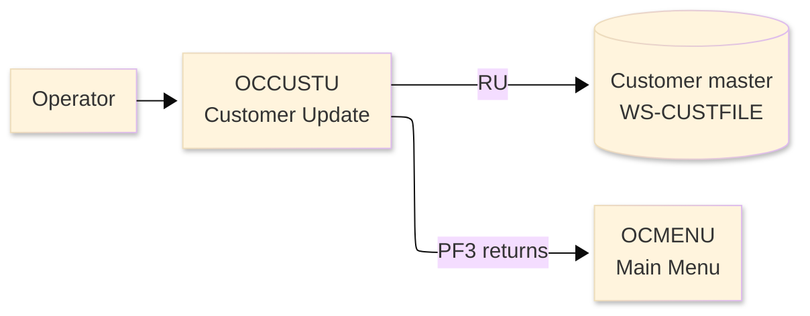
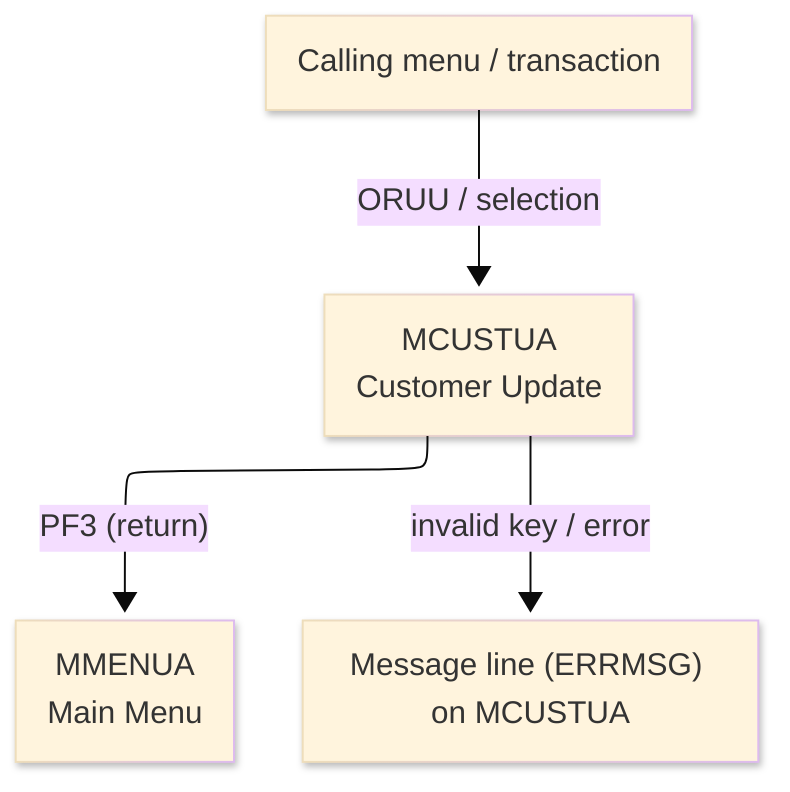
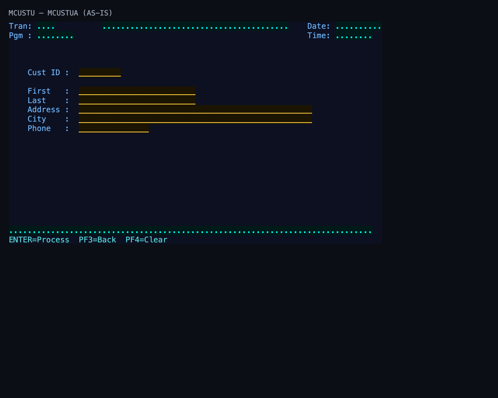

# Screen Design Document — OCCUSTU_CustomerUpdate

## 0. Cover

| Item | Content |
|---|---|
| System | ORION-CCMS (ORION Credit Card Management System) |
| Subsystem | On-line (CICS/BMS) |
| Function name | Customer Update |
| Function ID | OCCUSTU |
| CICS transaction | ORUU |
| Version | 1 |
| Author / Created on | modernizeX／2026-09-28 |
| Updated by / Updated on | modernizeX／2026-09-28 |

Approval frame: Customer｜Author｜Approver｜Responsible person

## 1. Function overview

### 1.1 Overview diagram

System architecture — the transaction program, the files/tables it touches, the sub-programs it links to, and where it hands control.

### 1.2 Function overview

1. Look up the customer by its key and display the current values.
2. Let the operator change the editable fields.
3. Validate the changes and save them back to the file on confirmation.

**Roles:** authenticated operator (signed on through the Sign On screen).

**Function keys**

| Key | Label as rendered (verbatim) | What it does |
|---|---|---|
| `ENTER` | `ENTER=Process` | validate the entry and process the current step |
| `PF3` | `PF3=Back` | return to the main menu (OCMENU) |
| `PF4` | `PF4=Clear` | clear the entered values and start again |

### 1.3 Databases used

| № | Logical table name | Physical table/file name | Create(C) | Read(R) | Update(U) | Delete(D) | Notes |
|---|---|---|---|---|---|---|---|
| 1 | Customer master | WS-CUSTFILE | - | 〇 | 〇 | - | VSAM KSDS (EXEC CICS file control) |

## 2. Screen spec

Screen transition of the whole function — every screen a box, every edge labelled with what moves the operator.

### 2.1 MCUSTUA — Customer Update (OCCUSTU)

**Layout**

*This screen appears when the operator selects the update function.* Physical size 24×80 (mapset `MCUSTU`, map `MCUSTUA`).

**Item details**

| № | Field (BMS) | COBOL symbolic | Kind | Attributes | Line | Col | Character count (screen columns) | Colour | picin | picout | Initial value / caption | Notes |
|---|---|---|---|---|---|---|---|---|---|---|---|---|
| 1 | (literal) | — | caption | ASKIP/NORM | 1 | 1 | 5 | BLUE | — | — | Tran: | field header |
| 2 | TRNNAME | TRNNAMEO | display | ASKIP/NORM | 1 | 7 | 4 | BLUE | — | — | — | program-supplied display |
| 3 | TITLE | TITLEO | display | ASKIP/NORM | 1 | 21 | 40 | YELLOW | — | — | — | program-supplied display |
| 4 | (literal) | — | caption | ASKIP/NORM | 1 | 65 | 5 | BLUE | — | — | Date: | field header |
| 5 | CURDATE | CURDATEO | display | ASKIP/NORM | 1 | 71 | 10 | BLUE | — | — | — | program-supplied display |
| 6 | (literal) | — | caption | ASKIP/NORM | 2 | 1 | 5 | BLUE | — | — | Pgm : | field header |
| 7 | PGMNAME | PGMNAMEO | display | ASKIP/NORM | 2 | 7 | 8 | BLUE | — | — | — | program-supplied display |
| 8 | (literal) | — | caption | ASKIP/NORM | 2 | 65 | 5 | BLUE | — | — | Time: | field header |
| 9 | CURTIME | CURTIMEO | display | ASKIP/NORM | 2 | 71 | 8 | BLUE | — | — | — | program-supplied display |
| 10 | (literal) | — | caption | ASKIP/NORM | 6 | 5 | 9 | BLUE | — | — | Cust ID : | field header |
| 11 | CUSTID | CUSTIDO | input | UNPROT/IC/FSET | 6 | 16 | 9 | GREEN | — | — | — | operator input |
| 12 | (literal) | — | caption | ASKIP/NORM | 8 | 5 | 9 | BLUE | — | — | First   : | field header |
| 13 | CUFNAM | CUFNAMO | input | UNPROT/IC/FSET | 8 | 16 | 25 | GREEN | — | — | — | operator input |
| 14 | (literal) | — | caption | ASKIP/NORM | 9 | 5 | 9 | BLUE | — | — | Last    : | field header |
| 15 | CULNAM | CULNAMO | input | UNPROT/IC/FSET | 9 | 16 | 25 | GREEN | — | — | — | operator input |
| 16 | (literal) | — | caption | ASKIP/NORM | 10 | 5 | 9 | BLUE | — | — | Address : | field header |
| 17 | CUADDR | CUADDRO | input | UNPROT/IC/FSET | 10 | 16 | 50 | GREEN | — | — | — | operator input |
| 18 | (literal) | — | caption | ASKIP/NORM | 11 | 5 | 9 | BLUE | — | — | City    : | field header |
| 19 | CUCITY | CUCITYO | input | UNPROT/IC/FSET | 11 | 16 | 50 | GREEN | — | — | — | operator input |
| 20 | (literal) | — | caption | ASKIP/NORM | 12 | 5 | 9 | BLUE | — | — | Phone   : | field header |
| 21 | CUPHONE | CUPHONEO | input | UNPROT/IC/FSET | 12 | 16 | 15 | GREEN | — | — | — | operator input |
| 22 | ERRMSG | ERRMSGO | display | ASKIP/NORM | 23 | 1 | 78 | RED | — | — | — | program-supplied display |
| 23 | (literal) | — | caption | ASKIP/NORM | 24 | 1 | 34 | TURQUOISE | — | — | ENTER=Process  PF3=Back  PF4=Clear | field header |

**Item states**

> Legend: `○`=enabled ｜ `必`=enabled (required) ｜ `□`=display only ｜ `×`=hidden ｜ `レ`=initial focus

| № | Field (BMS) | Initial display | Record loaded (editable) | Confirm save |
|---|---|---|---|---|
| 1 | TRNNAME | □ | □ | □ |
| 2 | TITLE | □ | □ | □ |
| 3 | CURDATE | □ | □ | □ |
| 4 | PGMNAME | □ | □ | □ |
| 5 | CURTIME | □ | □ | □ |
| 6 | CUSTID | ○ | ○ | □ |
| 7 | CUFNAM | ○ | ○ | □ |
| 8 | CULNAM | ○ | ○ | □ |
| 9 | CUADDR | ○ | ○ | □ |
| 10 | CUCITY | ○ | ○ | □ |
| 11 | CUPHONE | ○ | ○ | □ |
| 12 | ERRMSG | □ | □ | □ |

## 3. Check specifications

### 3.1 MCUSTUA — Customer Update

All messages below are the literal strings the program sends to the on-screen message line, extracted from the source. Type: E=Error / W=Warning / C=Confirm / I=Information.

| No. | Timing | Condition | Type | Display | Message content (verbatim) | Notes |
|---|---|---|---|---|---|---|
| 1 | ENTER / validation | an unsupported key was pressed | E | A (message line) | Invalid key pressed. Please try again. | on-screen ERRMSG line |

## 4. Event specifications

### 4.1 MCUSTUA — Customer Update

Per-key and per-field behaviour, written as operator steps.

| No. | Item | Timing / condition | Action | Next screen |
|---|---|---|---|---|
| **Function key section** | | | | |
| 1 | `ENTER` | when pressed | the changed fields are validated and, once confirmed, written back to the customer record | stays on the screen, or continues to the main menu (OCMENU) |
| 2 | `PF3` | when pressed | cancel and return to the main menu (OCMENU) | the main menu (OCMENU) |
| 3 | `PF4` | when pressed | clear the entered values so the operator can start again | stays on the screen |
| **Data entry section** | | | | |
| 4 | Key field(s) | on ENTER | the changed fields are validated and, once confirmed, written back to the customer record | stays on `MCUSTUA` (or shows a message) |

## 5. DB CRUD

**Update spec**

### WS-CUSTFILE — Customer master

| No. | PK | Item name | Field | On save (PF5) — update by key |
|---|---|---|---|---|
| 1 | ✓ | Id | CU-ID | key (unchanged) |
| 2 |  | First Name | CU-FIRST-NAME | screen input |
| 3 |  | Middle Name | CU-MIDDLE-NAME | screen input |
| 4 |  | Last Name | CU-LAST-NAME | screen input |
| 5 |  | Addr Line 1 | CU-ADDR-LINE-1 | screen input |
| 6 |  | Addr Line 2 | CU-ADDR-LINE-2 | screen input |
| 7 |  | Addr City | CU-ADDR-CITY | screen input |
| 8 |  | Addr State | CU-ADDR-STATE | screen input |
| 9 |  | Addr Country | CU-ADDR-COUNTRY | screen input |
| 10 |  | Addr Zip | CU-ADDR-ZIP | screen input |
| 11 |  | Phone 1 | CU-PHONE-1 | screen input |
| 12 |  | Phone 2 | CU-PHONE-2 | screen input |
| 13 |  | Ssn | CU-SSN | screen input |
| 14 |  | Govt Id | CU-GOVT-ID | screen input |
| 15 |  | Dob | CU-DOB | screen input |
| 16 |  | Fico Score | CU-FICO-SCORE | screen input |
| 17 |  | Filler | FILLER | screen input |

**Column-level CRUD (per event / business type)**

| Screen / table | Physical name | Field group | On save (PF5) — update by key |
|---|---|---|---|
| Customer master | WS-CUSTFILE | whole record | R/U |

