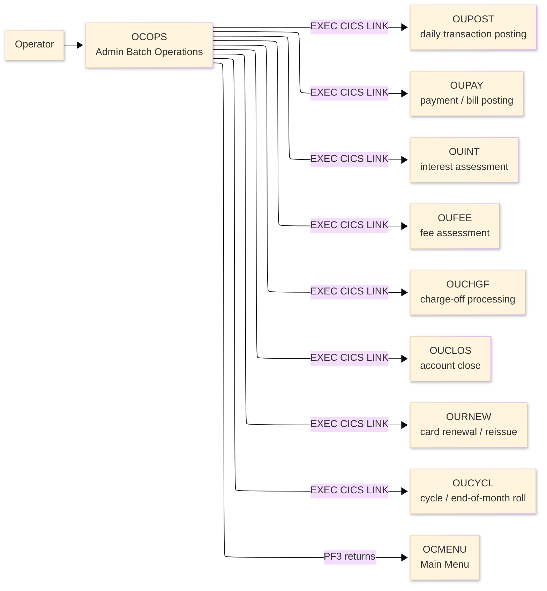
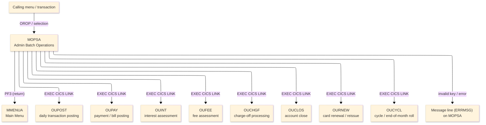
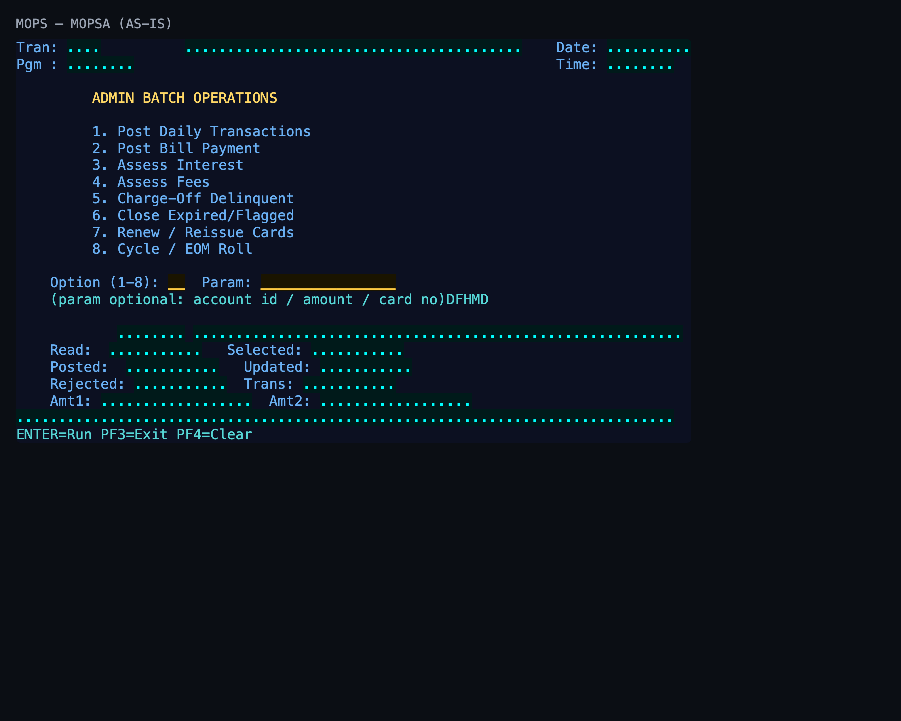

# Screen Design Document — OCOPS_BatchOperations

## 0. Cover

| Item | Content |
|---|---|
| System | ORION-CCMS (ORION Credit Card Management System) |
| Subsystem | On-line (CICS/BMS) |
| Function name | Admin Batch Operations |
| Function ID | OCOPS |
| CICS transaction | OROP |
| Version | 1 |
| Author / Created on | modernizeX／2026-09-28 |
| Updated by / Updated on | modernizeX／2026-09-28 |

Approval frame: Customer｜Author｜Approver｜Responsible person

## 1. Function overview

### 1.1 Overview diagram

System architecture — the transaction program, the files/tables it touches, the sub-programs it links to, and where it hands control.

### 1.2 Function overview

1. Present the available back-office operations as a numbered option list.
2. Run the selected operation by linking to its processing sub-program.
3. Show the operation result and the record counts it reports.

**Roles:** authenticated operator (signed on through the Sign On screen).

**Function keys**

| Key | Label as rendered (verbatim) | What it does |
|---|---|---|
| `ENTER` | `ENTER=Run` | validate the entry and process the current step |
| `PF3` | `PF3=Exit` | return to the main menu (OCMENU) |
| `PF4` | `PF4=Clear` | clear the entered values and start again |

### 1.3 Databases used

| № | Logical table name | Physical table/file name | Create(C) | Read(R) | Update(U) | Delete(D) | Notes |
|---|---|---|---|---|---|---|---|
| 1 | — | — | - | - | - | - | Not applicable — navigation only; file access is performed by the linked sub-programs |

## 2. Screen spec

Screen transition of the whole function — every screen a box, every edge labelled with what moves the operator.

### 2.1 MOPSA — Admin Batch Operations (OCOPS)

**Layout**

*This screen appears when the operator selects the batch-operations option from the menu.* Physical size 24×80 (mapset `MOPS`, map `MOPSA`).

**Item details**

| № | Field (BMS) | COBOL symbolic | Kind | Attributes | Line | Col | Character count (screen columns) | Colour | picin | picout | Initial value / caption | Notes |
|---|---|---|---|---|---|---|---|---|---|---|---|---|
| 1 | (literal) | — | caption | ASKIP/NORM | 1 | 1 | 5 | BLUE | — | — | Tran: | field header |
| 2 | TRNNAME | TRNNAMEO | display | ASKIP/NORM | 1 | 7 | 4 | BLUE | — | — | — | program-supplied display |
| 3 | TITLE | TITLEO | display | ASKIP/NORM | 1 | 21 | 40 | YELLOW | — | — | — | program-supplied display |
| 4 | (literal) | — | caption | ASKIP/NORM | 1 | 65 | 5 | BLUE | — | — | Date: | field header |
| 5 | CURDATE | CURDATEO | display | ASKIP/NORM | 1 | 71 | 10 | BLUE | — | — | — | program-supplied display |
| 6 | (literal) | — | caption | ASKIP/NORM | 2 | 1 | 5 | BLUE | — | — | Pgm : | field header |
| 7 | PGMNAME | PGMNAMEO | display | ASKIP/NORM | 2 | 7 | 8 | BLUE | — | — | — | program-supplied display |
| 8 | (literal) | — | caption | ASKIP/NORM | 2 | 65 | 5 | BLUE | — | — | Time: | field header |
| 9 | CURTIME | CURTIMEO | display | ASKIP/NORM | 2 | 71 | 8 | BLUE | — | — | — | program-supplied display |
| 10 | (literal) | — | caption | ASKIP/NORM | 4 | 10 | 30 | YELLOW | — | — | ADMIN BATCH OPERATIONS | field header |
| 11 | (literal) | — | caption | ASKIP/NORM | 6 | 10 | 30 | BLUE | — | — | 1. Post Daily Transactions | field header |
| 12 | (literal) | — | caption | ASKIP/NORM | 7 | 10 | 30 | BLUE | — | — | 2. Post Bill Payment | field header |
| 13 | (literal) | — | caption | ASKIP/NORM | 8 | 10 | 30 | BLUE | — | — | 3. Assess Interest | field header |
| 14 | (literal) | — | caption | ASKIP/NORM | 9 | 10 | 30 | BLUE | — | — | 4. Assess Fees | field header |
| 15 | (literal) | — | caption | ASKIP/NORM | 10 | 10 | 30 | BLUE | — | — | 5. Charge-Off Delinquent | field header |
| 16 | (literal) | — | caption | ASKIP/NORM | 11 | 10 | 30 | BLUE | — | — | 6. Close Expired/Flagged | field header |
| 17 | (literal) | — | caption | ASKIP/NORM | 12 | 10 | 30 | BLUE | — | — | 7. Renew / Reissue Cards | field header |
| 18 | (literal) | — | caption | ASKIP/NORM | 13 | 10 | 30 | BLUE | — | — | 8. Cycle / EOM Roll | field header |
| 19 | (literal) | — | caption | ASKIP/NORM | 15 | 5 | 13 | BLUE | — | — | Option (1-8): | field header |
| 20 | OPTION | OPTIONO | input | UNPROT/IC/FSET | 15 | 19 | 2 | GREEN | — | — | — | operator input |
| 21 | (literal) | — | caption | ASKIP/NORM | 15 | 23 | 6 | BLUE | — | — | Param: | field header |
| 22 | PARM | PARMO | input | UNPROT/FSET | 15 | 30 | 16 | GREEN | — | — | — | operator input |
| 23 | (literal) | — | caption | ASKIP/NORM | 16 | 5 | 52 | TURQUOISE | — | — | (param optional: account id / amount / card no)DFHMDF POS=(18,05),LENGTH=7,ATTRB=(ASKIP,NORM),COLOR=BLUE,INITIAL= | field header |
| 24 | RSTAT | RSTATO | display | ASKIP/NORM | 18 | 13 | 8 | GREEN | — | — | — | program-supplied display |
| 25 | RMSG | RMSGO | display | ASKIP/NORM | 18 | 22 | 58 | GREEN | — | — | — | program-supplied display |
| 26 | (literal) | — | caption | ASKIP/NORM | 19 | 5 | 6 | BLUE | — | — | Read: | field header |
| 27 | RCREAD | RCREADO | display | ASKIP/NORM | 19 | 12 | 11 | GREEN | — | — | — | program-supplied display |
| 28 | (literal) | — | caption | ASKIP/NORM | 19 | 26 | 9 | BLUE | — | — | Selected: | field header |
| 29 | RCSEL | RCSELO | display | ASKIP/NORM | 19 | 36 | 11 | GREEN | — | — | — | program-supplied display |
| 30 | (literal) | — | caption | ASKIP/NORM | 20 | 5 | 8 | BLUE | — | — | Posted: | field header |
| 31 | RCPOST | RCPOSTO | display | ASKIP/NORM | 20 | 14 | 11 | GREEN | — | — | — | program-supplied display |
| 32 | (literal) | — | caption | ASKIP/NORM | 20 | 28 | 8 | BLUE | — | — | Updated: | field header |
| 33 | RCUPD | RCUPDO | display | ASKIP/NORM | 20 | 37 | 11 | GREEN | — | — | — | program-supplied display |
| 34 | (literal) | — | caption | ASKIP/NORM | 21 | 5 | 9 | BLUE | — | — | Rejected: | field header |
| 35 | RCREJ | RCREJO | display | ASKIP/NORM | 21 | 15 | 11 | GREEN | — | — | — | program-supplied display |
| 36 | (literal) | — | caption | ASKIP/NORM | 21 | 28 | 6 | BLUE | — | — | Trans: | field header |
| 37 | RCTRAN | RCTRANO | display | ASKIP/NORM | 21 | 35 | 11 | GREEN | — | — | — | program-supplied display |
| 38 | (literal) | — | caption | ASKIP/NORM | 22 | 5 | 5 | BLUE | — | — | Amt1: | field header |
| 39 | RAMT1 | RAMT1O | display | ASKIP/NORM | 22 | 11 | 18 | GREEN | — | — | — | program-supplied display |
| 40 | (literal) | — | caption | ASKIP/NORM | 22 | 31 | 5 | BLUE | — | — | Amt2: | field header |
| 41 | RAMT2 | RAMT2O | display | ASKIP/NORM | 22 | 37 | 18 | GREEN | — | — | — | program-supplied display |
| 42 | ERRMSG | ERRMSGO | display | ASKIP/NORM | 23 | 1 | 78 | RED | — | — | — | program-supplied display |
| 43 | (literal) | — | caption | ASKIP/NORM | 24 | 1 | 40 | TURQUOISE | — | — | ENTER=Run PF3=Exit PF4=Clear | field header |

**Item states**

> Legend: `○`=enabled ｜ `必`=enabled (required) ｜ `□`=display only ｜ `×`=hidden ｜ `レ`=initial focus

| № | Field (BMS) | Initial display | Operation selected | After run |
|---|---|---|---|---|
| 1 | TRNNAME | □ | □ | □ |
| 2 | TITLE | □ | □ | □ |
| 3 | CURDATE | □ | □ | □ |
| 4 | PGMNAME | □ | □ | □ |
| 5 | CURTIME | □ | □ | □ |
| 6 | OPTION | ○ | ○ | □ |
| 7 | PARM | ○ | ○ | □ |
| 8 | RSTAT | □ | □ | □ |
| 9 | RMSG | □ | □ | □ |
| 10 | RCREAD | □ | □ | □ |
| 11 | RCSEL | □ | □ | □ |
| 12 | RCPOST | □ | □ | □ |
| 13 | RCUPD | □ | □ | □ |
| 14 | RCREJ | □ | □ | □ |
| 15 | RCTRAN | □ | □ | □ |
| 16 | RAMT1 | □ | □ | □ |
| 17 | RAMT2 | □ | □ | □ |
| 18 | ERRMSG | □ | □ | □ |

## 3. Check specifications

### 3.1 MOPSA — Admin Batch Operations

All messages below are the literal strings the program sends to the on-screen message line, extracted from the source. Type: E=Error / W=Warning / C=Confirm / I=Information.

| No. | Timing | Condition | Type | Display | Message content (verbatim) | Notes |
|---|---|---|---|---|---|---|
| 1 | ENTER / validation | processing state | I | A (message line) | Select an operation (1-8) and press ENTER. | on-screen ERRMSG line |
| 2 | ENTER / validation | the entered value failed a field rule | E | A (message line) | Invalid option. Enter 1 through 8. | on-screen ERRMSG line |
| 3 | ENTER / validation | processing state | I | A (message line) | Operation could not be started. Contact support. | on-screen ERRMSG line |
| 4 | ENTER / validation | the action completed | E | A (message line) | Operation complete. Review the counts below. | on-screen ERRMSG line |
| 5 | ENTER / validation | an unsupported key was pressed | E | A (message line) | Invalid key pressed. Please try again. | on-screen ERRMSG line |

## 4. Event specifications

### 4.1 MOPSA — Admin Batch Operations

Per-key and per-field behaviour, written as operator steps.

| No. | Item | Timing / condition | Action | Next screen |
|---|---|---|---|---|
| **Function key section** | | | | |
| 1 | `ENTER` | when pressed | the chosen operation number is checked and the matching processing sub-program is run | stays on the screen, or continues to the main menu (OCMENU) |
| 2 | `PF3` | when pressed | cancel and return to the main menu (OCMENU) | the main menu (OCMENU) |
| 3 | `PF4` | when pressed | clear the entered values so the operator can start again | stays on the screen |
| 4 | `PF12` | when pressed | cancel the current action and return to the main menu (OCMENU) | the main menu (OCMENU) |
| 5 | `CLEAR` | when pressed | clear the screen and redisplay it | stays on the screen |
| **Data entry section** | | | | |
| 6 | Key field(s) | on ENTER | the chosen operation number is checked and the matching processing sub-program is run | stays on `MOPSA` (or shows a message) |

## 5. DB CRUD

**Update spec**

Not applicable — the Admin Batch Operations screen only reads data; no table row is created, updated or deleted.

**Column-level CRUD (per event / business type)**

| Screen / table | Physical name | Field group | On ENTER — read |
|---|---|---|---|
| — | — | none | none |

