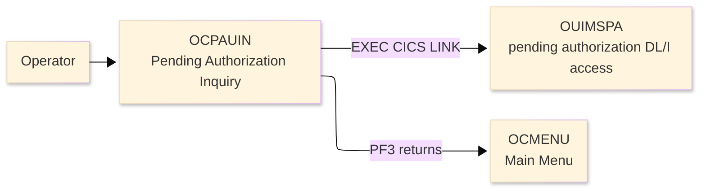
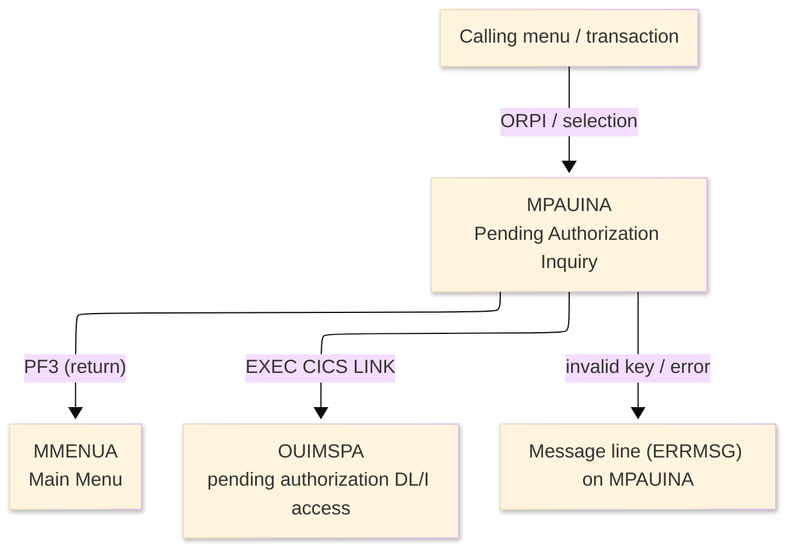
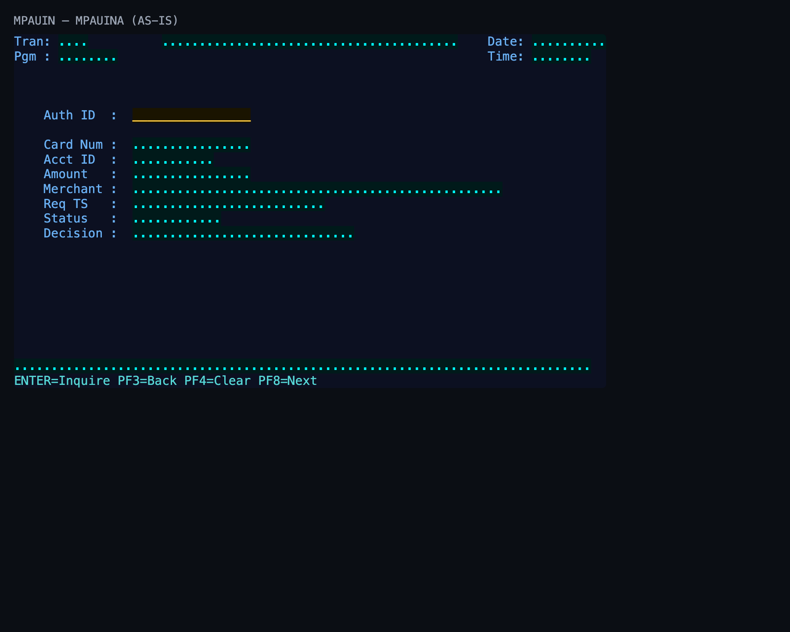

# Screen Design Document — OCPAUIN_PendingAuthInquiry

## 0. Cover

| Item | Content |
|---|---|
| System | ORION-CCMS (ORION Credit Card Management System) |
| Subsystem | On-line (CICS/BMS) |
| Function name | Pending Authorization Inquiry |
| Function ID | OCPAUIN |
| CICS transaction | ORPI |
| Version | 1 |
| Author / Created on | modernizeX／2026-09-28 |
| Updated by / Updated on | modernizeX／2026-09-28 |

Approval frame: Customer｜Author｜Approver｜Responsible person

## 1. Function overview

### 1.1 Overview diagram

System architecture — the transaction program, the files/tables it touches, the sub-programs it links to, and where it hands control.

### 1.2 Function overview

1. Accept the search key for the authorization inquiry.
2. Retrieve and display the matching authorization information for review.
3. Let the operator refine the key and inquire again.

**Roles:** authenticated operator (signed on through the Sign On screen).

**Function keys**

| Key | Label as rendered (verbatim) | What it does |
|---|---|---|
| `ENTER` | `ENTER=Inquire` | validate the entry and process the current step |
| `PF3` | `PF3=Back` | return to the main menu (OCMENU) |
| `PF4` | `PF4=Clear` | clear the entered values and start again |
| `PF8` | `PF8=Next` | page forward through the list |

### 1.3 Databases used

| № | Logical table name | Physical table/file name | Create(C) | Read(R) | Update(U) | Delete(D) | Notes |
|---|---|---|---|---|---|---|---|
| 1 | — | — | - | - | - | - | Not applicable — navigation only; file access is performed by the linked sub-programs |

## 2. Screen spec

Screen transition of the whole function — every screen a box, every edge labelled with what moves the operator.

### 2.1 MPAUINA — Pending Authorization Inquiry (OCPAUIN)

**Layout**

*This screen appears when the operator opens the inquiry function.* Physical size 24×80 (mapset `MPAUIN`, map `MPAUINA`).

**Item details**

| № | Field (BMS) | COBOL symbolic | Kind | Attributes | Line | Col | Character count (screen columns) | Colour | picin | picout | Initial value / caption | Notes |
|---|---|---|---|---|---|---|---|---|---|---|---|---|
| 1 | (literal) | — | caption | ASKIP/NORM | 1 | 1 | 5 | BLUE | — | — | Tran: | field header |
| 2 | TRNNAME | TRNNAMEO | display | ASKIP/NORM | 1 | 7 | 4 | BLUE | — | — | — | program-supplied display |
| 3 | TITLE | TITLEO | display | ASKIP/NORM | 1 | 21 | 40 | YELLOW | — | — | — | program-supplied display |
| 4 | (literal) | — | caption | ASKIP/NORM | 1 | 65 | 5 | BLUE | — | — | Date: | field header |
| 5 | CURDATE | CURDATEO | display | ASKIP/NORM | 1 | 71 | 10 | BLUE | — | — | — | program-supplied display |
| 6 | (literal) | — | caption | ASKIP/NORM | 2 | 1 | 5 | BLUE | — | — | Pgm : | field header |
| 7 | PGMNAME | PGMNAMEO | display | ASKIP/NORM | 2 | 7 | 8 | BLUE | — | — | — | program-supplied display |
| 8 | (literal) | — | caption | ASKIP/NORM | 2 | 65 | 5 | BLUE | — | — | Time: | field header |
| 9 | CURTIME | CURTIMEO | display | ASKIP/NORM | 2 | 71 | 8 | BLUE | — | — | — | program-supplied display |
| 10 | (literal) | — | caption | ASKIP/NORM | 6 | 5 | 10 | BLUE | — | — | Auth ID  : | field header |
| 11 | AUTHID | AUTHIDO | input | UNPROT/IC/FSET | 6 | 17 | 16 | GREEN | — | — | — | operator input |
| 12 | (literal) | — | caption | ASKIP/NORM | 8 | 5 | 10 | BLUE | — | — | Card Num : | field header |
| 13 | PACARD | PACARDO | display | ASKIP/NORM | 8 | 17 | 16 | TURQUOISE | — | — | — | program-supplied display |
| 14 | (literal) | — | caption | ASKIP/NORM | 9 | 5 | 10 | BLUE | — | — | Acct ID  : | field header |
| 15 | PAACCT | PAACCTO | display | ASKIP/NORM | 9 | 17 | 11 | TURQUOISE | — | — | — | program-supplied display |
| 16 | (literal) | — | caption | ASKIP/NORM | 10 | 5 | 10 | BLUE | — | — | Amount   : | field header |
| 17 | PAAMT | PAAMTO | display | ASKIP/NORM | 10 | 17 | 16 | TURQUOISE | — | — | — | program-supplied display |
| 18 | (literal) | — | caption | ASKIP/NORM | 11 | 5 | 10 | BLUE | — | — | Merchant : | field header |
| 19 | PAMERCH | PAMERCHO | display | ASKIP/NORM | 11 | 17 | 50 | TURQUOISE | — | — | — | program-supplied display |
| 20 | (literal) | — | caption | ASKIP/NORM | 12 | 5 | 10 | BLUE | — | — | Req TS   : | field header |
| 21 | PAREQTS | PAREQTSO | display | ASKIP/NORM | 12 | 17 | 26 | TURQUOISE | — | — | — | program-supplied display |
| 22 | (literal) | — | caption | ASKIP/NORM | 13 | 5 | 10 | BLUE | — | — | Status   : | field header |
| 23 | PASTAT | PASTATO | display | ASKIP/NORM | 13 | 17 | 12 | TURQUOISE | — | — | — | program-supplied display |
| 24 | (literal) | — | caption | ASKIP/NORM | 14 | 5 | 10 | BLUE | — | — | Decision : | field header |
| 25 | PADEC | PADECO | display | ASKIP/NORM | 14 | 17 | 30 | TURQUOISE | — | — | — | program-supplied display |
| 26 | ERRMSG | ERRMSGO | display | ASKIP/NORM | 23 | 1 | 78 | RED | — | — | — | program-supplied display |
| 27 | (literal) | — | caption | ASKIP/NORM | 24 | 1 | 41 | TURQUOISE | — | — | ENTER=Inquire PF3=Back PF4=Clear PF8=Next | field header |

**Item states**

> Legend: `○`=enabled ｜ `必`=enabled (required) ｜ `□`=display only ｜ `×`=hidden ｜ `レ`=initial focus

| № | Field (BMS) | Initial display (key prompt) | Result displayed |
|---|---|---|---|
| 1 | TRNNAME | □ | □ |
| 2 | TITLE | □ | □ |
| 3 | CURDATE | □ | □ |
| 4 | PGMNAME | □ | □ |
| 5 | CURTIME | □ | □ |
| 6 | AUTHID | ○ | □ |
| 7 | PACARD | □ | □ |
| 8 | PAACCT | □ | □ |
| 9 | PAAMT | □ | □ |
| 10 | PAMERCH | □ | □ |
| 11 | PAREQTS | □ | □ |
| 12 | PASTAT | □ | □ |
| 13 | PADEC | □ | □ |
| 14 | ERRMSG | □ | □ |

## 3. Check specifications

### 3.1 MPAUINA — Pending Authorization Inquiry

All messages below are the literal strings the program sends to the on-screen message line, extracted from the source. Type: E=Error / W=Warning / C=Confirm / I=Information.

| No. | Timing | Condition | Type | Display | Message content (verbatim) | Notes |
|---|---|---|---|---|---|---|
| 1 | ENTER / validation | processing state | I | A (message line) | Enter an authorization id and press ENTER. | on-screen ERRMSG line |
| 2 | ENTER / validation | an unsupported key was pressed | E | A (message line) | Invalid key pressed. Please try again. | on-screen ERRMSG line |
| 3 | ENTER / validation | a required field was left blank | E | A (message line) | Please enter all required fields. | on-screen ERRMSG line |

## 4. Event specifications

### 4.1 MPAUINA — Pending Authorization Inquiry

Per-key and per-field behaviour, written as operator steps.

| No. | Item | Timing / condition | Action | Next screen |
|---|---|---|---|---|
| **Function key section** | | | | |
| 1 | `ENTER` | when pressed | the search key is accepted and the matching authorization information is displayed | stays on the screen, or continues to the main menu (OCMENU) |
| 2 | `PF3` | when pressed | cancel and return to the main menu (OCMENU) | the main menu (OCMENU) |
| 3 | `PF4` | when pressed | clear the entered values so the operator can start again | stays on the screen |
| 4 | `PF8` | when pressed | page forward to the next page of rows | stays on the screen |
| **Data entry section** | | | | |
| 5 | Key field(s) | on ENTER | the search key is accepted and the matching authorization information is displayed | stays on `MPAUINA` (or shows a message) |

## 5. DB CRUD

**Update spec**

Not applicable — the Pending Authorization Inquiry screen only reads data; no table row is created, updated or deleted.

**Column-level CRUD (per event / business type)**

| Screen / table | Physical name | Field group | On ENTER — read |
|---|---|---|---|
| — | — | none | none |

