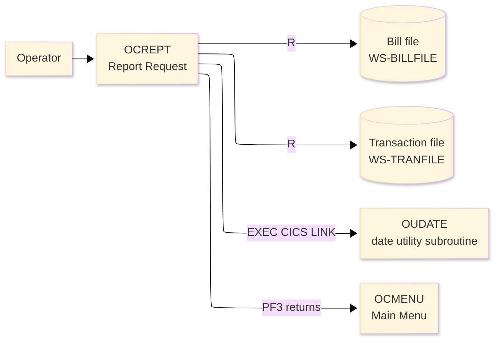
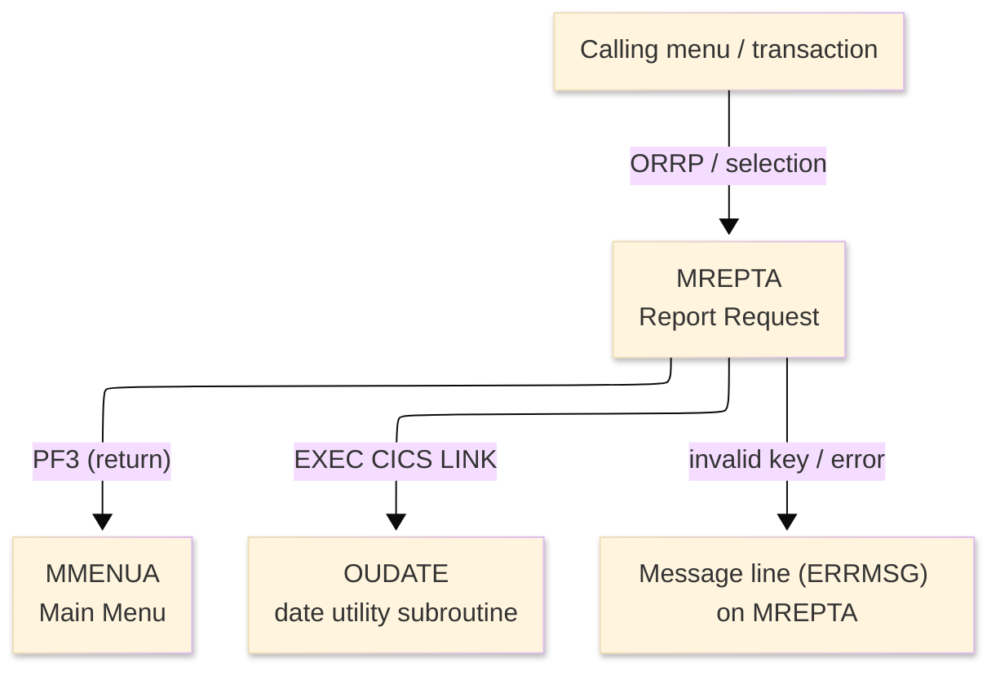
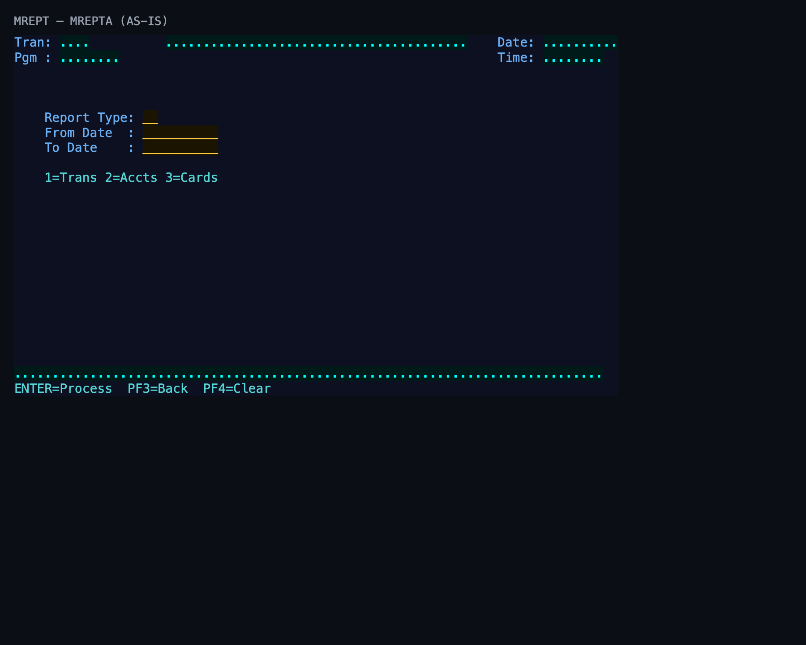

# Screen Design Document — OCREPT_ReportRequest

## 0. Cover

| Item | Content |
|---|---|
| System | ORION-CCMS (ORION Credit Card Management System) |
| Subsystem | On-line (CICS/BMS) |
| Function name | Report Request |
| Function ID | OCREPT |
| CICS transaction | ORRP |
| Version | 1 |
| Author / Created on | modernizeX／2026-09-28 |
| Updated by / Updated on | modernizeX／2026-09-28 |

Approval frame: Customer｜Author｜Approver｜Responsible person

## 1. Function overview

### 1.1 Overview diagram

System architecture — the transaction program, the files/tables it touches, the sub-programs it links to, and where it hands control.

### 1.2 Function overview

1. Accept the report selection and date range.
2. Submit the report request for the chosen report.
3. Confirm the request has been accepted.

**Roles:** authenticated operator (signed on through the Sign On screen).

**Function keys**

| Key | Label as rendered (verbatim) | What it does |
|---|---|---|
| `ENTER` | `ENTER=Process` | validate the entry and process the current step |
| `PF3` | `PF3=Back` | return to the main menu (OCMENU) |
| `PF4` | `PF4=Clear` | clear the entered values and start again |

### 1.3 Databases used

| № | Logical table name | Physical table/file name | Create(C) | Read(R) | Update(U) | Delete(D) | Notes |
|---|---|---|---|---|---|---|---|
| 1 | Bill file | WS-BILLFILE | - | 〇 | - | - | VSAM KSDS (EXEC CICS file control) |
| 2 | Transaction file | WS-TRANFILE | - | 〇 | - | - | VSAM KSDS (EXEC CICS file control) |

## 2. Screen spec

Screen transition of the whole function — every screen a box, every edge labelled with what moves the operator.

### 2.1 MREPTA — Report Request (OCREPT)

**Layout**

*This screen appears when the operator selects the report-request function.* Physical size 24×80 (mapset `MREPT`, map `MREPTA`).

**Item details**

| № | Field (BMS) | COBOL symbolic | Kind | Attributes | Line | Col | Character count (screen columns) | Colour | picin | picout | Initial value / caption | Notes |
|---|---|---|---|---|---|---|---|---|---|---|---|---|
| 1 | (literal) | — | caption | ASKIP/NORM | 1 | 1 | 5 | BLUE | — | — | Tran: | field header |
| 2 | TRNNAME | TRNNAMEO | display | ASKIP/NORM | 1 | 7 | 4 | BLUE | — | — | — | program-supplied display |
| 3 | TITLE | TITLEO | display | ASKIP/NORM | 1 | 21 | 40 | YELLOW | — | — | — | program-supplied display |
| 4 | (literal) | — | caption | ASKIP/NORM | 1 | 65 | 5 | BLUE | — | — | Date: | field header |
| 5 | CURDATE | CURDATEO | display | ASKIP/NORM | 1 | 71 | 10 | BLUE | — | — | — | program-supplied display |
| 6 | (literal) | — | caption | ASKIP/NORM | 2 | 1 | 5 | BLUE | — | — | Pgm : | field header |
| 7 | PGMNAME | PGMNAMEO | display | ASKIP/NORM | 2 | 7 | 8 | BLUE | — | — | — | program-supplied display |
| 8 | (literal) | — | caption | ASKIP/NORM | 2 | 65 | 5 | BLUE | — | — | Time: | field header |
| 9 | CURTIME | CURTIMEO | display | ASKIP/NORM | 2 | 71 | 8 | BLUE | — | — | — | program-supplied display |
| 10 | (literal) | — | caption | ASKIP/NORM | 6 | 5 | 12 | BLUE | — | — | Report Type: | field header |
| 11 | RPTYPE | RPTYPEO | input | UNPROT/IC/FSET | 6 | 18 | 2 | GREEN | — | — | — | operator input |
| 12 | (literal) | — | caption | ASKIP/NORM | 7 | 5 | 12 | BLUE | — | — | From Date  : | field header |
| 13 | RPFROM | RPFROMO | input | UNPROT/IC/FSET | 7 | 18 | 10 | GREEN | — | — | — | operator input |
| 14 | (literal) | — | caption | ASKIP/NORM | 8 | 5 | 12 | BLUE | — | — | To Date    : | field header |
| 15 | RPTO | RPTOO | input | UNPROT/IC/FSET | 8 | 18 | 10 | GREEN | — | — | — | operator input |
| 16 | (literal) | — | caption | ASKIP/NORM | 10 | 5 | 23 | TURQUOISE | — | — | 1=Trans 2=Accts 3=Cards | field header |
| 17 | ERRMSG | ERRMSGO | display | ASKIP/NORM | 23 | 1 | 78 | RED | — | — | — | program-supplied display |
| 18 | (literal) | — | caption | ASKIP/NORM | 24 | 1 | 34 | TURQUOISE | — | — | ENTER=Process  PF3=Back  PF4=Clear | field header |

**Item states**

> Legend: `○`=enabled ｜ `必`=enabled (required) ｜ `□`=display only ｜ `×`=hidden ｜ `レ`=initial focus

| № | Field (BMS) | Initial display | Selection entered |
|---|---|---|---|
| 1 | TRNNAME | □ | □ |
| 2 | TITLE | □ | □ |
| 3 | CURDATE | □ | □ |
| 4 | PGMNAME | □ | □ |
| 5 | CURTIME | □ | □ |
| 6 | RPTYPE | ○ | ○ |
| 7 | RPFROM | ○ | ○ |
| 8 | RPTO | ○ | ○ |
| 9 | ERRMSG | □ | □ |

## 3. Check specifications

### 3.1 MREPTA — Report Request

All messages below are the literal strings the program sends to the on-screen message line, extracted from the source. Type: E=Error / W=Warning / C=Confirm / I=Information.

| No. | Timing | Condition | Type | Display | Message content (verbatim) | Notes |
|---|---|---|---|---|---|---|
| 1 | ENTER / validation | processing state | I | A (message line) | Type 01=Bills 02=Trans, dates YYYY-MM-DD. | on-screen ERRMSG line |
| 2 | ENTER / validation | processing state | I | A (message line) | Unsupported report type. | on-screen ERRMSG line |
| 3 | ENTER / validation | a required field was left blank | E | A (message line) | Report type is required. | on-screen ERRMSG line |
| 4 | ENTER / validation | the entered value failed a field rule | E | A (message line) | Report type must be 01 or 02. | on-screen ERRMSG line |
| 5 | ENTER / validation | a required field was left blank | E | A (message line) | From and to dates are required. | on-screen ERRMSG line |
| 6 | ENTER / validation | processing state | I | A (message line) | From date is not a valid date. | on-screen ERRMSG line |
| 7 | ENTER / validation | processing state | I | A (message line) | To date is not a valid date. | on-screen ERRMSG line |
| 8 | ENTER / validation | processing state | I | A (message line) | From date is later than to date. | on-screen ERRMSG line |
| 9 | ENTER / validation | processing state | E | A (message line) | Error starting bill browse. | on-screen ERRMSG line |
| 10 | ENTER / validation | processing state | E | A (message line) | Error reading bill file. | on-screen ERRMSG line |
| 11 | ENTER / validation | processing state | E | A (message line) | Error starting tran browse. | on-screen ERRMSG line |
| 12 | ENTER / validation | processing state | E | A (message line) | Error reading tran file. | on-screen ERRMSG line |
| 13 | ENTER / validation | an unsupported key was pressed | E | A (message line) | Invalid key pressed. Please try again. | on-screen ERRMSG line |

## 4. Event specifications

### 4.1 MREPTA — Report Request

Per-key and per-field behaviour, written as operator steps.

| No. | Item | Timing / condition | Action | Next screen |
|---|---|---|---|---|
| **Function key section** | | | | |
| 1 | `ENTER` | when pressed | the report selection is validated and the request is submitted | stays on the screen, or continues to the main menu (OCMENU) |
| 2 | `PF3` | when pressed | cancel and return to the main menu (OCMENU) | the main menu (OCMENU) |
| 3 | `PF4` | when pressed | clear the entered values so the operator can start again | stays on the screen |
| **Data entry section** | | | | |
| 4 | Key field(s) | on ENTER | the report selection is validated and the request is submitted | stays on `MREPTA` (or shows a message) |

## 5. DB CRUD

**Update spec**

Not applicable — the Report Request screen only reads data; no table row is created, updated or deleted.

**Column-level CRUD (per event / business type)**

| Screen / table | Physical name | Field group | On ENTER — read |
|---|---|---|---|
| Bill file | WS-BILLFILE | whole record | R |
| Transaction file | WS-TRANFILE | whole record | R |

