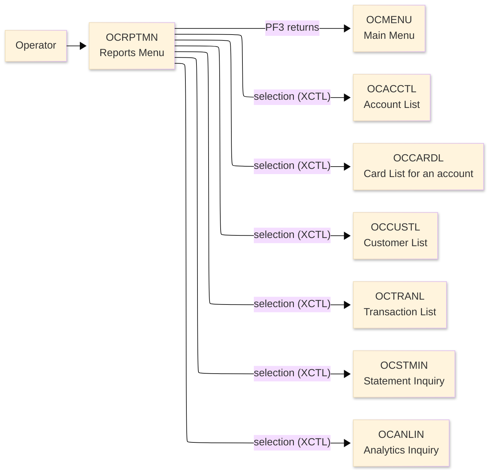
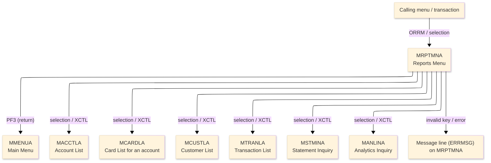
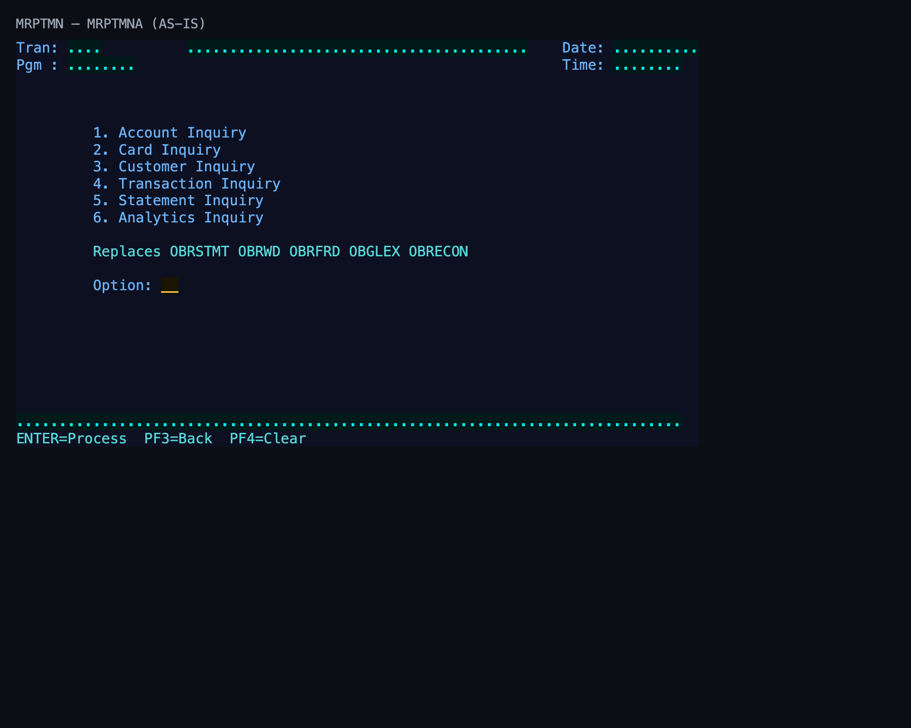

# Screen Design Document — OCRPTMN_ReportsMenu

## 0. Cover

| Item | Content |
|---|---|
| System | ORION-CCMS (ORION Credit Card Management System) |
| Subsystem | On-line (CICS/BMS) |
| Function name | Reports Menu |
| Function ID | OCRPTMN |
| CICS transaction | ORRM |
| Version | 1 |
| Author / Created on | modernizeX／2026-09-28 |
| Updated by / Updated on | modernizeX／2026-09-28 |

Approval frame: Customer｜Author｜Approver｜Responsible person

## 1. Function overview

### 1.1 Overview diagram

System architecture — the transaction program, the files/tables it touches, the sub-programs it links to, and where it hands control.

### 1.2 Function overview

1. Present the available functions as a numbered option list.
2. Read the operator's option and hand control to the matching transaction.
3. Return the operator to the sign-on screen on exit.

**Roles:** authenticated operator (signed on through the Sign On screen).

**Function keys**

| Key | Label as rendered (verbatim) | What it does |
|---|---|---|
| `ENTER` | `ENTER=Process` | validate the entry and process the current step |
| `PF3` | `PF3=Back` | return to the main menu (OCMENU) |
| `PF4` | `PF4=Clear` | clear the entered values and start again |

### 1.3 Databases used

| № | Logical table name | Physical table/file name | Create(C) | Read(R) | Update(U) | Delete(D) | Notes |
|---|---|---|---|---|---|---|---|
| 1 | — | — | - | - | - | - | Not applicable — navigation only; file access is performed by the linked sub-programs |

## 2. Screen spec

Screen transition of the whole function — every screen a box, every edge labelled with what moves the operator.

### 2.1 MRPTMNA — Reports Menu (OCRPTMN)

**Layout**

*This screen appears after a successful sign-on and whenever the operator returns from a function.* Physical size 24×80 (mapset `MRPTMN`, map `MRPTMNA`).

**Item details**

| № | Field (BMS) | COBOL symbolic | Kind | Attributes | Line | Col | Character count (screen columns) | Colour | picin | picout | Initial value / caption | Notes |
|---|---|---|---|---|---|---|---|---|---|---|---|---|
| 1 | (literal) | — | caption | ASKIP/NORM | 1 | 1 | 5 | BLUE | — | — | Tran: | field header |
| 2 | TRNNAME | TRNNAMEO | display | ASKIP/NORM | 1 | 7 | 4 | BLUE | — | — | — | program-supplied display |
| 3 | TITLE | TITLEO | display | ASKIP/NORM | 1 | 21 | 40 | YELLOW | — | — | — | program-supplied display |
| 4 | (literal) | — | caption | ASKIP/NORM | 1 | 65 | 5 | BLUE | — | — | Date: | field header |
| 5 | CURDATE | CURDATEO | display | ASKIP/NORM | 1 | 71 | 10 | BLUE | — | — | — | program-supplied display |
| 6 | (literal) | — | caption | ASKIP/NORM | 2 | 1 | 5 | BLUE | — | — | Pgm : | field header |
| 7 | PGMNAME | PGMNAMEO | display | ASKIP/NORM | 2 | 7 | 8 | BLUE | — | — | — | program-supplied display |
| 8 | (literal) | — | caption | ASKIP/NORM | 2 | 65 | 5 | BLUE | — | — | Time: | field header |
| 9 | CURTIME | CURTIMEO | display | ASKIP/NORM | 2 | 71 | 8 | BLUE | — | — | — | program-supplied display |
| 10 | (literal) | — | caption | ASKIP/NORM | 6 | 10 | 18 | BLUE | — | — | 1. Account Inquiry | field header |
| 11 | (literal) | — | caption | ASKIP/NORM | 7 | 10 | 15 | BLUE | — | — | 2. Card Inquiry | field header |
| 12 | (literal) | — | caption | ASKIP/NORM | 8 | 10 | 19 | BLUE | — | — | 3. Customer Inquiry | field header |
| 13 | (literal) | — | caption | ASKIP/NORM | 9 | 10 | 22 | BLUE | — | — | 4. Transaction Inquiry | field header |
| 14 | (literal) | — | caption | ASKIP/NORM | 10 | 10 | 20 | BLUE | — | — | 5. Statement Inquiry | field header |
| 15 | (literal) | — | caption | ASKIP/NORM | 11 | 10 | 20 | BLUE | — | — | 6. Analytics Inquiry | field header |
| 16 | (literal) | — | caption | ASKIP/NORM | 13 | 10 | 44 | TURQUOISE | — | — | Replaces OBRSTMT OBRWD OBRFRD OBGLEX OBRECON | field header |
| 17 | (literal) | — | caption | ASKIP/NORM | 15 | 10 | 7 | BLUE | — | — | Option: | field header |
| 18 | OPTION | OPTIONO | input | UNPROT/IC/FSET | 15 | 18 | 2 | GREEN | — | — | — | operator input |
| 19 | ERRMSG | ERRMSGO | display | ASKIP/NORM | 23 | 1 | 78 | RED | — | — | — | program-supplied display |
| 20 | (literal) | — | caption | ASKIP/NORM | 24 | 1 | 34 | TURQUOISE | — | — | ENTER=Process  PF3=Back  PF4=Clear | field header |

**Item states**

> Legend: `○`=enabled ｜ `必`=enabled (required) ｜ `□`=display only ｜ `×`=hidden ｜ `レ`=initial focus

| № | Field (BMS) | Initial display | Option entered |
|---|---|---|---|
| 1 | TRNNAME | □ | □ |
| 2 | TITLE | □ | □ |
| 3 | CURDATE | □ | □ |
| 4 | PGMNAME | □ | □ |
| 5 | CURTIME | □ | □ |
| 6 | OPTION | ○ | ○ |
| 7 | ERRMSG | □ | □ |

## 3. Check specifications

### 3.1 MRPTMNA — Reports Menu

All messages below are the literal strings the program sends to the on-screen message line, extracted from the source. Type: E=Error / W=Warning / C=Confirm / I=Information.

| No. | Timing | Condition | Type | Display | Message content (verbatim) | Notes |
|---|---|---|---|---|---|---|
| 1 | ENTER / validation | an unsupported key was pressed | E | A (message line) | Invalid key pressed. Please try again. | on-screen ERRMSG line |

## 4. Event specifications

### 4.1 MRPTMNA — Reports Menu

Per-key and per-field behaviour, written as operator steps.

| No. | Item | Timing / condition | Action | Next screen |
|---|---|---|---|---|
| **Function key section** | | | | |
| 1 | `ENTER` | when pressed | the chosen option number is checked and control passes to the matching transaction | stays on the screen, or continues to the main menu (OCMENU) |
| 2 | `PF3` | when pressed | cancel and return to the main menu (OCMENU) | the main menu (OCMENU) |
| 3 | `PF4` | when pressed | clear the entered values so the operator can start again | stays on the screen |
| **Data entry section** | | | | |
| 4 | Key field(s) | on ENTER | the chosen option number is checked and control passes to the matching transaction | stays on `MRPTMNA` (or shows a message) |

## 5. DB CRUD

**Update spec**

Not applicable — the Reports Menu screen only reads data; no table row is created, updated or deleted.

**Column-level CRUD (per event / business type)**

| Screen / table | Physical name | Field group | On ENTER — read |
|---|---|---|---|
| — | — | none | none |

