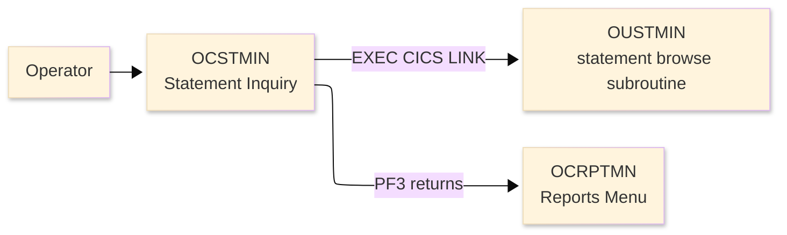
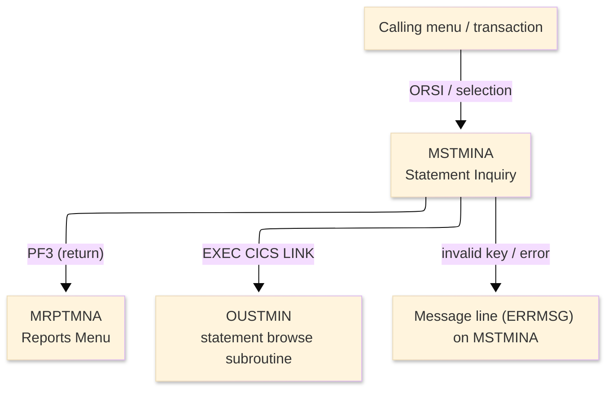
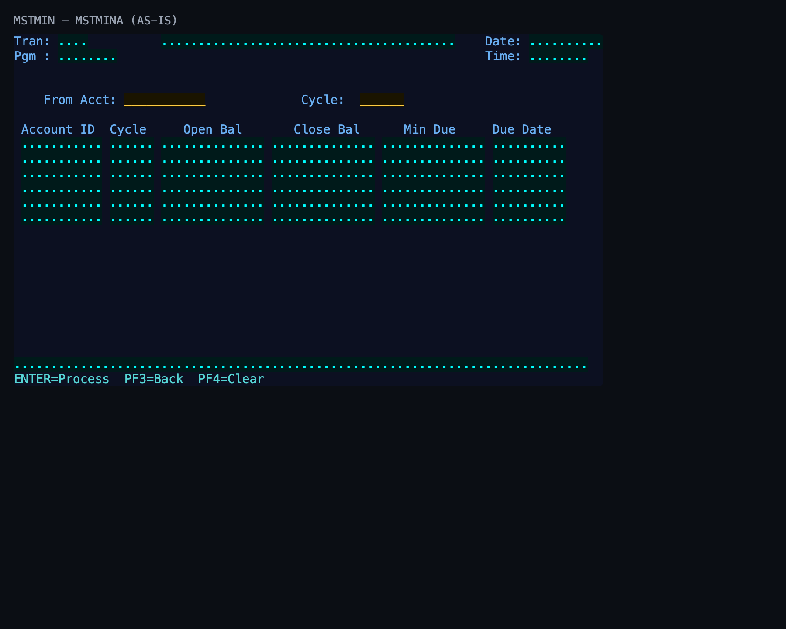

# Screen Design Document — OCSTMIN_StatementInquiry

## 0. Cover

| Item | Content |
|---|---|
| System | ORION-CCMS (ORION Credit Card Management System) |
| Subsystem | On-line (CICS/BMS) |
| Function name | Statement Inquiry |
| Function ID | OCSTMIN |
| CICS transaction | ORSI |
| Version | 1 |
| Author / Created on | modernizeX／2026-09-28 |
| Updated by / Updated on | modernizeX／2026-09-28 |

Approval frame: Customer｜Author｜Approver｜Responsible person

## 1. Function overview

### 1.1 Overview diagram

System architecture — the transaction program, the files/tables it touches, the sub-programs it links to, and where it hands control.

### 1.2 Function overview

1. Accept the search key for the statement inquiry.
2. Retrieve and display the matching statement information for review.
3. Let the operator refine the key and inquire again.

**Roles:** authenticated operator (signed on through the Sign On screen).

**Function keys**

| Key | Label as rendered (verbatim) | What it does |
|---|---|---|
| `ENTER` | `ENTER=Process` | validate the entry and process the current step |
| `PF3` | `PF3=Back` | return to the reports menu (OCRPTMN) |
| `PF4` | `PF4=Clear` | clear the entered values and start again |

### 1.3 Databases used

| № | Logical table name | Physical table/file name | Create(C) | Read(R) | Update(U) | Delete(D) | Notes |
|---|---|---|---|---|---|---|---|
| 1 | — | — | - | - | - | - | Not applicable — navigation only; file access is performed by the linked sub-programs |

## 2. Screen spec

Screen transition of the whole function — every screen a box, every edge labelled with what moves the operator.

### 2.1 MSTMINA — Statement Inquiry (OCSTMIN)

**Layout**

*This screen appears when the operator opens the inquiry function.* Physical size 24×80 (mapset `MSTMIN`, map `MSTMINA`).

**Item details**

| № | Field (BMS) | COBOL symbolic | Kind | Attributes | Line | Col | Character count (screen columns) | Colour | picin | picout | Initial value / caption | Notes |
|---|---|---|---|---|---|---|---|---|---|---|---|---|
| 1 | (literal) | — | caption | ASKIP/NORM | 1 | 1 | 5 | BLUE | — | — | Tran: | field header |
| 2 | TRNNAME | TRNNAMEO | display | ASKIP/NORM | 1 | 7 | 4 | BLUE | — | — | — | program-supplied display |
| 3 | TITLE | TITLEO | display | ASKIP/NORM | 1 | 21 | 40 | YELLOW | — | — | — | program-supplied display |
| 4 | (literal) | — | caption | ASKIP/NORM | 1 | 65 | 5 | BLUE | — | — | Date: | field header |
| 5 | CURDATE | CURDATEO | display | ASKIP/NORM | 1 | 71 | 10 | BLUE | — | — | — | program-supplied display |
| 6 | (literal) | — | caption | ASKIP/NORM | 2 | 1 | 5 | BLUE | — | — | Pgm : | field header |
| 7 | PGMNAME | PGMNAMEO | display | ASKIP/NORM | 2 | 7 | 8 | BLUE | — | — | — | program-supplied display |
| 8 | (literal) | — | caption | ASKIP/NORM | 2 | 65 | 5 | BLUE | — | — | Time: | field header |
| 9 | CURTIME | CURTIMEO | display | ASKIP/NORM | 2 | 71 | 8 | BLUE | — | — | — | program-supplied display |
| 10 | (literal) | — | caption | ASKIP/NORM | 5 | 5 | 10 | BLUE | — | — | From Acct: | field header |
| 11 | FRACCT | FRACCTO | input | UNPROT/IC/FSET | 5 | 16 | 11 | GREEN | — | — | — | operator input |
| 12 | (literal) | — | caption | ASKIP/NORM | 5 | 40 | 6 | BLUE | — | — | Cycle: | field header |
| 13 | FRCYC | FRCYCO | input | UNPROT/IC/FSET | 5 | 48 | 6 | GREEN | — | — | — | operator input |
| 14 | (literal) | — | caption | ASKIP/NORM | 7 | 2 | 10 | BLUE | — | — | Account ID | field header |
| 15 | (literal) | — | caption | ASKIP/NORM | 7 | 14 | 5 | BLUE | — | — | Cycle | field header |
| 16 | (literal) | — | caption | ASKIP/NORM | 7 | 24 | 8 | BLUE | — | — | Open Bal | field header |
| 17 | (literal) | — | caption | ASKIP/NORM | 7 | 39 | 9 | BLUE | — | — | Close Bal | field header |
| 18 | (literal) | — | caption | ASKIP/NORM | 7 | 54 | 7 | BLUE | — | — | Min Due | field header |
| 19 | (literal) | — | caption | ASKIP/NORM | 7 | 66 | 8 | BLUE | — | — | Due Date | field header |
| 20 | SA1 | SA1O | display | ASKIP/NORM | 8 | 2 | 11 | TURQUOISE | — | — | — | program-supplied display |
| 21 | SC1 | SC1O | display | ASKIP/NORM | 8 | 14 | 6 | TURQUOISE | — | — | — | program-supplied display |
| 22 | SO1 | SO1O | display | ASKIP/NORM | 8 | 21 | 14 | TURQUOISE | — | — | — | program-supplied display |
| 23 | SL1 | SL1O | display | ASKIP/NORM | 8 | 36 | 14 | TURQUOISE | — | — | — | program-supplied display |
| 24 | SM1 | SM1O | display | ASKIP/NORM | 8 | 51 | 14 | TURQUOISE | — | — | — | program-supplied display |
| 25 | SD1 | SD1O | display | ASKIP/NORM | 8 | 66 | 10 | TURQUOISE | — | — | — | program-supplied display |
| 26 | SA2 | SA2O | display | ASKIP/NORM | 9 | 2 | 11 | TURQUOISE | — | — | — | program-supplied display |
| 27 | SC2 | SC2O | display | ASKIP/NORM | 9 | 14 | 6 | TURQUOISE | — | — | — | program-supplied display |
| 28 | SO2 | SO2O | display | ASKIP/NORM | 9 | 21 | 14 | TURQUOISE | — | — | — | program-supplied display |
| 29 | SL2 | SL2O | display | ASKIP/NORM | 9 | 36 | 14 | TURQUOISE | — | — | — | program-supplied display |
| 30 | SM2 | SM2O | display | ASKIP/NORM | 9 | 51 | 14 | TURQUOISE | — | — | — | program-supplied display |
| 31 | SD2 | SD2O | display | ASKIP/NORM | 9 | 66 | 10 | TURQUOISE | — | — | — | program-supplied display |
| 32 | SA3 | SA3O | display | ASKIP/NORM | 10 | 2 | 11 | TURQUOISE | — | — | — | program-supplied display |
| 33 | SC3 | SC3O | display | ASKIP/NORM | 10 | 14 | 6 | TURQUOISE | — | — | — | program-supplied display |
| 34 | SO3 | SO3O | display | ASKIP/NORM | 10 | 21 | 14 | TURQUOISE | — | — | — | program-supplied display |
| 35 | SL3 | SL3O | display | ASKIP/NORM | 10 | 36 | 14 | TURQUOISE | — | — | — | program-supplied display |
| 36 | SM3 | SM3O | display | ASKIP/NORM | 10 | 51 | 14 | TURQUOISE | — | — | — | program-supplied display |
| 37 | SD3 | SD3O | display | ASKIP/NORM | 10 | 66 | 10 | TURQUOISE | — | — | — | program-supplied display |
| 38 | SA4 | SA4O | display | ASKIP/NORM | 11 | 2 | 11 | TURQUOISE | — | — | — | program-supplied display |
| 39 | SC4 | SC4O | display | ASKIP/NORM | 11 | 14 | 6 | TURQUOISE | — | — | — | program-supplied display |
| 40 | SO4 | SO4O | display | ASKIP/NORM | 11 | 21 | 14 | TURQUOISE | — | — | — | program-supplied display |
| 41 | SL4 | SL4O | display | ASKIP/NORM | 11 | 36 | 14 | TURQUOISE | — | — | — | program-supplied display |
| 42 | SM4 | SM4O | display | ASKIP/NORM | 11 | 51 | 14 | TURQUOISE | — | — | — | program-supplied display |
| 43 | SD4 | SD4O | display | ASKIP/NORM | 11 | 66 | 10 | TURQUOISE | — | — | — | program-supplied display |
| 44 | SA5 | SA5O | display | ASKIP/NORM | 12 | 2 | 11 | TURQUOISE | — | — | — | program-supplied display |
| 45 | SC5 | SC5O | display | ASKIP/NORM | 12 | 14 | 6 | TURQUOISE | — | — | — | program-supplied display |
| 46 | SO5 | SO5O | display | ASKIP/NORM | 12 | 21 | 14 | TURQUOISE | — | — | — | program-supplied display |
| 47 | SL5 | SL5O | display | ASKIP/NORM | 12 | 36 | 14 | TURQUOISE | — | — | — | program-supplied display |
| 48 | SM5 | SM5O | display | ASKIP/NORM | 12 | 51 | 14 | TURQUOISE | — | — | — | program-supplied display |
| 49 | SD5 | SD5O | display | ASKIP/NORM | 12 | 66 | 10 | TURQUOISE | — | — | — | program-supplied display |
| 50 | SA6 | SA6O | display | ASKIP/NORM | 13 | 2 | 11 | TURQUOISE | — | — | — | program-supplied display |
| 51 | SC6 | SC6O | display | ASKIP/NORM | 13 | 14 | 6 | TURQUOISE | — | — | — | program-supplied display |
| 52 | SO6 | SO6O | display | ASKIP/NORM | 13 | 21 | 14 | TURQUOISE | — | — | — | program-supplied display |
| 53 | SL6 | SL6O | display | ASKIP/NORM | 13 | 36 | 14 | TURQUOISE | — | — | — | program-supplied display |
| 54 | SM6 | SM6O | display | ASKIP/NORM | 13 | 51 | 14 | TURQUOISE | — | — | — | program-supplied display |
| 55 | SD6 | SD6O | display | ASKIP/NORM | 13 | 66 | 10 | TURQUOISE | — | — | — | program-supplied display |
| 56 | ERRMSG | ERRMSGO | display | ASKIP/NORM | 23 | 1 | 78 | RED | — | — | — | program-supplied display |
| 57 | (literal) | — | caption | ASKIP/NORM | 24 | 1 | 34 | TURQUOISE | — | — | ENTER=Process  PF3=Back  PF4=Clear | field header |

**Item states**

> Legend: `○`=enabled ｜ `必`=enabled (required) ｜ `□`=display only ｜ `×`=hidden ｜ `レ`=initial focus

| № | Field (BMS) | Initial display (key prompt) | Result displayed |
|---|---|---|---|
| 1 | TRNNAME | □ | □ |
| 2 | TITLE | □ | □ |
| 3 | CURDATE | □ | □ |
| 4 | PGMNAME | □ | □ |
| 5 | CURTIME | □ | □ |
| 6 | FRACCT | ○ | □ |
| 7 | FRCYC | ○ | □ |
| 8 | SA1 | □ | □ |
| 9 | SC1 | □ | □ |
| 10 | SO1 | □ | □ |
| 11 | SL1 | □ | □ |
| 12 | SM1 | □ | □ |
| 13 | SD1 | □ | □ |
| 14 | SA2 | □ | □ |
| 15 | SC2 | □ | □ |
| 16 | SO2 | □ | □ |
| 17 | SL2 | □ | □ |
| 18 | SM2 | □ | □ |
| 19 | SD2 | □ | □ |
| 20 | SA3 | □ | □ |
| 21 | SC3 | □ | □ |
| 22 | SO3 | □ | □ |
| 23 | SL3 | □ | □ |
| 24 | SM3 | □ | □ |
| 25 | SD3 | □ | □ |
| 26 | SA4 | □ | □ |
| 27 | SC4 | □ | □ |
| 28 | SO4 | □ | □ |
| 29 | SL4 | □ | □ |
| 30 | SM4 | □ | □ |
| 31 | SD4 | □ | □ |
| 32 | SA5 | □ | □ |
| 33 | SC5 | □ | □ |
| 34 | SO5 | □ | □ |
| 35 | SL5 | □ | □ |
| 36 | SM5 | □ | □ |
| 37 | SD5 | □ | □ |
| 38 | SA6 | □ | □ |
| 39 | SC6 | □ | □ |
| 40 | SO6 | □ | □ |
| 41 | SL6 | □ | □ |
| 42 | SM6 | □ | □ |
| 43 | SD6 | □ | □ |
| 44 | ERRMSG | □ | □ |

## 3. Check specifications

### 3.1 MSTMINA — Statement Inquiry

All messages below are the literal strings the program sends to the on-screen message line, extracted from the source. Type: E=Error / W=Warning / C=Confirm / I=Information.

| No. | Timing | Condition | Type | Display | Message content (verbatim) | Notes |
|---|---|---|---|---|---|---|
| 1 | ENTER / validation | an unsupported key was pressed | E | A (message line) | Invalid key pressed. Please try again. | on-screen ERRMSG line |

## 4. Event specifications

### 4.1 MSTMINA — Statement Inquiry

Per-key and per-field behaviour, written as operator steps.

| No. | Item | Timing / condition | Action | Next screen |
|---|---|---|---|---|
| **Function key section** | | | | |
| 1 | `ENTER` | when pressed | the search key is accepted and the matching statement information is displayed | stays on the screen, or continues to the reports menu (OCRPTMN) |
| 2 | `PF3` | when pressed | cancel and return to the reports menu (OCRPTMN) | the reports menu (OCRPTMN) |
| 3 | `PF4` | when pressed | clear the entered values so the operator can start again | stays on the screen |
| 4 | `PF7` | when pressed | page backward to the previous page of rows | stays on the screen |
| 5 | `PF8` | when pressed | page forward to the next page of rows | stays on the screen |
| **Data entry section** | | | | |
| 6 | Key field(s) | on ENTER | the search key is accepted and the matching statement information is displayed | stays on `MSTMINA` (or shows a message) |

## 5. DB CRUD

**Update spec**

Not applicable — the Statement Inquiry screen only reads data; no table row is created, updated or deleted.

**Column-level CRUD (per event / business type)**

| Screen / table | Physical name | Field group | On ENTER — read |
|---|---|---|---|
| — | — | none | none |

