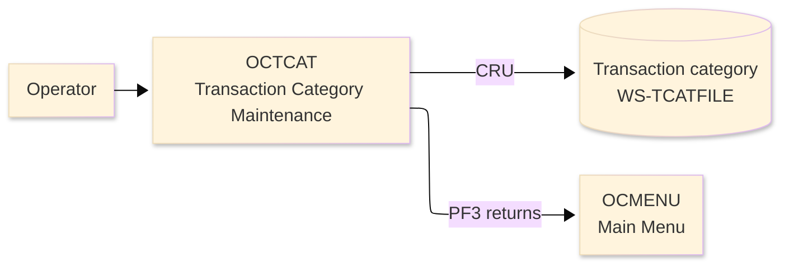
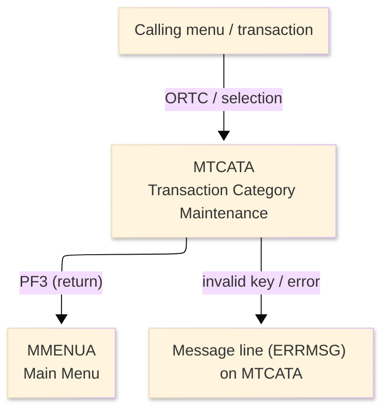
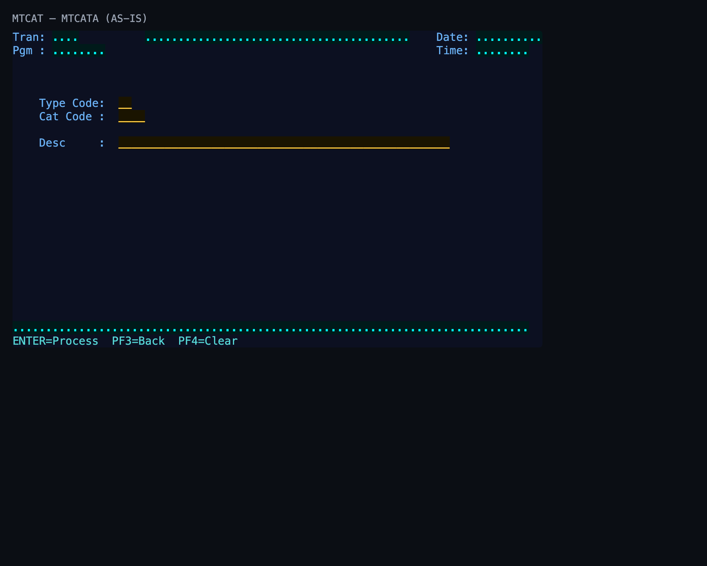

# Screen Design Document — OCTCAT_TranCategoryMaint

## 0. Cover

| Item | Content |
|---|---|
| System | ORION-CCMS (ORION Credit Card Management System) |
| Subsystem | On-line (CICS/BMS) |
| Function name | Transaction Category Maintenance |
| Function ID | OCTCAT |
| CICS transaction | ORTC |
| Version | 1 |
| Author / Created on | modernizeX／2026-09-28 |
| Updated by / Updated on | modernizeX／2026-09-28 |

Approval frame: Customer｜Author｜Approver｜Responsible person

## 1. Function overview

### 1.1 Overview diagram

System architecture — the transaction program, the files/tables it touches, the sub-programs it links to, and where it hands control.

### 1.2 Function overview

1. Look up the transaction code and display its current definition.
2. Let the operator add, change or remove the transaction definition.
3. Validate and apply the maintenance action on confirmation.

**Roles:** authenticated operator (signed on through the Sign On screen).

**Function keys**

| Key | Label as rendered (verbatim) | What it does |
|---|---|---|
| `ENTER` | `ENTER=Process` | validate the entry and process the current step |
| `PF3` | `PF3=Back` | return to the main menu (OCMENU) |
| `PF4` | `PF4=Clear` | clear the entered values and start again |

### 1.3 Databases used

| № | Logical table name | Physical table/file name | Create(C) | Read(R) | Update(U) | Delete(D) | Notes |
|---|---|---|---|---|---|---|---|
| 1 | Transaction category | WS-TCATFILE | 〇 | 〇 | 〇 | - | VSAM KSDS (EXEC CICS file control) |

## 2. Screen spec

Screen transition of the whole function — every screen a box, every edge labelled with what moves the operator.

### 2.1 MTCATA — Transaction Category Maintenance (OCTCAT)

**Layout**

*This screen appears when the operator selects the maintenance function.* Physical size 24×80 (mapset `MTCAT`, map `MTCATA`).

**Item details**

| № | Field (BMS) | COBOL symbolic | Kind | Attributes | Line | Col | Character count (screen columns) | Colour | picin | picout | Initial value / caption | Notes |
|---|---|---|---|---|---|---|---|---|---|---|---|---|
| 1 | (literal) | — | caption | ASKIP/NORM | 1 | 1 | 5 | BLUE | — | — | Tran: | field header |
| 2 | TRNNAME | TRNNAMEO | display | ASKIP/NORM | 1 | 7 | 4 | BLUE | — | — | — | program-supplied display |
| 3 | TITLE | TITLEO | display | ASKIP/NORM | 1 | 21 | 40 | YELLOW | — | — | — | program-supplied display |
| 4 | (literal) | — | caption | ASKIP/NORM | 1 | 65 | 5 | BLUE | — | — | Date: | field header |
| 5 | CURDATE | CURDATEO | display | ASKIP/NORM | 1 | 71 | 10 | BLUE | — | — | — | program-supplied display |
| 6 | (literal) | — | caption | ASKIP/NORM | 2 | 1 | 5 | BLUE | — | — | Pgm : | field header |
| 7 | PGMNAME | PGMNAMEO | display | ASKIP/NORM | 2 | 7 | 8 | BLUE | — | — | — | program-supplied display |
| 8 | (literal) | — | caption | ASKIP/NORM | 2 | 65 | 5 | BLUE | — | — | Time: | field header |
| 9 | CURTIME | CURTIMEO | display | ASKIP/NORM | 2 | 71 | 8 | BLUE | — | — | — | program-supplied display |
| 10 | (literal) | — | caption | ASKIP/NORM | 6 | 5 | 10 | BLUE | — | — | Type Code: | field header |
| 11 | TCTYPE | TCTYPEO | input | UNPROT/IC/FSET | 6 | 17 | 2 | GREEN | — | — | — | operator input |
| 12 | (literal) | — | caption | ASKIP/NORM | 7 | 5 | 10 | BLUE | — | — | Cat Code : | field header |
| 13 | TCCD | TCCDO | input | UNPROT/IC/FSET | 7 | 17 | 4 | GREEN | — | — | — | operator input |
| 14 | (literal) | — | caption | ASKIP/NORM | 9 | 5 | 10 | BLUE | — | — | Desc     : | field header |
| 15 | TCDESC | TCDESCO | input | UNPROT/IC/FSET | 9 | 17 | 50 | GREEN | — | — | — | operator input |
| 16 | ERRMSG | ERRMSGO | display | ASKIP/NORM | 23 | 1 | 78 | RED | — | — | — | program-supplied display |
| 17 | (literal) | — | caption | ASKIP/NORM | 24 | 1 | 34 | TURQUOISE | — | — | ENTER=Process  PF3=Back  PF4=Clear | field header |

**Item states**

> Legend: `○`=enabled ｜ `必`=enabled (required) ｜ `□`=display only ｜ `×`=hidden ｜ `レ`=initial focus

| № | Field (BMS) | Initial display | Record loaded | Confirm action |
|---|---|---|---|---|
| 1 | TRNNAME | □ | □ | □ |
| 2 | TITLE | □ | □ | □ |
| 3 | CURDATE | □ | □ | □ |
| 4 | PGMNAME | □ | □ | □ |
| 5 | CURTIME | □ | □ | □ |
| 6 | TCTYPE | ○ | ○ | □ |
| 7 | TCCD | ○ | ○ | □ |
| 8 | TCDESC | ○ | ○ | □ |
| 9 | ERRMSG | □ | □ | □ |

## 3. Check specifications

### 3.1 MTCATA — Transaction Category Maintenance

All messages below are the literal strings the program sends to the on-screen message line, extracted from the source. Type: E=Error / W=Warning / C=Confirm / I=Information.

| No. | Timing | Condition | Type | Display | Message content (verbatim) | Notes |
|---|---|---|---|---|---|---|
| 1 | ENTER / validation | an unsupported key was pressed | E | A (message line) | Invalid key pressed. Please try again. | on-screen ERRMSG line |

## 4. Event specifications

### 4.1 MTCATA — Transaction Category Maintenance

Per-key and per-field behaviour, written as operator steps.

| No. | Item | Timing / condition | Action | Next screen |
|---|---|---|---|---|
| **Function key section** | | | | |
| 1 | `ENTER` | when pressed | the entered transaction definition is validated and the maintenance action is applied | stays on the screen, or continues to the main menu (OCMENU) |
| 2 | `PF3` | when pressed | cancel and return to the main menu (OCMENU) | the main menu (OCMENU) |
| 3 | `PF4` | when pressed | clear the entered values so the operator can start again | stays on the screen |
| 4 | `PF5` | when pressed | confirm and save the change to the file | stays on the screen with a result message |
| **Data entry section** | | | | |
| 5 | Key field(s) | on ENTER | the entered transaction definition is validated and the maintenance action is applied | stays on `MTCATA` (or shows a message) |

## 5. DB CRUD

**Update spec**

### WS-TCATFILE — Transaction category

| No. | PK | Item name | Field | On add | On change | On delete |
|---|---|---|---|---|---|---|
| 1 | ✓ | Type Cd | TC-TYPE-CD | read | read | delete record |
| 2 |  | Cd | TC-CD | read | read | — |
| 3 |  | Desc | TC-DESC | read | read | — |
| 4 |  | Filler | FILLER | read | read | — |

**Column-level CRUD (per event / business type)**

| Screen / table | Physical name | Field group | On add | On change | On delete |
|---|---|---|---|---|---|
| Transaction category | WS-TCATFILE | whole record | C/R/U | C/R/U | C/R/U |

