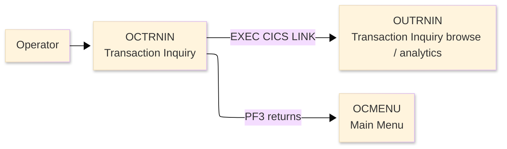
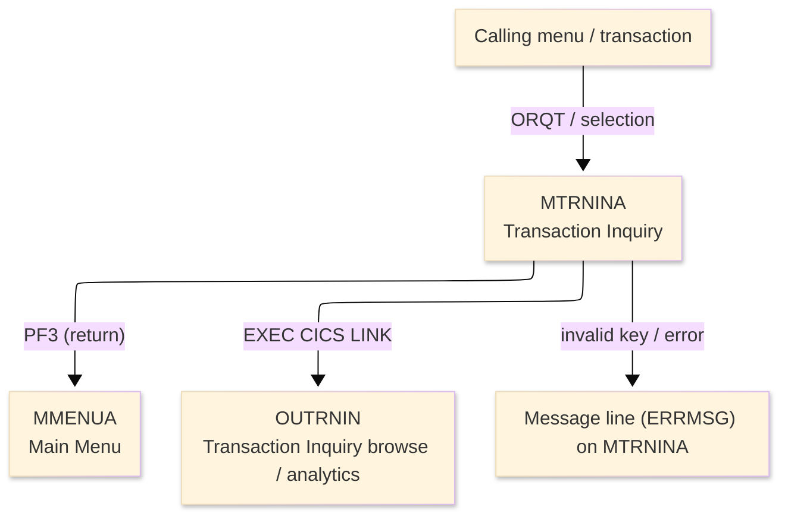
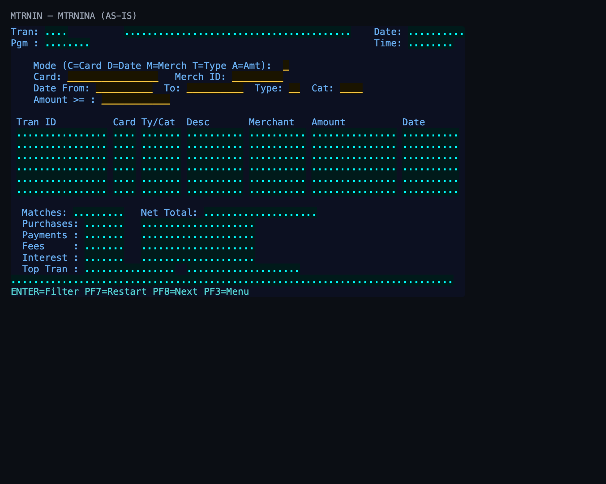

# Screen Design Document — OCTRNIN_TransactionInquiry

## 0. Cover

| Item | Content |
|---|---|
| System | ORION-CCMS (ORION Credit Card Management System) |
| Subsystem | On-line (CICS/BMS) |
| Function name | Transaction Inquiry |
| Function ID | OCTRNIN |
| CICS transaction | ORQT |
| Version | 1 |
| Author / Created on | modernizeX／2026-09-28 |
| Updated by / Updated on | modernizeX／2026-09-28 |

Approval frame: Customer｜Author｜Approver｜Responsible person

## 1. Function overview

### 1.1 Overview diagram

System architecture — the transaction program, the files/tables it touches, the sub-programs it links to, and where it hands control.

### 1.2 Function overview

1. Accept the search key for the transaction inquiry.
2. Retrieve and display the matching transaction information for review.
3. Let the operator refine the key and inquire again.

**Roles:** authenticated operator (signed on through the Sign On screen).

**Function keys**

| Key | Label as rendered (verbatim) | What it does |
|---|---|---|
| `ENTER` | `ENTER=Filter` | validate the entry and process the current step |
| `PF7` | `PF7=Restart` | page backward through the list |
| `PF8` | `PF8=Next` | page forward through the list |
| `PF3` | `PF3=Menu` | return to the main menu (OCMENU) |

### 1.3 Databases used

| № | Logical table name | Physical table/file name | Create(C) | Read(R) | Update(U) | Delete(D) | Notes |
|---|---|---|---|---|---|---|---|
| 1 | — | — | - | - | - | - | Not applicable — navigation only; file access is performed by the linked sub-programs |

## 2. Screen spec

Screen transition of the whole function — every screen a box, every edge labelled with what moves the operator.

### 2.1 MTRNINA — Transaction Inquiry (OCTRNIN)

**Layout**

*This screen appears when the operator opens the inquiry function.* Physical size 24×80 (mapset `MTRNIN`, map `MTRNINA`).

**Item details**

| № | Field (BMS) | COBOL symbolic | Kind | Attributes | Line | Col | Character count (screen columns) | Colour | picin | picout | Initial value / caption | Notes |
|---|---|---|---|---|---|---|---|---|---|---|---|---|
| 1 | (literal) | — | caption | ASKIP/NORM | 1 | 1 | 5 | BLUE | — | — | Tran: | field header |
| 2 | TRNNAME | TRNNAMEO | display | ASKIP/NORM | 1 | 7 | 4 | BLUE | — | — | — | program-supplied display |
| 3 | TITLE | TITLEO | display | ASKIP/NORM | 1 | 21 | 40 | YELLOW | — | — | — | program-supplied display |
| 4 | (literal) | — | caption | ASKIP/NORM | 1 | 65 | 5 | BLUE | — | — | Date: | field header |
| 5 | CURDATE | CURDATEO | display | ASKIP/NORM | 1 | 71 | 10 | BLUE | — | — | — | program-supplied display |
| 6 | (literal) | — | caption | ASKIP/NORM | 2 | 1 | 5 | BLUE | — | — | Pgm : | field header |
| 7 | PGMNAME | PGMNAMEO | display | ASKIP/NORM | 2 | 7 | 8 | BLUE | — | — | — | program-supplied display |
| 8 | (literal) | — | caption | ASKIP/NORM | 2 | 65 | 5 | BLUE | — | — | Time: | field header |
| 9 | CURTIME | CURTIMEO | display | ASKIP/NORM | 2 | 71 | 8 | BLUE | — | — | — | program-supplied display |
| 10 | (literal) | — | caption | ASKIP/NORM | 4 | 5 | 42 | BLUE | — | — | Mode (C=Card D=Date M=Merch T=Type A=Amt): | field header |
| 11 | TMODE | TMODEO | input | UNPROT/IC/FSET | 4 | 49 | 1 | GREEN | — | — | — | operator input |
| 12 | (literal) | — | caption | ASKIP/NORM | 5 | 5 | 5 | BLUE | — | — | Card: | field header |
| 13 | FCARD | FCARDO | input | UNPROT/IC/FSET | 5 | 11 | 16 | GREEN | — | — | — | operator input |
| 14 | (literal) | — | caption | ASKIP/NORM | 5 | 30 | 9 | BLUE | — | — | Merch ID: | field header |
| 15 | FMERCH | FMERCHO | input | UNPROT/IC/FSET | 5 | 40 | 9 | GREEN | — | — | — | operator input |
| 16 | (literal) | — | caption | ASKIP/NORM | 6 | 5 | 10 | BLUE | — | — | Date From: | field header |
| 17 | FRDATE | FRDATEO | input | UNPROT/IC/FSET | 6 | 16 | 10 | GREEN | — | — | — | operator input |
| 18 | (literal) | — | caption | ASKIP/NORM | 6 | 28 | 3 | BLUE | — | — | To: | field header |
| 19 | FTDATE | FTDATEO | input | UNPROT/IC/FSET | 6 | 32 | 10 | GREEN | — | — | — | operator input |
| 20 | (literal) | — | caption | ASKIP/NORM | 6 | 44 | 5 | BLUE | — | — | Type: | field header |
| 21 | FTYPE | FTYPEO | input | UNPROT/IC/FSET | 6 | 50 | 2 | GREEN | — | — | — | operator input |
| 22 | (literal) | — | caption | ASKIP/NORM | 6 | 54 | 4 | BLUE | — | — | Cat: | field header |
| 23 | FCAT | FCATO | input | UNPROT/IC/FSET | 6 | 59 | 4 | GREEN | — | — | — | operator input |
| 24 | (literal) | — | caption | ASKIP/NORM | 7 | 5 | 11 | BLUE | — | — | Amount >= : | field header |
| 25 | FAMT | FAMTO | input | UNPROT/IC/FSET | 7 | 17 | 12 | GREEN | — | — | — | operator input |
| 26 | (literal) | — | caption | ASKIP/NORM | 9 | 2 | 7 | BLUE | — | — | Tran ID | field header |
| 27 | (literal) | — | caption | ASKIP/NORM | 9 | 19 | 4 | BLUE | — | — | Card | field header |
| 28 | (literal) | — | caption | ASKIP/NORM | 9 | 24 | 6 | BLUE | — | — | Ty/Cat | field header |
| 29 | (literal) | — | caption | ASKIP/NORM | 9 | 32 | 4 | BLUE | — | — | Desc | field header |
| 30 | (literal) | — | caption | ASKIP/NORM | 9 | 43 | 8 | BLUE | — | — | Merchant | field header |
| 31 | (literal) | — | caption | ASKIP/NORM | 9 | 54 | 6 | BLUE | — | — | Amount | field header |
| 32 | (literal) | — | caption | ASKIP/NORM | 9 | 70 | 4 | BLUE | — | — | Date | field header |
| 33 | TID1 | TID1O | display | ASKIP/NORM | 10 | 2 | 16 | TURQUOISE | — | — | — | program-supplied display |
| 34 | TCD1 | TCD1O | display | ASKIP/NORM | 10 | 19 | 4 | TURQUOISE | — | — | — | program-supplied display |
| 35 | TTC1 | TTC1O | display | ASKIP/NORM | 10 | 24 | 7 | TURQUOISE | — | — | — | program-supplied display |
| 36 | TDS1 | TDS1O | display | ASKIP/NORM | 10 | 32 | 10 | TURQUOISE | — | — | — | program-supplied display |
| 37 | TMC1 | TMC1O | display | ASKIP/NORM | 10 | 43 | 10 | TURQUOISE | — | — | — | program-supplied display |
| 38 | TAM1 | TAM1O | display | ASKIP/NORM | 10 | 54 | 15 | TURQUOISE | — | — | — | program-supplied display |
| 39 | TDT1 | TDT1O | display | ASKIP/NORM | 10 | 70 | 10 | TURQUOISE | — | — | — | program-supplied display |
| 40 | TID2 | TID2O | display | ASKIP/NORM | 11 | 2 | 16 | TURQUOISE | — | — | — | program-supplied display |
| 41 | TCD2 | TCD2O | display | ASKIP/NORM | 11 | 19 | 4 | TURQUOISE | — | — | — | program-supplied display |
| 42 | TTC2 | TTC2O | display | ASKIP/NORM | 11 | 24 | 7 | TURQUOISE | — | — | — | program-supplied display |
| 43 | TDS2 | TDS2O | display | ASKIP/NORM | 11 | 32 | 10 | TURQUOISE | — | — | — | program-supplied display |
| 44 | TMC2 | TMC2O | display | ASKIP/NORM | 11 | 43 | 10 | TURQUOISE | — | — | — | program-supplied display |
| 45 | TAM2 | TAM2O | display | ASKIP/NORM | 11 | 54 | 15 | TURQUOISE | — | — | — | program-supplied display |
| 46 | TDT2 | TDT2O | display | ASKIP/NORM | 11 | 70 | 10 | TURQUOISE | — | — | — | program-supplied display |
| 47 | TID3 | TID3O | display | ASKIP/NORM | 12 | 2 | 16 | TURQUOISE | — | — | — | program-supplied display |
| 48 | TCD3 | TCD3O | display | ASKIP/NORM | 12 | 19 | 4 | TURQUOISE | — | — | — | program-supplied display |
| 49 | TTC3 | TTC3O | display | ASKIP/NORM | 12 | 24 | 7 | TURQUOISE | — | — | — | program-supplied display |
| 50 | TDS3 | TDS3O | display | ASKIP/NORM | 12 | 32 | 10 | TURQUOISE | — | — | — | program-supplied display |
| 51 | TMC3 | TMC3O | display | ASKIP/NORM | 12 | 43 | 10 | TURQUOISE | — | — | — | program-supplied display |
| 52 | TAM3 | TAM3O | display | ASKIP/NORM | 12 | 54 | 15 | TURQUOISE | — | — | — | program-supplied display |
| 53 | TDT3 | TDT3O | display | ASKIP/NORM | 12 | 70 | 10 | TURQUOISE | — | — | — | program-supplied display |
| 54 | TID4 | TID4O | display | ASKIP/NORM | 13 | 2 | 16 | TURQUOISE | — | — | — | program-supplied display |
| 55 | TCD4 | TCD4O | display | ASKIP/NORM | 13 | 19 | 4 | TURQUOISE | — | — | — | program-supplied display |
| 56 | TTC4 | TTC4O | display | ASKIP/NORM | 13 | 24 | 7 | TURQUOISE | — | — | — | program-supplied display |
| 57 | TDS4 | TDS4O | display | ASKIP/NORM | 13 | 32 | 10 | TURQUOISE | — | — | — | program-supplied display |
| 58 | TMC4 | TMC4O | display | ASKIP/NORM | 13 | 43 | 10 | TURQUOISE | — | — | — | program-supplied display |
| 59 | TAM4 | TAM4O | display | ASKIP/NORM | 13 | 54 | 15 | TURQUOISE | — | — | — | program-supplied display |
| 60 | TDT4 | TDT4O | display | ASKIP/NORM | 13 | 70 | 10 | TURQUOISE | — | — | — | program-supplied display |
| 61 | TID5 | TID5O | display | ASKIP/NORM | 14 | 2 | 16 | TURQUOISE | — | — | — | program-supplied display |
| 62 | TCD5 | TCD5O | display | ASKIP/NORM | 14 | 19 | 4 | TURQUOISE | — | — | — | program-supplied display |
| 63 | TTC5 | TTC5O | display | ASKIP/NORM | 14 | 24 | 7 | TURQUOISE | — | — | — | program-supplied display |
| 64 | TDS5 | TDS5O | display | ASKIP/NORM | 14 | 32 | 10 | TURQUOISE | — | — | — | program-supplied display |
| 65 | TMC5 | TMC5O | display | ASKIP/NORM | 14 | 43 | 10 | TURQUOISE | — | — | — | program-supplied display |
| 66 | TAM5 | TAM5O | display | ASKIP/NORM | 14 | 54 | 15 | TURQUOISE | — | — | — | program-supplied display |
| 67 | TDT5 | TDT5O | display | ASKIP/NORM | 14 | 70 | 10 | TURQUOISE | — | — | — | program-supplied display |
| 68 | TID6 | TID6O | display | ASKIP/NORM | 15 | 2 | 16 | TURQUOISE | — | — | — | program-supplied display |
| 69 | TCD6 | TCD6O | display | ASKIP/NORM | 15 | 19 | 4 | TURQUOISE | — | — | — | program-supplied display |
| 70 | TTC6 | TTC6O | display | ASKIP/NORM | 15 | 24 | 7 | TURQUOISE | — | — | — | program-supplied display |
| 71 | TDS6 | TDS6O | display | ASKIP/NORM | 15 | 32 | 10 | TURQUOISE | — | — | — | program-supplied display |
| 72 | TMC6 | TMC6O | display | ASKIP/NORM | 15 | 43 | 10 | TURQUOISE | — | — | — | program-supplied display |
| 73 | TAM6 | TAM6O | display | ASKIP/NORM | 15 | 54 | 15 | TURQUOISE | — | — | — | program-supplied display |
| 74 | TDT6 | TDT6O | display | ASKIP/NORM | 15 | 70 | 10 | TURQUOISE | — | — | — | program-supplied display |
| 75 | (literal) | — | caption | ASKIP/NORM | 17 | 3 | 8 | BLUE | — | — | Matches: | field header |
| 76 | MCNT | MCNTO | display | ASKIP/NORM | 17 | 12 | 9 | TURQUOISE | — | — | — | program-supplied display |
| 77 | (literal) | — | caption | ASKIP/NORM | 17 | 24 | 10 | BLUE | — | — | Net Total: | field header |
| 78 | MTOT | MTOTO | display | ASKIP/NORM | 17 | 35 | 20 | TURQUOISE | — | — | — | program-supplied display |
| 79 | (literal) | — | caption | ASKIP/NORM | 18 | 3 | 10 | BLUE | — | — | Purchases: | field header |
| 80 | PCNT | PCNTO | display | ASKIP/NORM | 18 | 14 | 7 | TURQUOISE | — | — | — | program-supplied display |
| 81 | PSUM | PSUMO | display | ASKIP/NORM | 18 | 24 | 20 | TURQUOISE | — | — | — | program-supplied display |
| 82 | (literal) | — | caption | ASKIP/NORM | 19 | 3 | 10 | BLUE | — | — | Payments : | field header |
| 83 | YCNT | YCNTO | display | ASKIP/NORM | 19 | 14 | 7 | TURQUOISE | — | — | — | program-supplied display |
| 84 | YSUM | YSUMO | display | ASKIP/NORM | 19 | 24 | 20 | TURQUOISE | — | — | — | program-supplied display |
| 85 | (literal) | — | caption | ASKIP/NORM | 20 | 3 | 10 | BLUE | — | — | Fees     : | field header |
| 86 | FCNT | FCNTO | display | ASKIP/NORM | 20 | 14 | 7 | TURQUOISE | — | — | — | program-supplied display |
| 87 | FSUM | FSUMO | display | ASKIP/NORM | 20 | 24 | 20 | TURQUOISE | — | — | — | program-supplied display |
| 88 | (literal) | — | caption | ASKIP/NORM | 21 | 3 | 10 | BLUE | — | — | Interest : | field header |
| 89 | ICNT | ICNTO | display | ASKIP/NORM | 21 | 14 | 7 | TURQUOISE | — | — | — | program-supplied display |
| 90 | ISUM | ISUMO | display | ASKIP/NORM | 21 | 24 | 20 | TURQUOISE | — | — | — | program-supplied display |
| 91 | (literal) | — | caption | ASKIP/NORM | 22 | 3 | 10 | BLUE | — | — | Top Tran : | field header |
| 92 | XID | XIDO | display | ASKIP/NORM | 22 | 14 | 16 | TURQUOISE | — | — | — | program-supplied display |
| 93 | XAMT | XAMTO | display | ASKIP/NORM | 22 | 32 | 20 | TURQUOISE | — | — | — | program-supplied display |
| 94 | ERRMSG | ERRMSGO | display | ASKIP/NORM | 23 | 1 | 78 | RED | — | — | — | program-supplied display |
| 95 | (literal) | — | caption | ASKIP/NORM | 24 | 1 | 42 | TURQUOISE | — | — | ENTER=Filter PF7=Restart PF8=Next PF3=Menu | field header |

**Item states**

> Legend: `○`=enabled ｜ `必`=enabled (required) ｜ `□`=display only ｜ `×`=hidden ｜ `レ`=initial focus

| № | Field (BMS) | Initial display (key prompt) | Result displayed |
|---|---|---|---|
| 1 | TRNNAME | □ | □ |
| 2 | TITLE | □ | □ |
| 3 | CURDATE | □ | □ |
| 4 | PGMNAME | □ | □ |
| 5 | CURTIME | □ | □ |
| 6 | TMODE | ○ | □ |
| 7 | FCARD | ○ | □ |
| 8 | FMERCH | ○ | □ |
| 9 | FRDATE | ○ | □ |
| 10 | FTDATE | ○ | □ |
| 11 | FTYPE | ○ | □ |
| 12 | FCAT | ○ | □ |
| 13 | FAMT | ○ | □ |
| 14 | TID1 | □ | □ |
| 15 | TCD1 | □ | □ |
| 16 | TTC1 | □ | □ |
| 17 | TDS1 | □ | □ |
| 18 | TMC1 | □ | □ |
| 19 | TAM1 | □ | □ |
| 20 | TDT1 | □ | □ |
| 21 | TID2 | □ | □ |
| 22 | TCD2 | □ | □ |
| 23 | TTC2 | □ | □ |
| 24 | TDS2 | □ | □ |
| 25 | TMC2 | □ | □ |
| 26 | TAM2 | □ | □ |
| 27 | TDT2 | □ | □ |
| 28 | TID3 | □ | □ |
| 29 | TCD3 | □ | □ |
| 30 | TTC3 | □ | □ |
| 31 | TDS3 | □ | □ |
| 32 | TMC3 | □ | □ |
| 33 | TAM3 | □ | □ |
| 34 | TDT3 | □ | □ |
| 35 | TID4 | □ | □ |
| 36 | TCD4 | □ | □ |
| 37 | TTC4 | □ | □ |
| 38 | TDS4 | □ | □ |
| 39 | TMC4 | □ | □ |
| 40 | TAM4 | □ | □ |
| 41 | TDT4 | □ | □ |
| 42 | TID5 | □ | □ |
| 43 | TCD5 | □ | □ |
| 44 | TTC5 | □ | □ |
| 45 | TDS5 | □ | □ |
| 46 | TMC5 | □ | □ |
| 47 | TAM5 | □ | □ |
| 48 | TDT5 | □ | □ |
| 49 | TID6 | □ | □ |
| 50 | TCD6 | □ | □ |
| 51 | TTC6 | □ | □ |
| 52 | TDS6 | □ | □ |
| 53 | TMC6 | □ | □ |
| 54 | TAM6 | □ | □ |
| 55 | TDT6 | □ | □ |
| 56 | MCNT | □ | □ |
| 57 | MTOT | □ | □ |
| 58 | PCNT | □ | □ |
| 59 | PSUM | □ | □ |
| 60 | YCNT | □ | □ |
| 61 | YSUM | □ | □ |
| 62 | FCNT | □ | □ |
| 63 | FSUM | □ | □ |
| 64 | ICNT | □ | □ |
| 65 | ISUM | □ | □ |
| 66 | XID | □ | □ |
| 67 | XAMT | □ | □ |
| 68 | ERRMSG | □ | □ |

## 3. Check specifications

### 3.1 MTRNINA — Transaction Inquiry

All messages below are the literal strings the program sends to the on-screen message line, extracted from the source. Type: E=Error / W=Warning / C=Confirm / I=Information.

| No. | Timing | Condition | Type | Display | Message content (verbatim) | Notes |
|---|---|---|---|---|---|---|
| 1 | ENTER / validation | an unsupported key was pressed | E | A (message line) | Invalid key pressed. Please try again. | on-screen ERRMSG line |

## 4. Event specifications

### 4.1 MTRNINA — Transaction Inquiry

Per-key and per-field behaviour, written as operator steps.

| No. | Item | Timing / condition | Action | Next screen |
|---|---|---|---|---|
| **Function key section** | | | | |
| 1 | `ENTER` | when pressed | the search key is accepted and the matching transaction information is displayed | stays on the screen, or continues to the main menu (OCMENU) |
| 2 | `PF7` | when pressed | page backward to the previous page of rows | stays on the screen |
| 3 | `PF8` | when pressed | page forward to the next page of rows | stays on the screen |
| 4 | `PF3` | when pressed | cancel and return to the main menu (OCMENU) | the main menu (OCMENU) |
| **Data entry section** | | | | |
| 5 | Key field(s) | on ENTER | the search key is accepted and the matching transaction information is displayed | stays on `MTRNINA` (or shows a message) |

## 5. DB CRUD

**Update spec**

Not applicable — the Transaction Inquiry screen only reads data; no table row is created, updated or deleted.

**Column-level CRUD (per event / business type)**

| Screen / table | Physical name | Field group | On ENTER — read |
|---|---|---|---|
| — | — | none | none |

