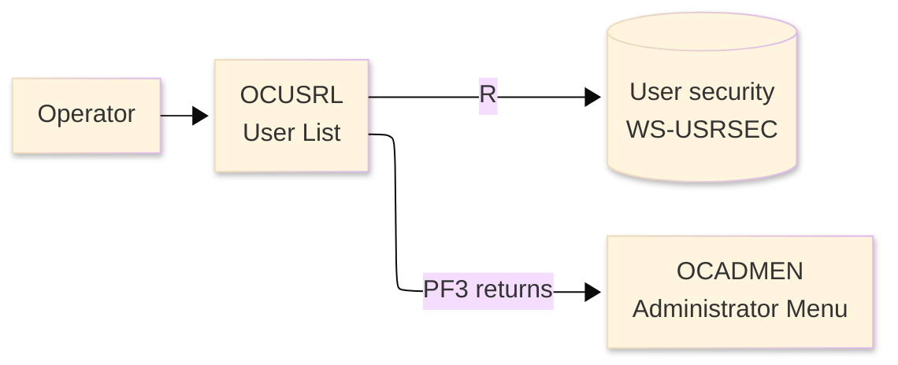
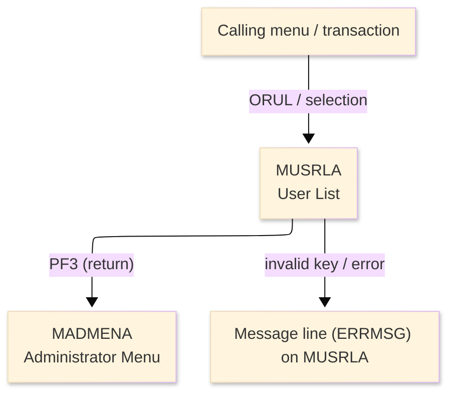
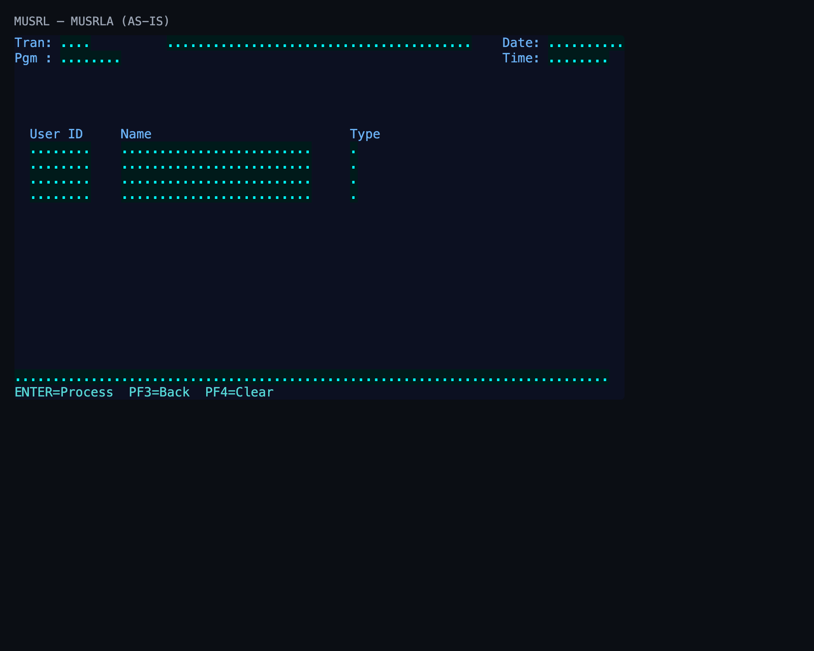

# Screen Design Document — OCUSRL_UserList

## 0. Cover

| Item | Content |
|---|---|
| System | ORION-CCMS (ORION Credit Card Management System) |
| Subsystem | On-line (CICS/BMS) |
| Function name | User List |
| Function ID | OCUSRL |
| CICS transaction | ORUL |
| Version | 1 |
| Author / Created on | modernizeX／2026-09-28 |
| Updated by / Updated on | modernizeX／2026-09-28 |

Approval frame: Customer｜Author｜Approver｜Responsible person

## 1. Function overview

### 1.1 Overview diagram

System architecture — the transaction program, the files/tables it touches, the sub-programs it links to, and where it hands control.

### 1.2 Function overview

1. List user records a page at a time from the file.
2. Let the operator page forward and backward through the result set.
3. Let the operator select a row to view its detail.

**Roles:** authenticated operator (signed on through the Sign On screen).

**Function keys**

| Key | Label as rendered (verbatim) | What it does |
|---|---|---|
| `ENTER` | `ENTER=Process` | validate the entry and process the current step |
| `PF3` | `PF3=Back` | return to the administrator menu (OCADMEN) |
| `PF4` | `PF4=Clear` | clear the entered values and start again |

### 1.3 Databases used

| № | Logical table name | Physical table/file name | Create(C) | Read(R) | Update(U) | Delete(D) | Notes |
|---|---|---|---|---|---|---|---|
| 1 | User security | WS-USRSEC | - | 〇 | - | - | VSAM KSDS (EXEC CICS file control) |

## 2. Screen spec

Screen transition of the whole function — every screen a box, every edge labelled with what moves the operator.

### 2.1 MUSRLA — User List (OCUSRL)

**Layout**

*This screen appears when the operator opens the list function; it refreshes on each page key.* Physical size 24×80 (mapset `MUSRL`, map `MUSRLA`).

**Item details**

| № | Field (BMS) | COBOL symbolic | Kind | Attributes | Line | Col | Character count (screen columns) | Colour | picin | picout | Initial value / caption | Notes |
|---|---|---|---|---|---|---|---|---|---|---|---|---|
| 1 | (literal) | — | caption | ASKIP/NORM | 1 | 1 | 5 | BLUE | — | — | Tran: | field header |
| 2 | TRNNAME | TRNNAMEO | display | ASKIP/NORM | 1 | 7 | 4 | BLUE | — | — | — | program-supplied display |
| 3 | TITLE | TITLEO | display | ASKIP/NORM | 1 | 21 | 40 | YELLOW | — | — | — | program-supplied display |
| 4 | (literal) | — | caption | ASKIP/NORM | 1 | 65 | 5 | BLUE | — | — | Date: | field header |
| 5 | CURDATE | CURDATEO | display | ASKIP/NORM | 1 | 71 | 10 | BLUE | — | — | — | program-supplied display |
| 6 | (literal) | — | caption | ASKIP/NORM | 2 | 1 | 5 | BLUE | — | — | Pgm : | field header |
| 7 | PGMNAME | PGMNAMEO | display | ASKIP/NORM | 2 | 7 | 8 | BLUE | — | — | — | program-supplied display |
| 8 | (literal) | — | caption | ASKIP/NORM | 2 | 65 | 5 | BLUE | — | — | Time: | field header |
| 9 | CURTIME | CURTIMEO | display | ASKIP/NORM | 2 | 71 | 8 | BLUE | — | — | — | program-supplied display |
| 10 | (literal) | — | caption | ASKIP/NORM | 7 | 3 | 7 | BLUE | — | — | User ID | field header |
| 11 | (literal) | — | caption | ASKIP/NORM | 7 | 15 | 4 | BLUE | — | — | Name | field header |
| 12 | (literal) | — | caption | ASKIP/NORM | 7 | 45 | 4 | BLUE | — | — | Type | field header |
| 13 | USR1 | USR1O | display | ASKIP/NORM | 8 | 3 | 8 | TURQUOISE | — | — | — | program-supplied display |
| 14 | UNM1 | UNM1O | display | ASKIP/NORM | 8 | 15 | 25 | TURQUOISE | — | — | — | program-supplied display |
| 15 | UTY1 | UTY1O | display | ASKIP/NORM | 8 | 45 | 1 | TURQUOISE | — | — | — | program-supplied display |
| 16 | USR2 | USR2O | display | ASKIP/NORM | 9 | 3 | 8 | TURQUOISE | — | — | — | program-supplied display |
| 17 | UNM2 | UNM2O | display | ASKIP/NORM | 9 | 15 | 25 | TURQUOISE | — | — | — | program-supplied display |
| 18 | UTY2 | UTY2O | display | ASKIP/NORM | 9 | 45 | 1 | TURQUOISE | — | — | — | program-supplied display |
| 19 | USR3 | USR3O | display | ASKIP/NORM | 10 | 3 | 8 | TURQUOISE | — | — | — | program-supplied display |
| 20 | UNM3 | UNM3O | display | ASKIP/NORM | 10 | 15 | 25 | TURQUOISE | — | — | — | program-supplied display |
| 21 | UTY3 | UTY3O | display | ASKIP/NORM | 10 | 45 | 1 | TURQUOISE | — | — | — | program-supplied display |
| 22 | USR4 | USR4O | display | ASKIP/NORM | 11 | 3 | 8 | TURQUOISE | — | — | — | program-supplied display |
| 23 | UNM4 | UNM4O | display | ASKIP/NORM | 11 | 15 | 25 | TURQUOISE | — | — | — | program-supplied display |
| 24 | UTY4 | UTY4O | display | ASKIP/NORM | 11 | 45 | 1 | TURQUOISE | — | — | — | program-supplied display |
| 25 | ERRMSG | ERRMSGO | display | ASKIP/NORM | 23 | 1 | 78 | RED | — | — | — | program-supplied display |
| 26 | (literal) | — | caption | ASKIP/NORM | 24 | 1 | 34 | TURQUOISE | — | — | ENTER=Process  PF3=Back  PF4=Clear | field header |

**Item states**

> Legend: `○`=enabled ｜ `必`=enabled (required) ｜ `□`=display only ｜ `×`=hidden ｜ `レ`=initial focus

| № | Field (BMS) | Initial display | Page displayed |
|---|---|---|---|
| 1 | TRNNAME | □ | □ |
| 2 | TITLE | □ | □ |
| 3 | CURDATE | □ | □ |
| 4 | PGMNAME | □ | □ |
| 5 | CURTIME | □ | □ |
| 6 | USR1 | □ | □ |
| 7 | UNM1 | □ | □ |
| 8 | UTY1 | □ | □ |
| 9 | USR2 | □ | □ |
| 10 | UNM2 | □ | □ |
| 11 | UTY2 | □ | □ |
| 12 | USR3 | □ | □ |
| 13 | UNM3 | □ | □ |
| 14 | UTY3 | □ | □ |
| 15 | USR4 | □ | □ |
| 16 | UNM4 | □ | □ |
| 17 | UTY4 | □ | □ |
| 18 | ERRMSG | □ | □ |

## 3. Check specifications

### 3.1 MUSRLA — User List

All messages below are the literal strings the program sends to the on-screen message line, extracted from the source. Type: E=Error / W=Warning / C=Confirm / I=Information.

| No. | Timing | Condition | Type | Display | Message content (verbatim) | Notes |
|---|---|---|---|---|---|---|
| 1 | ENTER / validation | processing state | I | A (message line) | No users found. | on-screen ERRMSG line |
| 2 | ENTER / validation | processing state | I | A (message line) | PF8 next page PF7 top PF3 exit. | on-screen ERRMSG line |
| 3 | ENTER / validation | processing state | I | A (message line) | Top of list. PF8 next page. | on-screen ERRMSG line |
| 4 | ENTER / validation | processing state | I | A (message line) | No more users to display. | on-screen ERRMSG line |
| 5 | ENTER / validation | processing state | E | A (message line) | Error starting user browse. | on-screen ERRMSG line |
| 6 | ENTER / validation | processing state | E | A (message line) | Error reading user file. | on-screen ERRMSG line |
| 7 | ENTER / validation | an unsupported key was pressed | E | A (message line) | Invalid key pressed. Please try again. | on-screen ERRMSG line |

## 4. Event specifications

### 4.1 MUSRLA — User List

Per-key and per-field behaviour, written as operator steps.

| No. | Item | Timing / condition | Action | Next screen |
|---|---|---|---|---|
| **Function key section** | | | | |
| 1 | `ENTER` | when pressed | the starting key is accepted and the first page of user rows is listed | stays on the screen, or continues to the administrator menu (OCADMEN) |
| 2 | `PF3` | when pressed | cancel and return to the administrator menu (OCADMEN) | the administrator menu (OCADMEN) |
| 3 | `PF4` | when pressed | clear the entered values so the operator can start again | stays on the screen |
| 4 | `PF7` | when pressed | page backward to the previous page of rows | stays on the screen |
| 5 | `PF8` | when pressed | page forward to the next page of rows | stays on the screen |
| **Data entry section** | | | | |
| 6 | Key field(s) | on ENTER | the starting key is accepted and the first page of user rows is listed | stays on `MUSRLA` (or shows a message) |

## 5. DB CRUD

**Update spec**

Not applicable — the User List screen only reads data; no table row is created, updated or deleted.

**Column-level CRUD (per event / business type)**

| Screen / table | Physical name | Field group | On ENTER — read |
|---|---|---|---|
| User security | WS-USRSEC | whole record | R |

