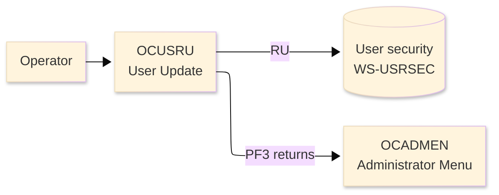
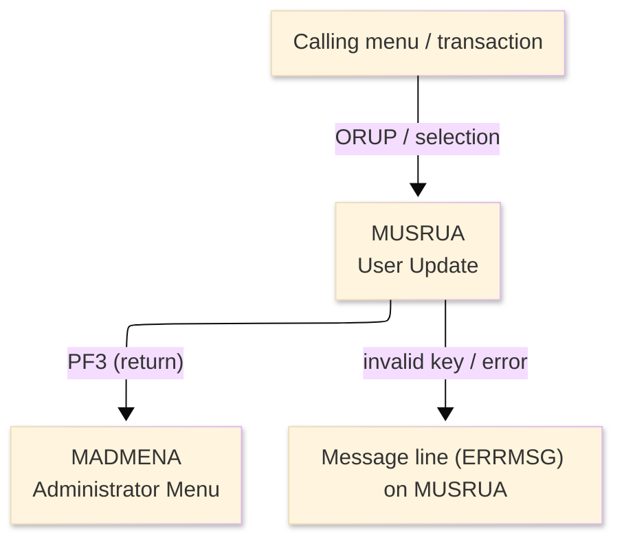
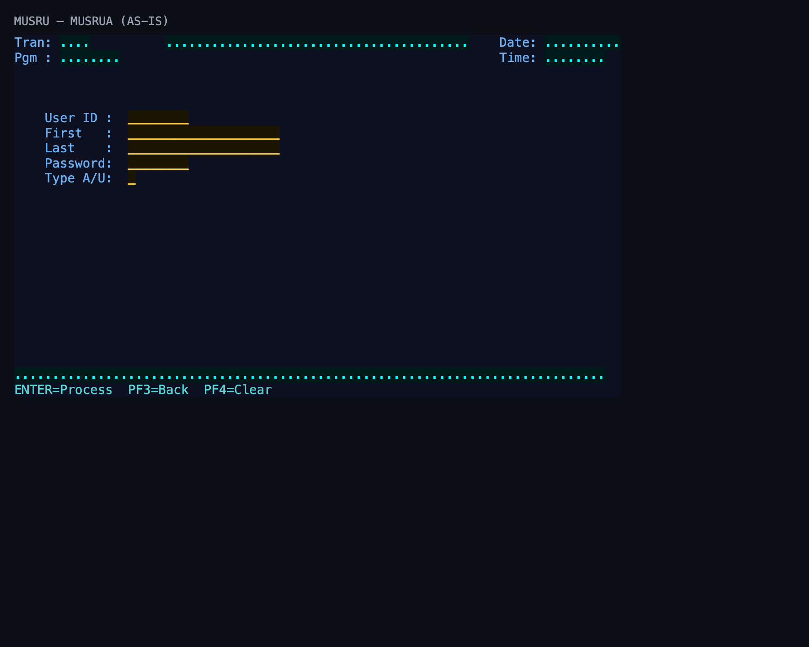

# Screen Design Document — OCUSRU_UserUpdate

## 0. Cover

| Item | Content |
|---|---|
| System | ORION-CCMS (ORION Credit Card Management System) |
| Subsystem | On-line (CICS/BMS) |
| Function name | User Update |
| Function ID | OCUSRU |
| CICS transaction | ORUP |
| Version | 1 |
| Author / Created on | modernizeX／2026-09-28 |
| Updated by / Updated on | modernizeX／2026-09-28 |

Approval frame: Customer｜Author｜Approver｜Responsible person

## 1. Function overview

### 1.1 Overview diagram

System architecture — the transaction program, the files/tables it touches, the sub-programs it links to, and where it hands control.

### 1.2 Function overview

1. Look up the user by its key and display the current values.
2. Let the operator change the editable fields.
3. Validate the changes and save them back to the file on confirmation.

**Roles:** authenticated operator (signed on through the Sign On screen).

**Function keys**

| Key | Label as rendered (verbatim) | What it does |
|---|---|---|
| `ENTER` | `ENTER=Process` | validate the entry and process the current step |
| `PF3` | `PF3=Back` | return to the administrator menu (OCADMEN) |
| `PF4` | `PF4=Clear` | clear the entered values and start again |

### 1.3 Databases used

| № | Logical table name | Physical table/file name | Create(C) | Read(R) | Update(U) | Delete(D) | Notes |
|---|---|---|---|---|---|---|---|
| 1 | User security | WS-USRSEC | - | 〇 | 〇 | - | VSAM KSDS (EXEC CICS file control) |

## 2. Screen spec

Screen transition of the whole function — every screen a box, every edge labelled with what moves the operator.

### 2.1 MUSRUA — User Update (OCUSRU)

**Layout**

*This screen appears when the operator selects the update function.* Physical size 24×80 (mapset `MUSRU`, map `MUSRUA`).

**Item details**

| № | Field (BMS) | COBOL symbolic | Kind | Attributes | Line | Col | Character count (screen columns) | Colour | picin | picout | Initial value / caption | Notes |
|---|---|---|---|---|---|---|---|---|---|---|---|---|
| 1 | (literal) | — | caption | ASKIP/NORM | 1 | 1 | 5 | BLUE | — | — | Tran: | field header |
| 2 | TRNNAME | TRNNAMEO | display | ASKIP/NORM | 1 | 7 | 4 | BLUE | — | — | — | program-supplied display |
| 3 | TITLE | TITLEO | display | ASKIP/NORM | 1 | 21 | 40 | YELLOW | — | — | — | program-supplied display |
| 4 | (literal) | — | caption | ASKIP/NORM | 1 | 65 | 5 | BLUE | — | — | Date: | field header |
| 5 | CURDATE | CURDATEO | display | ASKIP/NORM | 1 | 71 | 10 | BLUE | — | — | — | program-supplied display |
| 6 | (literal) | — | caption | ASKIP/NORM | 2 | 1 | 5 | BLUE | — | — | Pgm : | field header |
| 7 | PGMNAME | PGMNAMEO | display | ASKIP/NORM | 2 | 7 | 8 | BLUE | — | — | — | program-supplied display |
| 8 | (literal) | — | caption | ASKIP/NORM | 2 | 65 | 5 | BLUE | — | — | Time: | field header |
| 9 | CURTIME | CURTIMEO | display | ASKIP/NORM | 2 | 71 | 8 | BLUE | — | — | — | program-supplied display |
| 10 | (literal) | — | caption | ASKIP/NORM | 6 | 5 | 9 | BLUE | — | — | User ID : | field header |
| 11 | USERID | USERIDO | input | UNPROT/IC/FSET | 6 | 16 | 8 | GREEN | — | — | — | operator input |
| 12 | (literal) | — | caption | ASKIP/NORM | 7 | 5 | 9 | BLUE | — | — | First   : | field header |
| 13 | USFNAM | USFNAMO | input | UNPROT/IC/FSET | 7 | 16 | 20 | GREEN | — | — | — | operator input |
| 14 | (literal) | — | caption | ASKIP/NORM | 8 | 5 | 9 | BLUE | — | — | Last    : | field header |
| 15 | USLNAM | USLNAMO | input | UNPROT/IC/FSET | 8 | 16 | 20 | GREEN | — | — | — | operator input |
| 16 | (literal) | — | caption | ASKIP/NORM | 9 | 5 | 9 | BLUE | — | — | Password: | field header |
| 17 | USPWD | USPWDO | input | UNPROT/IC/FSET | 9 | 16 | 8 | GREEN | — | — | — | operator input |
| 18 | (literal) | — | caption | ASKIP/NORM | 10 | 5 | 9 | BLUE | — | — | Type A/U: | field header |
| 19 | USTYPE | USTYPEO | input | UNPROT/IC/FSET | 10 | 16 | 1 | GREEN | — | — | — | operator input |
| 20 | ERRMSG | ERRMSGO | display | ASKIP/NORM | 23 | 1 | 78 | RED | — | — | — | program-supplied display |
| 21 | (literal) | — | caption | ASKIP/NORM | 24 | 1 | 34 | TURQUOISE | — | — | ENTER=Process  PF3=Back  PF4=Clear | field header |

**Item states**

> Legend: `○`=enabled ｜ `必`=enabled (required) ｜ `□`=display only ｜ `×`=hidden ｜ `レ`=initial focus

| № | Field (BMS) | Initial display | Record loaded (editable) | Confirm save |
|---|---|---|---|---|
| 1 | TRNNAME | □ | □ | □ |
| 2 | TITLE | □ | □ | □ |
| 3 | CURDATE | □ | □ | □ |
| 4 | PGMNAME | □ | □ | □ |
| 5 | CURTIME | □ | □ | □ |
| 6 | USERID | ○ | ○ | □ |
| 7 | USFNAM | ○ | ○ | □ |
| 8 | USLNAM | ○ | ○ | □ |
| 9 | USPWD | ○ | ○ | □ |
| 10 | USTYPE | ○ | ○ | □ |
| 11 | ERRMSG | □ | □ | □ |

## 3. Check specifications

### 3.1 MUSRUA — User Update

All messages below are the literal strings the program sends to the on-screen message line, extracted from the source. Type: E=Error / W=Warning / C=Confirm / I=Information.

| No. | Timing | Condition | Type | Display | Message content (verbatim) | Notes |
|---|---|---|---|---|---|---|
| 1 | ENTER / validation | processing state | I | A (message line) | Enter a user id and press ENTER. | on-screen ERRMSG line |
| 2 | ENTER / validation | the keyed record does not exist | E | A (message line) | User not found. | on-screen ERRMSG line |
| 3 | ENTER / validation | processing state | C | A (message line) | Modify fields and press ENTER to update. | on-screen ERRMSG line |
| 4 | ENTER / validation | a required field was left blank | E | A (message line) | First name is required. | on-screen ERRMSG line |
| 5 | ENTER / validation | a required field was left blank | E | A (message line) | Last name is required. | on-screen ERRMSG line |
| 6 | ENTER / validation | a required field was left blank | E | A (message line) | Password is required. | on-screen ERRMSG line |
| 7 | ENTER / validation | the entered value failed a field rule | E | A (message line) | Type must be A (admin) or U (user). | on-screen ERRMSG line |
| 8 | ENTER / validation | processing state | E | A (message line) | Error reading user file. | on-screen ERRMSG line |
| 9 | ENTER / validation | the keyed record does not exist | E | A (message line) | User no longer exists. | on-screen ERRMSG line |
| 10 | ENTER / validation | processing state | E | A (message line) | Error reading user for update. | on-screen ERRMSG line |
| 11 | ENTER / validation | processing state | E | A (message line) | Error updating user file. | on-screen ERRMSG line |
| 12 | ENTER / validation | the action completed | I | A (message line) | User updated successfully. | on-screen ERRMSG line |
| 13 | ENTER / validation | an unsupported key was pressed | E | A (message line) | Invalid key pressed. Please try again. | on-screen ERRMSG line |
| 14 | ENTER / validation | a required field was left blank | E | A (message line) | Please enter all required fields. | on-screen ERRMSG line |

## 4. Event specifications

### 4.1 MUSRUA — User Update

Per-key and per-field behaviour, written as operator steps.

| No. | Item | Timing / condition | Action | Next screen |
|---|---|---|---|---|
| **Function key section** | | | | |
| 1 | `ENTER` | when pressed | the changed fields are validated and, once confirmed, written back to the user record | stays on the screen, or continues to the administrator menu (OCADMEN) |
| 2 | `PF3` | when pressed | cancel and return to the administrator menu (OCADMEN) | the administrator menu (OCADMEN) |
| 3 | `PF4` | when pressed | clear the entered values so the operator can start again | stays on the screen |
| **Data entry section** | | | | |
| 4 | Key field(s) | on ENTER | the changed fields are validated and, once confirmed, written back to the user record | stays on `MUSRUA` (or shows a message) |

## 5. DB CRUD

**Update spec**

### WS-USRSEC — User security

| No. | PK | Item name | Field | On save (PF5) — update by key |
|---|---|---|---|---|
| 1 | ✓ | Id | US-ID | key (unchanged) |
| 2 |  | First Name | US-FIRST-NAME | screen input |
| 3 |  | Last Name | US-LAST-NAME | screen input |
| 4 |  | Password | US-PASSWORD | screen input |
| 5 |  | Type | US-TYPE | screen input |
| 6 |  | Filler | FILLER | screen input |

**Column-level CRUD (per event / business type)**

| Screen / table | Physical name | Field group | On save (PF5) — update by key |
|---|---|---|---|
| User security | WS-USRSEC | whole record | R/U |

