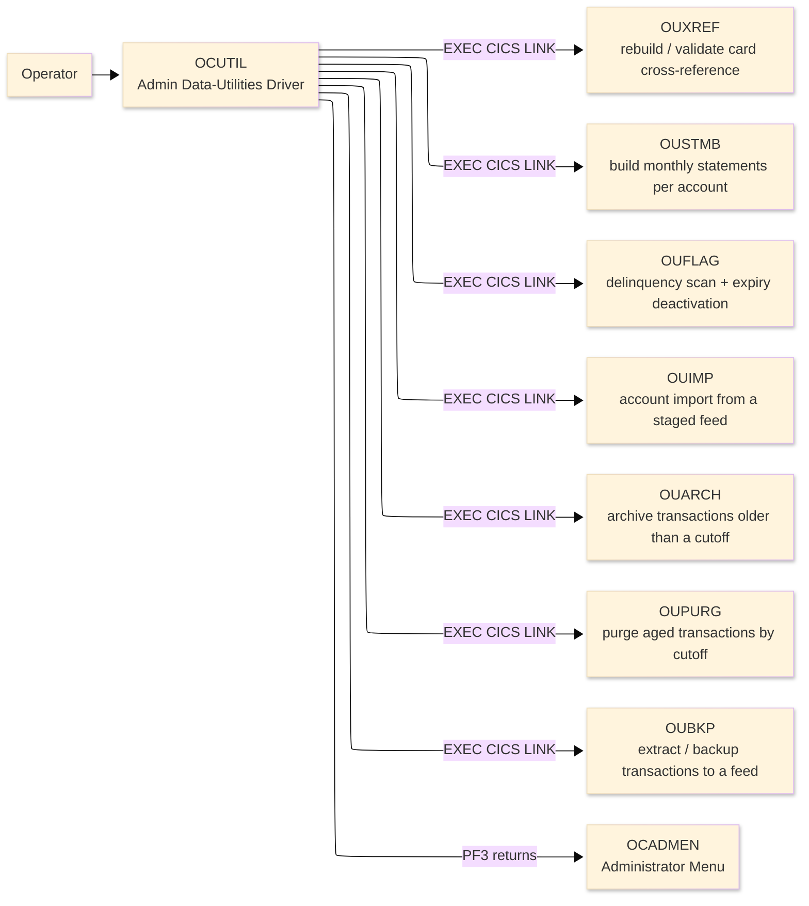
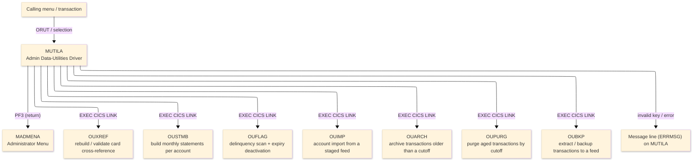
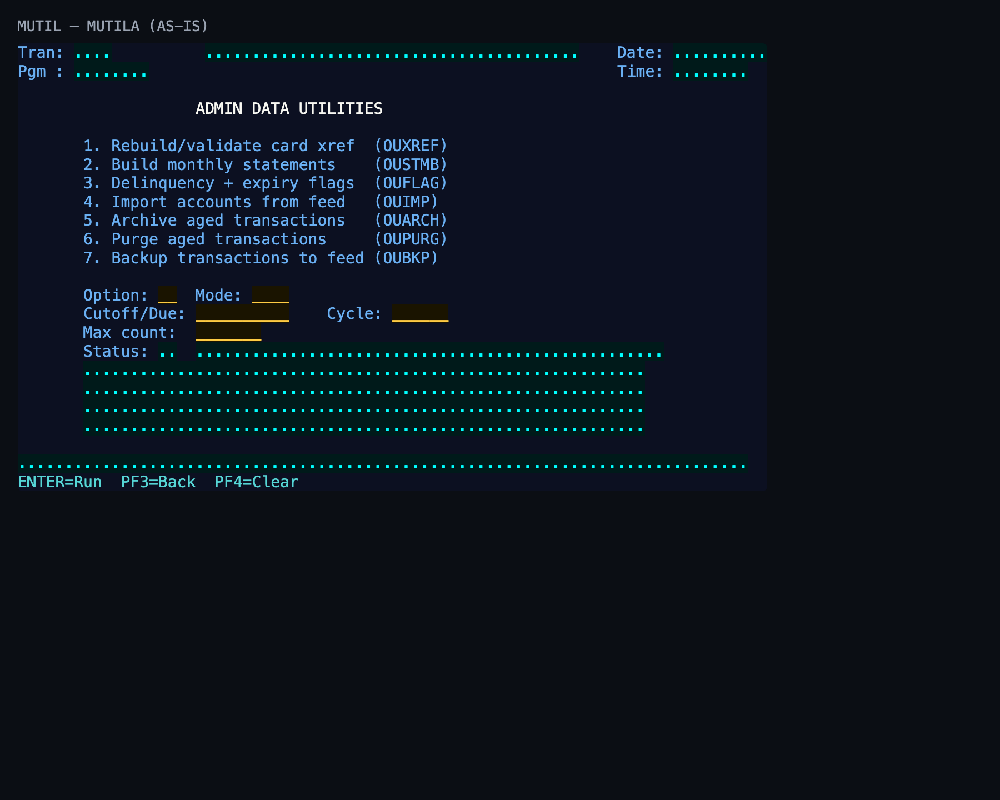

# Screen Design Document — OCUTIL_DataUtilities

## 0. Cover

| Item | Content |
|---|---|
| System | ORION-CCMS (ORION Credit Card Management System) |
| Subsystem | On-line (CICS/BMS) |
| Function name | Admin Data-Utilities Driver |
| Function ID | OCUTIL |
| CICS transaction | ORUT |
| Version | 1 |
| Author / Created on | modernizeX／2026-09-28 |
| Updated by / Updated on | modernizeX／2026-09-28 |

Approval frame: Customer｜Author｜Approver｜Responsible person

## 1. Function overview

### 1.1 Overview diagram

System architecture — the transaction program, the files/tables it touches, the sub-programs it links to, and where it hands control.

### 1.2 Function overview

1. Present the available back-office operations as a numbered option list.
2. Run the selected operation by linking to its processing sub-program.
3. Show the operation result and the record counts it reports.

**Roles:** authenticated operator (signed on through the Sign On screen).

**Function keys**

| Key | Label as rendered (verbatim) | What it does |
|---|---|---|
| `ENTER` | `ENTER=Run` | validate the entry and process the current step |
| `PF3` | `PF3=Back` | return to the administrator menu (OCADMEN) |
| `PF4` | `PF4=Clear` | clear the entered values and start again |

### 1.3 Databases used

| № | Logical table name | Physical table/file name | Create(C) | Read(R) | Update(U) | Delete(D) | Notes |
|---|---|---|---|---|---|---|---|
| 1 | — | — | - | - | - | - | Not applicable — navigation only; file access is performed by the linked sub-programs |

## 2. Screen spec

Screen transition of the whole function — every screen a box, every edge labelled with what moves the operator.

### 2.1 MUTILA — Admin Data-Utilities Driver (OCUTIL)

**Layout**

*This screen appears when the operator selects the batch-operations option from the menu.* Physical size 24×80 (mapset `MUTIL`, map `MUTILA`).

**Item details**

| № | Field (BMS) | COBOL symbolic | Kind | Attributes | Line | Col | Character count (screen columns) | Colour | picin | picout | Initial value / caption | Notes |
|---|---|---|---|---|---|---|---|---|---|---|---|---|
| 1 | (literal) | — | caption | ASKIP/NORM | 1 | 1 | 5 | BLUE | — | — | Tran: | field header |
| 2 | TRNNAME | TRNNAMEO | display | ASKIP/NORM | 1 | 7 | 4 | BLUE | — | — | — | program-supplied display |
| 3 | TITLE | TITLEO | display | ASKIP/NORM | 1 | 21 | 40 | YELLOW | — | — | — | program-supplied display |
| 4 | (literal) | — | caption | ASKIP/NORM | 1 | 65 | 5 | BLUE | — | — | Date: | field header |
| 5 | CURDATE | CURDATEO | display | ASKIP/NORM | 1 | 71 | 10 | BLUE | — | — | — | program-supplied display |
| 6 | (literal) | — | caption | ASKIP/NORM | 2 | 1 | 5 | BLUE | — | — | Pgm : | field header |
| 7 | PGMNAME | PGMNAMEO | display | ASKIP/NORM | 2 | 7 | 8 | BLUE | — | — | — | program-supplied display |
| 8 | (literal) | — | caption | ASKIP/NORM | 2 | 65 | 5 | BLUE | — | — | Time: | field header |
| 9 | CURTIME | CURTIMEO | display | ASKIP/NORM | 2 | 71 | 8 | BLUE | — | — | — | program-supplied display |
| 10 | (literal) | — | caption | ASKIP/NORM | 4 | 20 | 30 | NEUTRAL | — | — | ADMIN DATA UTILITIES | field header |
| 11 | (literal) | — | caption | ASKIP/NORM | 6 | 8 | 40 | BLUE | — | — | 1. Rebuild/validate card xref  (OUXREF) | field header |
| 12 | (literal) | — | caption | ASKIP/NORM | 7 | 8 | 40 | BLUE | — | — | 2. Build monthly statements    (OUSTMB) | field header |
| 13 | (literal) | — | caption | ASKIP/NORM | 8 | 8 | 40 | BLUE | — | — | 3. Delinquency + expiry flags  (OUFLAG) | field header |
| 14 | (literal) | — | caption | ASKIP/NORM | 9 | 8 | 40 | BLUE | — | — | 4. Import accounts from feed   (OUIMP) | field header |
| 15 | (literal) | — | caption | ASKIP/NORM | 10 | 8 | 40 | BLUE | — | — | 5. Archive aged transactions   (OUARCH) | field header |
| 16 | (literal) | — | caption | ASKIP/NORM | 11 | 8 | 40 | BLUE | — | — | 6. Purge aged transactions     (OUPURG) | field header |
| 17 | (literal) | — | caption | ASKIP/NORM | 12 | 8 | 40 | BLUE | — | — | 7. Backup transactions to feed (OUBKP) | field header |
| 18 | (literal) | — | caption | ASKIP/NORM | 14 | 8 | 7 | BLUE | — | — | Option: | field header |
| 19 | UTOPT | UTOPTO | input | UNPROT/IC/FSET | 14 | 16 | 2 | GREEN | — | — | — | operator input |
| 20 | (literal) | — | caption | ASKIP/NORM | 14 | 20 | 5 | BLUE | — | — | Mode: | field header |
| 21 | UTMODE | UTMODEO | input | UNPROT/FSET | 14 | 26 | 4 | GREEN | — | — | — | operator input |
| 22 | (literal) | — | caption | ASKIP/NORM | 15 | 8 | 11 | BLUE | — | — | Cutoff/Due: | field header |
| 23 | UTDATE | UTDATEO | input | UNPROT/FSET | 15 | 20 | 10 | GREEN | — | — | — | operator input |
| 24 | (literal) | — | caption | ASKIP/NORM | 15 | 34 | 6 | BLUE | — | — | Cycle: | field header |
| 25 | UTCYC | UTCYCO | input | UNPROT/FSET | 15 | 41 | 6 | GREEN | — | — | — | operator input |
| 26 | (literal) | — | caption | ASKIP/NORM | 16 | 8 | 10 | BLUE | — | — | Max count: | field header |
| 27 | UTNUM | UTNUMO | input | UNPROT/FSET | 16 | 20 | 7 | GREEN | — | — | — | operator input |
| 28 | (literal) | — | caption | ASKIP/NORM | 17 | 8 | 7 | BLUE | — | — | Status: | field header |
| 29 | RSTAT | RSTATO | display | ASKIP/NORM | 17 | 16 | 2 | TURQUOISE | — | — | — | program-supplied display |
| 30 | RMSG | RMSGO | display | ASKIP/NORM | 17 | 20 | 50 | TURQUOISE | — | — | — | program-supplied display |
| 31 | RLINE1 | RLINE1O | display | ASKIP/NORM | 18 | 8 | 60 | GREEN | — | — | — | program-supplied display |
| 32 | RLINE2 | RLINE2O | display | ASKIP/NORM | 19 | 8 | 60 | GREEN | — | — | — | program-supplied display |
| 33 | RLINE3 | RLINE3O | display | ASKIP/NORM | 20 | 8 | 60 | GREEN | — | — | — | program-supplied display |
| 34 | RLINE4 | RLINE4O | display | ASKIP/NORM | 21 | 8 | 60 | GREEN | — | — | — | program-supplied display |
| 35 | ERRMSG | ERRMSGO | display | ASKIP/NORM | 23 | 1 | 78 | RED | — | — | — | program-supplied display |
| 36 | (literal) | — | caption | ASKIP/NORM | 24 | 1 | 40 | TURQUOISE | — | — | ENTER=Run  PF3=Back  PF4=Clear | field header |

**Item states**

> Legend: `○`=enabled ｜ `必`=enabled (required) ｜ `□`=display only ｜ `×`=hidden ｜ `レ`=initial focus

| № | Field (BMS) | Initial display | Operation selected | After run |
|---|---|---|---|---|
| 1 | TRNNAME | □ | □ | □ |
| 2 | TITLE | □ | □ | □ |
| 3 | CURDATE | □ | □ | □ |
| 4 | PGMNAME | □ | □ | □ |
| 5 | CURTIME | □ | □ | □ |
| 6 | UTOPT | ○ | ○ | □ |
| 7 | UTMODE | ○ | ○ | □ |
| 8 | UTDATE | ○ | ○ | □ |
| 9 | UTCYC | ○ | ○ | □ |
| 10 | UTNUM | ○ | ○ | □ |
| 11 | RSTAT | □ | □ | □ |
| 12 | RMSG | □ | □ | □ |
| 13 | RLINE1 | □ | □ | □ |
| 14 | RLINE2 | □ | □ | □ |
| 15 | RLINE3 | □ | □ | □ |
| 16 | RLINE4 | □ | □ | □ |
| 17 | ERRMSG | □ | □ | □ |

## 3. Check specifications

### 3.1 MUTILA — Admin Data-Utilities Driver

All messages below are the literal strings the program sends to the on-screen message line, extracted from the source. Type: E=Error / W=Warning / C=Confirm / I=Information.

| No. | Timing | Condition | Type | Display | Message content (verbatim) | Notes |
|---|---|---|---|---|---|---|
| 1 | ENTER / validation | processing state | I | A (message line) | Select a utility (1-7), key params, press ENTER. | on-screen ERRMSG line |
| 2 | ENTER / validation | processing state | E | A (message line) | Sub-program link failed - check resources. | on-screen ERRMSG line |
| 3 | ENTER / validation | the action completed | E | A (message line) | Utility complete - see counts below. | on-screen ERRMSG line |
| 4 | ENTER / validation | processing state | I | A (message line) | Enter a utility number 1 through 7. | on-screen ERRMSG line |
| 5 | ENTER / validation | the entered value failed a field rule | E | A (message line) | Utility number must be 1 through 7. | on-screen ERRMSG line |
| 6 | ENTER / validation | a numeric field held non-numeric data | E | A (message line) | Max count must be numeric. | on-screen ERRMSG line |
| 7 | ENTER / validation | a numeric field held non-numeric data | E | A (message line) | Cycle must be numeric (YYYYMM). | on-screen ERRMSG line |
| 8 | ENTER / validation | an unsupported key was pressed | E | A (message line) | Invalid key pressed. Please try again. | on-screen ERRMSG line |

## 4. Event specifications

### 4.1 MUTILA — Admin Data-Utilities Driver

Per-key and per-field behaviour, written as operator steps.

| No. | Item | Timing / condition | Action | Next screen |
|---|---|---|---|---|
| **Function key section** | | | | |
| 1 | `ENTER` | when pressed | the chosen operation number is checked and the matching processing sub-program is run | stays on the screen, or continues to the administrator menu (OCADMEN) |
| 2 | `PF3` | when pressed | cancel and return to the administrator menu (OCADMEN) | the administrator menu (OCADMEN) |
| 3 | `PF4` | when pressed | clear the entered values so the operator can start again | stays on the screen |
| 4 | `PF12` | when pressed | cancel the current action and return to the administrator menu (OCADMEN) | the administrator menu (OCADMEN) |
| 5 | `CLEAR` | when pressed | clear the screen and redisplay it | stays on the screen |
| **Data entry section** | | | | |
| 6 | Key field(s) | on ENTER | the chosen operation number is checked and the matching processing sub-program is run | stays on `MUTILA` (or shows a message) |

## 5. DB CRUD

**Update spec**

Not applicable — the Admin Data-Utilities Driver screen only reads data; no table row is created, updated or deleted.

**Column-level CRUD (per event / business type)**

| Screen / table | Physical name | Field group | On ENTER — read |
|---|---|---|---|
| — | — | none | none |

