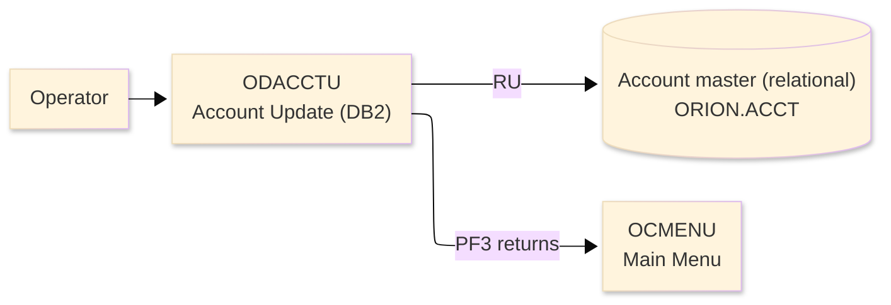
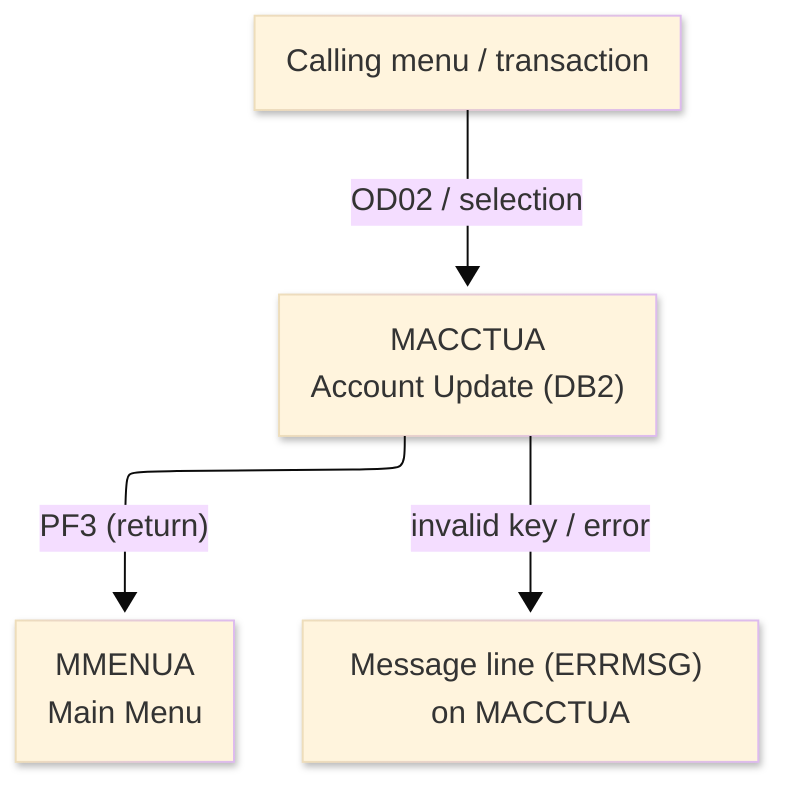
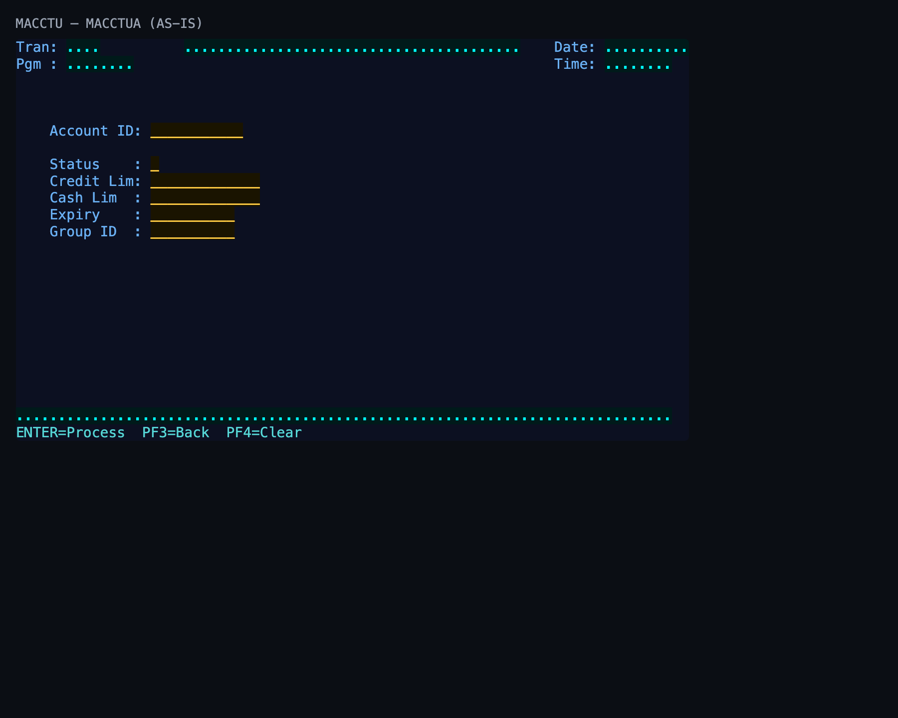

# Screen Design Document — ODACCTU_AccountUpdateDB2

## 0. Cover

| Item | Content |
|---|---|
| System | ORION-CCMS (ORION Credit Card Management System) |
| Subsystem | On-line (CICS/BMS) — DB2 variant |
| Function name | Account Update (DB2) |
| Function ID | ODACCTU |
| CICS transaction | OD02 |
| Version | 1 |
| Author / Created on | modernizeX／2026-09-28 |
| Updated by / Updated on | modernizeX／2026-09-28 |

Approval frame: Customer｜Author｜Approver｜Responsible person

## 1. Function overview

### 1.1 Overview diagram

System architecture — the transaction program, the files/tables it touches, the sub-programs it links to, and where it hands control.

### 1.2 Function overview

1. Look up the account by its key and display the current values.
2. Let the operator change the editable fields.
3. Validate the changes and save them back to the file on confirmation.

**Roles:** authenticated operator (signed on through the Sign On screen).

**Function keys**

| Key | Label as rendered (verbatim) | What it does |
|---|---|---|
| `ENTER` | `ENTER=Process` | validate the entry and process the current step |
| `PF3` | `PF3=Back` | return to the main menu (OCMENU) |
| `PF4` | `PF4=Clear` | clear the entered values and start again |

### 1.3 Databases used

| № | Logical table name | Physical table/file name | Create(C) | Read(R) | Update(U) | Delete(D) | Notes |
|---|---|---|---|---|---|---|---|
| 1 | Account master (relational) | ORION.ACCT | - | 〇 | 〇 | - | DB2 relational table (EXEC SQL) |

## 2. Screen spec

Screen transition of the whole function — every screen a box, every edge labelled with what moves the operator.

### 2.1 MACCTUA — Account Update (DB2) (ODACCTU)

**Layout**

*This screen appears when the operator selects the update function.* Physical size 24×80 (mapset `MACCTU`, map `MACCTUA`).

**Item details**

| № | Field (BMS) | COBOL symbolic | Kind | Attributes | Line | Col | Character count (screen columns) | Colour | picin | picout | Initial value / caption | Notes |
|---|---|---|---|---|---|---|---|---|---|---|---|---|
| 1 | (literal) | — | caption | ASKIP/NORM | 1 | 1 | 5 | BLUE | — | — | Tran: | field header |
| 2 | TRNNAME | TRNNAMEO | display | ASKIP/NORM | 1 | 7 | 4 | BLUE | — | — | — | program-supplied display |
| 3 | TITLE | TITLEO | display | ASKIP/NORM | 1 | 21 | 40 | YELLOW | — | — | — | program-supplied display |
| 4 | (literal) | — | caption | ASKIP/NORM | 1 | 65 | 5 | BLUE | — | — | Date: | field header |
| 5 | CURDATE | CURDATEO | display | ASKIP/NORM | 1 | 71 | 10 | BLUE | — | — | — | program-supplied display |
| 6 | (literal) | — | caption | ASKIP/NORM | 2 | 1 | 5 | BLUE | — | — | Pgm : | field header |
| 7 | PGMNAME | PGMNAMEO | display | ASKIP/NORM | 2 | 7 | 8 | BLUE | — | — | — | program-supplied display |
| 8 | (literal) | — | caption | ASKIP/NORM | 2 | 65 | 5 | BLUE | — | — | Time: | field header |
| 9 | CURTIME | CURTIMEO | display | ASKIP/NORM | 2 | 71 | 8 | BLUE | — | — | — | program-supplied display |
| 10 | (literal) | — | caption | ASKIP/NORM | 6 | 5 | 11 | BLUE | — | — | Account ID: | field header |
| 11 | ACCTID | ACCTIDO | input | UNPROT/IC/FSET | 6 | 17 | 11 | GREEN | — | — | — | operator input |
| 12 | (literal) | — | caption | ASKIP/NORM | 8 | 5 | 11 | BLUE | — | — | Status    : | field header |
| 13 | ACSTAT | ACSTATO | input | UNPROT/IC/FSET | 8 | 17 | 1 | GREEN | — | — | — | operator input |
| 14 | (literal) | — | caption | ASKIP/NORM | 9 | 5 | 11 | BLUE | — | — | Credit Lim: | field header |
| 15 | ACCRLIM | ACCRLIMO | input | UNPROT/IC/FSET | 9 | 17 | 13 | GREEN | — | — | — | operator input |
| 16 | (literal) | — | caption | ASKIP/NORM | 10 | 5 | 11 | BLUE | — | — | Cash Lim  : | field header |
| 17 | ACCSLIM | ACCSLIMO | input | UNPROT/IC/FSET | 10 | 17 | 13 | GREEN | — | — | — | operator input |
| 18 | (literal) | — | caption | ASKIP/NORM | 11 | 5 | 11 | BLUE | — | — | Expiry    : | field header |
| 19 | ACEXP | ACEXPO | input | UNPROT/IC/FSET | 11 | 17 | 10 | GREEN | — | — | — | operator input |
| 20 | (literal) | — | caption | ASKIP/NORM | 12 | 5 | 11 | BLUE | — | — | Group ID  : | field header |
| 21 | ACGRP | ACGRPO | input | UNPROT/IC/FSET | 12 | 17 | 10 | GREEN | — | — | — | operator input |
| 22 | ERRMSG | ERRMSGO | display | ASKIP/NORM | 23 | 1 | 78 | RED | — | — | — | program-supplied display |
| 23 | (literal) | — | caption | ASKIP/NORM | 24 | 1 | 34 | TURQUOISE | — | — | ENTER=Process  PF3=Back  PF4=Clear | field header |

**Item states**

> Legend: `○`=enabled ｜ `必`=enabled (required) ｜ `□`=display only ｜ `×`=hidden ｜ `レ`=initial focus

| № | Field (BMS) | Initial display | Record loaded (editable) | Confirm save |
|---|---|---|---|---|
| 1 | TRNNAME | □ | □ | □ |
| 2 | TITLE | □ | □ | □ |
| 3 | CURDATE | □ | □ | □ |
| 4 | PGMNAME | □ | □ | □ |
| 5 | CURTIME | □ | □ | □ |
| 6 | ACCTID | ○ | ○ | □ |
| 7 | ACSTAT | ○ | ○ | □ |
| 8 | ACCRLIM | ○ | ○ | □ |
| 9 | ACCSLIM | ○ | ○ | □ |
| 10 | ACEXP | ○ | ○ | □ |
| 11 | ACGRP | ○ | ○ | □ |
| 12 | ERRMSG | □ | □ | □ |

## 3. Check specifications

### 3.1 MACCTUA — Account Update (DB2)

All messages below are the literal strings the program sends to the on-screen message line, extracted from the source. Type: E=Error / W=Warning / C=Confirm / I=Information.

| No. | Timing | Condition | Type | Display | Message content (verbatim) | Notes |
|---|---|---|---|---|---|---|
| 1 | ENTER / validation | processing state | C | A (message line) | Enter account id and press ENTER to fetch. | on-screen ERRMSG line |
| 2 | ENTER / validation | the entry passed validation | C | A (message line) | Amend fields and press PF5 to update. | on-screen ERRMSG line |
| 3 | ENTER / validation | a numeric field held non-numeric data | E | A (message line) | Account id must be numeric. | on-screen ERRMSG line |
| 4 | ENTER / validation | processing state | C | A (message line) | Press ENTER to fetch a row before PF5. | on-screen ERRMSG line |
| 5 | ENTER / validation | the action completed | I | A (message line) | Account updated successfully. | on-screen ERRMSG line |
| 6 | ENTER / validation | a required field was left blank | E | A (message line) | Account id is required and numeric. | on-screen ERRMSG line |
| 7 | ENTER / validation | the entered value failed a field rule | E | A (message line) | Status must be Y or N. | on-screen ERRMSG line |
| 8 | ENTER / validation | a required field was left blank | E | A (message line) | Credit and cash limits are required. | on-screen ERRMSG line |
| 9 | ENTER / validation | processing state | E | A (message line) | Error reading account table. | on-screen ERRMSG line |
| 10 | ENTER / validation | processing state | E | A (message line) | Error updating account table. | on-screen ERRMSG line |
| 11 | ENTER / validation | an unsupported key was pressed | E | A (message line) | Invalid key pressed. Please try again. | on-screen ERRMSG line |
| 12 | ENTER / validation | a required field was left blank | E | A (message line) | Please enter all required fields. | on-screen ERRMSG line |
| 13 | ENTER / validation | the keyed record does not exist | E | A (message line) | Record not found. | on-screen ERRMSG line |

## 4. Event specifications

### 4.1 MACCTUA — Account Update (DB2)

Per-key and per-field behaviour, written as operator steps.

| No. | Item | Timing / condition | Action | Next screen |
|---|---|---|---|---|
| **Function key section** | | | | |
| 1 | `ENTER` | when pressed | the changed fields are validated and, once confirmed, written back to the account record | stays on the screen, or continues to the main menu (OCMENU) |
| 2 | `PF3` | when pressed | cancel and return to the main menu (OCMENU) | the main menu (OCMENU) |
| 3 | `PF4` | when pressed | clear the entered values so the operator can start again | stays on the screen |
| 4 | `PF5` | when pressed | confirm and save the change to the file | stays on the screen with a result message |
| **Data entry section** | | | | |
| 5 | Key field(s) | on ENTER | the changed fields are validated and, once confirmed, written back to the account record | stays on `MACCTUA` (or shows a message) |

## 5. DB CRUD

**Update spec**

### ORION.ACCT — Account master (relational)

| No. | PK | Item name | Field | On save (PF5) — update by key |
|---|---|---|---|---|
| 1 | ✓ | key field | (see record layout) | set from the screen / program |

**Column-level CRUD (per event / business type)**

| Screen / table | Physical name | Field group | On save (PF5) — update by key |
|---|---|---|---|
| Account master (relational) | ORION.ACCT | whole record | R/U |

