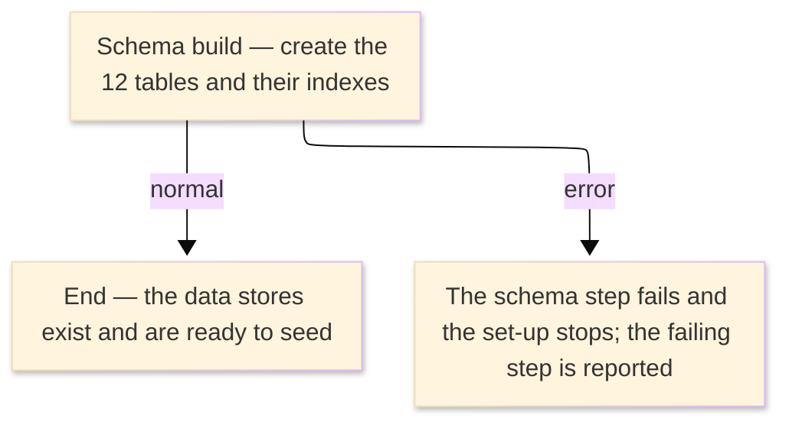

# TO-BE Job Flow — DEFVSAM

> The TO-BE counterpart of `DEFVSAM_VsamClusterDefine_JobFlow.md`. The step order and the branch
> conditions are preserved; where a step changes form factor it is recorded in §4.

| Item | Value |
|---|---|
| JOBID | DEFVSAM (define all the master data stores) |
| Process name | Create the credit-card data stores — now the relational schema |
| Platform | Java 17 · Spring Boot 3.x · Oracle (H2 in dev) — schema/DDL creation, not Spring Batch |
| How it is run | the schema is created once when the database is built (Flyway migration in the backend, `schema.sql` in the batch launcher); there is no `batch-runner` job for this step |
| Schedule | not determined (ask the team) — historically a one-time set-up job |
| Log ／ monitoring | the database migration / DDL log |
| Author | modernizeX |

> **Form-factor change (business impact):** in AS-IS this job ran IDCAMS DEFINE CLUSTER to create the
> 12 VSAM KSDS clusters and their alternate indexes. In TO-BE those 12 files are relational tables;
> there is **no Spring Batch job** for this step. The whole job is replaced by the schema/DDL that
> creates the tables and their indexes. The business content — the shape of the credit-card data
> stores — is the same; only the storage mechanism changed. The alternate-index DEFINE steps became
> the tables' secondary indexes. See §4.

### Job flow diagram

## 1. Step table — 1-to-1 mapping

One bold row per step, one sub-row per I/O.

| Step | Program | I/O | File ／ table | Notes |
|---|---|---|---|---|
| **◆ Overview** |  | ・Overall: | create the 12 credit-card data stores → relational tables |  |
| **◆ P0 Schema creation** |  |  |  |  |
| **SCHEMADDL** | (no program — schema/DDL) |  |  | was 12 IDCAMS DEFINE CLUSTER steps; now the schema/DDL — see §4 |
|  |  | IN | the table and index definitions (were the cluster/index DEFINE control cards) |  |
|  |  | OUT | table `acctfile` | keyed by `ac_id` |
|  |  | OUT | table `cardfile` | keyed by `cd_num`; secondary index (was CARDAX1) |
|  |  | OUT | table `custfile` | keyed by `cu_id` |
|  |  | OUT | table `xreffile` | keyed by `xr_card_num`; two secondary indexes (were XREFAX1, XREFAX2) |
|  |  | OUT | table `tranfile` | keyed by `tr_id`; secondary index (was TRANAX1) |
|  |  | OUT | table `ttypfile` | keyed by `tt_cd` |
|  |  | OUT | table `tcatfile` | keyed by `tc_type_cd, tc_cd` |
|  |  | OUT | table `dgrpfile` | keyed by `dg_acct_group, dg_type_cd, dg_cat_cd` |
|  |  | OUT | table `usrsec` | keyed by `us_id` |
|  |  | OUT | table `billfile` | keyed by `bl_id` |
|  |  | OUT | table `stmtfile` | keyed by `st_acct_id, st_cycle` |
|  |  | OUT | table `ctrlfile` | keyed by `ct_key` |

## 2. Branch conditions & dependencies

| Condition | Flow |
|---|---|
| the schema runs once when the database is first built | every table must exist before any load seeds it and before the on-line and posting functions can use it |
| the schema step must complete before any master is seeded or read | otherwise the load and the on-line functions fail and set-up stops |

## 3. Termination & abnormal handling

| Item | Value |
|---|---|
| Normal termination | the schema completes and the 12 tables and their indexes exist (success) |
| Business error | a failed schema step stops the set-up and reports the failing step |
| Rerun | re-run the migration / DDL against a fresh (empty) database |
| Cleanup | drop and recreate the schema to rebuild from scratch |

## 4. Programs in the job

| # | Program | Module | Detailed document |
|---|---|---|---|
| 1 | (none — IDCAMS DEFINE utility) | replaced by the database schema/DDL that creates the 12 tables (`acctfile`, `cardfile`, `custfile`, `xreffile`, `tranfile`, `ttypfile`, `tcatfile`, `dgrpfile`, `usrsec`, `billfile`, `stmtfile`, `ctrlfile`) and, as secondary indexes, the former alternate-index steps | no program design — utility step, no COBOL business logic |
