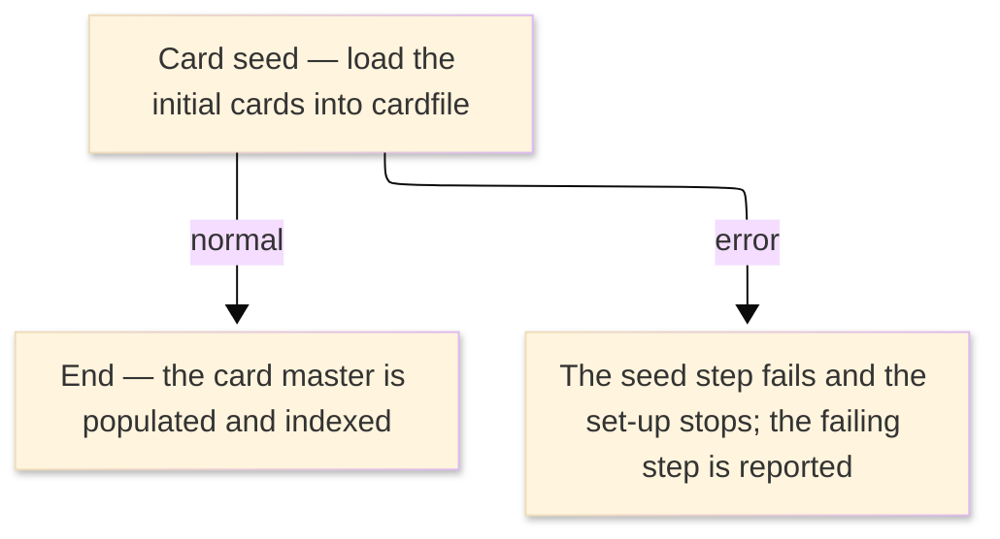

# TO-BE Job Flow — LOADCARD

> The TO-BE counterpart of `LOADCARD_CardLoad_JobFlow.md`. The step order and the branch
> conditions are preserved; where a step changes form factor it is recorded in §4.

| Item | Value |
|---|---|
| JOBID | LOADCARD (initial load of the card master) |
| Process name | Initial load of the card master — unchanged |
| Platform | Java 17 · Spring Boot 3.x · Oracle (H2 in dev) — data initialization, not Spring Batch |
| How it is run | one-time database seed at environment set-up (see §4); there is no `batch-runner` job for this load |
| Schedule | not determined (ask the team) — historically a one-time initial load |
| Log ／ monitoring | the database migration / seed log |
| Author | modernizeX |

> **Form-factor change (business impact):** in AS-IS this job was an IDCAMS REPRO utility that copied
> a sequential file into the card VSAM cluster and then built a card alternate index. In TO-BE the card
> master is the relational table `cardfile`; there is **no Spring Batch job** for this load. The same
> rows are created by the schema/seed step that builds the database, and the former alternate index is
> now a secondary index on `cardfile`. The business content — the initial set of cards — is the same;
> only the loading mechanism changed. See §4.

### Job flow diagram

## 1. Step table — 1-to-1 mapping

One bold row per step, one sub-row per I/O.

| Step | Program | I/O | File ／ table | Notes |
|---|---|---|---|---|
| **◆ Overview** |  | ・Overall: | initial cards → `cardfile` |  |
| **◆ P0 Initial load** |  |  |  |  |
| **CARDSEED** | (no program — data seed) |  |  | was IDCAMS REPRO; now a database seed — see §4 |
|  |  | IN | initial card data (was the sequential dataset) |  |
|  |  | OUT | table `cardfile` | keyed by `cd_num`; rows created once |
|  |  | OUT | secondary index on `cardfile` | was the alternate-index build step CARDBX1; now maintained automatically |

## 2. Branch conditions & dependencies

| Condition | Flow |
|---|---|
| the seed runs once when the database is first built | the card master must be populated before the on-line and posting functions can use it |
| the secondary index is created with the table | card lookups by the alternate key work as soon as the rows are seeded |
| the seed step must complete before the card is read anywhere | otherwise a store error is reported and set-up stops |

## 3. Termination & abnormal handling

| Item | Value |
|---|---|
| Normal termination | the seed completes and the card master holds the initial rows (success) |
| Business error | a failed seed stops the set-up and reports the failing step |
| Rerun | re-run the database seed against a fresh (empty) schema |
| Cleanup | drop and recreate the schema to reload from scratch |

## 4. Programs in the job

| # | Program | Module | Detailed document |
|---|---|---|---|
| 1 | (none — IDCAMS REPRO utility) | replaced by the database schema/seed that creates the `cardfile` rows; the former CARDBX1 alternate-index build is now a secondary index on `cardfile` | no program design — utility step, no COBOL business logic |
