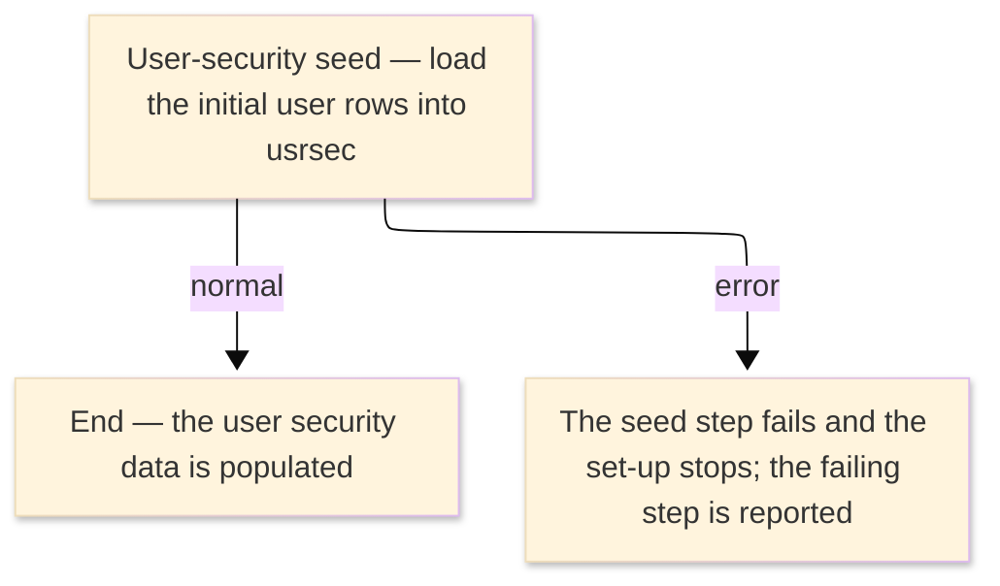

# TO-BE Job Flow — LOADUSER

> The TO-BE counterpart of `LOADUSER_UserLoad_JobFlow.md`. The step order and the branch
> conditions are preserved; where a step changes form factor it is recorded in §4.

| Item | Value |
|---|---|
| JOBID | LOADUSER (initial load of the user security data) |
| Process name | Initial load of the user security data — unchanged |
| Platform | Java 17 · Spring Boot 3.x · Oracle (H2 in dev) — data initialization, not Spring Batch |
| How it is run | one-time database seed at environment set-up (see §4); there is no `batch-runner` job for this load |
| Schedule | not determined (ask the team) — historically a one-time initial load |
| Log ／ monitoring | the database migration / seed log |
| Author | modernizeX |

> **Form-factor change (business impact):** in AS-IS this job was an IDCAMS REPRO utility that copied
> a sequential file into the user-security VSAM cluster. In TO-BE the user security data is the
> relational table `usrsec`; there is **no Spring Batch job** for this load. The same rows are created
> by the schema/seed step that builds the database. The business content — the initial set of user
> security records — is the same; only the loading mechanism changed. See §4.

### Job flow diagram

## 1. Step table — 1-to-1 mapping

One bold row per step, one sub-row per I/O.

| Step | Program | I/O | File ／ table | Notes |
|---|---|---|---|---|
| **◆ Overview** |  | ・Overall: | initial user-security rows → `usrsec` |  |
| **◆ P0 Initial load** |  |  |  |  |
| **USERSEED** | (no program — data seed) |  |  | was IDCAMS REPRO; now a database seed — see §4 |
|  |  | IN | initial user-security data (was the sequential dataset) |  |
|  |  | OUT | table `usrsec` | keyed by `us_id`; rows created once |

## 2. Branch conditions & dependencies

| Condition | Flow |
|---|---|
| the seed runs once when the database is first built | the user security data must be populated before the on-line sign-on and administration functions can use it |
| the seed step must complete before a user is read anywhere | otherwise a store error is reported and set-up stops |

## 3. Termination & abnormal handling

| Item | Value |
|---|---|
| Normal termination | the seed completes and the user security data holds the initial rows (success) |
| Business error | a failed seed stops the set-up and reports the failing step |
| Rerun | re-run the database seed against a fresh (empty) schema |
| Cleanup | drop and recreate the schema to reload from scratch |

## 4. Programs in the job

| # | Program | Module | Detailed document |
|---|---|---|---|
| 1 | (none — IDCAMS REPRO utility) | replaced by the database schema/seed that creates the `usrsec` rows | no program design — utility step, no COBOL business logic |
