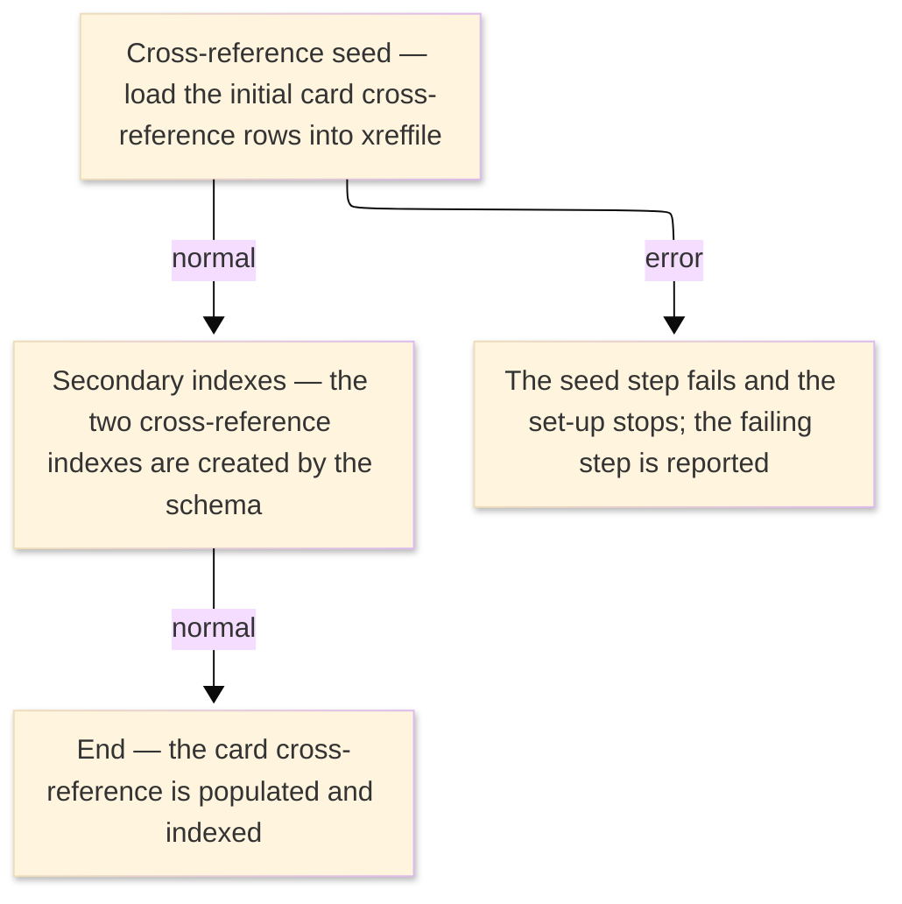

# TO-BE Job Flow — LOADXREF

> The TO-BE counterpart of `LOADXREF_XrefLoad_JobFlow.md`. The step order and the branch
> conditions are preserved; where a step changes form factor it is recorded in §4.

| Item | Value |
|---|---|
| JOBID | LOADXREF (initial load of the card cross-reference) |
| Process name | Initial load of the card cross-reference — unchanged |
| Platform | Java 17 · Spring Boot 3.x · Oracle (H2 in dev) — data initialization, not Spring Batch |
| How it is run | one-time database seed at environment set-up (see §4); there is no `batch-runner` job for this load |
| Schedule | not determined (ask the team) — historically a one-time initial load |
| Log ／ monitoring | the database migration / seed log |
| Author | modernizeX |

> **Form-factor change (business impact):** in AS-IS this job ran an IDCAMS REPRO utility to copy a
> sequential file into the card cross-reference VSAM cluster and then two IDCAMS steps to build its two
> alternate indexes. In TO-BE the card cross-reference is the relational table `xreffile`; there is **no
> Spring Batch job** for this load. The same rows are created by the schema/seed step that builds the
> database, and the two alternate indexes became the table's two secondary indexes, created by the
> schema. The business content — the initial set of card-to-account cross-reference entries — is the
> same; only the loading mechanism changed. See §4.

### Job flow diagram

## 1. Step table — 1-to-1 mapping

One bold row per step, one sub-row per I/O.

| Step | Program | I/O | File ／ table | Notes |
|---|---|---|---|---|
| **◆ Overview** |  | ・Overall: | initial card cross-reference rows → `xreffile` (with two secondary indexes) |  |
| **◆ P0 Initial load** |  |  |  |  |
| **XREFSEED** | (no program — data seed) |  |  | was IDCAMS REPRO; now a database seed — see §4 |
|  |  | IN | initial card cross-reference data (was the sequential dataset) |  |
|  |  | OUT | table `xreffile` | keyed by `xr_card_num`; rows created once |
| **XREFBX1** | (no program — schema index) |  |  | was an IDCAMS alternate-index build; now a secondary index on `xreffile` — see §4 |
|  |  | OUT | table `xreffile` | first secondary index (was the XREFBX1 alternate-index build step) |
| **XREFBX2** | (no program — schema index) |  |  | was an IDCAMS alternate-index build; now a secondary index on `xreffile` — see §4 |
|  |  | OUT | table `xreffile` | second secondary index (was the XREFBX2 alternate-index build step) |

## 2. Branch conditions & dependencies

| Condition | Flow |
|---|---|
| the seed runs once when the database is first built | the card cross-reference must be populated before the on-line and posting functions can resolve a card to its account |
| the two secondary indexes are created with the table by the schema (were the XREFBX1 and XREFBX2 build steps, run after the load) | the alternate-key look-ups those index builds provided are served by these secondary indexes |
| the seed step must complete before the cross-reference is read anywhere | otherwise a store error is reported and set-up stops |

## 3. Termination & abnormal handling

| Item | Value |
|---|---|
| Normal termination | the seed completes and the card cross-reference holds the initial rows, indexed by its two secondary indexes (success) |
| Business error | a failed seed stops the set-up and reports the failing step |
| Rerun | re-run the database seed against a fresh (empty) schema |
| Cleanup | drop and recreate the schema to reload from scratch |

## 4. Programs in the job

| # | Program | Module | Detailed document |
|---|---|---|---|
| 1 | (none — IDCAMS REPRO utility) | replaced by the database schema/seed that creates the `xreffile` rows and, as secondary indexes, the former XREFBX1 and XREFBX2 alternate-index build steps | no program design — utility step, no COBOL business logic |
