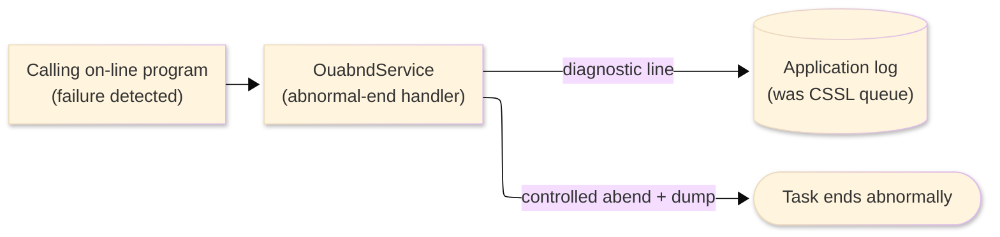
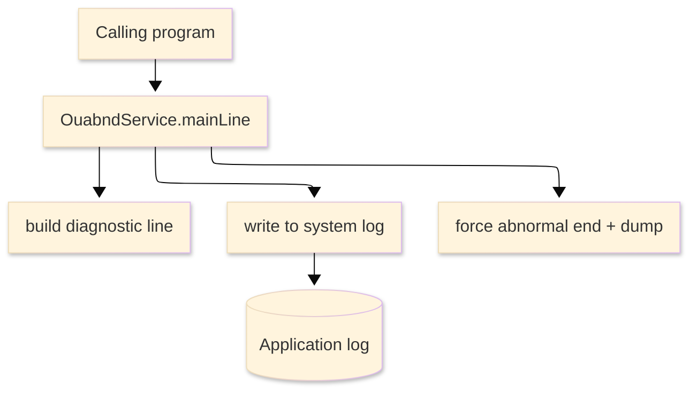

# TO-BE Batch Program Design — OUABND_AbendHandler

> **TO-BE = AS-IS in business terms.** The section order follows the AS-IS document so the two
> compare 1-to-1; what is added is the mapping onto the generated Java/Spring module. Anything
> forced to differ is stated in the section it belongs to, in business terms.

**Header**

| Item | Content |
|---|---|
| System | ORION-CCMS (ORION Credit Card Management System) |
| Source program | OUABND（COBOL） |
| TO-BE module | `orion-online/back-end/programs/ouabnd` · package `com.generated.orion.ouabnd` |
| Platform | Java 17 · Spring Boot 3.x · DB Oracle (H2 in dev) |
| Author ／ Date | modernizeX ／ 2026-09-28 |

> **Form-factor note (business impact):** in AS-IS this was a shared abnormal-end handler invoked by
> another program when it hit a fatal error (reached through a CICS program link). The transpiler
> produced it as an in-process service in the on-line back-end (`OuabndService`), **not** as a
> stand-alone Spring Batch job; the business behaviour — capture the failure diagnostics and end the
> task in a controlled way with a dump — is unchanged. It is still called in-process by whichever
> program detects the failure. See §8.

## 1. Program overview

### 1.1 TO-BE I/O diagram

### 1.2 Function overview

When another on-line program detects a fatal error it hands this handler a small diagnostic block —
the failing program name, the location within it, the system response and reason codes and a free-text
detail. The handler builds a single readable diagnostic line from those values, writes it to the
system log so operators can see what failed, records the current system response code, and then ends
the task abnormally with a storage dump so the original failure is captured for diagnosis.

### 1.3 I/O table

| Business name | File ／ table | I/O |
|---|---|---|
| Diagnostic request / result area | in-memory call area (was COMMAREA `KABND-PARM`) | I-O |
| System log | application log (was the CSSL transient-data queue) | O |

### 1.4 Called subprograms / modules

| Item | Notes |
|---|---|
| (no sub-program) | the handler calls no external business program |
| Application log | receives the diagnostic line (was the CSSL transient-data queue) |

### 1.5 DB tables & SQL

No SQL — the handler performs no database or business-file access; it writes one diagnostic line to
the application log and ends the task.

### 1.6 Special notes

- Called in-process by another on-line program when it detects a fatal error; in AS-IS it was reached
  through a CICS program link to `OUABND`.
- The handler always ends the task abnormally with a storage dump, so the original failure is
  preserved for diagnosis; there is no path in which it returns normally.
- No database or business-file access; the only external effect is the diagnostic line on the system
  log.

## 2. Processing details

_One row per business step, in execution order. Paragraph and method names are intentionally absent._

| 識別番号 | Business step | What happens | Condition ／ actual value |
|---|---|---|---|
| 0.0 | The handler starts | it is called in-process by the failing program and drives the diagnostic capture and the controlled abnormal end |  |
| 2.0 | Build the diagnostic line | assembles one readable line from the failing program name, the location within it and the free-text detail supplied by the caller | line reads "ABEND IN … AT … - …" |
| 2.1 | Record the diagnostic | writes the diagnostic line to the system log so the failure is visible to operators |  |
| 9.0 | End the task abnormally | captures the current system response code and forces a controlled abnormal end with a storage dump, so the failure is captured for diagnosis |  |

## 3. Structure diagram

_The call structure of the routine as generated._

## 4. Output specifications (file / table)

The diagnostic block is passed in and echoed back unchanged; the handler reads its fields to build the
log line and does not alter them. Byte positions are kept from the AS-IS layout.

### 4.1 Diagnostic request / result area (KABND) — 126 bytes

| Level | Item name | Field ／ column | Type ／ bytes | Position | Java ／ SQL type | How it is set |
|---|---|---|---|---|---|---|
| 01 | Parm | KABND-PARM | group ／ 126 | 1 | in-memory call area | whole diagnostic block |
| 05 | Failing program | KA-PROGRAM | X(08) ／ 8 | 1 | `String` | supplied by the failing program (input) |
| 05 | Location | KA-PARAGRAPH | X(30) ／ 30 | 9 | `String` | the point within the program where it failed (supplied by the caller) |
| 05 | Response code | KA-RESP-CD | S9(09) ／ 4 | 39 | `int` | the system response code at the point of failure (supplied by the caller) |
| 05 | Reason code | KA-REAS-CD | S9(09) ／ 4 | 43 | `int` | the reason code at the point of failure (supplied by the caller) |
| 05 | Detail text | KA-DETAIL | X(80) ／ 80 | 47 | `String` | free-text detail supplied by the caller |

> The response and reason codes are binary fullwords (`int`, no fraction). The handler assembles the
> log line "ABEND IN <failing program> AT <location> - <detail>" from these fields and writes it to
> the application log before ending the task; the block itself is returned unchanged.

## 5. In/out parameters & check specifications

### 5.1 Parameters

| Kind | Value | Notes |
|---|---|---|
| Input parameter | the diagnostic block (`KABND-PARM`) — failing program, location, response and reason codes, detail text | supplied by the failing program |
| Return value | a controlled abnormal end with a storage dump | the handler does not return normally |
| Echoed area | the diagnostic block is passed back unchanged | used only to build the log line |

### 5.2 Checks

| No. | Kind | Condition | Error code | Behaviour |
|---|---|---|---|---|
| 1 | Operational | the handler is called at all | — | it always records the diagnostic line and then forces a controlled abnormal end with a dump |

## 6. Modification summary

| No. | Date | Title | Content |
|---|---|---|---|
| 1 | 2026-09-28 | Initial TO-BE mapping | Mapped from the AS-IS design onto the generated `OuabndService`; behaviour preserved. |

## 7. Screen

No screen — the handler writes a diagnostic line to the system log and ends the task; nothing is shown
on a screen.

## 8. TO-BE operations (replacing JCL/BAT)

| Item | Value |
|---|---|
| Trigger | called in-process by another on-line program when it detects a fatal error (in AS-IS a CICS-linked routine); it is now an in-process on-line service (`OuabndService`), not a Spring Batch job, and is not scheduled |
| Schedule | not applicable — it runs only when a caller fails |
| Input data | the diagnostic details supplied by the failing program |
| Log | the diagnostic line is written to the application log (was the CSSL transient-data queue) |
| Rerun | not applicable — the handler runs only in response to a caller's failure |
