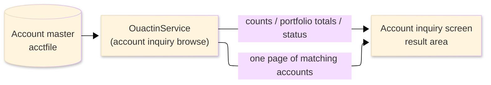
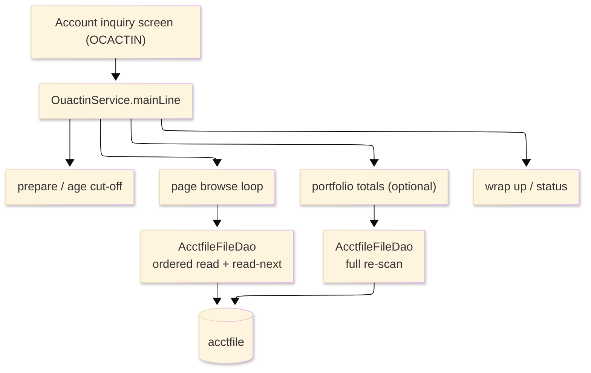

# TO-BE Batch Program Design — OUACTIN_AccountInquiryBrowse

> **TO-BE = AS-IS in business terms.** The section order follows the AS-IS document so the two
> compare 1-to-1; what is added is the mapping onto the generated Java/Spring module. Anything
> forced to differ is stated in the section it belongs to, in business terms.

**Header**

| Item | Content |
|---|---|
| System | ORION-CCMS (ORION Credit Card Management System) |
| Source program | OUACTIN（COBOL） |
| TO-BE module | `orion-online/back-end/programs/ouactin` · package `com.generated.orion.ouactin` |
| Platform | Java 17 · Spring Boot 3.x · DB Oracle (H2 in dev) |
| Author ／ Date | modernizeX ／ 2026-09-28 |

> **Form-factor note (business impact):** in AS-IS this account browse was a COBOL routine that the
> account-inquiry screen called on line to fill one page of results. The transpiler produced it as an
> in-process service in the on-line back-end (`OuactinService`), **not** as a stand-alone Spring Batch
> job; the business logic — which accounts belong to each view and the figures shown for them — is
> unchanged. It is still invoked from the account-inquiry screen. See §8.

## 1. Program overview

### 1.1 TO-BE I/O diagram

### 1.2 Function overview

Return one page of accounts that match the view chosen on the account-inquiry screen. The run reads
the account master in account-id order, and for each account works out its available credit
(limit minus balance), its utilisation (balance against limit, capped) and its minimum due, then
tests it against the selected view — every account, delinquent, over-limit, dormant, closed, newly
opened, or high-utilisation. Matching accounts are collected up to a full page (thirteen); if more
remain, a resume key and a more indicator are returned so the screen can page forward. When the screen
also asks for indicators, the whole filtered set is re-read to return the true population count, total
balance and total available credit. The run only reads; it never changes an account.

### 1.3 I/O table

| Business name | File ／ table | I/O |
|---|---|---|
| Account master (was VSAM KSDS) | table `acctfile` | I |
| Request / result area | in-memory call area (was COMMAREA) | I-O |

> The keyed account browse (start / read-next / end) becomes an ordered read of `acctfile` by its
> primary key `ac_id`, so accounts are still processed in ascending account-id order. Field widths and
> money precision are preserved (see §4). No account row is written back.

### 1.4 Called subprograms / modules

| Item | Notes |
|---|---|
| `AcctfileFileDao` | data access for the account master; ordered browse and read-next by account id |
| (no sub-program) | the routine calls no external business program |

### 1.5 DB tables & SQL

| Table | Operation | Columns |
|---|---|---|
| `acctfile` | SELECT (ordered read by `ac_id`), sequential browse forward | balance, credit limit, cycle credit / debit, active status, open date and group columns via JdbcTemplate |

### 1.6 Special notes

- Called on demand from the account-inquiry screen; the request names the view, the account to resume
  after (`KAI-START-KEY`) and whether portfolio indicators are wanted (`KAI-WANT-KPI`).
- Money is held as `BigDecimal`. Utilisation is balance divided by limit times one hundred, rounded
  half-up and capped at 999.99; available credit is limit minus balance. The delinquent test compares
  cycle credit against a minimum due of two percent of the balance with a floor of twenty-five.
- Read-only: the run reports figures and never updates the account master, so it is safe to repeat.

## 2. Processing details

_One row per business step, in execution order. Paragraph and method names are intentionally absent._

| 識別番号 | Business step | What happens | Condition ／ actual value |
|---|---|---|---|
| 0.0 | The inquiry starts | the run is called from the account-inquiry screen and drives preparation, the age cut-off, the page browse, the optional portfolio totals and the wrap-up in turn |  |
| 1.0 | Prepare the run | clears the result counters and paging switches and sets the status to normal |  |
| 2.0 | Work out the age cut-off | establishes the date ninety days back so newly opened accounts can be recognised | cut-off = today minus ninety days |
| 3.0 | Browse a page of accounts | positions at the requested account and reads forward, keeping matching accounts until the page is full or the file ends | stops at thirteen kept accounts or end of file |
| 3.1 | Position the read | starts the account read at the requested account; when there is nothing to read the browse is treated as finished; an unexpected store response stops the browse and is flagged | not-found or end → nothing to browse; other → flagged as error |
| 3.2 | Gather the page | reads the next account, counts it as scanned, derives its figures, tests it against the chosen view and keeps it when it matches | end of accounts ends the page |
| 3.4 | Finish the read | closes the account read once the page is complete and records whether more accounts remain and the resume key | more indicator set when the file was not exhausted |
| 4.0 | Derive each account's figures | works out available credit, utilisation (capped) and the minimum due for the account | utilisation forced to zero when limit or balance is not positive |
| 4.5 | Apply the chosen view | keeps the account only when it belongs to the selected view — every account, delinquent (cycle credit below the minimum due), over-limit (balance above limit), dormant (no cycle credit or debit), closed (status not active), newly opened (opened since the cut-off) or high-utilisation (utilisation at or above eighty percent) | the view is chosen on the screen |
| 5.0 | Keep the matching account | adds the account to the page with its id, status, balance, limit, available credit and utilisation, and remembers its key as the resume point |  |
| 6.0 | Compute the portfolio totals | when indicators were requested, re-reads the whole filtered set and totals the matching population, their balances and their available credit | only when the screen asked for indicators |
| 9.0 | Wrap up the run | sets the final status — normal, or error when a store failure was met — and returns the page, the counts, the totals and the resume key to the screen | error status when a store access failed |

## 3. Structure diagram

_The call structure of the routine as generated._

## 4. Output specifications (file / table)

The result call area returned to the screen keeps the original field widths and money precision; it is
the former COMMAREA, now an in-memory object, and no field maps to a written table column.

### 4.1 Result call area (KACTIN-AREA) — 763 bytes

| Level | Item name | Field | Type ／ bytes | Position | Java type | How it is set |
|---|---|---|---|---|---|---|
| 01 | Area | KACTIN-AREA | group ／ 763 | 1 | call area | whole request / result area |
| 05 | Filter | KAI-FILTER | X(01) ／ 0 | 1 | `String` | requested view (input) |
| 05 | Start key | KAI-START-KEY | 9(11) ／ 11 | 1 | `long` | account to resume after (input) |
| 05 | Want indicators | KAI-WANT-KPI | X(01) ／ 0 | 12 | `String` | whether portfolio totals are wanted (input) |
| 05 | Return code | KAI-RETURN-CD | X(01) ／ 0 | 12 | `String` | normal or error, set at wrap-up |
| 05 | Row count | KAI-ROW-COUNT | 9(02) ／ 2 | 12 | `int` | accounts kept on the page |
| 05 | More switch | KAI-MORE-SW | X(01) ／ 0 | 14 | `String` | more-accounts indicator |
| 05 | Next key | KAI-NEXT-KEY | 9(11) ／ 11 | 14 | `long` | next-page resume account |
| 05 | Scan count | KAI-SCAN-COUNT | 9(07) ／ 7 | 25 | `int` | accounts read |
| 05 | Population count | KAI-POP-COUNT | 9(09) ／ 9 | 32 | `long` | filtered population size |
| 05 | Balance total | KAI-POP-BAL-TOT | S9(15)V99 ／ 17 | 41 | `BigDecimal` | total balance of the population |
| 05 | Available total | KAI-POP-AVL-TOT | S9(15)V99 ／ 17 | 58 | `BigDecimal` | total available credit |
| 05 | Row (occurs 13) | KAI-ROW | group ／ 689 | 75 | list | one entry per kept account |
| 10 | Account id | KAI-R-ID | 9(11) ／ 11 | 75 | `long` | account id |
| 10 | Status | KAI-R-STATUS | X(01) ／ 1 | 86 | `String` | active status |
| 10 | Balance | KAI-R-BAL | S9(10)V99 ／ 12 | 87 | `BigDecimal` | current balance |
| 10 | Limit | KAI-R-LIMIT | S9(10)V99 ／ 12 | 99 | `BigDecimal` | credit limit |
| 10 | Available | KAI-R-AVAIL | S9(10)V99 ／ 12 | 111 | `BigDecimal` | available credit |
| 10 | Utilisation | KAI-R-UTIL | 9(03)V99 ／ 5 | 123 | `BigDecimal` | utilisation percent (capped) |

> The page holds up to thirteen accounts (`KAI-ROW` occurs 13). Money stays at two-decimal scale;
> utilisation is computed at high precision, rounded half-up and capped at 999.99.

## 5. In/out parameters & check specifications

### 5.1 Parameters

| Kind | Value | Notes |
|---|---|---|
| Input parameter | the view to browse and the account to resume after (`KAI-FILTER`, `KAI-START-KEY`) | supplied by the account-inquiry screen |
| Input parameter | whether portfolio indicators are also wanted (`KAI-WANT-KPI`) | drives the second, filter-wide pass |
| Return value | an outcome code — normal or error (`KAI-RETURN-CD`) | tells the screen whether the page is reliable |
| Return page | up to thirteen matching accounts with balance, limit, available credit and utilisation (`KAI-ROW`) | shown on the inquiry screen |
| Return counts | accounts kept, accounts read, the more indicator and the resume key (`KAI-ROW-COUNT`, `KAI-SCAN-COUNT`, `KAI-MORE-SW`, `KAI-NEXT-KEY`) | drive paging |
| Return totals | filtered population count, total balance and total available credit (`KAI-POP-COUNT`, `KAI-POP-BAL-TOT`, `KAI-POP-AVL-TOT`) | returned only when indicators were requested |

### 5.2 Checks

| No. | Kind | Condition | Error code | Behaviour |
|---|---|---|---|---|
| 1 | Store access | positioning the account read returns an unexpected response | — | the outcome code is set to error, the browse ends, and the response is written to the application log |
| 2 | Store access | reading the next account returns an unexpected response | — | the outcome code is set to error, the browse ends, and the response is written to the application log |
| 3 | Business | no account matches the chosen view | — | the page comes back empty with a normal status and the more indicator turned off |

## 6. Modification summary

| No. | Date | Title | Content |
|---|---|---|---|
| 1 | 2026-09-28 | Initial TO-BE mapping | Mapped from the AS-IS design onto the generated `OuactinService`; behaviour preserved. |

## 7. Screen

No screen — the routine is driven from the account-inquiry screen and returns its page and figures there.

## 8. TO-BE operations (replacing JCL/BAT)

| Item | Value |
|---|---|
| Trigger | called on demand from the account-inquiry screen each time the operator selects a view or pages forward |
| Schedule | not determined (ask the team) |
| Input data | the account balances, limits, statuses and open dates already held in the database |
| Log | written to the application log; the counts and figures are returned to the operator on screen |
| Rerun | safe to rerun; the run only reads the account master and recomputes the figures each time |
