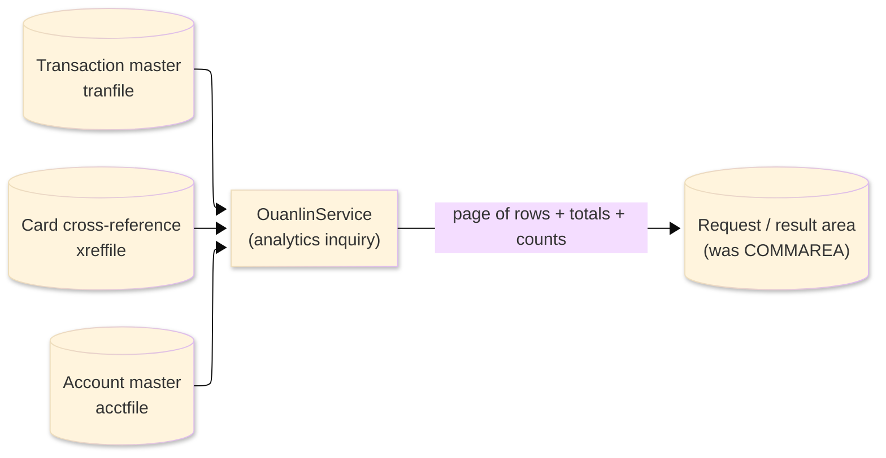
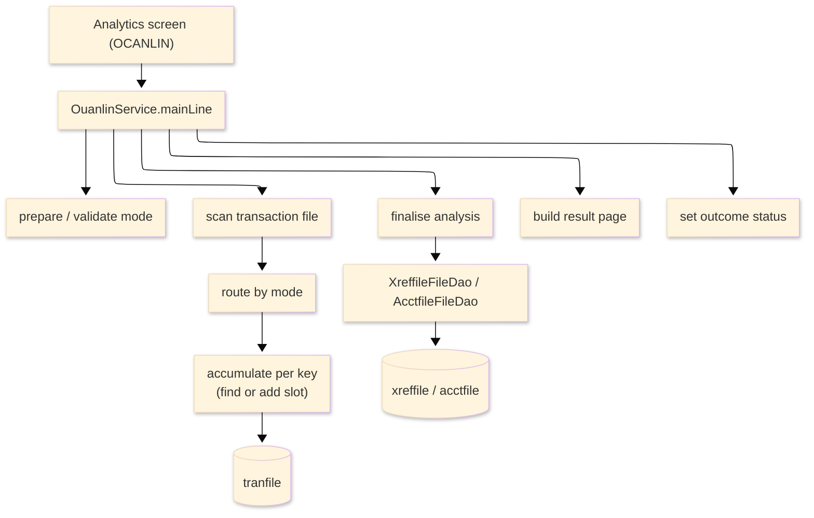

# TO-BE Batch Program Design — OUANLIN_AnalyticsCompute

> **TO-BE = AS-IS in business terms.** The section order follows the AS-IS document so the two
> compare 1-to-1; what is added is the mapping onto the generated Java/Spring module. Anything
> forced to differ is stated in the section it belongs to, in business terms.

**Header**

| Item | Content |
|---|---|
| System | ORION-CCMS (ORION Credit Card Management System) |
| Source program | OUANLIN（COBOL） |
| TO-BE module | `orion-online/back-end/programs/ouanlin` · package `com.generated.orion.ouanlin` |
| Platform | Java 17 · Spring Boot 3.x · DB Oracle (H2 in dev) |
| Author ／ Date | modernizeX ／ 2026-09-28 |

> **Form-factor note (business impact):** in AS-IS this analytics routine replaced four legacy nightly
> report jobs with a single on-line inquiry called from the analytics screen (reached through a CICS
> program link). The transpiler produced it as an in-process service in the on-line back-end
> (`OuanlinService`), **not** as a stand-alone Spring Batch job; the business behaviour — scan the
> transactions and compute the requested analysis — is unchanged. It is still called in-process from the
> analytics screen. See §8.

## 1. Program overview

### 1.1 TO-BE I/O diagram

### 1.2 Function overview

An on-line analytics inquiry over the transaction master. For the requested mode it scans transactions
from the start of file (bounded by a scan cap so the inquiry stays responsive), accumulates the
mode-specific figures, and returns one page of result rows plus two mode-specific grand totals to the
caller. Four modes are supported: rewards (points earned per card on purchases), fraud (cards flagged
for a large amount or high transaction velocity), general ledger (totals by transaction type as
debit/credit), and reconciliation (movement per account compared with its balance).

### 1.3 I/O table

| Business name | File ／ table | I/O |
|---|---|---|
| Transaction master (was VSAM KSDS) | table `tranfile` | I |
| Card cross-reference (was VSAM KSDS) | table `xreffile` | I |
| Account master (was VSAM KSDS) | table `acctfile` | I |
| Request / result area | in-memory call area (was COMMAREA `KANLB-PARM`) | I-O |

> The transaction keyed browse (start / read-next) becomes an ordered read of `tranfile` by its primary
> key `tr_id`, so transactions are scanned in ascending transaction-id order; the scan is bounded by a
> cap for on-line responsiveness. The card cross-reference and account master are read directly by key
> (`xr_card_num`, `ac_id`), so record order does not apply to them.

### 1.4 Called subprograms / modules

| Item | Notes |
|---|---|
| `TranfileFileDao` · `XreffileFileDao` · `AcctfileFileDao` | data access for the transaction master (browse), the card cross-reference and the account master |
| (no sub-program) | the routine calls no external business program |

### 1.5 DB tables & SQL

| Table | Operation | Columns |
|---|---|---|
| `tranfile` | SELECT (ordered browse from start, capped) | scanned by `tr_id` |
| `xreffile` | SELECT by card number | resolves a card to its account (`xr_card_num`) |
| `acctfile` | SELECT by account id | current balance for reconciliation (`ac_id`) |

### 1.6 Special notes

- Called in-process from the analytics screen; in AS-IS it was reached through a CICS program link and
  was linked from OCANLIN.
- Replaces four legacy batch reports — rewards (OBRWD / OBRWDRPT), fraud (OBRFRD), general-ledger
  extract (OBGLEX) and reconciliation (OBRECON) — with a single on-line inquiry.
- The transaction browse is bounded by a scan cap so the inquiry stays responsive; results are paged by
  a start offset and a page size of up to six rows, with a "more rows" flag.
- Amounts are held as `BigDecimal`; reward points are earned on the whole-unit purchase amount (the
  fractional part is dropped before points are computed) at the base rate, or the bonus rate at or above
  the large-amount threshold.
- The result table has a fixed capacity; distinct keys beyond that capacity are counted as overflow.

## 2. Processing details

_One row per business step, in execution order. Paragraph and method names are intentionally absent._

| 識別番号 | Business step | What happens | Condition ／ actual value |
|---|---|---|---|
| 0.0 | The analytics inquiry starts | validates the request, scans the transactions, finalises the chosen analysis, builds one page of results and sets the outcome | analysis runs only when the mode is valid |
| 1.0 | Prepare the run | clears the result table, counters and totals, takes the requested page size (defaulting to six when out of range), and checks the requested mode | page size 1–6; mode RW / FR / GL / RC |
| 2.0 | Scan the transactions | reads the transaction master in order from the start, accumulating figures for the chosen mode until end of file or the scan cap | bounded by the scan cap |
| 2.1 | Start the scan | positions the read at the start of the transaction master; nothing to read ends the scan empty; a read failure ends the run with the error status |  |
| 2.2 | Take the next transaction | reads the next transaction and, while records remain and the cap is not reached, hands each one to the chosen analysis; a read failure ends the run with the error status | end of file stops the scan |
| 2.3 | Route by mode | sends each transaction to the rewards, fraud, general-ledger or reconciliation accumulation | by mode RW / FR / GL / RC |
| 2.35 | Classify the transaction | decides whether a transaction counts as a purchase | payments, credits, fees and interest (PY, CR, FE, IN) are not purchases |
| 2.4 | Accumulate rewards | for each purchase, earns points on the whole-unit amount and rolls the count, amount and points up per card | bonus rate at or above the large-amount threshold, otherwise the base rate |
| 2.5 | Accumulate fraud stats | rolls the count and amount up per card and keeps the largest single amount seen for that card |  |
| 2.6 | Accumulate general-ledger totals | rolls the count and amount up per transaction type, marking each entry credit or debit | payments and credits (PY, CR) → credit; else debit |
| 2.7 | Accumulate reconciliation movement | treats payments and credits as a negative movement and everything else as positive, resolves the card to its account, and rolls the movement up per account | a card with no account is counted as an orphan |
| 2.9 | End the scan | closes the transaction read |  |
| 3.0 | Finalise the analysis | applies the mode-specific wrap-up | fraud → keep flagged; reconciliation → compare to balance |
| 3.1 | Finalise fraud | flags a card for a large single amount, high velocity, or both, keeps only flagged cards, and sets the totals to the flagged amount and the flagged-card count | reasons "LARGE AMT" / "VELOCITY" / "LARGE+VELO" |
| 3.2 | Finalise reconciliation | reads each account, compares the accumulated movement with the current balance, and marks the row | "OK" / "MISMATCH" / "MISSING" / "READ ERR" |
| 4.0 | Build the result page | records the totals and counts, then copies the requested page of rows (from the requested offset, up to the page size) and flags whether more rows remain | more rows → the "more" flag is set |
| 4.05 | Clear the page rows | blanks the six result row slots before the page is filled |  |
| 6.0 | Set the outcome | reports the error status when the run failed, no-rows when nothing matched, otherwise success | "99" failed / "10" no rows / "00" rows |
| 7.0 | Find or add a result slot | locates the result row for a key or starts a new one | a full result table counts an overflow |

## 3. Structure diagram

_The call structure of the routine as generated._

## 4. Output specifications (file / table)

The request / result area is passed in and returned; byte positions are kept from the AS-IS layout.

### 4.1 Request / result area (KANLB) — 490 bytes

| Level | Item name | Field ／ column | Type ／ bytes | Position | Java ／ SQL type | How it is set |
|---|---|---|---|---|---|---|
| 01 | Parm | KANLB-PARM | group ／ 490 | 1 | in-memory call area | whole request / result block |
| 05 | Request | KAB-REQUEST | group ／ 8 | 1 | group | the caller's request |
| 10 | Mode | KAB-MODE | X(02) ／ 2 | 1 | `String` | requested analysis — RW / FR / GL / RC (input) |
| 10 | Start offset | KAB-START-OFF | 9(04) ／ 4 | 3 | `int` | first result row to return (input) |
| 10 | Max rows | KAB-MAX-ROWS | 9(02) ／ 2 | 7 | `int` | page size, 1–6 (input; defaults to 6) |
| 05 | Result | KAB-RESULT | group ／ 22 | 9 | group | the run outcome |
| 10 | Status | KAB-STATUS | X(02) ／ 2 | 9 | `String` | "00" rows / "10" no rows / "99" invalid mode or read failure |
| 10 | Row count | KAB-ROW-CNT | 9(02) ／ 2 | 11 | `int` | rows returned in this page |
| 10 | Result count | KAB-RESULT-CNT | 9(04) ／ 4 | 13 | `int` | total result rows found |
| 10 | Scanned | KAB-SCANNED | 9(09) ／ 9 | 17 | `long` | transactions scanned |
| 10 | Discrepancies | KAB-DISC | 9(04) ／ 4 | 26 | `int` | reconciliation discrepancies |
| 10 | More | KAB-MORE | X(01) ／ 1 | 30 | `String` | "Y" when more rows remain beyond this page |
| 05 | Totals | KAB-TOTALS | group ／ 34 | 31 | group | mode-specific grand totals |
| 10 | Total 1 | KAB-TOT-1 | S9(15)V99 ／ 17 | 31 | `BigDecimal` | first grand total (e.g. purchase / debit amount) |
| 10 | Total 2 | KAB-TOT-2 | S9(15)V99 ／ 17 | 48 | `BigDecimal` | second grand total (e.g. points / credit amount) |
| 05 | Rows | KAB-ROWS | group ／ 426 | 65 | group | up to six result rows |
| 10 | Row | KAB-ROW | group ／ 426 | 65 | group | one result row |
| 15 | Row key | KAB-R-KEY | X(16) ／ 16 | 65 | `String` | card, account or type key for the row |
| 15 | Row info | KAB-R-INFO | X(16) ／ 16 | 81 | `String` | label — e.g. "PURCHASES" / "CR" / "DR" / "OK" / "MISMATCH" |
| 15 | Row count | KAB-R-CNT | 9(09) ／ 9 | 97 | `long` | transactions in the row |
| 15 | Row amount | KAB-R-AMT | S9(13)V99 ／ 15 | 106 | `BigDecimal` | accumulated amount / movement for the row |
| 15 | Row value | KAB-R-VAL | S9(13)V99 ／ 15 | 121 | `BigDecimal` | mode value — points, largest amount, or the account balance |

> Money is `BigDecimal` at two-decimal scale (zoned display, not packed); the grand totals and row
> amounts are running sums, so no rounding is applied. Reward points are computed on the whole-unit
> purchase amount — the fractional part is dropped before the rate is applied.

## 5. In/out parameters & check specifications

### 5.1 Parameters

| Kind | Value | Notes |
|---|---|---|
| Input parameters | the analysis mode (`KAB-MODE` — RW / FR / GL / RC), the page start offset (`KAB-START-OFF`) and the page size (`KAB-MAX-ROWS`, up to 6) | supplied by the analytics screen |
| Return status | the outcome (`KAB-STATUS`) | "00" rows returned, "10" no rows, "99" invalid mode or read failure |
| Return counts | rows in this page (`KAB-ROW-CNT`), total result rows (`KAB-RESULT-CNT`), transactions scanned (`KAB-SCANNED`), discrepancies (`KAB-DISC`) and a more-rows flag (`KAB-MORE`) | shown back on the analytics screen |
| Return amounts | two mode-specific grand totals (`KAB-TOT-1`, `KAB-TOT-2`) and, per row, the count, amount and value | shown back on the analytics screen |

### 5.2 Checks

| No. | Kind | Condition | Error code | Behaviour |
|---|---|---|---|---|
| 1 | Business | the requested mode is not RW / FR / GL / RC | `99` | the run ends with the error status |
| 2 | Business | the requested page size is below 1 or above 6 | — | defaulted to 6 |
| 3 | File access | the transaction browse returns a response other than normal, not-found or end-of-file | `99` | the run ends with the error status |
| 4 | File access | the account is not on file during reconciliation | — | the row is marked "MISSING" and counted as a discrepancy |
| 5 | Business | there are more distinct keys than the result table can hold | — | the extra transactions are counted as overflow |

## 6. Modification summary

| No. | Date | Title | Content |
|---|---|---|---|
| 1 | 2026-09-28 | Initial TO-BE mapping | Mapped from the AS-IS design onto the generated `OuanlinService`; behaviour preserved. |

## 7. Screen

No screen — the routine is called from the analytics screen; the page of results and totals is returned
there.

## 8. TO-BE operations (replacing JCL/BAT)

| Item | Value |
|---|---|
| Trigger | called in-process from the analytics screen when an analytics view is requested (in AS-IS a CICS-linked routine from OCANLIN); it is now an in-process on-line service (`OuanlinService`), not a Spring Batch job, and is not scheduled |
| Schedule | not applicable — called on demand; it replaces the former nightly report jobs |
| Input data | the transaction master, card cross-reference and account master in the database; the mode, offset and page size from the calling screen |
| Log | application log |
| Rerun | safe to rerun; each call re-scans the transactions (up to the scan cap) and recomputes the requested analysis |
