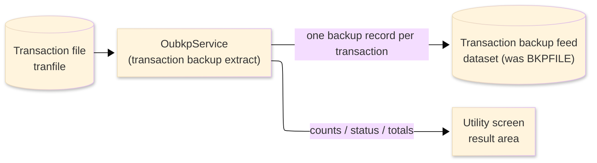
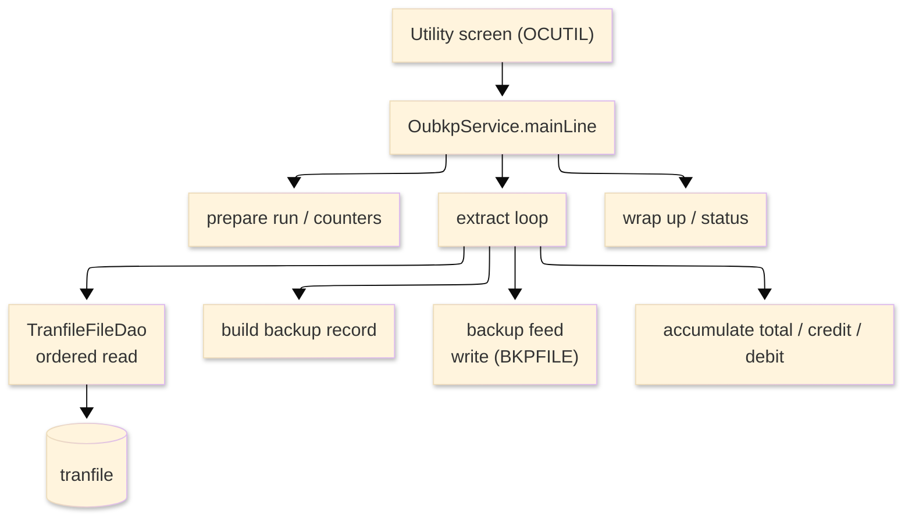

# TO-BE Batch Program Design — OUBKP_TransactionBackup

> **TO-BE = AS-IS in business terms.** The section order follows the AS-IS document so the two
> compare 1-to-1; what is added is the mapping onto the generated Java/Spring module. Anything
> forced to differ is stated in the section it belongs to, in business terms.

**Header**

| Item | Content |
|---|---|
| System | ORION-CCMS (ORION Credit Card Management System) |
| Source program | OUBKP（COBOL） |
| TO-BE module | `orion-online/back-end/programs/oubkp` · package `com.generated.orion.oubkp` |
| Platform | Java 17 · Spring Boot 3.x · DB Oracle (H2 in dev) |
| Author ／ Date | modernizeX ／ 2026-09-28 |

> **Form-factor note (business impact):** in AS-IS this transaction-backup extract was a COBOL routine
> linked from the utility screen. The transpiler produced it as an in-process service in the on-line
> back-end (`OubkpService`), **not** as a stand-alone Spring Batch job; the business logic — which
> transactions are extracted, the pipe-delimited backup record built for each, and how the totals,
> credit and debit sums are accumulated — is unchanged. It is still launched from the utility screen
> (OCUTIL). See §8.

## 1. Program overview

### 1.1 TO-BE I/O diagram

### 1.2 Function overview

Extract a backup feed of transactions on demand. The run reads the transaction file in key order and,
for each transaction, builds a pipe-delimited flat backup record and writes it to the backup feed keyed
by transaction id. As it goes it accumulates the running total amount and splits the money into a credit
sum and a debit sum. The run reports how many transactions were read and written, how many failed, and
the total, credit and debit amounts, and hands back the next key so a large extract can be continued in
further passes. An optional start key and an optional maximum count limit the scope.

### 1.3 I/O table

| Business name | File ／ table | I/O |
|---|---|---|
| Transaction file (was VSAM KSDS) | table `tranfile` | I |
| Transaction backup feed (was VSAM KSDS `BKPFILE`) | backup dataset | O |
| Request / result area | in-memory call area (was COMMAREA) | I-O |

> The transaction keyed browse (start / read-next) becomes an ordered read of `tranfile` by its
> primary key `tr_id` (`SELECT … ORDER BY tr_id`), so transactions are still extracted in ascending
> transaction-id order. The backup record keeps the transaction id as its key. Field widths and the
> money precision are preserved (see §4).

### 1.4 Called subprograms / modules

| Item | Notes |
|---|---|
| `TranfileFileDao` (`@Repository("TRANFILE")`) | data access for the transaction file — ordered read |
| (no sub-program) | the routine calls no external business program |

### 1.5 DB tables & SQL

| Table | Operation | Columns |
|---|---|---|
| `tranfile` | SELECT (ordered read by `tr_id`) | whole transaction row via the shared JDBC file DAO |

> The backup feed destination (was VSAM KSDS `BKPFILE`) has no dedicated table or DAO in the generated
> build; it is resolved by file name through the shared file-access layer, so the backup store must be
> provisioned before the run is used (see §1.6 and §8).

### 1.6 Special notes

- Launched on demand from the utility screen (OCUTIL); a start transaction id and a maximum count may
  be supplied (blank / zero mean "from the first record" and "no limit").
- Each backup record is a pipe-delimited flat layout (see §4); the seven separators are single bar
  characters.
- Money is held as `BigDecimal`; the total, credit and debit amounts are plain running sums (no
  rounding applied). A negative transaction amount is added to the debit sum, otherwise to the credit
  sum.
- The next key is returned so the remaining transactions can be extracted in a later pass.
- The backup feed destination dataset is not backed by a generated table; provision it before use.

## 2. Processing details

_One row per business step, in execution order. Paragraph and method names are intentionally absent._

| 識別番号 | Business step | What happens | Condition ／ actual value |
|---|---|---|---|
| 0.0 | The backup run starts | the run is launched from the utility screen and drives preparation, the extract loop and the wrap-up in turn |  |
| 1.0 | Prepare the run | clears the result counters and the total, credit and debit amounts, sets the status to in-progress and takes the requested maximum |  |
| 2.0 | Position the extract | positions the transaction read at the first record, or at the requested start key; when there is nothing to read the loop is skipped; a store error stops the run | not-found / end → nothing to extract; other error → run fails |
| 3.0 | Extract the transactions in order | reads forward through the transaction file, building and writing a backup record for each, until the end of file or until the requested maximum is reached |  |
| 3.1 | Take the next transaction | fetches the next transaction; at end of file the loop finishes; a read failure ends the loop and is counted as an error | end of transactions ends the loop |
| 3.2 | Extract one transaction | builds the backup record, writes it to the backup feed, and adds the amount to the totals |  |
| 3.3 | Build the backup record | lays out the transaction id, type, category, card number, amount, merchant id, original timestamp and description into the pipe-delimited backup record |  |
| 3.4 | Write the backup record | writes the backup record to the feed and counts it as written; a failed write counts it as an error |  |
| 3.5 | Accumulate the amounts | adds the amount to the running total and to either the credit or the debit sum | negative amount → debit; otherwise → credit |
| 4.0 | Look past the extracted range | checks whether more transactions remain beyond the extracted range and, if so, returns the next start key for a later pass | more data → returns the next transaction id |
| 5.0 | Finish the extract | closes the transaction read once the loop is done |  |
| 6.0 | Wrap up the run | sets the final status and message (complete, or "no transactions extracted" when nothing was read) and returns the accumulated counts and amounts to the operator | nothing read → "NO TRANSACTIONS EXTRACTED" |

## 3. Structure diagram

_The call structure of the routine as generated._

## 4. Output specifications (file / table)

The backup feed record is a pipe-delimited flat layout (not the transaction record); it is written to
the backup dataset keyed by the transaction id. Byte positions are kept from the generated layout.

### 4.1 Transaction backup feed (BKP-REC) — 136 bytes

| Level | Item name | Field ／ column | Type ／ bytes | Position | Java ／ SQL type | How it is set |
|---|---|---|---|---|---|---|
| 01 | Record | BKP-REC | group ／ 136 | 1 | backup record | pipe-delimited backup line |
| 05 | Transaction id | BK-TRAN-ID | X(16) ／ 16 | 1 | `String` | backup record key; the transaction id |
| 05 | Separator | BK-BAR-1 | X(01) ／ 1 | 17 | `String` | constant bar `\|` |
| 05 | Type code | BK-TYPE | X(02) ／ 2 | 18 | `String` | the transaction type code |
| 05 | Separator | BK-BAR-2 | X(01) ／ 1 | 20 | `String` | constant bar `\|` |
| 05 | Category code | BK-CAT | 9(04) ／ 4 | 21 | `int` | the transaction category code |
| 05 | Separator | BK-BAR-3 | X(01) ／ 1 | 25 | `String` | constant bar `\|` |
| 05 | Card number | BK-CARD-NUM | X(16) ／ 16 | 26 | `String` | the card number |
| 05 | Separator | BK-BAR-4 | X(01) ／ 1 | 42 | `String` | constant bar `\|` |
| 05 | Amount | BK-AMT | -,---,---,--9.99 ／ 16 | 43 | `BigDecimal` | the transaction amount, edited to a signed money field, scale 2 |
| 05 | Separator | BK-BAR-5 | X(01) ／ 1 | 59 | `String` | constant bar `\|` |
| 05 | Merchant id | BK-MERCH-ID | 9(09) ／ 9 | 60 | `int` | the merchant id |
| 05 | Separator | BK-BAR-6 | X(01) ／ 1 | 69 | `String` | constant bar `\|` |
| 05 | Original timestamp | BK-ORIG-TS | X(26) ／ 26 | 70 | `String` | the transaction's original timestamp |
| 05 | Separator | BK-BAR-7 | X(01) ／ 1 | 96 | `String` | constant bar `\|` |
| 05 | Description | BK-DESC | X(40) ／ 40 | 97 | `String` | the first 40 characters of the transaction description |

> `BK-AMT` is a `BigDecimal` with two-decimal scale, written as a sign-suppressed edited money field
> (`-,---,---,--9.99`). The accumulated total, credit and debit amounts are `BigDecimal` running sums
> with no rounding applied.

## 5. In/out parameters & check specifications

### 5.1 Parameters

| Kind | Value | Notes |
|---|---|---|
| Input parameter | optional start transaction id (`KBK-START-KEY`), optional maximum count (`KBK-MAX`) | supplied by the utility screen |
| Return value | a status flag — complete, no-work, or failed (`KBK-STATUS`) plus a status message (`KBK-MSG`) | tells the operator the outcome |
| Return counts | transactions read, written and errors (`KBK-READ`, `KBK-WRITTEN`, `KBK-ERRORS`) | shown back on the utility screen |
| Return amounts | total, credit and debit amounts (`KBK-TOT-AMT`, `KBK-CREDIT-AMT`, `KBK-DEBIT-AMT`) | shown back on the utility screen |
| Return continuation | more-data flag and next start key (`KBK-MORE`, `KBK-NEXT-KEY`) | lets the operator continue a large extract in a later pass |

### 5.2 Checks

| No. | Kind | Condition | Error code | Behaviour |
|---|---|---|---|---|
| 1 | Store access | the transaction read cannot be positioned | — | the run stops (status `99`) and reports "TRANFILE STARTBR FAILED" |
| 2 | Store access | fetching the next transaction fails | — | the loop ends, the record is counted as an error and reports "TRANFILE READNEXT FAILED" |
| 3 | Business | a backup record cannot be written to the feed | — | that transaction is counted as an error and the run continues |
| 4 | Business | no transactions were read | — | the run ends normally (status `10`) reporting "NO TRANSACTIONS EXTRACTED" |

## 6. Modification summary

| No. | Date | Title | Content |
|---|---|---|---|
| 1 | 2026-09-28 | Initial TO-BE mapping | Mapped from the AS-IS design onto the generated `OubkpService`; behaviour preserved. |

## 7. Screen

No screen — the routine is driven from the utility screen and reports its outcome there.

## 8. TO-BE operations (replacing JCL/BAT)

| Item | Value |
|---|---|
| Trigger | launched on demand from the utility screen (OCUTIL); the transpiler produced it as an in-process on-line service (`OubkpService`), not a stand-alone Spring Batch job — an optional start key and maximum count may be supplied |
| Schedule | not determined (ask the team) |
| Input data | the current transactions held in the `tranfile` table; the backup feed destination must be provisioned beforehand |
| Log | written to the application log; the outcome counts and amounts are returned to the operator on the utility screen |
| Rerun | safe to rerun; a large extract can be continued by passing the returned next key as the start key for the next pass |
