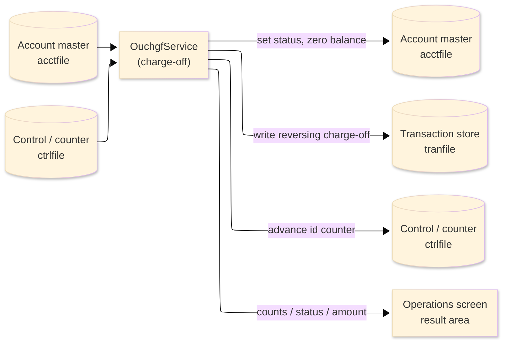
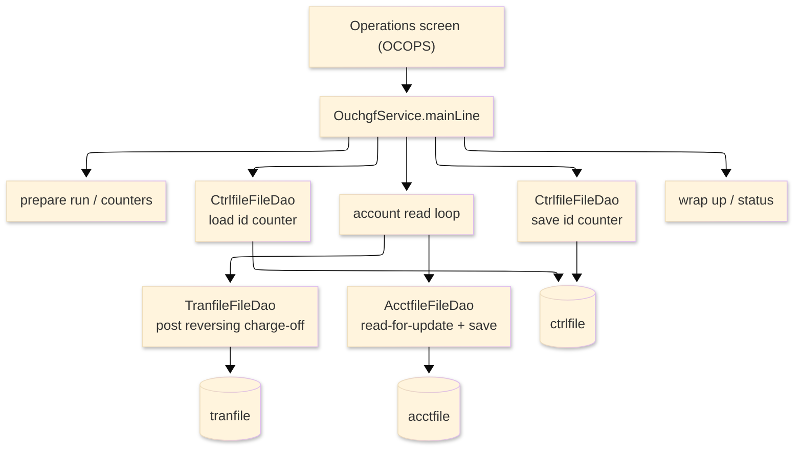

# TO-BE Batch Program Design — OUCHGF_ChargeOff

> **TO-BE = AS-IS in business terms.** The section order follows the AS-IS document so the two
> compare 1-to-1; what is added is the mapping onto the generated Java/Spring module. Anything
> forced to differ is stated in the section it belongs to, in business terms.

**Header**

| Item | Content |
|---|---|
| System | ORION-CCMS (ORION Credit Card Management System) |
| Source program | OUCHGF（COBOL） |
| TO-BE module | `orion-online/back-end/programs/ouchgf` · package `com.generated.orion.ouchgf` |
| Platform | Java 17 · Spring Boot 3.x · DB Oracle (H2 in dev) |
| Author ／ Date | modernizeX ／ 2026-09-28 |

> **Form-factor note (business impact):** in AS-IS this charge-off run was a COBOL routine invoked
> from the Operations screen. The transpiler produced it as an in-process service in the on-line
> back-end (`OuchgfService`), **not** as a stand-alone Spring Batch job; the business logic — which
> accounts are written off, and how the reversing transaction and the account update are formed — is
> unchanged. It is still launched from the Operations screen. See §8.

## 1. Program overview

### 1.1 TO-BE I/O diagram

### 1.2 Function overview

Write off severely delinquent accounts on demand. The run reads the account master in key order; an
account is charged off when it is active, carries a positive balance that is materially over its
credit limit (balance above credit limit × 1.20) and has taken no payment this cycle (cycle credit is
zero). For each such account the run posts a reversing charge-off transaction (type `CO`, amount = the
negative of the balance) to the transaction store, then re-reads the account, sets it to charged-off,
zeroes the balance and the cycle-debit bucket and saves it. The run reports how many accounts were
read, selected, posted, updated and rejected, how many transactions were written, and the total
charged-off amount. New transaction ids are drawn from a shared counter that is loaded at the start
and saved at the end.

### 1.3 I/O table

| Business name | File ／ table | I/O |
|---|---|---|
| Account master (was VSAM KSDS) | table `acctfile` | I-O |
| Control / counter file (was VSAM KSDS) | table `ctrlfile` | I-O |
| Transaction store (was VSAM KSDS) | table `tranfile` | O |
| Request / result area | in-memory call area (was COMMAREA) | I-O |

> The account master keyed browse (start / read-next) becomes an ordered read of `acctfile` by its
> primary key `ac_id`, so accounts are still processed in ascending account-id order. The counter row
> is fetched by the control key `ct_key` = `TRANID`, and each transaction is inserted by its key
> `tr_id`. Field widths and money precision are preserved (see §4).

### 1.4 Called subprograms / modules

| Item | Notes |
|---|---|
| `AcctfileFileDao` · `CtrlfileFileDao` · `TranfileFileDao` | data access for the account master, the counter file and the transaction store |
| (no sub-program) | the routine calls no external business program |

### 1.5 DB tables & SQL

| Table | Operation | Columns |
|---|---|---|
| `acctfile` | SELECT (ordered read), SELECT … FOR UPDATE, UPDATE | status, balance and cycle-debit columns via JdbcTemplate |
| `ctrlfile` | SELECT … FOR UPDATE, UPDATE, INSERT | last-value counter column |
| `tranfile` | INSERT | one charge-off transaction row per account written off |

### 1.6 Special notes

- Launched on demand from the Operations screen; an optional single account may be requested
  (`KO-PARM-ACCT`; 0 means every account).
- Charge-off test: the account is active, the balance is above the credit limit × 1.20, and the cycle
  credit is zero.
- Money is held as `BigDecimal`. The reversing amount is the exact negation of the balance and the
  balance and cycle-debit are zeroed, so no rounding is applied to any posted amount; the over-limit
  threshold (credit limit × 1.20) is used only for the eligibility comparison. See §4.
- The transaction id continues from a shared counter (control key `TRANID`, id prefix `CO`); the
  counter is saved back only when at least one transaction was written.

## 2. Processing details

_One row per business step, in execution order. Paragraph and method names are intentionally absent._

| 識別番号 | Business step | What happens | Condition ／ actual value |
|---|---|---|---|
| 0.0 | The charge-off run starts | the run is launched from the Operations screen and drives preparation, the counter load, the account loop, the counter save and the wrap-up in turn |  |
| 1.0 | Prepare the run | clears the result counters, sets the status to in-progress and stamps the run time; if a single account was requested, switches on the filter for that one account | single account when the requested account is greater than zero |
| 1.5 | Load the transaction-id counter | reads the counter record so new transaction ids continue from the last used value; when the counter is absent the numbering starts from zero | counter key `TRANID` |
| 3.0 | Read the accounts in order | positions at the first (or requested) account and reads forward until the end |  |
| 3.1 | Position the read | starts reading the account master from the first or the requested account; when there is nothing to read it reports that there are no accounts to process; a store error stops the run | not-found → "no accounts to process"; other error → run fails |
| 3.2 | Take the next account | reads the next account and counts it as read; at end of file the loop finishes; a store error stops the run | end of accounts ends the loop |
| 4.0 | Assess one account | decides whether this account must be written off | charged off only when active, the balance is above the credit limit × 1.20, and no payment was taken this cycle |
| 4.1 | Write the account off | remembers the balance about to be written off, takes the next transaction id, then posts the reversal and updates the account |  |
| 4.2 | Post the reversing transaction | adds a charge-off transaction (type `CO`, amount = the negative of the balance) to the transaction store and counts it |  |
| 4.3 | Update the account | re-reads the account for update, sets it to charged-off, zeroes the balance and the cycle-debit bucket, saves it, counts it as posted and adds the written-off balance to the total; a failed read or save counts the account as rejected |  |
| 3.4 | Finish the read | ends the account read once the loop is done |  |
| 5.5 | Save the transaction-id counter | writes the advanced counter back so the next run continues the numbering | skipped when no transaction was written |
| 9.0 | Wrap up the run | sets the final status (complete, complete-with-warnings when any account was rejected, or failed) and returns the counts and the total charged-off amount to the operator | warning status when at least one account was rejected |

## 3. Structure diagram

_The call structure of the routine as generated._

## 4. Output specifications (file / table)

Each output record keeps its original field widths; every field also maps to a column of the matching
table.

### 4.1 Control file (CTRL-REC) — 60 bytes

| Level | Item name | Field ／ column | Type ／ bytes | Position | Java ／ SQL type | How it is set |
|---|---|---|---|---|---|---|
| 01 | Record | CTRL-REC | group ／ 60 | 1 | row of `ctrlfile` | whole record |
| 05 | Counter key | CT-KEY | X(08) ／ 8 | 1 | `String` ／ `VARCHAR2(8)` | control key `TRANID` |
| 05 | Last value | CT-LAST-VALUE | 9(11) ／ 11 | 9 | `long` ／ `NUMERIC(11)` | the advanced transaction-id counter |
| 05 | Description | CT-DESC | X(30) ／ 30 | 20 | `String` ／ `VARCHAR2(30)` | `TRAN ID COUNTER` when the counter row is created |
| 05 | Filler | FILLER | X(11) ／ 11 | 50 | — | reserved |

### 4.2 Account master (ACCT-REC) — 300 bytes

| Level | Item name | Field ／ column | Type ／ bytes | Position | Java ／ SQL type | How it is set |
|---|---|---|---|---|---|---|
| 01 | Record | ACCT-REC | group ／ 300 | 1 | row of `acctfile` | whole record |
| 05 | Account id | AC-ID | 9(11) ／ 11 | 1 | `long` ／ `NUMERIC(11)` | record key (unchanged) |
| 05 | Active status | AC-ACTIVE-STATUS | X(01) ／ 1 | 12 | `String` ／ `VARCHAR2(1)` | set to charged-off (`C`) |
| 05 | Current balance | AC-CURR-BAL | S9(10)V99 ／ 12 | 13 | `BigDecimal` ／ `DECIMAL(12,2)` | zeroed |
| 05 | Credit limit | AC-CREDIT-LIMIT | S9(10)V99 ／ 12 | 25 | `BigDecimal` ／ `DECIMAL(12,2)` | unchanged |
| 05 | Cash limit | AC-CASH-LIMIT | S9(10)V99 ／ 12 | 37 | `BigDecimal` ／ `DECIMAL(12,2)` | unchanged |
| 05 | Open date | AC-OPEN-DATE | X(10) ／ 10 | 49 | `String` ／ `VARCHAR2(10)` | unchanged |
| 05 | Expiry date | AC-EXPIRY-DATE | X(10) ／ 10 | 59 | `String` ／ `VARCHAR2(10)` | unchanged |
| 05 | Reissue date | AC-REISSUE-DATE | X(10) ／ 10 | 69 | `String` ／ `VARCHAR2(10)` | unchanged |
| 05 | Cycle credit | AC-CYC-CREDIT | S9(10)V99 ／ 12 | 79 | `BigDecimal` ／ `DECIMAL(12,2)` | unchanged |
| 05 | Cycle debit | AC-CYC-DEBIT | S9(10)V99 ／ 12 | 91 | `BigDecimal` ／ `DECIMAL(12,2)` | zeroed |
| 05 | Address zip | AC-ADDR-ZIP | X(10) ／ 10 | 103 | `String` ／ `VARCHAR2(10)` | unchanged |
| 05 | Group id | AC-GROUP-ID | X(10) ／ 10 | 113 | `String` ／ `VARCHAR2(10)` | unchanged |
| 05 | Filler | FILLER | X(178) ／ 178 | 123 | — | reserved |

### 4.3 Transaction store (TRAN-REC) — 350 bytes

| Level | Item name | Field ／ column | Type ／ bytes | Position | Java ／ SQL type | How it is set |
|---|---|---|---|---|---|---|
| 01 | Record | TRAN-REC | group ／ 350 | 1 | row of `tranfile` | whole record |
| 05 | Transaction id | TR-ID | X(16) ／ 16 | 1 | `String` ／ `VARCHAR2(16)` | new id (prefix `CO` + counter sequence) |
| 05 | Type code | TR-TYPE-CD | X(02) ／ 2 | 17 | `String` ／ `VARCHAR2(2)` | `CO` (charge-off) |
| 05 | Category code | TR-CAT-CD | 9(04) ／ 4 | 19 | `int` ／ `NUMERIC(4)` | zero |
| 05 | Source | TR-SOURCE | X(10) ／ 10 | 23 | `String` ／ `VARCHAR2(10)` | `CHGOFF` |
| 05 | Description | TR-DESC | X(100) ／ 100 | 33 | `String` ／ `VARCHAR2(100)` | `CHARGE-OFF ADJUSTMENT - BALANCE WRITTEN OFF` |
| 05 | Amount | TR-AMT | S9(09)V99 ／ 11 | 133 | `BigDecimal` ／ `DECIMAL(11,2)` | the negative of the written-off balance |
| 05 | Merchant id | TR-MERCHANT-ID | 9(09) ／ 9 | 144 | `long` ／ `NUMERIC(9)` | zero |
| 05 | Merchant name | TR-MERCHANT-NAME | X(50) ／ 50 | 153 | `String` ／ `VARCHAR2(50)` | `INTERNAL ADJUSTMENT` |
| 05 | Merchant city | TR-MERCHANT-CITY | X(50) ／ 50 | 203 | `String` ／ `VARCHAR2(50)` | blank |
| 05 | Merchant zip | TR-MERCHANT-ZIP | X(10) ／ 10 | 253 | `String` ／ `VARCHAR2(10)` | blank |
| 05 | Card number | TR-CARD-NUM | X(16) ／ 16 | 263 | `String` ／ `VARCHAR2(16)` | blank |
| 05 | Original timestamp | TR-ORIG-TS | X(26) ／ 26 | 279 | `String` ／ `VARCHAR2(26)` | run timestamp |
| 05 | Processing timestamp | TR-PROC-TS | X(26) ／ 26 | 305 | `String` ／ `VARCHAR2(26)` | run timestamp |
| 05 | Filler | FILLER | X(20) ／ 20 | 331 | — | reserved |

> COMP-3 money fields are held as `BigDecimal` and stored at the COBOL-declared two-decimal scale,
> truncated toward zero (`RoundingMode.DOWN`) — the same result as the original COBOL arithmetic,
> which carries no `ROUNDED` clause. Because the charge-off amount is the exact negation of the
> balance and the balance and cycle-debit are set to zero, no rounding is ever applied to a posted
> amount; the over-limit threshold (credit limit × 1.20) affects only the eligibility test.

## 5. In/out parameters & check specifications

### 5.1 Parameters

| Kind | Value | Notes |
|---|---|---|
| Input parameter | a single account to charge off, or 0 for all accounts (`KO-PARM-ACCT`) | supplied by the Operations screen |
| Return value | a status flag — complete, complete-with-warnings, or failed (`KO-STATUS`) plus a status message | tells the operator the outcome |
| Return counts | accounts read, selected, posted, updated and rejected, plus transactions written | shown back on the Operations screen |
| Return amount | total charged-off balance (`KO-AMT-1`) | shown back on the Operations screen |

### 5.2 Checks

| No. | Kind | Condition | Error code | Behaviour |
|---|---|---|---|---|
| 1 | Store access | the account read cannot be positioned | — | the run stops and reports "STARTBR ACCTFILE FAILED." |
| 2 | Store access | reading the next account fails | — | the run stops and reports "READNEXT ACCTFILE FAILED." |
| 3 | Business | an account cannot be re-read or saved for update | — | that account is counted as rejected and the run ends with a warning |
| 4 | Business | no accounts qualify for charge-off | — | the run ends normally reporting "NO ACCOUNTS TO PROCESS." |

## 6. Modification summary

| No. | Date | Title | Content |
|---|---|---|---|
| 1 | 2026-09-28 | Initial TO-BE mapping | Mapped from the AS-IS design onto the generated `OuchgfService`; behaviour preserved. |

## 7. Screen

No screen — the routine is driven from the Operations screen and reports its outcome there.

## 8. TO-BE operations (replacing JCL/BAT)

| Item | Value |
|---|---|
| Trigger | launched on demand from the Operations screen; an optional single account can be entered, otherwise every account is scanned. This former batch routine now runs as an in-process on-line service, not a stand-alone Spring Batch job; the business logic is unchanged |
| Schedule | not determined (ask the team) |
| Input data | the current account balances, statuses and credit limits, plus the transaction-id counter, already held in the database |
| Log | written to the application log; the outcome counts and the charged-off total are returned to the operator on screen |
| Rerun | safe to rerun; an account already charged off carries a zero balance, so it no longer qualifies and is skipped, and no account is written off twice |
